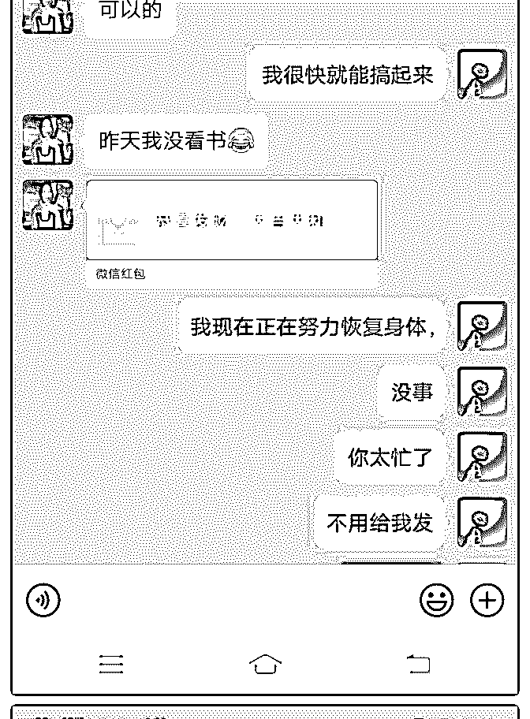

# 5 月 22 日开始参与

美丽.快乐~勺珈 : 5 月 22 日开始参与小鱼老师的计划行动的第 1

天——6 月 2 号，10 天的时间开启变现之路。

成功收获第 1 位核心学员，接着两天之后（6 月 4 日）升级为导 师计划学员，紧接着又收获了一位导师计划学员（6 月 5 日），成功赚取了核心课程的学费。

哈哈，有人说哇塞，你这几天好像一直在开挂。今天的收 获，一切都是来源于内心的渴望度和你所付出的汗水成正比 的。

刚刚开始加入进来的时候，我也很迷茫，找不着自己的定 位，但是我坚信，我又一次重回泽宇教育，一定会在这里找 到我想要的答案。 在小鱼老师的梳理下，还有我对个人品牌未来价值的一个判 断，找到了一个非常切合当下需求的一个定位——专注帮助 找到精准天赋领域。就这样子开启了我的个人定位变现和小 鱼老师行动计划征程的第 1 天。

专注目标才能产生结果，这是 10 天最大的感悟。 其实每个人都是非常有潜力的，只要你肯逼自己一把，你都

可以突破自己从 0~1 的这个过程。当时的我定目标的时候，其 实我心里也没有底，我也害怕自己做不到，但是我想起泽宇

导师说过一句话，求中上得中，求中得下，求下而不得，所 以我把目标放大了 10 倍，把行动力放大 10 倍，专注把每一步 走好，按照流程去实践验证概念，免费做 1 对 1 的咨询，在实 践的过程中不断遇到问题马上去解决它，然后进行复盘总结 记录下来，我就开始发现自己在教别人的过程当中，自己的

思路变得越来越清晰了，所以教才是最好的学。

一边输入一边输出，总结自己的经验，在遇到类似的问题中 自己也会越来越得心应手，慢慢地自己就开始变得独立了， 自己也学着会尝试着去找答案，解决问题，思维卡壳了，就 重复地去听课件。带着问的学习，让又加深了对知识的一个 理解，这就是小鱼老师说的高效学习。

很庆幸这段时间，复盘死磕自己，熬过了 0~1 的阶段，感受到 了自己的成长和内心的强大，也吸引有身边很有能量的伙伴 加入进来，在我的身上又多了一份使命感和责任。 接下来我会付出比从 0~1 的这个阶段更大的精力和努力，专注 于个人品牌打造的事业当中，用全身心的力量去帮助信任我 的伙伴，拿到他们想要的结果。

因为有他们的信任让我具备了无穷的力量，我将把这份信任 化成动力，让自己变得更好，更精专，带着他们一起走向一 个新的高度。

活着的价值就是让信任你的人，让他们的生命变得更美好， 彼此间互相成就，互为贵人。

如果你对个人定位有困惑的，我很愿意帮你做个梳理，让你 用最快的时间找到你的天赋领域，但因为时间有限，仅限每 天限前 2 位免费咨询，价值 399 元，并赠送 298 个人情感咨询手 册，感兴趣的朋友可以加我微信：sbmnv68629

2019-06-05(5 赞)

关注公众号"懒人找资源"，星球资源一站式服务

加入泽宇教育 28 天

玲珑 : 加入泽宇教育 28 天，开小号，0 基础 0 人脉，成功变现

3000+，3 倍多赚回核心课学费。

刚开始加入泽宇教育时候，看到别人群里发赚回核心课学 费，都觉得很牛，后面看到别人引流，变现 4 位数，也觉得很 牛，终于轮到自己也能变现 4 位数，几倍赚回学费的时候，发 现其实变现也很简单。 这一个月时间，做了很多事情，也做了很多的重大决定和改 变，但是最有成就感的就是进入泽宇教育，28 天从 0 资源到成 交 6 位学员，变现 3000+。 让我印象最深的是最近一次的变现，这个是无心插柳柳成 荫。记得是当时学完百万营销话术后，想用这个试着成交客 户，或者找个伙伴来对练一下。但是真的交流起来总是不能 顺畅，后面就报名参加了华丹的问题答疑，帮我梳理了一下 百万营销话术的运用，按照话术流程，不要打乱，不要颠 倒，更不能随便更改，除非自己对自己的营销话术非常有信 心。 最后华丹给了我一个任务，让我不以营销为目的的去找个新 人练习，当然对方是要不知道的，完全按照百万营销的话术 流程走一遍，然后把流程发给她看，并且总结一下结果。 也许是越努力越幸运，当天晚上答疑复盘还没写完，就有朋 友圈伙伴私聊我，问我最近在做什么，因为是熟悉的朋友， 本来想随便聊聊，后面转念一想，她不就是最好的演练对象 吗？还是做微商的，有一些共同语言，闲聊后知道她最近状 态不是很乐观，于是我就按照百万营销的话术从前到后聊了 一遍，最后就成了，只是对方目前实在没有钱，后面是拖了 几天才成交，还是全部家底都给我了，很感激她的信任，她 一再说自己是信任我的，但是对这个平台不熟悉，没接触过 这样的平台，后面我们又通了一个多小时电话，基本都解决

了对方的疑虑，致此这一单算是圆满成交。虽然当中多波 折，但是回想起来，对方的每一次犹豫，都让我有了新的解 决思路，都是新的成长。

记得泽宇反复说过的一句话：『遇到贵人之前，自己要先成 为别人的贵人。』

感谢感恩泽宇教育，感谢明哲，华丹，C 宾的知道，昨天半夜 还在回答我的问题。他们都是我的贵人，我也希望在这以 后，我能成为越来越多人的贵人，能帮助大家实现自己的一 个个小目标。

缘分的结识也来自不断的自我介绍，我是玲珑&Ellin，年入六 位数的金融理财咨询师，玲珑理财咨询师创办人，恒利家族 办公室合伙人。 我会帮你摆脱朝九晚五和死工资，通过理财规划，成为理财 达人，自由支配时间并且实现全球旅游办公。 曾经的我，一个人负债到深圳，生活和工作两点一线，没有 一技之长，每天朝九晚五，每个月工资入不敷出，一度对生 活和未来极度恐慌和迷茫，后来的我通过每天学习理财计 划，成功帮自己和身边朋友实现吃穿自由和旅行自由。 现已累计帮助 100+组家庭及个人实现资产合理配置，并且节 省/增值资产累计 500W+

我最近成立公司会比较忙一些，如果大家有兴趣了解理财规 划这一块，我很乐意花时间帮各位理一理，为你做一对一咨 询服务，由于时间有限，仅限每天三位的朋友，感兴趣的可 以加我微信私聊。

2019-06-04(15 赞)

评论区：

雪尔 : 好棒，好厉害

雪尔 : 但是微信怎么加不上？

Lynn :

关注公众号"懒人找资源"，星球资源一站式服务

好吧，我也来做第一

好吧，我也来做第一次成果庆祝 [偷笑]

加入泽宇教育第 3 天收到了第一个半年的陪伴式顾问咨询的单

3000+。

说大吗？迄今为止最大的单笔，但是真的很大吗？我的目标

远不在此。

继续努力加油吧，给自己个仪式感，从这里开始！

2019-06-03(4 赞)

评论区：

丽君 : 加油！

易旭丨中医 :

关注公众号"懒人找资源"，星球资源一站式服务