# 4 年 0 收入的宝妈，

4 年 0 收入的宝妈，个人品牌一个月，累计收款 10000+，她是

怎么做到的？

也许你猜到了，我就是这个故事的主人公。 我是谁？

泽宇教育优秀学员，长投学堂股票营班主任，一天 14 小时陪 娃的全职宝妈

曾经的我工作 5 年月薪没有超过 5 千，在离职换工作期间意外 怀孕，本着不给企业添负担的心态，踏上了全职备孕育儿的 道路。

在去年年初，强烈的学习理财投资的意识觉醒，于是开始关 注，学习了最初的理财课程之后，发现自己还是原来的自 己，生活并没有改变，总结分析之后发现是行动力问题，于 是投资了课程推荐的投资组合，到今年 5 月定投一年，清仓的 时候投资收益 8%，结算后投资收益只有可怜的 3%。只能感慨 一下场外投资高额的手续费。

庆幸的是我没有停止学习，既然对理财投资产生了兴趣，就 要把它落实下去。现在想来执行力强可以算是我的一个天赋 了。

后面的故事大家猜到了吗？

是的，我进入了长投学堂学习理财投资，从保险，基金，到 股票初级，股票进阶一路学下来。最好的投资是投资自己。 在投资自己这件事上，我从不犹豫，也从不手软。

课程学完就毫不犹豫地加入了长投学堂大家庭，成为训练营 助教。你所在圈子的高度决定了你的高度。那个时候白天带 娃，中午和晚上孩子睡觉后才能完成助教工作，虽然时间紧 迫，但是工作一点没有耽误，并且以优秀的成绩，跟班 2 次就 晋升为班主任了，刚好是去年的年底，算是给自己的 2018 年 画上了一个完美的句号。

到这里也许你会觉得故事结束了，但我想告诉你这只是故事 的开始。

2019 年带过两次班，第一次实习，学员满意度 90%，顺利晋 升为正式班主任。正式班主任带班期间由于过度劳累住院， 无奈下班级转让。至此暂停了在长投任职班主任的工作（由 于内部制度，助教和实习是没有工资的，所以一直没有过收 入）但是在长投学习到的投资知识转化成了我的自身优势， 从年初到 4 月底，投资基金累计收益 30%，指导闺蜜投资股票 收益 50%（不要问我为什么不自己投资。。。这么扎心的话 题）

在住院修养期间，接触到了泽宇的个人品牌打造，只是学习 了基础的核心课程，就发生了思维上的巨大改变。

在知识付费时代，人们会因为知识的匮乏产生焦虑，我就是

其中一个，学习了太多课程，但是没有办法变现。以结果为 导向的学习才是正确的选择。庆幸我做了正确的选择。选择 大于努力这句话在我身上得到了切实的体现。

在泽宇聚星会涨价的最后半小时，负债也要报名！是的，我 是刷花呗交的学费，多付出 10%的费用。但是那个时候我就 非常确信，聚星会的价值远超过他的价格，一年的投资学习 让我知道这是一个大便宜，不能错过！并且给自己定下目 标，半年的时间，赚回学费并产生收入。让我没有想到的 是，仅仅一个月，只是每天 3 小时的付出，整个五月累计收款 10870 元，已经赚回导师计划的学费！

关于变现，我的方法是：

1.找到定位

2.按照正确的方法去执行

3.复盘：沉淀正确的，改正错的

4.输出价值：给别人提供价值增加连接粘性

5.解决问题：帮别人解决问题，体现你的价值

6.重复 2-6 步 五月行动汇总：

1.听课 40+，一共听了 13 节课，每节都要听 4-5 遍

2.增加弱连接 300+

3.复盘 15 篇

4.日更 29 篇

5.一对一咨询 10 次

6.建群分享 2 次

通关秘籍给你了，你准备好改变与行动了吗？

2019-06-02(24 赞)

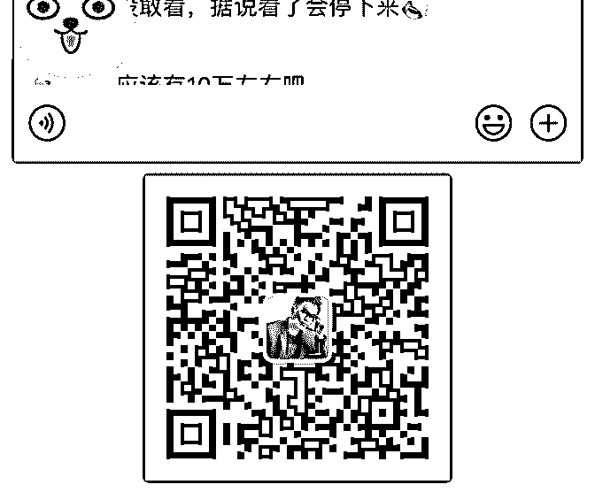

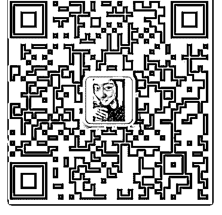

关注公众号"懒人找资源"，星球资源一站式服务

加入泽宇 28 天开始

静 :

加入泽宇 28 天开始变现，累计 596 元，赚回学费，我达成了自

己刚来时定的小目标！

加入泽宇的原因比较复杂，一方面内心是想有所不同，但是 工作朝九晚六，找不到突破口；一方面接触到了优秀的人， 想要有这样的能量和特质。很高兴的是，我都做到了！

那么就分享一下，我是如何变现的

1、思维转变影响行动，让别人看到你 以前我比较没有安全感，不喜欢展示自己，觉得什么事情自 己做好了就行。但是泽宇告诉我，不发声=不发生，要运用十 条心法让贵人遇见你。 所以我开始展示自己的工作成果，生活乐趣，发现很多平时 没有联系的人都被吸引，主动来交流，这就是建立信任，也 是给我的正向反馈，激励我敢于展示、乐于展示。

2、确定标签 很多小伙伴在这一步犯难了，我当时也是有三个喜欢的标签 在选择，因为自己无法做决定，所以就分别找到身边熟悉我 的好友、不是很熟的同事做调研，筛选掉了没有市场、和我 不搭的一项，剩下两项怎么选呢？ 我找到了相关方面的领路人/权威人士，比如我最终确定做个 人理财规划咨询，除了有硕士专业背书、个人一直在深造， 还有很重要的一点，我与课程老师交流，发现她比我自己都 要早发现我在这方面的兴趣和专业能力是很高的！毫无疑 问，这就是我的标签。

3、社交传播 确定标签后，我发了一条朋友圈，是老师对我的认可和我自 己对于理财的想法，其中包括月光、负债、还有理财≠投资， 这三个痛点。很快地，有好几个人评论“想学习”、“求指导”、 “有同样焦虑”。 我直接从中筛选两位成交可能性高的人私聊，与他们沟通我 能帮助解决什么问题，很顺利地成交了。后面几位学员是根 据朋友圈信息主动来询问，也是很快成交。

4、成交后的感悟 一定要先开始，不论是免费咨询，还是付费咨询。因为成交 后，才是真正的开始，责任感会逼你去主动指导、快速提 升，一旦出结果，这种喜悦又会激励你去成交下一个客户。 当然中间也会面临很多问题，比如客户暂时没有出结果，或 者感觉自己的能力还无法帮助对方，这都没有关系，边做边 学，边做边完善自己的咨询体系，只会感觉越走越稳。

5、关于个人品牌的使命感 在开始做咨询后，我越来越感受到做个人品牌是要有使命感 的，让别人因为自己的帮助而变得更好，非常有成就感！比 如我在和身边的人交流中，发现大家对于生命周期的理财规 划是没有概念的，这时我就很想让大家都报名我的课程，教 他们理财≠投资，还有现金规划、保险配置、子女教育基金、 养老规划等等我们一生要面对的很多财务问题。如果普通人 能提早了解并规划，那么生活会从容很多。到这里我发现， 如果我愿意行动起来，按照课程所教去发声、出结果，那么 引流也是自然而然的了。

最后，感谢泽宇教育这个平台，这只是第一步，我会一直在 这里学习、成长、获得结果；感谢我的导师明哲，非常温和 耐心，答疑高效，指导性强，生活有趣，乐于分享；感谢自 己，专注当下，活在未来。

2019-06-02(5 赞)

小白加入泽宇 18 天

沐之航～人类图解读师 : 小白加入泽宇 18 天，开始变现第一 单，299 元。 5 月 13 号加入泽宇教育，我当时是直接加入的聚星汇，赠送了 核心课和导师计划，可是我是从小白开始的。加入后，我就 从核心课开始听，然后一直找自己的标签和定位，在这个定 位上，我就耽误了很长时间，我当时是 3 个方向，一个是自己 擅长的，一个是自己目前的工作，最后一个是自己喜欢的， 就是个人品牌咨询师，直到 26 号，我跟安娜老师聊天，老师 一句话点醒我，喜欢就是方向啊。我才定好位，但是个人品 牌咨询师，这个方向确实很大，对于我这个小白来说，难度 不言而喻。但我可能就是那种“初生牛犊不怕虎”吧，我就想 着，先定位再说，走着看着，不行了再调整方向。结果就是 这么神奇，第二天就有人主动咨询我做什么的，这个可以说 是之前就认识的人，以前的同事，但也有七八年没见过面 了，但他知道我以前的工作情况，我以前做业务还是比较不 错的，也获得过很多奖励，他对我还是很认可的，他最近工 作有些迷茫，市场开拓的情况不太如意，看到我发朋友圈的 变化，就好奇的被吸引来了。刚好前一天晚上答疑，华丹老 师说到了百万营销，要先找人练练，那就用我朋友来练手 了，然后我就用百万营销一步一步的问下来，巧的是，他就 这么一步步被带下来，到了付费的时刻了。其实我在他之 前，还没有免费的案例，当时就在想，是送他免费案例，还 是试着尝试收费，然后脑子里一想，看看收费什么结果吧， 如果他不情愿，再免费送他。然后我就跟他说，我平时价格 是 599，现在给他半价 299，一对一指导他，如何进行朋友圈 打造及提高销售成绩。然后他回复我，月底吧，月底发工资 了就开始学习。做了多年的销售，我知道这种承诺，有时候 是一种拖延，想再考虑，在后期反悔的可能性很大，虽然 299，说多也不多，我稍微逼一下，哪怕是交个定金，也是可

以让他当天转账的，当然也不排除真的经济很紧张的。面对 熟人，我不想销售痕迹太过于明显，所以，我跟他闲聊了一 些别的话题，让他放松了一些后，问他具体哪天，我把学员 课程安排一下（其实他就是我第一个咨询的人），他说 30 号 转账（周五），最晚 6 月 1 号。然后，我怕他不把这件事放在 心上，故意给他留了个作业，我说跟他聊天过程中，发现他 自我设限很严重，让他写 10 个自我设限。他痛快的答应 30 号 交作业。30 号那天，我等了一天，也没等到他的微信，心里 有些担心。然后 31 号早上我给他发信息，交作业啦。他回 复，今天下午，最迟明天早上，因为工资还没发。我给他回 复，先把 10 个自我设限写出来。他苦思冥想，写了 3 个，我又 给他指导了一下，终于凑够了 10 个。也可能是我催着他想的 过程中，他发现了自己思想的一些问题吧，也许就是像他说 的，下午才发工资。下午他微信直接转账 299，接着我就跟他 约了晚上 10 点一对一指导。教学相长，此刻发挥了巨大的作 用。一下班我就开始复习泽宇课程，然后构思晚上的课程。 晚上一对一指导了一个小时，在教他的过程中，我也又重新 对课程有了新的认知。他也觉得收获很大。不管怎么说，我 自己终于迈出了第一步，泽宇说，只要能赚一块钱，就能赚 100 块钱，我相信，后面我的成长一定会越来越快。 我是沐之航，一个有温度的个人品牌咨询师，微信 xiaona072658，欢迎与我连接。

2019-06-01(4 赞)

美葶(爱欣欣) :

加入泽宇一个月，收

加入泽宇一个月，收入破 2w。

上次庆祝成果，是推出声音训练升级版课程。3 天变现 1w＋。 到昨天，一周变现 2w＋。感觉加入泽宇就像进入了财富能量 中，被推着走。

我一直是一个有技能，但是没有完全发挥出来帮我变现的 人。一度非常苦恼，学了很多课程，但是很难直击痛点。

课程升级，模仿泽宇课程分为 3 个板块，解决了学员各个阶段 的问题。同时，我把百万营销话术就存在手机里，用这个流 程谈，成功几率＞80%。

好像没有什么可以给大家借鉴的，其实就是按照课程学习， 复盘，答疑，行动。边做边学，也是一直做事的风格。我相 信，在行动中可以学到更多，也不要怕失败，就是一个试错 的过程，何况我们的成本很低很低。

泽宇教育真的就是一直以来我特别渴望找到的。能直接给我 方法，省去了我摸索的时间。

感谢泽宇，感谢 lorna。 我是美葶，一位帮你用声音树立自信的声音咨询师。

2019-06-01(11 赞)

评论区：

石斌-时间管理咨询师 : 优秀，希望能够链接更多的老铁，微信 shibin225

西姆全屋定制焦海霞 1* : 美葶老师你最棒！

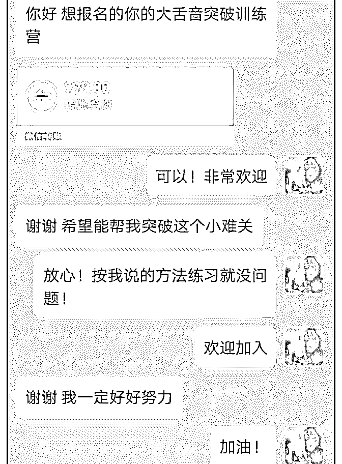

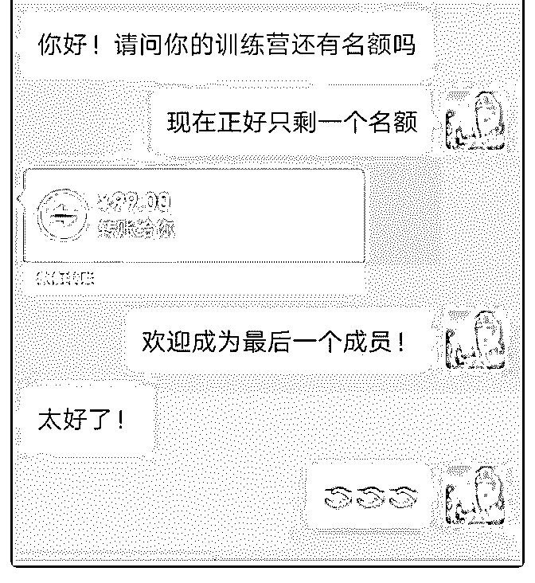

五月复盘和获得成果

夏雨晨 : 五月复盘和获得成果复盘

感谢泽宇教育，感谢 Anna 华丹助教，帮助我第一天做付费 咨询，就赚了 428 元，赚回了学费

说到打造个人品牌，做付费咨询，2018 年夏天我就做过一次 付费社群。做了小半年，因为经营不善和自己能力有限，就 陷入困境了。

2019 年初，一个好朋友给我推荐了泽宇教育，拉我进群学 习，说泽宇教育很棒。我内心很拒绝，因为市场上的课程我 买的太多了，被割韭菜太多了，简单来说，那些很水的课 程，把精力都放在了让你怎么付费，等你心动了，付费了， 然后就没有你什么事，随便写十来节课程，很水，也没有售 后服务。

泽宇教育就不一样，Anna 华丹助教问了我很多次，“最近学 习怎么样，遇到了什么问题吗？”

刚开始，Anna 华丹助教刚开始这样问我，我还有点烦。 以前哪有助教来问我学习得怎么样，只会发链接说，嗨，今

晚有一场直播，要不要来听，扫码上车啊，只要 9 块 9 鸭，么 么哒！

么你妹！ 我是拆书达人，这么割我韭菜，割了一次又一次，学费不是

问题，关键是忽悠人啊，这是侮辱我读过的书啊!真的有很坑

的课，我之前花了 2000 报了一个写作课，想继续提高自己的 写作能力，结果都是签约作者还是避免不了被割韭菜。

Anna 华丹助教依然倔强的问我，“最近学习怎么样，遇到了 什么问题吗？”

后面，还加上了一句，“是定位不清，还是不知道目标群 体？”

不得不批评 Anna 华丹助教一句，你这么执着，让我很羞愧 啊！

只有我妈和 Anna 华丹助教这么给我发消息，我妈是说，“你 要减肥啊！”，Anna 华丹助教说，“你要学习啊!”加起来就 是，你要变好啊!

感恩 Anna 华丹助教，感恩泽宇教育。

5 月 25 号，我看完书，写了大纲，画了思维导图，编辑说可以 写初稿。2500 稿费啊，就要到手了。

然后我就去玩游戏了，Anna 华丹助教的消息又来，“乖乖， 你学习了吗？”

我的天啊，这是早上懒床，被妈妈掀被子，好娇羞啊！ 我开始给自己定位——拆书咨询师。

能提供的服务——提升阅读力，通过拆书来实现个人成长；

一遍赚稿费，一遍提升自己。

找目标群体的需求——没有人手把手教，没有合适的练习方 法，没有投稿资源。

于是，我开始写拆书的课程大纲，找编辑链接投稿渠道。

5 月 31 号，我重新开始做付费社群，很快就有两位朋友报名付 费，一共 400 元。还吸引了 40 多朋友来听第一堂免费课程。其 实，我想着昨晚第一堂免费课程再收费，结果两位小伙伴很 信任。感谢！

6 月 1 号，早上，泽云群里的一个小伙伴，来找我寻找帮助。 我就用过去看过的书，《用户思维》、《能力陷阱》、《学 会提问》，帮助小伙伴理清了思路。

本想着是同窗之谊，不必收费了，Anna 华丹助教那么好， 我也要当好人，小伙伴最后还是发了红包，很开心。

再次感谢泽宇教育，再次感恩倔强的 Anna 华丹助教，你是 个好人，这是我能想到，对一个人最好的赞美。

2019-06-01(15 赞)

评论区：

石斌-时间管理咨询师 : 链接更多的优秀老铁 微信 shibin225

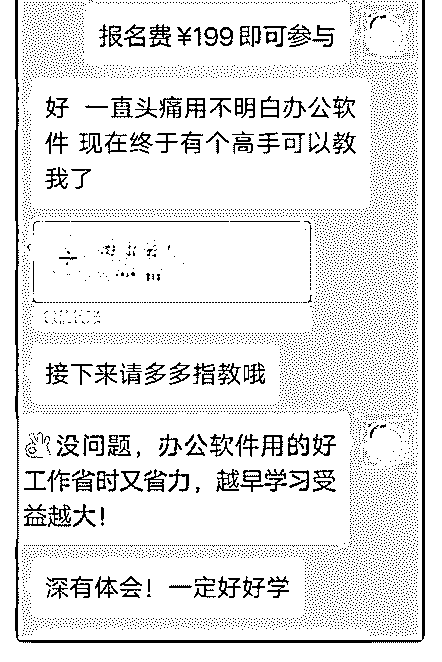

丽珍 :

关注公众号"懒人找资源"，星球资源一站式服务

【加入泽宇教育三个

【加入泽宇教育三个多月，变现 8000+，我是如何做到的？】

从好朋友那里了解到泽宇教育，后来通过泽宇教育的一次活 动让我正式开始加入。就认识了明哲助教。 明哲是一位超级负责人的领路人，每次都很用心点评学员的 复盘，在这里自我检讨一下，我没有经常复盘，连课程都没 有学完。但为什么我可以有这些成绩，因为我有在积累，在 朋友圈向优秀的人学习，比如华丹，明哲，芳芳，婷婷等等 优秀的大咖，虽然她们可能不知道我，但我一直有关注她 们，关注她们的什么呢？

1、自我状态 一个人若是没有状态，要是没有自发的能力，如何去影响别 人，去吸引别人，让别人关注你，成为你的顾客，你的学 员，所以你自己才是一切的来源，把自己先做好，剩下的交 给时间。

2、如何打造优秀朋友圈 在加入泽宇教育前，这个点我是一直有关注的，但通过接触 芳芳，我才知道朋友圈的图可以这么精致，通过看华丹等大 咖的朋友圈，我才知道，文案可以写的这么有吸引力。总结 她们的特色，再结合自己的风格，很快我就找到适合自己发 圈的思路，朋友圈关注度提高了很多，也通过个人 IP 引流了 很多精准客户。

3、学习工作的责任感 泽宇教育里不管是导师还是助教他们都非常负责人，以学员 为中心，以结果为导向，帮助学员快速成长。每次看到他们 的用心付出，自己就被触动。因为我自己，同样需要对客户

用心付出，从艾灸前方案的准备，艾灸中的讲解，艾灸后的 指导跟进，每位客户都在用心服务，这也让我在工作室里在 大学生中保持业绩第一

以下是我部分的成果展示，由于时间关系没来得及给大家系 统性复盘展示，只想告诉大家，泽宇教育是用成果说话的平 台，感恩遇见，感谢明哲一直的鼓励和帮助，让我一个大三 的学生收获良多。这只是一个小的开始，未来希望和大家一 起共同努力。

最后介绍一下我自己

【姓名】徐丽珍

【昵称】丽珍

【坐标】广州

【标签】①艾灸养生、②深圳前海艾艾贴经销、③自主创业

大三学生

【个人经历】

①担任校内艾满园文化创意有限公司负责人

②通过艾灸为 300+的客户解决常见疾病问题

③ 获得“美容与健康(艾灸)人才素质测评证书”。

【兴趣爱好】中医，艾灸

【我能提供】

①常见疾病艾灸方法

②教你做自己家的健康保健医生

【未来规划】

成为一名专业艾灸养生品牌咨询师，为更多的人解决疾病的

困扰。

2019-05-31(14 赞)

评论区：

燕双鹰 : 三个多月，不长也不短，成绩可喜可贺，继续加油呀[玫瑰]

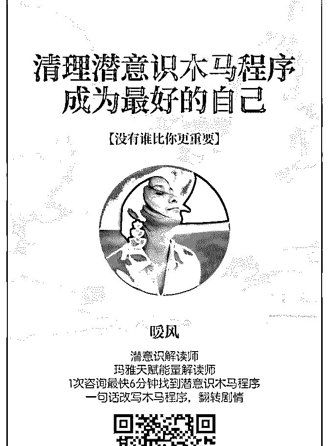

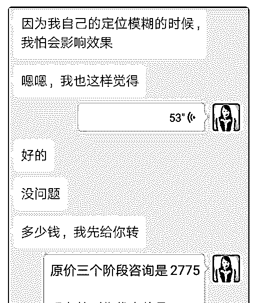

紫衣微醺 lydia :

我是紫衣微醺，上着

我是紫衣微醺，上着班的俩娃妈妈，白天上班，晚上带娃，

见缝插针做着自己想做的事情。

我是 4 月 22 日报名泽宇教育的，在@小青啊小青的推荐下，加 入进来。

先来说说以前的我吧，2015 年生了我的小儿子，由于生活中 的种种艰难，一度抑郁不已。后来通过自我开解，想着发展 一个自己喜欢的兴趣爱好，分散一下注意力，于是选中了画 画。从 2018 年画到了现在。 用爱好表现这在之前根本没想过，直到有位朋友看中了我的 小画，做成了钩针作品，在淘宝上售卖，每月有了一定的分 成，兴趣表现才逐渐在我脑海里清晰了起来。 机缘巧合，在简书上认识了@小青啊小青，她是做绘画训练 营的，通过和她的聊天，了解到了泽宇教育，犹豫了几天之 后，加入了泽宇教育，从此，思维转变，观念转变。 于是，尝试着办 21 天兴趣营，第一期，当时定价 9.9 元，安娜 老师说太便宜了，其实是我对自己没多少信心。而后有了第 二期，现在筹备 50 天的黑白手绘静谧时光之旅。有学员从第 一期跟到第二期，又报名了静谧时光之旅。我真的很开心， 虽然我不是画画最好的，可是我从 0 到 1 的突破经验，完全可 以教授给零基础的小伙伴们。 在办兴趣营的过程中，我越来越发现自己知识的欠缺，于是 边教边学习，边精进。这种感觉真的很棒，定好目标，做一 件自己喜欢的事情，乐此不疲。 不到 50 天时间，兴趣变现收入 600+，虽然跟泽宇教育里的其 他人差距很大，可是和昨天的我相比，是进了一大步。 再次感谢@小青啊小青，感谢@安娜助教，感谢@华丹老师， 我会继续努力，在自己喜欢的路上越走越远。

2019-05-31(12 赞)

评论区：

梧桐 : 亲，怎么链接你？ 紫衣微醺 lydia : 微信 lamzhoubaby

加入泽宇一个半月，

a great wa* : 加入泽宇一个半月，线下创业成功让我变现 6000 元。

加入泽宇教育一个月，在 Anna 老师的帮助下，我开始了自己 的线下创业“韩国一体化留学”项目的开展和实施。 虽早在很久之前我就有了这个想法，但是自己都一直不自 信，直到我接触到了泽宇教育，了解到泽宇的成功经历和华 丹的成功经历自己才真正放下了所谓的担心，去一步一步地 进行创业。 在学习核心课的过程中，可能很多都没有看见我的复盘，因 为自己特别喜欢用笔和纸记录，一点点去理解去感悟，不懂 的东西会和身边的人交流，渐渐的整理出来了大体的框架结 构和发展方向。 当我和别人谈到泽宇教育时我都会做这样的一个比喻：。很 多不同的花放在一起会很乱，但是专业的插花师,会利用这些 乱乱的东西，完成一幅艺术作品。对于泽宇来说、我们是乱 乱的“花”。对与我们自己来说、我们是即将在泽宇教育里成 长的“插花师”。

谢谢 Anna，

我不知道该怎么去写这个复盘，希望下次变现的时候会有更

多的分享。

2019-05-29(11 赞)

评论区：

荻野 : 你好，可以联系主编荻野在简书投稿推广并且领取 18.88 红包，如没微信，可添加 wx：VStarOne521

加入泽宇变现 4 万+

天使姐姐 : 加入泽宇变现 4 万+成长感恩~

今天是 5 月 27 日，距离我加入泽宇整整三个月，在这三个月 中，我经历了巨大的转变。 我目前的阶段是第 1 期训练营结束，第 2 期录制超级课程进行 中……朋友圈学习建设中……，目前还没有做引流和组建团 队。庆祝成果的话，学习后我的收入目前累计 4 万，已经 4 倍 赚回学费。

在这里我要首先感谢石蓉蓉，我们是在一月份李欣频的课上 认识的，通过她我了解到泽宇教育。看到加入的人都很牛 逼，就产生了兴趣。

先加入导师计划，没过几天我又加入了聚星会。第一篇复盘 是详细讲我如何找到自己定位的，这里不再赘述。要提的是 我发现我的主题也是讲金钱和爱，这和蓉蓉的讲的主题就相 同了。

当我根据内在指引确定我是要分享这个主题时，我去看了蓉 蓉的朋友圈，她通过自己的经历和现代心理学讲如何打造吸 金和吸爱体质，非常的棒！

我自己灵修很多年了，看到蓉蓉做心理几年就对钱和爱有这 么深的领悟，非常的佩服，所以一直也在默默的关注她。看 到她短时间大爆发，确实做到了吸金体质，按照金钱之道在 传播爱，也再次证明金钱财富之道是可以学习并实践出来 的，也给了我很大的鼓舞。

在金钱这部分，因为我学医的，我研究宇宙能量，人体很多

年了，所以我从现代物理学去将宇宙能量和金钱财富能量运 作讲出来，并将能量运作具象化为行动，通过行动就可以提 高自己并获得财富的增加。所以我和蓉蓉主题类似，实际内 容是不同的。

在真爱的这部分，我主要是结合自己多年的成长，做个案疗 愈的经验，总结了很多效果很显著的练习方法，只要按照练 习做，就会真正的学会爱，爱自己到爱他人，在练习中疗愈 自己，包括如何创造美好的亲密关系，包括亲子关系，如何 看待性……这些和蓉蓉的讲的爱也是完全不同的。

在首期和第二次招生，大部分都是我的老学员和做过个案 的，他们均获得成长和改变，反馈很热烈，有个学员轻松收 回了十几年都没收回的土地，有个学员做了几年的放弃项 目，起死回生，有的学员奇迹般收到了心仪物品……

我能够在泽宇成长，找到定位并分享出来，帮助更多人，这 对我是非常幸福的，无法言喻的，因为分享，我常常热泪盈 眶，常常热血沸腾，常常爱能量爆棚~……成长，我是受益最 深的~~

每个人成长的路径不同，最终都是证得宇宙之道，按照自己 总结的智慧活出那份丰盛和喜悦，我们在这里汇聚，也说明 很多人需要突破金钱和情感卡点，还有什么比这更好呢？

在这里表达感谢~蓉蓉带给我的启发，主要有几点：

1.真诚的去发朋友圈，敢于展示自己。我自己本身是个内向的 人，家庭和部队的环境都是要不苟言笑不能表达，这方面确 实是我的不足。在受到蓉蓉启发后也没有第一时间去表达感 谢！在这里说声抱歉！即便是开课了，去做分享了，也不太

发朋友圈，蓉蓉在朋友圈提醒，你不发谁知道？我被提醒 了，开始也在圈里展现自己。

2.给出爱，收获爱。爱是我要分享的主题，看到她以爱去分 享，收获满满的好评，非常喜悦，这就是爱的表达。她总是 在圈里分享谁曾经帮助过她，这些是我做的不足的，在爱的 表达方面要向她学习。

3.营销。她在圈里展示自己的价值，也展示出自己很贵有价 值，所以大家也都认可并买单。这也是我要学习的地方。外 在都是内心的投射。值得学习~

所以看到这里，你有没有受到谁的启发？如果有，去包个红 包，表达感谢吧~哈哈哈哈

在这里还要深深感谢泽宇课程和我的导师 Lorna~ 1.Lorna 提醒我第 1 期先做训练营，所以我在训练营中也总结了

很多经验，在第 2 期录制超级课程有了改进。

2.从招募文案的写作到调查问卷的设置，我有很多小白的地方 向 Lorna 提问，包括招募文案的营销逻辑顺序，和问卷的标 题，她都非常的耐心，一针见血的指出了问题！

3.朋友圈的建设，老师讲要细致到一纳米，指出了我很多不 足。我会不断改进。

4.系统的课程打造+各种变现的方法，Lorna 讲要把这些思维融 入大脑，在群里每周的分享都非常的干货，我都收藏起来， 值得反复学习。

……

给 Lorna 和泽宇发红包，他们不收~~说老师带学生是应该 的……感恩~

综上，我在个人品牌的路上从小白实现了变现~~还有很多需 要提高的，

很感恩自己选择了泽宇~

再次感谢泽宇，Lorna，蓉蓉，还有很多彼此鼓励的小伙伴~

————————————————————

对了，便于大家了解我发个自我介绍~

【姓名】张艺潇

【昵称】天使姐姐

【坐标】西安

【个人经历】

我曾经从军 9 年，是一名军医，为追随内心复员创业，从零开 始做到年收入 7 位数以上，一度因面临公司破产，婚姻崩溃。 我也几乎抑郁。我选择不断学习提升自己，先后从师国内 外。深度觉醒，与丈夫复合。多次闭关，终体验到了“神性自 在”的境界。生活也轻松实现了财富自由和情感自由。在更多 人渴望觉醒的时刻，我愿将自己的财富人生通关密码分享出 来，帮助更多人活出丰盛喜悦荣耀。

【我能提供】

1\. 高频微课：《财富炼金》洞悉金钱流动的真相，与金钱交 朋友，帮你清理金钱卡点，创造财富能量场，打通财富管

道，与财富天使对话等。纯干货行动指南。

1\. 高频微课：《真爱炼金》教你如何爱自己，快速释放负能 量的实操方法，清理情绪卡点，创造美好亲密关系，如何看 待性等。纯干货行动指南。

2\. 金钱个案：金钱卡点清理，解除所有金钱限制，打通财富 管道，让金钱洪流畅行无阻。

情感个案。 阿卡西个案：我将作为管道，连接你与宇宙源头高维度的守 护者，给你人生当下符合你最佳利益的指引。适合各类人生 困惑，重要人生和事业选择等等。

——————————————————

一起成长，一起绽放。

We are one，we are connected.

我的微信：27551530\. 2019-05-28(18 赞)

评论区：

荻野 : 你好，可以联系主编荻野在简书投稿推广并且领取 18.88 红包，如没微信，可添加 wx：VStarOne521

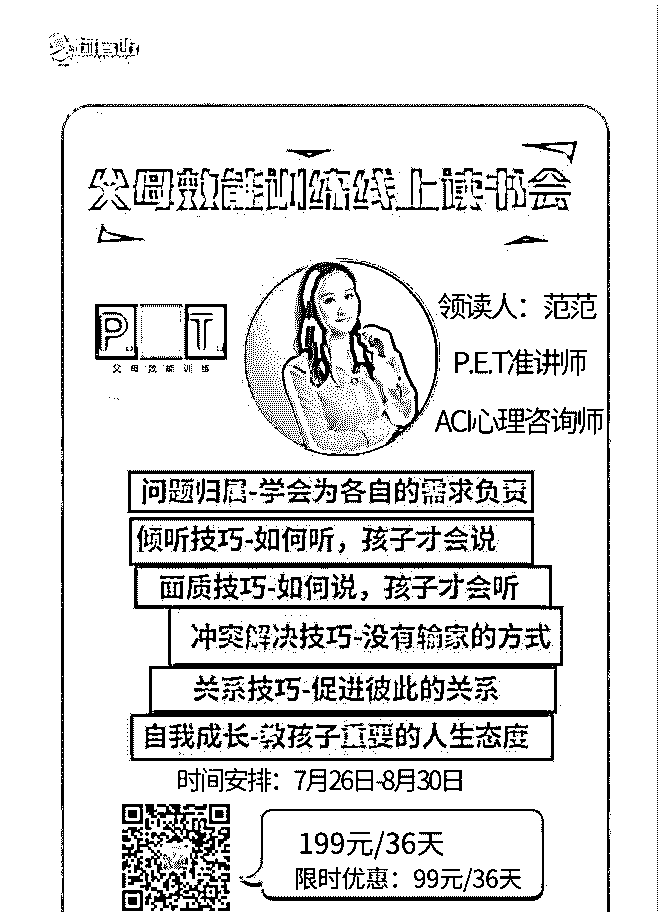

佳慧|塔罗师 : 怎么加您微信 好厉害啊 学习

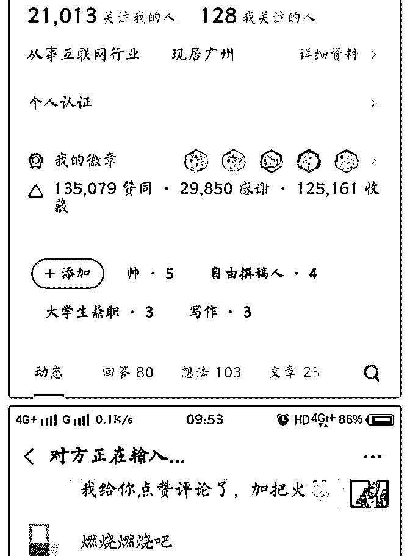

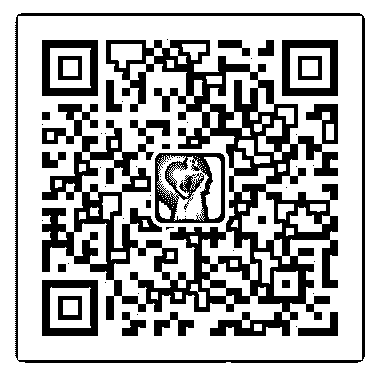

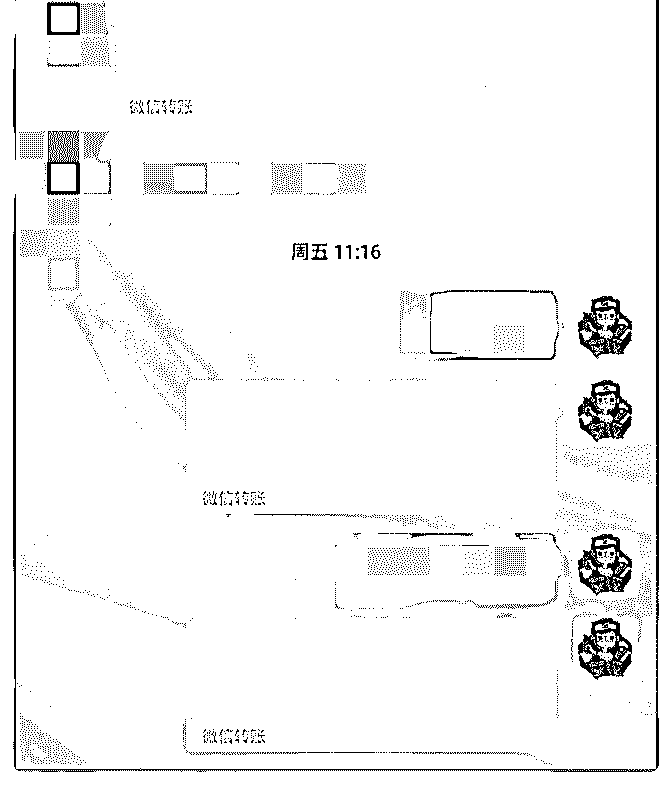

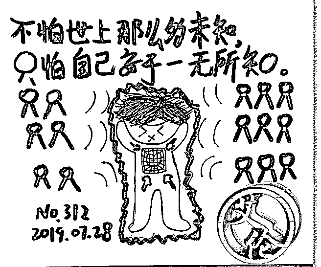

关注公众号"懒人找资源"，星球资源一站式服务

开始，就已经成功了

微美时光~~杨麒正 : 开始，就已经成功了一半，揭开 24 小时 变现 5000 的秘密！

引子：我是谁？谁是我？

我叫杨麒正，很多人都称呼我正气大叔，我是一个在舞台上

讲课十三年的企业教练导师，商学院院长。给一半以上世界

500 强企业的高层做过领导力的课程和培养企业教练。喜欢健 身，有很多自己的理论体系。虽然收入还不错，但是经常会

陷入迷茫，不知道未来自己想要什么。偶然机会接触到泽宇 教育，被泽宇的旅游办公这全新的理念震撼，原来这就是我 一直想要的生活，仿佛漆黑的海面上突然看到了灯塔，心中 豁然开朗。梦想的生活慢慢清晰，人也更有精神头了。 开端：迷茫与彷徨 经 C 宾老师引荐，毫不犹豫的加入了聚星会，刚加入迟迟不敢 下手，始终找不到自己的定位。迷茫时期最好的方法就是学 习，每天抽时间就听核心课程，C 宾老师的线上答疑，只要有 时间，我一定挤进去听，反正没思路，旁观下大家的成果， 别人今天遇到的问题，一定也是我将来会遇到的，多听听总 没坏处。每次听答疑课，都有巨大的收获，慢慢的思路开始 清晰。自己的定位也一点一点明确，如果能把我的爱好，变 成事业，岂不是很完美。

转折：牛刀小试 说干就干，梳理了自己的能力：演讲，领导力培训，员工培 训，减脂瘦身。瘦身，对，就是瘦身，是很多人一生不变的 追求，平时也有很多人问我是怎么瘦下来的，如果我做一个 懒人减脂课程，一定会有市场。经过一周的整理，课程框架 初步形成。

震撼：百万营销流程的魔力 一边设计课程，一边学习百万营销流程，听完直接被震撼 力，做培训这么多年，还没有一个老师，能把销售讲的如此

简单，如此透彻。这个课程简直是无价，以后在我的好多培 训中，都能用的到。泽宇太厉害了，这种思维体系，简直无 法想象，真的是一个二十几岁的年轻人具备的吗？只能用四 个字形容---惊为天人。

高潮：人生最大的幸福是心中有希望

一切准备就绪，做一个懒人塑形减脂营，快乐瘦身。我的朋

友圈有 3000+好友，先从朋友圈发一下试水，编辑了一条朋友 圈发出去之后，心中一直惴惴不安，就像女生约会初恋男友

一样-----既怕他不来，又怕他乱来。等待是焦虑的，也是幸福 的，这也许就是买彩票的人，等待开奖是最幸福的时间，一 个道理吧。半小时过去了，来了第一个咨询的人，一会第二 个第三个，本来打算只招收 15 个学员练练手，一上午就找了 8 个人，幸福来得太突然了，深深的成就感，满满的喜悦。图 片太多，就不一一晒了。

顿悟：心中有梦，脚下有路 所谓顿悟，就是一瞬间悟透了一辈子的道理。和优秀的人在 一起，才能更优秀，和有梦想的人在一起，才能更快乐。感 谢泽宇教育，让我重新找到了生活的激情，更清晰了我的梦 想。

瘦下来，才知道穿什么都很美； 瘦下来，才知道女神不难追； 瘦下来，才知道工作有精力； 瘦下来，才知道不会昏昏欲睡。

据美国权威机构发布报告，身材匀称的人，更容易自信，被 人信任，收获美满的爱情和人生。 假如我告诉你，肥胖比吸烟对人体危害更大； 假如我告诉你，每瘦一斤，最多可以延长 6 个月生命，你现在 准备开始行动了吗？ 每天 20 分，睡觉瘦十斤。正气大叔“懒人减脂塑形”营，不吃 药，不饿肚子，每天只要 20 分钟，科学饮食，科学运动，快 乐瘦身，我等你！

2019-05-27(17 赞)

评论区：

丽君 : 你好棒，加油！

荻野 : 你好，可以联系主编荻野在简书投稿推广并且领取 18.88 红包，如没微信，可添加 wx：VStarOne521

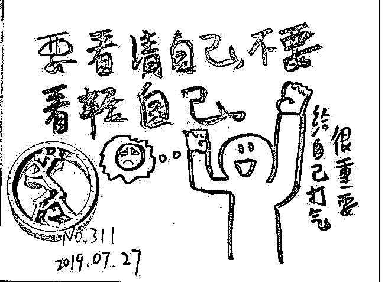

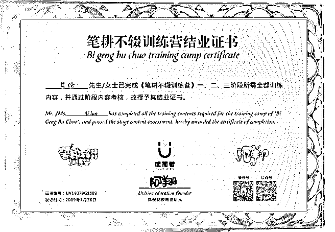

关注公众号"懒人找资源"，星球资源一站式服务

今天收到第 1 笔个人

waner : 今天收到第 1 笔个人定位后的咨询收入，虽然只有 66 元 钱，但是这对我来说也是非常值得记录的荣耀的一刻。尽管 我以前也收到过别人对我表示感谢的红包，但都不是基于我 是一个节日策划官，个人品牌咨询官的定位下。从这一笔小 小的变现，我也总结出一些可值得借鉴的经验，下面和大家 分享一下。 首先这位朋友是我才加入的新朋友，而且是他主动加的我， 是在一个流量交流群里面。我加入进去之后，首先发了一个 带字红包，然后再做自我介绍，再发了一个个人小视频，然 后小小的跟大家互动了一下。当时立马就有 5 个人加了我，而 且在群里有很多人还拿我上官婉儿这个名字开起了玩笑，气 氛一度有一点点热烈！

当时我的自我介绍是这样的。 美好的交流从真诚地自我介绍开始！

【昵称】上官 waner

【坐标】湖南桃源

【标签】节日策划官、个人品牌咨询官

【个人经历】 1、曾经老师的身份，为学校策划不低于 50 场社会实践活动， 让一大批学生家长都认可我的活动策划能力。 2、现任某区新媒体中心运营官，策划女神节活动达到 15 万

+浏览量；为某房地产公司策划年货节活动线上浏览量达 2 万

+，实际到场人数达 5000 人次+；

3、坚持在个人公众平台及轻社群平台分享输出近 10 万字，为

身边的朋友解惑答疑

【兴趣爱好】 活动策划 心理学 读书 旅游 摄影

【我能提供】 1、提供公众号运营、社群运营、抖音运营、朋友圈变现等学 习资料； 2、想做活动营销可以找我咨询，给你一些参考性的意见 ；

3、想打造自己的个人品牌，欢迎来咨询。

当这位朋友添加我之后，他主动来问我，是有什么学有什么 课程资料吗？然后我就问他想要哪方面的资料。后来我根据 他的需求先发了抖音运营资料包给他，并让他把对自己个人 IP, 目前现在的状况说一下，并告诉他我晚一点看了回复他。 他十分配合的把自己的情况大致介绍了一下，后来，我晚上 的时候就去请教了笔盖，我心里没底，不知道我的水平能不 能够解答他的问题，当时笔盖就鼓励我，让我用自己的真实 经历及收获感悟来影响他，打动他，吸引他，而且还表示做 我的坚强后盾，实在搞不定，就把他推荐给她，她来帮我出 面和他交流。 就这样，针对他提出来的问题，我查阅了资料给他自己最真 实的回答。我是在昨天晚上时给他一些具体的建议，他当时 没有回，但到今天中午的时候就给我直接发了一个 66 元的红 包，说非常感谢，受益匪浅！

从这第一笔变现我总结出 2 点收获。 第一你还没有变现，并不是因为你做的不够好，有可能是你 的圈子不对，所以不要急着去否认自己，可以去尝试换一个 圈子，在别的地方去放大自己。 第二，真诚的对待每一位朋友，注意我这里说的是朋友，我 并不是说的客户，其实说真的，我并没有想过他会给我发红 包，我也只是想着第 1 步验证的阶段，我看看自己是否真的能 够给别人一些合理的建议，得到别人的认可。而从这件事情 也可以看出，只要你真诚的去对待别人，真正的想要去把这 件事情做好，你会去想办法，查资料，找贵人来帮助等等， 从而完成这个事情，那么到最后，是一定会有结果的，即使

没有红包，我相信也会有好的反馈。只要你做出这一步了， 那么你就会有好的收获，从而增加你自己的自信心。 另外，从这件事情也得出一个小经验，就是当你去混群的时 候，一定需要做好相关的准备，要一气呵成。因为我学过相 关的混社群方法，首先，第 1 步是带字红包，然后个人介绍， 紧跟着爆本人真实照片，再来一句活跃氛围的表情包或话 语，会让别人记住你！其实我没有爆真实的照片，但是我用 了一个有趣的小视频，也吸引到了很多人的目光。 这就是今天第一笔变现的成果汇报，我相信自己可以做得更 好！

2019-05-25(18 赞)

评论区：

Abigail * : 棒棒的婉儿

waner : 谢谢你的鼓励，一起加油！

丽君 : 你好棒，加油！

荻野 : 你好，可以联系主编荻野在简书投稿推广并且领取 18.88 红包，如没微信，可添加 wx：VStarOne521

waner : 谢谢荻野

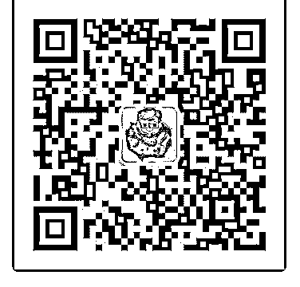

关注公众号"懒人找资源"，星球资源一站式服务

关于换定位 - 小

Jessie : 关于换定位 - 小鱼老师一对一复盘

最近很是焦虑。一方面，本来的定位“0-8 岁儿童英语启蒙启蒙 规划”引流遇到困难；另一方面，因为自身美音口音比较标 准，在加拿大的朋友主动找我上美语口音纠正课。试讲了一 节之后，大家都很认可，直接转了我学费（前后约 400 加币， 折合人民币 2000）。

一边有心栽花花不开，另一边无心栽柳柳成荫。所以我就寻 思着既然已经在准备口音纠正的材料了，是不是干脆就把定 位改了，专心做一件事。

和小鱼老师商量了之后，醍醐灌顶。决定还是先把目前的定 位做好。三点原因如下：

1\. 做标准化产品，还是定制化产品 开始的时候，这两者其实差别不大。但有了规模以后，会差

很多。这是由时间精力的稀缺性决定的。

如果做美音纠正，每个人的发音错误不同，需要一对一的辅 导，才会有效果，这一行属于偏定制化的服务产品。

而做儿童英语启蒙规划是可以标准化的，因为启蒙的手段就 这么几种，只要把具体操作细节技巧传授到位，家长执行力 强，效果就会很好。

从这一点看，长期来说，儿童英语启蒙规划完胜。

2\. 不管哪个定位，普世知识是共通的

尽管现在口音纠正遇到了送上门的客户，但这单结束后，我 同样会面对引流的困难。

引流，话术，朋友圈展示价值，这些普世知识不管哪个定位 都需要好好学习。不能因为偶然的一些因素，就妄想跳过学 习的过程，直接获得成果。

眼光要放的长远，客户才会源源不断。

3\. 咨询前筛选客户，咨询后全力以赴 我在做儿童英语启蒙规划的时候，会遇到一些家长执行力不

够的问题，这样的最终改变就不会太明显。

小鱼老师告诉我：宁缺毋滥，哪怕是在初期。 以前一直没明白泽宇教育咨询单的这个问题：为什么泽宇教

育要录取你？现在我懂了。这和“名师出高徒”是一个道理。 我们都以为是名师成就了高徒，但其实他们是互相成就。名

师在择徒的时候就会筛掉那些懒散的人，专心带好有行动力 又聪慧的孩子。如果没有这个筛选的过程，名师一是会带出 几个顽劣子弟，败坏了名声；二是精力分散，无法给予有慧 根的徒弟更多的指导，浪费了资源。

在初期广撒网的阶段，坚持宁缺毋滥特别难，但也特别重 要。与其咨询后出不了成绩，觉得愧对客户；不如咨询前细 细考量，选择最有潜力的那一批，全力以赴帮他们实现目 标。

豁然开朗的感觉真好。

我是 Jessie，专注 0-8 岁儿童英语启蒙的路线规划师。我女儿从 英语零基础到目前 9 岁，英语词汇量接近 20000，并考进多伦 多公校的天才班；我自己也在陪伴英语启蒙的过程中，从哑 巴英语逆袭为雅思 8 分老母。

如果你对儿童英语启蒙规划感兴趣，我很愿意帮你做个梳 理，免费赠送朗文 word by word 系列(Pdf+音频)，快速积累第 一桶单词。

2019-05-25(10 赞)

评论区：

林晓菊￥高效思维 : 哈哈哈，厉害

丽君 : 你好棒，加油

荻野 : 你好，可以联系主编荻野在简书投稿推广并且领取 18.88 红包，如没微信，可添加 wx：VStarOne521

Jessie : 谢谢主编，已简书投稿

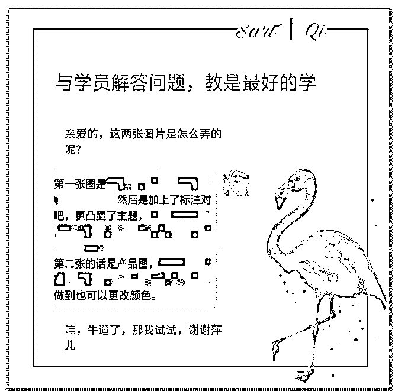

关注公众号"懒人找资源"，星球资源一站式服务

做好【品牌故事】，

唐芳 : 做好【品牌故事】，你的价值千万——故事女王|梓菲

今晚故事女王——梓菲老师在核心群跟大家进行了精彩的分 享，真的很感谢老师牺牲很多变现时间为我们做的一次分 享。

梓菲老师今晚分享，谈到了自己与故事的结缘（编剧专业老 师），谈到了在泽宇教育的成长（结识和收获），谈到了品 牌故事的重要性（个人品牌），谈到了在泽宇教育高效学习 的“三多”方法，最后一一表达了对泽宇教育以及导师们的感 谢。真的是很奈斯很用心的一次分享，收获匪浅。而且还专 门为核心群学员们提供福利，一对一讲授品牌故事方法。

一、每个人都需要一个故事 这部分是梓菲老师今晚分享的核心内容，也是我们能够收获

最大引起重视的一个内容。

1.个人品牌的本质不是狭隘的实物产品或课程，而是人本身。 梓菲老师说，☞人是情感动物，在快节奏的社会里，有一样

非常珍贵的东西叫【我认你】，这个“认”绝不是来自你的盲 目引流，把现有的学员服务好才是大爱和大格局的第一步。

关于这一点，我觉得自己做的不够好。 泽宇的课程里强调了很多次，要用心服务好客户，而且我也

是知道的。但我除了认真给学员备课，学员问的问题马上解

答以外。

我发现自己总是想着要一对一去观察她们都朋友圈，去主动 关心她们。却每次都因为自己生活中的一些事情一拖再拖， 没有好好地去跟她们聊一聊，了解她们的一个状态和学习或 工作情况。

听梓菲老师讲到这里，我必须把这个列入计划，一周至少三 次花时间来好好跟我的学员聊天，谈作图上的一些问题和收 获，真正帮助她们学到我朋友圈美学里的内容。

此外，梓菲老师还讲到，自己以前也有做面膜微商的经历， 可是朋友圈频频刷广告，出街扫货铺货，一点都做不起来， 最后不了了之。所以还谈到了，朋友圈文案的重要性。朋友 圈的文案要当成一个故事来讲，才足够吸引人。

这一点我也是深有体会，因为自己也是很喜欢看别人写故事 的朋友圈，我自己也会稍微用到。梓菲老师一说，我觉得自 己要经常写写朋友圈故事文案（学员成交，生活感悟，付费 咨询……）

2.再有道理和概念，也需要通过故事来体现 “你是你自己的产品经理，为了更好地展现价值，你需要软硬

结合。”

梓菲老师主要谈到了我们泽宇学员们，我们经常因为害怕成 绩不好，害怕不成功，担心自己的朋友圈不够高大上。于 是，朋友圈很多与“我”无关的内容，比如无关链接，无关的 文案等等，甚至有的会设置朋友圈三天可见，把微友们拒之 门外。

梓菲老师说的关于故事很重要的一点，“你今天的状态是过去

所有选择的总和，比起你所变现的数字，大多数人会更关心 你的童年糗事、人生低谷、得意导师或被背叛的难忘记 忆……”

其实，人天性就爱听故事，就爱八卦，你的朋友圈多一些关 于你的事情，相较于其他内容，会更吸引微友们的注意。

所以，朋友圈要多谈谈自己，谈谈好的，也适当谈谈有趣的 坏的，毕竟人无完人。当别人对你这个人认可了，熟悉你 了。于是，他们可能会喜欢你的性格，喜欢你的某个特质， 那么对于你卖的产品或者课程，也是愿意相信，愿意付费 的。

3.讲故事和文笔好并无必然联系 梓菲老师说，朋友圈文案不一定要刻意去学，关键是把握好

【故事思维】。

☞“故事思维说白了，就是用讲故事的方式和思维来表达一 切。”

☞“我们人类的所有活动，都是在用自己的叙述体系，来让别 人理解并接纳我们的价值体系，这是一切变现的前提。”

听了梓菲老师讲这些，其实我们每一次表达，不论说话还是 写作，还是朋友圈文案都是让别人理解我们的表达目的。所 以个人品牌运用好故事思维就很重要。

讲故事的方法我学过几种，简单列一下:

①朋友圈文案（小学水平就行） 时间、地点、人物

起因、经过、结果

②个人经历故事 目标、阻碍、努力、结果

二、泽宇教育的正确打开姿势 这里梓菲老师讲了很多我们大家可能出现的错误思维。

☞“成长比的是自我增量而不是起点高低。”

因为每个人的基础和路径都不尽相同，所以变现快慢也就不 一样。

梓菲老师指出，我们不能因为心急而跳级听课，这样我们被 更多大咖月入十万，几十万的结果刺激得自己连复盘都顾不 上。那么也就没有做到变现的正确方法了，当然也就很难变 现。

其次，我们也不能囤课成习惯，觉得进了泽宇教育就安全 了，想着方正导师和助教会解决自己的问题，让自己实现全 球旅行办公的。实际上，成长是没有任何人可以替代我们完 成的，所以我们需要自己提出需求，让大家帮助你。

怎样在泽宇教育学习☞【三多】

①多去星球捞干货（“偷学武功”） 因为这是我们花钱都买不到的他人的经验和智慧。

②多参加答疑（没有具体问题可蹭听） 助教和导师绝对是专业的，能够马上让你茅塞顿开。

③多在群里冒泡（多爆露问题） 这个别骗自己，模棱两可提问，具体一些，导师助教和大家 更加能够帮到你。

梓菲老师讲到这个，真的是大技巧。我这三点没有很好地做 到位，接下来也是需要改进。

特别是星球，多去看别人的复盘，自己也多复盘提供价值。 这个给自己定一周三次，每天专门找个时间看看相同定位却 做的比我好的人，他们是怎么实现快速变现的，然后好好运 用到自己身上。

另外，答疑我是因为知道自己的问题，没有勇气去参加，因 为担心助教一问这个你做了吗？我可能就会知道但是还是没 改。因为有顾虑，那今天梓菲老师讲了，我觉得自己至少一 周参加一次答疑，蹭听去，再努力去做到找出具体问题提 问。

对于第三个，我才发现自己在群里冒泡虽多，但都没有什么 特别的价值。下次在群里冒泡，我要试着请教大家和助教导 师问题，去为提出问题的其他泽宇伙伴们解答自己擅长的问 题。

以上是今晚对梓菲老师的分享复盘，结合了自己的理解和看 法，希望对你有所收获。

wx:StarXiaoA123 2019-05-25(20 赞)

评论区：

丽君 : 谢谢分享！我们一起加油！

荻野 : 你好，可以联系主编荻野在简书投稿推广并且领取 18.88 红包，如没微信，可添加 wx：VStarOne521

关注公众号"懒人找资源"，星球资源一站式服务