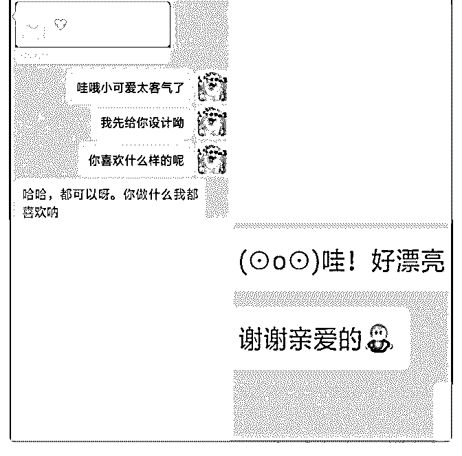
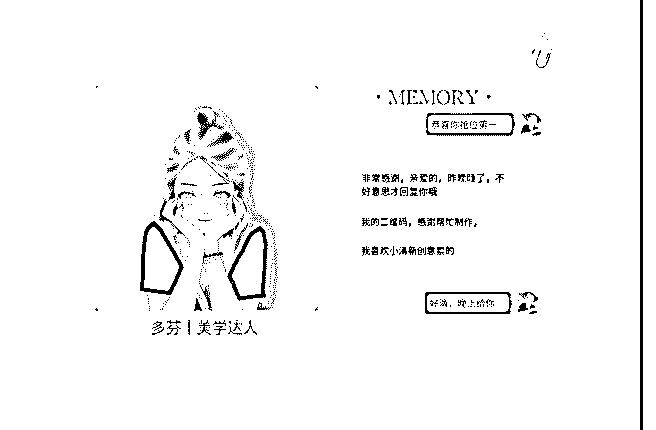
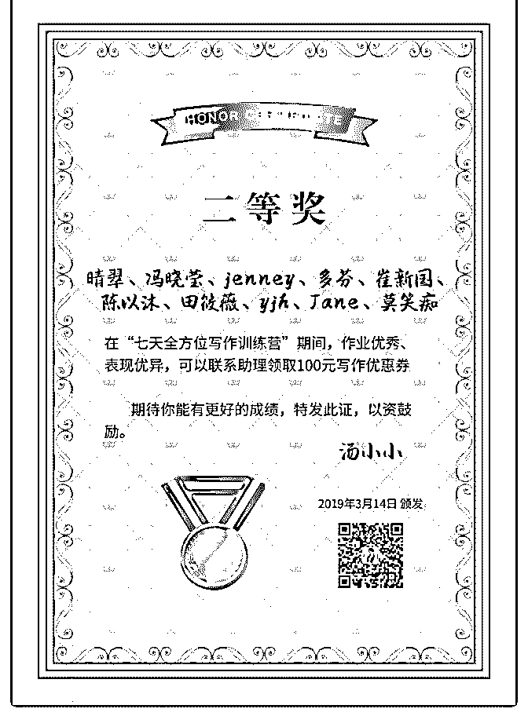

# #庆祝成果 我是如

林子预 : #庆祝成果 我是如何在动车上收到两名学员，赚到 798 的

5.23 日，又到了周四，也到了我的定投日，在动车上，我认真 去查看了自己定投的基金的各项指标，惊喜发现这几只基金 依然符合定投条件，仍然可以按计划，按配置积极买入。额 外还发现其中一只基金 5.23 分红，小开心了一下，发了一个朋 友圈庆祝一下。

我自己的搞完后，赶紧召集我的学员，到定投日的也行动起 来，甚至去一对一追踪，课程落实情况。不一会儿，两个学 员根据我的一对一指导，把关，也完成了操作，开启财富积 累第一步，她们深深感叹，原来理财辣么简单。

到这里，一条有价值的朋友圈又创造出来了，嘿嘿，小开 心。又发了一圈。

发完后，不到 10 分钟，一个好友过来找到我，说问我是不是 手把手教指数基金定投，我给她介绍了这边的情况，她果断 转账报名，才发现，哎呀，原来自己的朋友圈呀，真的是个 炼金地。

再过了 20 分钟，又一个朋友又过来咨询，说自己消费总是没 有节奏感，也不知如何理财，了解完他的情况后，我很庆幸 我是能帮助到他的，于是给了他思路，我的价值得到了他的 认可，但他说近期特别忙，暂时没时间学。希望我能给他留 一个 399 的名额，毕竟只有 5 个了。于是，他果断转了 100 定金 预约名额，说下个月来学补齐。

在这里总结几个点：

1、朋友圈一定要坚持写，写自己的成长，让别人看到我们的 进步。

2、招了学员一定要去用心服务，负责，带他们出结果，将心 比心，我们为他们的付出，她们一定是会给我们好评的，这 样也利于我们收集发圈素材。

3、新咨询客户可以先提供价值，挖掘其需求，展示对应价 值，而不着急成交，要带着爱，带着利他去成交，别人也更 容易接纳我们。

我是轻松年化 15% ，会做资产配置，会梳理个人财务系统的 独立理财咨询师子预 ，欢迎链接我，围观我的朋友圈[愉快] 一起多多交流，一起加油打造个人品牌。

2019-05-24(6 赞)

评论区：

freedom-ic* : 看着看着，我已经信任你了。 林子预 : 嗯？

关注公众号"懒人找资源"，星球资源一站式服务