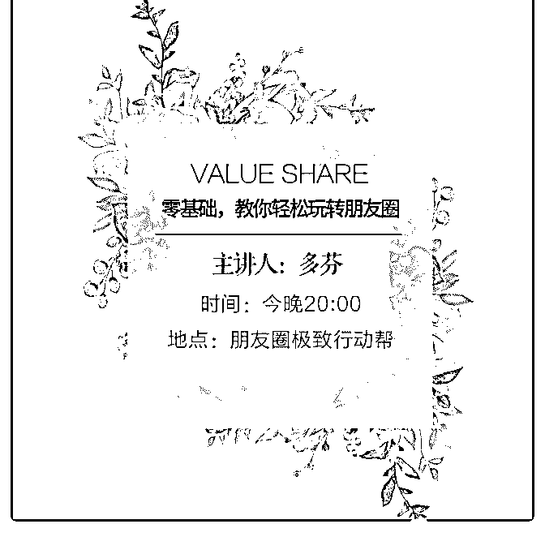
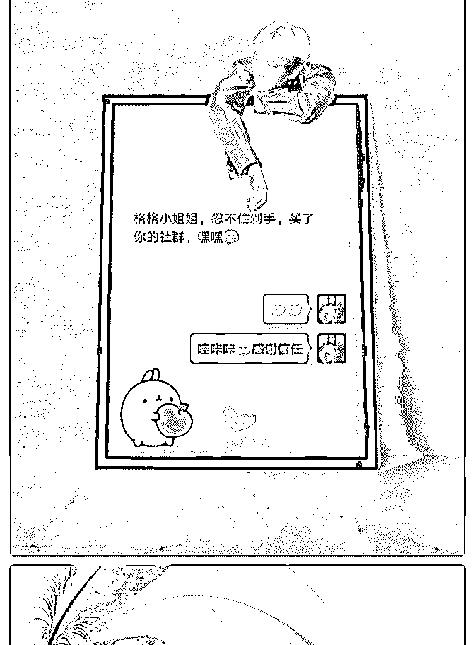
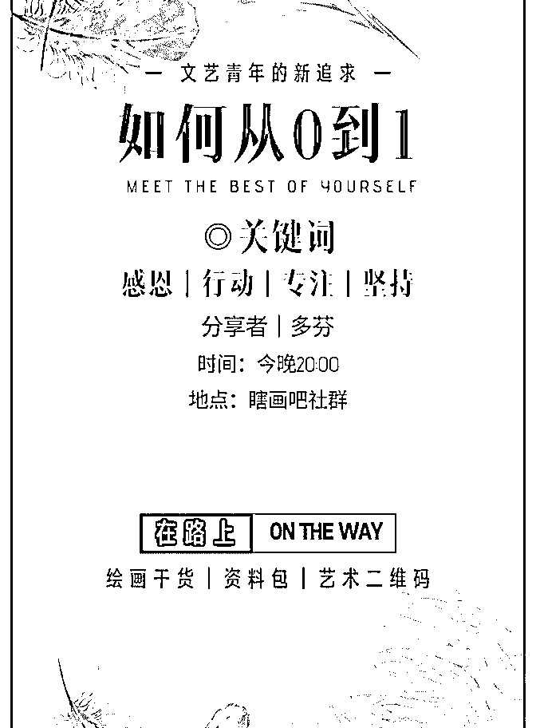
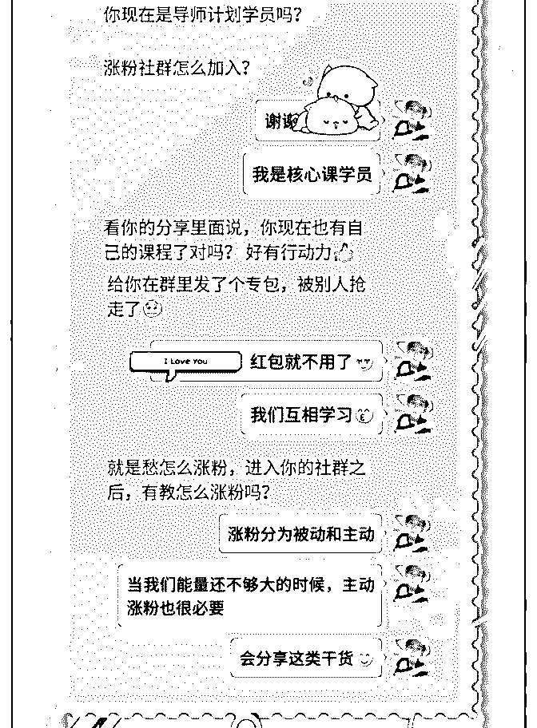
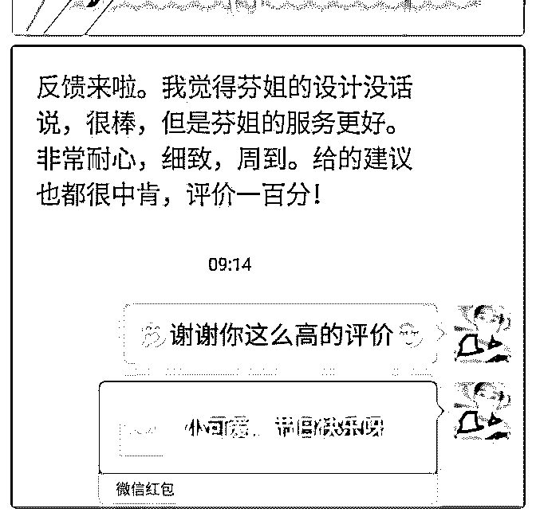
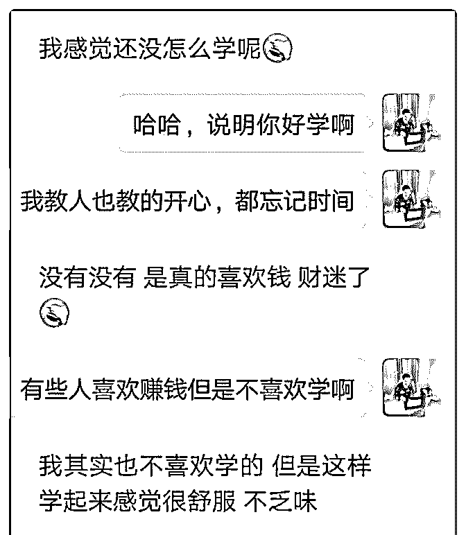
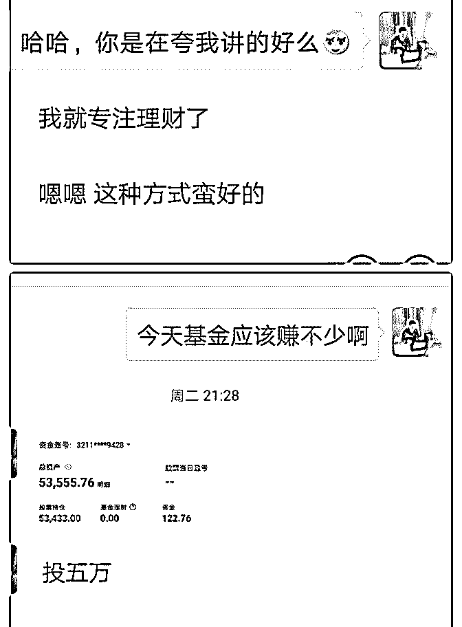
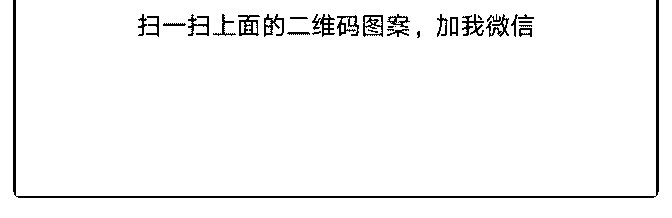

# 8 天 10 倍赚回学费

情感吴彦祖 : 8 天 10 倍赚回学费 3 5 0 0

自从四月份开始践行核心课程内容，每天认识一位新朋友，

打破自我设限，找到自己的定位，然后边做边调整，另一方

面我是两个微信号，一个是自己的情感咨询，一个是跟着亲

戚家做的鼻炎堂，两边同是持续输出干货，有迷茫，有自我

怀疑。

迟迟不出结果，四月份过去了没有变现，以至于我都不知道

五月会怎样，但是心里还是不服输，为什么别人可以变现我

不行？然后把以前加过的朋友重新捋一遍，持续去乡下宣

传，朋友圈展示，把有意向的顾客都拉回店里深入交流。

功夫不负有心人，终于在 5 月 11 号，我迎来了第一单，变现 RMB1 0 0 0 。当时的感觉就像一股电流冲击着自己的神经， 心里默念了：我是可以的，我是最棒的，人生不设限！

很快，幸运女神又开始眷顾我。

5 月 16 号，变现 RMB1 2 0 0 ！

接着，5 月 19 号，线下到店里咨询，变现 1 3 0 0 ！（收的现金 没法截图 ）

八天时间，从 0 到 3 5 0 0 。 让我更相信，正是因为上一个月的践行和积累，打磨基础。 迎来的五月的飞速成长！

接下来，我相信会有更多的变现 感谢泽宇教育，感谢核心课程，更感谢明哲师兄的无时无刻 的指导！有问题就反馈，解决问题，才是关键。 很喜欢团队里面说的一句话：

命，是弱者的借口

运，是强者的谦辞 因为有了成功体验，有了高峰体验，才会更加坚定自己的初 衷，走下去未必一帆风顺，但肯定会越来越好！黑客帝国里 说的，你不是不能，而是没有这个相应的程序，把赚钱的程 序装上自己的大脑，变现如此简单！

（噗哈哈说的有点浮夸了，相比大神我还是菜鸟，说的不足 之处各位看官多有指点呐 ）

2019-05-21(15 赞)

评论区：

丽君 : 把变现的程序装进大脑，变现如此简单！ 太棒了，向你学习！

荻野 : 你好，可以联系主编荻野在简书投稿推广并且领取 18.88 红包，如没微信，可添加 wx：VStarOne521

关注公众号"懒人找资源"，星球资源一站式服务

零基础零资源正在念

小小板凳 : 零基础零资源正在念大一的我是如何通过个人品牌 变现 1000+的

现今仍然记得很清楚，我是去年十一接触加入泽宇，中间走 走停停，到现在从零基础零人脉到通过个人品牌变现 1000+， 知乎万赞接近 2000000+的阅读量，我想和各位朋友分享一下 我的成长经验。

经过接近半年的时间去打造个人品牌收入，从我个人经历， 以及我身边一同打造个人品牌的朋友发现了几乎很多人都有 的一个问题。

这个共同的问题可以用四个字来概括:浅尝辄止 记得刚加入泽宇那段时间，我也是相当的勤奋，每天就像打

鸡血一样，听课写复盘，有时候学习太忙，但也依然坚持在

半夜听课写复盘。

但后来好半个月下来，几乎没有多少结果，而且那一阵子赶 上 12 月份英语四级考试，忙着考试复习，所以基本把个人品 牌的事情放在了一边，就没有去管。

直到过年前的那个月在核心课社群看到明哲助教从 0 到月入过 万的分享，才重新坚定了我打造个人品牌的道路，也感谢助 教的分享，如果我没有看到那场分享，或许我现在还是一位 零基础零粉丝的小白。

现在回想反思一下，和我一样本身就是零基础零资源，底子 差的朋友，本身就注定了不可能短期内出成果。而大多数人

太追求短期结果，努力做了之后没成果就放弃，自然不会出 结果。

根据我这几个月的成长经验，我总结了以下几点内容，希望 可以帮到大家。

1.关于定位问题 很多学员一直卡在定位的问题上没有突破。首先，个人定位

是整个个人品牌的核心，没有个人定位，后面所做出的一切

努力都很有可能是南辕北辙，越努力离成功越远。个人定位

值得我们花大量的时间去研究，去摸索。

有些学员本身就有一定的特长，比如摄影师，健身教练，或 者心理咨询师，这些学员很容易找到自己的定位去钻研，但 像我这样零基础零人脉的学员，没有特别的特长，该如何破 解呢？

我个人总结出的一个方法，我就没称之为“宽进严出”法。 可以根据字面意思去理解，你可以选择多条路去尝试，我现

在仍记得当时我给自己一个非常大而笼统的定位:个人成长

个人成长这个定位可以说非常宽泛了，关于成长的事情实在 是太多了，记得当时我帮助过学员解决过焦虑等问题，甚至 有为职场阿姨来像我请教职场的沟通问题，直到最后我现在 做的目标管理，解决行动力不足的问题，中间的定位来来回 回换了不少。

至于选哪个领域专攻，主要根据自己当下的情况来，再一个 根据市场的前景选择。

比如说我之前专攻在焦虑问题的解决，我个人也比较有兴趣 去做，但市场前景却不好，因为我发现现在市面上很多关于 焦虑的文章，泛滥于各个平台网络，物以稀为贵，用户的付 费意愿也比较低，市场前景不是很好。

第二个是职场的沟通，这个方面定位也是我第一次收到咨询 红包的定位，而且解决的都是许多职场人迫在眉睫的问题， 而且这类群体也有付费能力，可以说是个不错的定位。

但话说回来，我现在毕竟是一位大学生，而且才上大一，职 场上的事情八竿子打不着边，和自己当下有不少冲突的地 方，并不适合我去做，所以，我也并没有去深耕。

后来就选择了目标管理这个定位，帮助小伙伴树立目标，提 高行动力，改变拖延问题。首先，我原本是一位比较懒的 人，平时在学校里基本上就是看手机，玩手机，没有任何的 目标规划，但我现在却一步一个脚印，目标清晰，成长历程 清晰可见，自己能做好，就有教别人的基础。

对于我来说，这是一个可以深耕的定位，也很有市场，与我 当下生活也丝毫不冲突，自己也希望带着更多小伙伴加强行 动力，完成自己的目标，所以说，这一个月的时间，斩获颇 丰。

2.装饰好向顾客打开的“窗户”

这个窗户顾名思义，就是朋友圈。找到定位之后，我们第二 步需要做的就是去打造好自己的朋友圈。

朋友圈为什么这么重要，我们不妨换个角度去理解。 最近我们学校开展了网络防诈骗，远离校园贷的讲座，其中

的一句话我印象挺深，你很难想象在和你聊天的这部手机屏 前，究竟是什么样的一个人。

通常，客户经过引流加到你好友后，大概率情况下是想了解 一下你究竟是一个什么样的人，在没有办法和你直接见面的 情况下，大概率的会从你的朋友圈去寻找一些蛛丝马迹。

客户会从你的朋友圈来大致的做一个判断，你究竟值不值得 我去信任，是否我可以把几百元的学费放心的交到你手上而 不会被骗。

首先，朋友圈最应该有的内容就是学员的成功案例，这个就 是你个人品牌的专业背书，这一点胜过千言万语，这也是让 客户信任你的一个重要条件，每一个成交案例，都可以用来 成交下一个客户。

在朋友圈的发圈中，一般最常用的手法就是对比，常言都 说，没有对比就没有伤害。真正让客户感到痛的，刺激客户 付费的，就是通过对比产生的。

比如说，我们在指导学员的过程中可以发很多成功案例，我 现在有一位学员，他之前根本没有计划没有安排，但现在却 能列一张纸的计划，缕清目标思路步骤。这个转变其实就可 以发一条朋友圈成功案例

在比如说后来，我这位学员执行力不行，很多事情只停留在 纸面工作，行动甚少，但后来经过我的指导，现在自己就可 以自己督促自己完成任务，每日按时早起，身边人都说变了 好多。这个转变，完全可以再发一条朋友圈，去刺激其他的 潜在客户。

只要大家能够真正的去对待你的学员，他们身上的案例数不

胜数，很难找不到成功的案例，所以不用担心案例的问题。

切记，大家一定一定一定要认真对待自己的学员，如果学员 懒，我们可以去督促，但凡付费了的用户，他们肯定是想学 的，如果他们的学习热情很低，你应该反过来多去思考一下 自己的问题。

3.不要忘了身边真正的贵人，我们的导师和助教 和明哲助教一直交流改进的这几个月里，给我的感觉只有一

个，助教可真是全能通。[呲牙]到目前为止，我所问的一切关 于个人品牌的问题，没有一个是助教不能给我答复的（前提

是这个问题是你行动中遇到，而不是不行动光靠想想出来 的）。我按照助教和导师的建议去照做坚持执行的，没有一 项不出结果的。

有问题先反过来看课程，课程里没有明确说的，再去问助教 和导师，效果往往事半功倍。这个网络时代，不发声等于不 发生，你不向助教去主动请教问题，那就代表着你没有遇到 问题，而且一个几百人的大群，助教也不可能照顾到每位学 员。

只要你去坚持执行，遇到问题多去问助教几个为什么，为什 么别的小伙伴做的好，我却不行。得到建议和反馈后，听话 照做，不浅尝辄止，坚持下去，一定会有结果的!

最后，我还想再说几句心理话，送给还在努力中的朋友。 没有人关注你努力的过程，别人只会关注你努力的结果。很

多人只会好奇你现在取得这样成果的结果，但却忽视了一点: 改变都是先有日积月累的基础，再有一夜的突然爆发。

零基础零资源不可怕，相反是一件好事，你可以有很多选 择，你的选择可以更加贴切市场，更加的适合你，深耕这个 领域你可以有很强的针对性，少走不少的弯路，少做很多的 无用功。关键只在于一点，你是否真的能够坚持执行做下 去，遇到困难是否去分析，去请教，而不是想想算了吧。

如果大家有目标管理和执行的问题，也欢迎向我来请教，我 很乐意帮助大家解答，对于知乎方面有问题的小伙伴，也可 以来找我咨询[嘿哈]

2019-05-20(24 赞)

评论区：

丸子妈 : 很棒的分享

关注公众号"懒人找资源"，星球资源一站式服务

泽宇教育:蜗牛小白

英姐高效育儿咨询师 : 泽宇教育:蜗牛小白要一步步往上爬 泽宇核心课告诉我们:不急不停！ 笔盖姑娘说过:每个人的起步不一样，我们不要一个人去焦 虑，要去行动，不急，不停总是会有收获！ 今天很幸运的被一个小彩蛋砸中了:免费咨询一个宝妈，她是 朋友圈的一个朋友介绍来的，说是看了我的朋友圈，觉得在 育儿方面我应该可以帮助她的孩子，一开始只是抱着试试看 的心态，却想不到真的有所收获，在育儿方面观念得到了全 新的认识，因为我确实能够帮助了她。 但她肯定我的付出对她有帮助时，之前忐忑不安的心瞬间激 动起来，这种能够帮助别人的感觉好幸福[微笑]

感谢遇见泽宇教育，感谢笔盖姑娘对我这只蜗牛的不离不 弃！记住这种感觉，继续砥砺前行，加油！

2019-05-19(11 赞)

评论区：

丽君 : 你一定会越来越棒，加油！

英姐高效育儿咨询师 : 谢谢你[微笑]

关注公众号"懒人找资源"，星球资源一站式服务