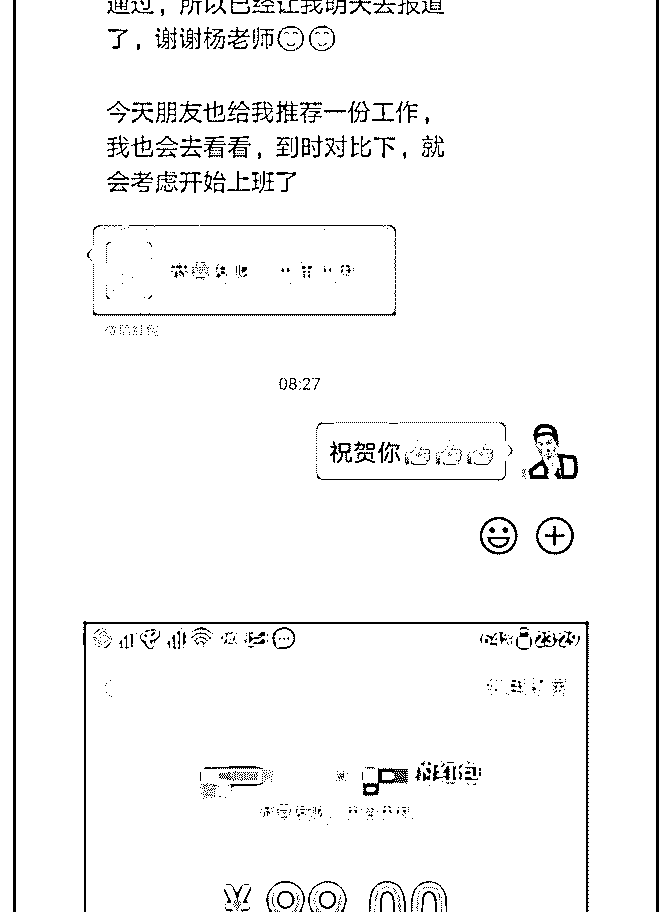
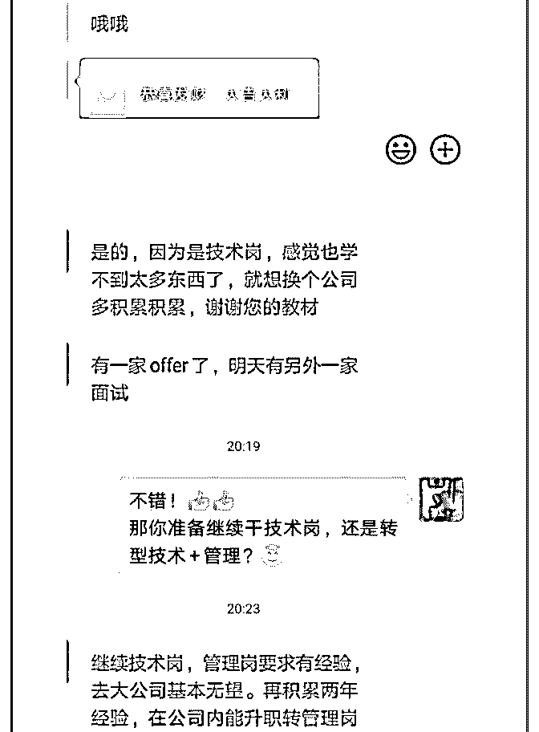
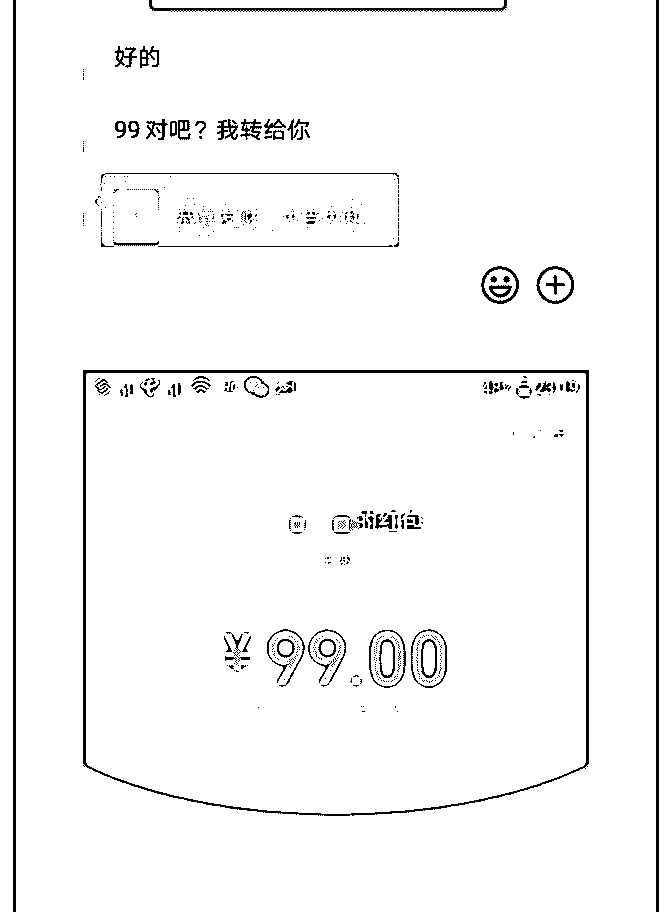

# #庆祝成果 # 《

圆圆 Mia - 专* : #庆祝成果 # 《16 天变现【10000+】，裸辞小 白是如何逆袭的？》

我是圆圆，职业转型的第 2 个月，也是加入泽宇教育开始行动 的第 2 个月，我通过做微信精准引流咨询 16 天收入

【10000+】。

回顾了整个过程，有以下几个高光时刻：

1、4 天收入【300+】，赚回核心课学费

2、7 天收入【3000+】，赚回导师计划的学费

3、18 天收入【10000+】，赚回聚星会的学费

4、5 月 16 天收入【10000+】，实现又一个新的里程碑。

也有以下几个至暗时刻。

1、连续 7 天没有咨询订单

2、客户聊到最后然后就没有然后了

3、发个招募文案无人问津

4、给客户看学员案例，对方不相信，说这些都可以造假

......

总体来说，有高峰期也有低谷期。 和你分享一下我这一路的心得： 一、向有结果的人学习。 我一直很坚信“贵人指路，少走弯路”。

在做咨询的过程中，我觉得我是幸运的。因为我遇到了泽宇 教育波力老师、小鱼老师两位贵人。

但是贵人都很忙的，也有很多人想向他们学习，那我是怎样 获得他们的帮助，甚至获得小鱼老师邀请，作为嘉宾向同学 们分享问我一路成长的逆袭经历呢？

有几个点是我一直践行的：

1、在学习群里积极展示自己：包括自己的进步、获得老师帮 助后的反馈、同学们有问题自己懂的也积极解答，减轻老师 的负担。

2、积极提问问题：经常找老师问问题，在解决自己问题的痛 同时还能刷下存在感，不停地在老师面前晃悠，让他记住有 你这么一号积极向上，正能量、爱学习的人。

3、出现进步定期反馈：自己取得一个小小的进步，也找老师 汇报一下，和他分享喜悦，让他看到你的成长以及可塑性。

二、用人不疑，疑人不用 这句话通常被运用在做管理上，但是我个人也把它运用在与

人相处以及寻找我的学习目标及老师身上。

我们每个阶段都可以给自己设置一个“标杆型”的学习榜样或 者是找一个你足够信任的老师教你学习。

我个人的习惯时在找到这个人时我会很慎重，就像去求职时 去选择自己的公司一样。

很多人可能会觉得是公司挑选面试者，我觉得是更多的是双 向选择，我也会去选择我的雇主。

就像刚开始在核心课阶段我找到小鱼老师，我和他说的不 是：老师，你收了我这个学生吧。而是我：老师，我想邀请 你做我在核心课阶段的导师，然后罗列我我的原因以及我当 下的情况，让他充分了解我的现状以及我当下的需求。

选择慎重归慎重，但是一旦选择下来之后，我将 100%信任对 方，对方教的方法，我都 100%听话照做，不质疑，因为我知 道，只有我完全将老师教的方法 100%内化，并且用的如鱼得 水的时候。我才能发现每一种方法的使用边界，并且去优 化。

三、心怀感恩，衷心感谢那些曾经帮助过我的人 没有谁有责任和义务去帮助你成长，即使你交了钱。因为那

么多人都付费学习，凭什么老师要多教你一点。

我觉得这时候就要心怀感恩。发自内心地感谢所有在我成长 路上帮助过我的人。

即使是很小的一个举动，我也都记下了。 在这里我也衷心感谢泽教育，感谢波力和小鱼两位老师的指

导。没有你们我不会成长这么快。

四、相信自己，当你想要做成一件事，整个宇宙都会来帮你 我觉得相信自己的力量是非常强大的，我在我裸辞之后去云

南旅游的那段时间，我看了一本书，很应景，叫《牧羊少年

的奇幻之旅》，里面有句话说，当你想要做成一件事时，整

个宇宙都会来帮你。我体验过这种力量。

当我想要改变自己，想要转型做自由职业的时候，我看到身 边很多人已经开始做了，并且小有成就，这给了我很大的信 心和动力。

当我开始行动的时候，又遇到泽宇教育，让我少走了很多弯 路。

我的一个朋友也有类似经历，她也处在职业转型期，非常恐 惧焦虑痛苦，不敢踏出那一步，但是不踏出去，整个人又非 常难受。她找我咨询过定位和职业转型的问题。

后来她想通过心理学催眠回溯的方式了解一下自己问题产生 的根源。我刚好又认识了一个催眠疗愈师，在没有得知她想 要通过催眠的方式自我疗愈时，我问她要不要试一试催眠的 方法，结果她说正巧自己在想要不要找个催眠的老师帮帮 她。

她向我反馈，发现自己想要改变的时候，身边就出现了很多 可以帮助到她的人。

所以你知道这个力量多强大了吧。信则有，不信则无。相信 导致发生。

五、二八法则，80%时间用于行动，20%的时间用于决策 我一直觉得世界上最大的成本是拖延和犹豫不决。我们清醒

时候的时间的构成无非 2 个元素：1 是做决策的时间 2 做完决 策行动的时间。二者的占比我觉得可以遵二八法则。

80%时间用于行动，20%的时间用于决策。

犹豫不决是做不了事情的，实践出真知，就像站在岸上是学 不会游泳的。

希望一直关注我的你一起加油，如果你遇到过和我一样的问 题，也欢迎来找我沟通，我很乐意和你分享我是怎么解决和 走过来的。并且赠送单日引流 400+的《引爆流量：引流裂变 实战手册》。

全文完

20190519

2019-05-19(26 赞)

评论区：

林晓菊￥高效思维 : 你的存在感确实刷得不错，加油，看好你！ 圆圆 Mia - 专* : 哈哈，谢谢[玫瑰][玫瑰]，一起加油

丽君 : 你实在是太棒了！向你学习，加油！

圆圆 Mia - 专* : 谢谢丽君，一起加油

关注公众号"懒人找资源"，星球资源一站式服务

《自我管理能力提升

通识书院 : 《自我管理能力提升训练营》招募发布 1 小时内赚 回核心课学费 我从 2 月中旬报名泽宇教育的课程，最近 3 个月一直处于个人 定位和焦虑的过程中，最近终于完成了自己的第一个产品的 定位《自我管理能力提升训练营》，昨天晚上在朋友圈进行 了铺垫，说明今天白天会有产品发布，并建立一个微信群来 进行产品说明。

今天上午使用工具做了一个简单的海报并在朋友圈进行了发 布，朋友圈的产品展示一定要采用三个段落，第一个段落介 绍你的产品、第二个段落是截图、第三个段落是你自己在留 言的地方写出你的产品价格或者购买方式或者购买链接，这 是我昨晚向关健明老师学的朋友圈文案展示方式，现学现 卖。

最后，有人报名之后，你一定要及时展示出来，以营造一种 抢购的现象。吸引看到的朋友尽快下单。

总结，无论你有什么的特长或者技能，勇敢地在朋友圈暂时 出来，尽快开始进行招募，只要能够招募到第一个学员，好 好打磨你的产品和服务学员，你就能招募到第 1000 个学员。 今天 1 个小时的时间我招募了 4 名 98 元的付费学员，赚回了核 心课的学费，你也可以做到。 我是金峰，一名自我管理高级咨询师，通识书院创办人，

《自我管理能力提升训练营》发起人，第一期种子用户还有 少许名额，欢迎抢占。

2019-05-18(15 赞)

关注公众号"懒人找资源"，星球资源一站式服务