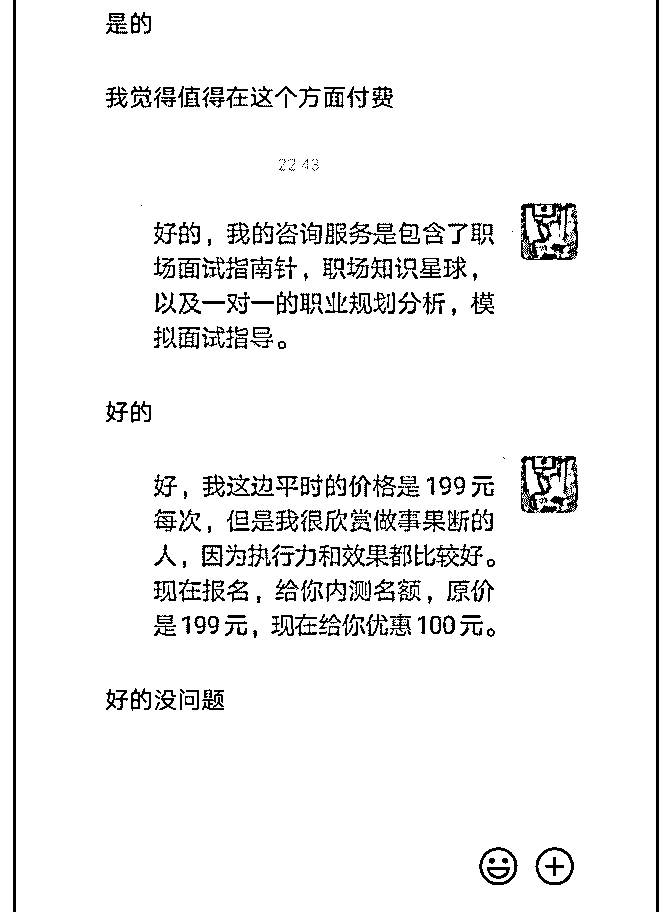
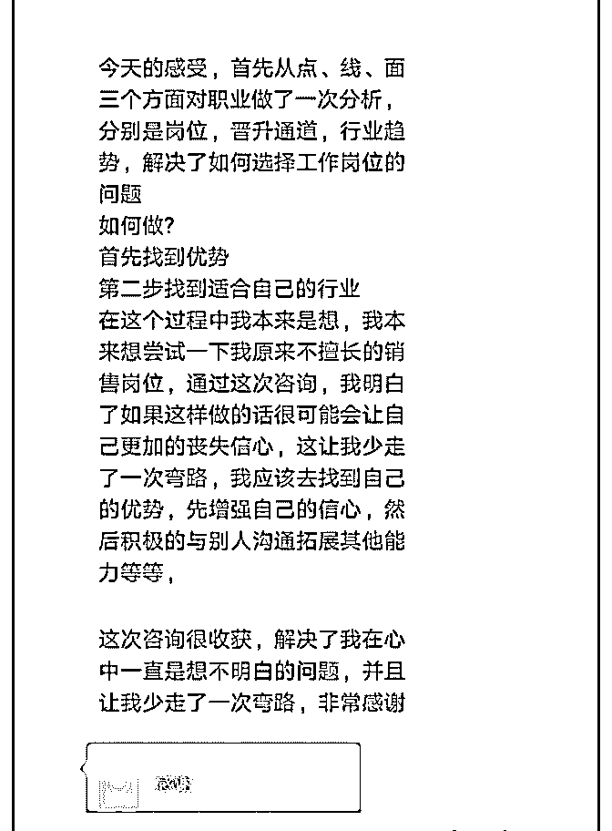
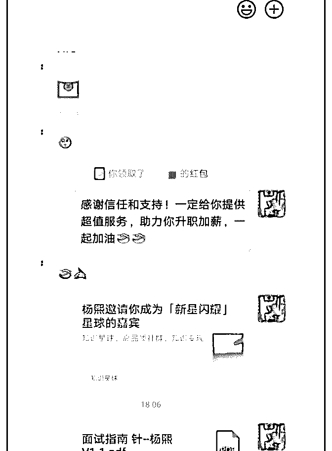
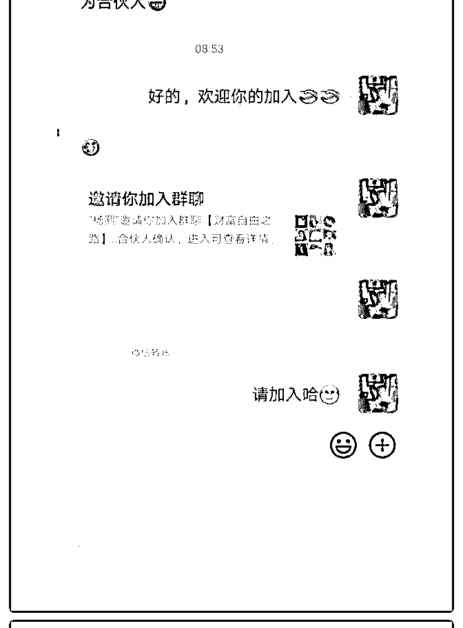
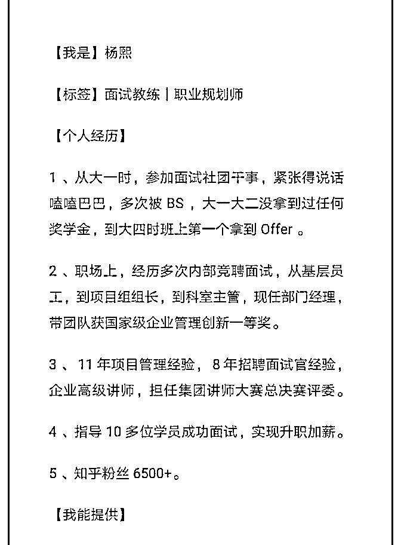
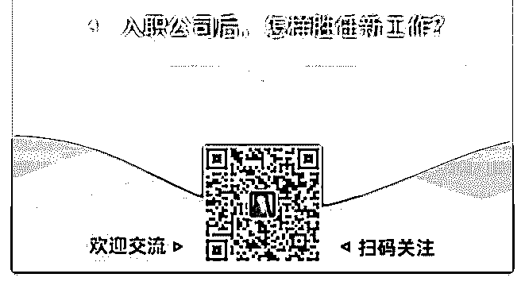
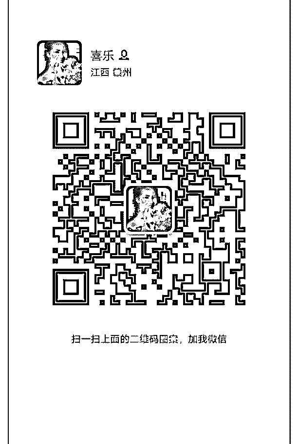

# #庆祝成果# 免费

朱丽仙—提升公众表达 : #庆祝成果#

免费咨询阶段，完成【4】位咨询，【2】位发红包，收到

【188】元

后 2 位开始引导收费，我【100%】收到大红包，我是怎么做

到的呢

1.不要有成交心态 成交心态会让自己着急去做有利于成交的事情，比如过度引

导付费的动作，会给学员带来不好的体验感，感觉你是为了 赚钱，而不是帮助他解决问题的。

2.树立帮助学员解决问题的心态 树立这个心态，你就会在咨询的过程中

（1）了解学员有什么问题

（2）诊断出现这些问题的原因

（3）根据这些问题给出定制的解决方案

（4）帮助学员解决问题

（5）学员就会感觉收获很大，价值很高

（6）简单引导付费，学员就会主动发大包给你了

我是丽仙，微信号 xianxianxm，专注提升公众表达，3 年公众 表达授课实战经验，累计授课人次 1600+，如果你有公众表达 问题，我可以帮你【免费】理一理，由于时间有限，每天仅 限前 2 位。

2019-05-18(10 赞)

关注公众号"懒人找资源"，星球资源一站式服务

我三个月 10000

石蓉蓉（内修心，外修* : 我三个月 1000000+成交，仅来自朋 友圈，分享一下经验

98%的人朋友圈是不赚钱的 其中 70%是不敢发真心话，所以发的畏畏缩缩、小心翼翼、

话说一半、提心吊胆

还有 20%是太急着赚钱，朋友圈全是广告，你发广告谁看 啊，一条条的产品信息，以为打开了黄页呢

还有 8%是很会卖东西，也有好产品，但害怕别人知道了自己 变好的秘诀，所以打死也不分享

以上情况，发朋友圈赚不到钱请不要怪社会，确实要怪怪自 己了。

破解方法： 对于第一种，属于心理层面问题，可以链接我来帮你梳理，

大大方方做自己的同事赚钱到手软；

第二种，属于技巧方法问题，多和你所在群的导师学习，

《朋友圈印钞机》就会教

第三种，格局=你愿意成就多少人=你能赚到多少钱，我三个 月能有这样的七位数成绩，是因为连我的试听课都是满满干

货和启发，我真心愿意成就小伙伴，这点真心你感受得到。

分享给你，祝你朋友圈赚大钱！ 我的 vx：rongjie0001

附图是学员心中我的靠谱 靠谱=真心愿意成就他人 2019-05-17(26 赞)

评论区：

荻野 : 你好，可以联系主编荻野在简书投稿推广并且领取 18.88 红包，如没微信，可添加 wx：VStarOne521

关注公众号"懒人找资源"，星球资源一站式服务

【茉莉香养生减肥训

茉莉香 : 【茉莉香养生减肥训练营】开训复盘 我虽然是直接进聚星汇加入的泽宇教育，但一直不太自信的 混在核心群。定位养生减肥后很快就带出 3 位小伙伴不打针不 吃药，不卖产品，靠科学饮食健康瘦到了理想状态，顺利毕 业。

朋友圈很多人看到了我的成功案例和价值输出，就来咨询我 减肥的方法，加入了学习的行列。此时导师笔盖建议我可以 做训练营了！于是我再一次被她推着向前迈出了重要一步， 筹备训练营。 我用了一个星期把自己的减肥方法认真梳理了一遍，拟定了 课程计划，并在导师笔盖的指导下对课程内容进行了多次修 改完善，最终形成了第一套训练营教程。 训练营招募前，我花了一个月在自建的免费分享群每天持续 输出养生减肥高价值，并免费分享了两节干货课程，受到大 家的一致好评。当我做好训练营准备后，当天下午笔盖教我 发了一条自己减肥成长过程配自己改变照片的朋友圈，来激 活朋友圈，引起大家关注。当天晚上八点四十，正式在朋友 圈和分享群里发出了招募令，并提出了前十名 5 折优惠的刺激 信息，但此时很多人都还在观望，无人问津。 第二天一早我是被入营收款信息吵醒的。有个同学完全没有 经过询问就付款要直接加入训练营。我问他为什么不问就 来，他说其实关注了我很久了，觉得我够专业，有信誉，为 人也很诚恳，关键价格和方法简直超值，于是他二话没说就 决定加入。 很快，过去咨询过没有决心报名的，想做我助教的，还有已 经跟我学习了一段时间的同学，取得了成果后推荐的朋友都 纷纷加入了训练营。不到两天时间，训练营已经成功招满了 20 人。

学员们经过紧锣密鼓的准备，训练营于 5 月 14 日正式开营。第 一天晚上，简单的开营仪式后，我进行了第一次课程授课， 并回答了学员的提问，强调了注意事项。同学们就开始进入 减脂实践了！ 第一天群内打卡，同学们无一例外的掉秤了，还有一个一天 掉了 1.6 公斤，效果简直不要太好，我自己都惊呆了！ 感谢导师笔盖的不离不弃和耐心指导，同学们的信任和支 持！相信的，拼了命都要带你们逆袭，期待在不久的将来， 你们都能遇到更美的自己！我们一起加油 ！

我是健康养生减肥咨询师，坚决抵制节食，卖产品打针吃 药，倡导科学合理饮食，只需跟着我好好学会吃饭，就可以 实现科学健康减肥，享受享瘦的愿望，期待链接优秀的你！ w

2019-05-16(15 赞)

评论区：

荻野 : 你好，可以联系主编荻野在简书投稿推广并且领取 18.88 红包，如没微信，可添加 wx：VStarOne521

茉莉香 : 老师我之前的投稿被锁定了，不知道为什么

荻野 : 私聊我告诉你

茉莉香 : 私信你了

Jack L 杰克 :

关注公众号"懒人找资源"，星球资源一站式服务

今天是核心课第一周

今天是核心课第一周的总结，这一刻的我，决定开启第二周

的学习和探索；开始之前，我想简单总结一下本周的历程；

【心态过程】： 我的生活虽然不是两点一线，但是感觉属于自己的时间越来

越少，周而复始的工作让我缺少了变性思考，脑回路本身都

很活跃，却卡壳在了一个固化思维，犹如一个没有润滑的轴

承，每一下都感觉会绷断的感觉。而这样的生活方式也让我

看不到未来是什么样的。序言的内容，触动内心，犹如轴承

滴入润滑油，带来的连锁反应，输出的功率和产生的热量提

供高效执行的一个动力；

生活中的我是一个凡是喜欢结合自己的想法和事态发展规律 的一个人，学习能力其实和大家都一样，维度我喜欢模仿和 传授两种方式。在我过去的职场生涯中，我刻画了无数个对 自我的标签，乃至于现在你让我定性自己的标签都很困难， 也许让你在这个过程种清晰的定义自己会用很多时间，可能 在这个过程中你会放弃、会更加的迷茫，你会决定你花了 钱，没有得到你想要的状态。其实一开始泽宇就告诉了你， 没有得到实质性的收获之前，等于什么都没有。

【我的目标】 说我的目标也好，标签也好，从这一周下来，我感觉我的标

签给自己定义的很大，大标签目标是成为泽宇一样的导师，

小目标是融会贯通吃透研发的每一堂课的每一个逻辑；

加入星球，每天很多人发送很多复盘，我都会挨着挨着的看 完，也有很多人每天在分享很多东西，有真正的大咖在总结 自己，也有总结就总结就自嗨起来的，也有总结总结就不见 的。其实我想说，有一个人一直都在，那就是泽宇；可能这 样说会让你很难理解我说的逻辑或者说很难理解我为什么会 这样说。其实有一点很简单，他成功了，你就要去复制他的 所有，你要去模仿他，而不是一周的课程你就学习 2 天就开始 觉得自己很懂了；

为什么“留单”的分享会触动很多人，是因为她是真真正正的 复盘了的人，而大多数，我们只是在思考。错吗？没有错！ 那对么？我只能说没学完。复盘除了去理解课程的每一步， 也是从新去走一次泽宇曾经走过的路，为什么在这个时候他 会说到这句话，为什么这个文案写在这里是这个逻辑，理解 清楚，这才是复盘的真正存在的价值。因为人的大脑是分不 清虚幻与现实的，你用泽宇的逻辑，得到的就是他的逻辑；

【自我设限】 罗列的自我设限，本周睡眠时间估计加起来在 40 小时不到，

本周进入的是高强度疯狂学习模式。一边调整体能，一边学

习深度的一些东西，从而打开认知，降低自我设限的影响。

总结一个自我设限的强迫提升的方式：核心课中的一句话， 发光的金子有很多，大家的酒也都很香；

如果你的思维是开始学会营销你这坨金子的光亮，你是在吆 喝你的酒有多香，主动式的营销自己，那么请问你还有时间 去自我设限么？

为什么对自己那么好？为什么事事都要等，一边营销自己， 一边学习，你才能逼迫自己用时间换取知识；改变你物理世

界之前需要先改变你的精神世界，用思维支配你的身体，而 不要身体支配你的思维。营销自己，你就会从多方面去打磨 你自己，只有你向别人提供价值之后，别人才会向你提供价 值，那么在别人提供价值的时候去学习、模仿别人的价值， 那么你就是价值 plus，这才是 1+1>2 的正解；你的圈子才会慢 慢的改变；社交课中的六部人脉法能让你价值输出进行跳 跃，身边的人就变成希望你成功的人群，希望成功的人群有 一个特质是喜欢互帮互助，那么互帮互助的时候也就是价值 互换的时候，那个时候就不再是 one by one 。

【制定制定改变和学习计划】 改变是一个动词，计划制定占比 20-30%，剩下的都是行动； 凌晨 3 点多第一次复盘，累么？------不累；为啥？------都是我

要的东西；

第一次接触的时候，心里想的是什么？我想大部分人都想的 是：会不会是心灵鸡汤、这些是不是听过的；

结果呢？核心课程序言就狠狠的打一耳光，你连很多领域都 没接触过，就敢说什么都会；既然什么都会，为什么还是现 在这个样子？

我的计划很简单，本周改变自己的特质 10 个，目前全部完 成，没有半点不舒服，反而整个人状态非常好，积极的状态 将精神状态调整为自嗨状态，把学习状态调整为自主状态， 把结果值制定为了：模仿出一堂+传授给别人。

这里解释一下刚才阐述的情况值：

1、积极状态：积极做事情并不一定能够给你带来一个好的结

果，但是能够让你养成一个积极做事的习惯和态度；

2、精神自嗨：精神一种沉浸状态，专注度会提升，不容易被 外界因素打乱自身计划，降低浪费时间成本。

3、模仿学习：学习大体框架和专业技能，模仿状态会让你抓 住细节，更加仔细的学习和临摹专注的事情；

4、传授学习：需要让你高度集中吃透知识，其中每一个逻辑 和每一个事态发展出现的情况都需要全盘考虑，要求值更 高；

其实在过程中我们就已经发现，如果要学习完一门课程我们 可以拆解区分课程内容，当一门课程你能到传授学习的境 界，那你是谁？

认识一个人比你优秀的人，不要怕问问题，因为这是你快速 成长最佳方式；

本周二喝断了，所以浪费了一天的学习时间，是不是看到这 里你的嘴角突然上扬了下或者脑海中突然出现了情绪声音‘哼 哼‘之类的，如果有，待会儿留言，我一定给你讲为什么我知 道。好啦，一本正经的复盘，突然出现这个小插曲，是不是 还是很滑稽的？其实这个喝断就是我们在目标达成过程中影 响的因素，缩短了最少一周 4-5 个小时的学习时间，于是乎， 周六一早 8 点开始，一直到晚上 7 点 22 分，中间无休，我一直 在复盘核心课第一节的全部内容，我现在能站在泽宇的角度 把第一周的所有内容进行口头复盘，乃至于制作了一个 PPT 课 件，每一句出现的逻辑是什么，每一个知识点为什么这样衔 接，我全数能复盘，那么我得到的是什么？我得到的是泽宇 在第一课的逻辑；我得到的是全身心的投入；

【本周成果分享】

1、精神成果：第一周如何打开新世界大门到重塑认知，知识 点掌握可口头复盘全内容；

2、实质收获：5.5 小时授课，3 个半小时集中 1 对多线上授 课，1 对 1 单独线上授课，1 对 1 单独线下授课，周变现 900；

等价值交换，就是你的核心价值提现，需要干货和营销逻 辑，也可以和我交流；很开心帮助 12 人解除了心中的迷茫， 也很开心帮助一个小丫头找到学习定位，也答应要倾囊相售 我的逻辑思路养成情况。人活着做有价值的事情和爱好的事 情每天都是开心的。

【每周一语】 莫笑雏龙鳞窄，敢于鲲鹏夺海，万般回首化尘埃，看我昆仑

不改。

我是 Jack L ，想成为泽宇的男人，在自我探索道路上不断前 行，借用泽宇一句话：当你打开新世界大门的时候，记得画 一份地图，让更多的人能找到那扇门。 期待您和我思维深度交流

2019-05-12(9 赞)

评论区：

荻野 : 你好，可以联系主编荻野在简书投稿推广并且领取 18.88 红包，如没微信，可添加 wx：VStarOne521

关注公众号"懒人找资源"，星球资源一站式服务

全职在家宝妈，从零

小伍 全额退保咨询 : 全职在家宝妈，从零开始，4 月份月 入 7000+ 除了坚持，还有感同身受对待每一个信任你的人

今年 2 月底加入泽宇的时候，是我 30 年来状态最差的时候，焦 虑迷茫，整夜整夜睡不着觉，决定加入，感觉是给自己的最 后一根稻草，如果抓住了，也许就能上岸，抓不住，就真的 感觉自己没救了。

加入泽宇后，每天都能跟很多优秀的小伙伴链接，跟他们聊 天，了解每个人的成长历程，发现那句话说的很对，没有哪 个牛逼的人是天生就牛的，都是经历了常人没办法理解的辛 苦后，才成长起来的。核心课整个听完一遍后，因为要一个 人带孩子，新手妈妈确实有点力不从心，还要处理工作家 务，所以就没有再复盘，也没有参加答疑，但是每天还是会 关注泽宇小伙伴的朋友圈，看着大家都很积极的在学习工 作，也给了我很大的信心，整个人的精神状态都好了很多， 在照顾孩子的同时，也很好的完成了自己的工作，并且有了 一份不错的收入，很庆幸，自己没有放弃，坚持了下来，真 的很感谢自己，也很感谢每一个相信我的人。

下面说说 3 月和 4 月的成果，我从事的是全额退保的工作，是 一个很冷门，但是市场潜力巨大的行业，简单来说，就是帮 助被保险业务员销售误导，隐瞒欺骗，夸大收益后购买保险 的客户进行司法维权，挽回他们的经济损失，拿到全额退 款。

这个行业虽然看起来市场很大，但是因为很冷门，很多人不 愿意相信，而且我们是先收取服务费，所以很容易被人当做 网络诈骗。一次一次被人质疑之后，自己都难免有点打退堂

鼓，所以刚加入泽宇的时候，我都不太想把这个事情作为自 己的个人标签，也找了很多其他的事情去尝试，但是最终发 现，还是这个事情是我真的愿意去花时间花经历长期去做的 事情，于是又调整了心态，继续坚持了下来，每天都坚持在 朋友圈展示我的工作和生活状态，慢慢的，开始有越来越多 的陌生人来咨询，还有咨询过后就没了动静，结果过了半个 多月又来找我，说愿意相信我，想跟我试一试，这种来自陌 生人的信任，真的让人很感动。

3 月份帮助了 3 个客户完成了全额退保，4 月份一下爆发，帮助

7 个客户完成了 11 份保单的全额退保，我的收入除去运营成

本，达到了 7000+，两个月下来总共有 10000 左右的收入，这

是我之前都不敢相信的。更可贵的是，因为在退保过程中，

我用心的对待他们每一个人，尽自己最大的努力去帮助他

们，所以跟客户都成为挺不错的朋友，他们也还给我寄来当

地的特产，我能感受到他们的那种感激是发自内心的，因为

有些客户的损失确实很多，我帮他们退回来的钱，足够他们

很长时间的收入，所以那种成就感，也是很强烈的。如果不

是加入泽宇，通过学习后给了我足够的自信，不给自己设

限，告诉自己一定可以，那我这个全职宝妈，真的不可能会

有这么高的收入的，虽然比不上各位大咖五六位数的收入，

但是对我来说，就真的已经很知足了。

很久没有写过复盘了，今天是母亲节，记录一下自己这几个 月的成长，也算是给自己一个母亲节礼物，将来可以自豪的 告诉自己的孩子，不管遇到什么困难，只要坚持住，勇敢的 走下去，就没有什么是做不到的！

我是小伍，专注保险销售误导全额退保[爱心] 2019-05-12(37 赞)

评论区：

丽霞 : 第一次听到这个职业，为你点赞，字里行间渗透出来的当时的辛酸，也许只能自己体会了。 小伍 全额退保咨询 : 谢谢，谁都会有迷茫痛苦的时候，过来了就好了[呲牙]

秦 : 我也是第一次听说这个职业，真心为你感到高兴，加油

小伍 全额退保咨询 : [偷笑]谢谢，以后就知道我们这个职业啦！

婷婷～践行者 : 加油，亲爱滴！

小伍 全额退保咨询 : 一起加油[愉快]

玲珑 : 棒棒哒，我恰好从保险行业开始的，也是因为想要买保险，怕被坑，才自己跑去保险公司学习，后面扩展到综合的

理财咨询，也是不想很多人理财被坑，庆幸的是在我这里成交的保单是 0 退保率，希望以后多交流，多学习，懂得更多坑，

才能帮客户避免入坑[抱拳]

小伍 全额退保咨询 : 好的，互相学习，有我们这个行业存在，坑人的业务员也会越来越少的[呲牙]

海琳 :

关注公众号"懒人找资源"，星球资源一站式服务