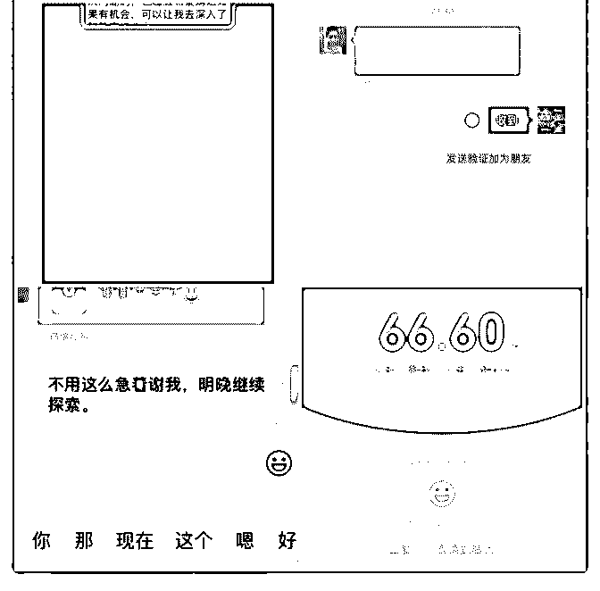
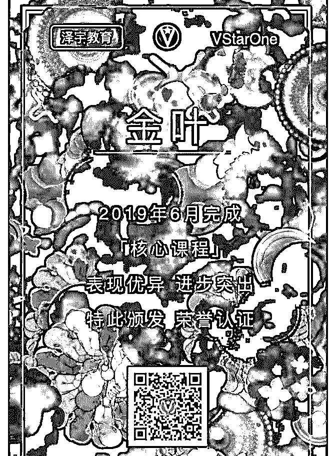
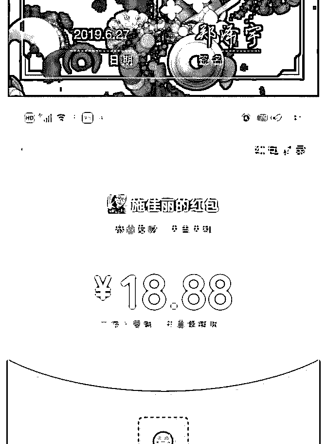
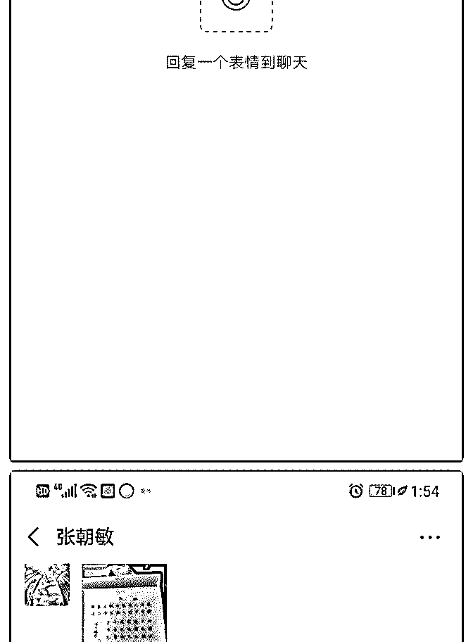
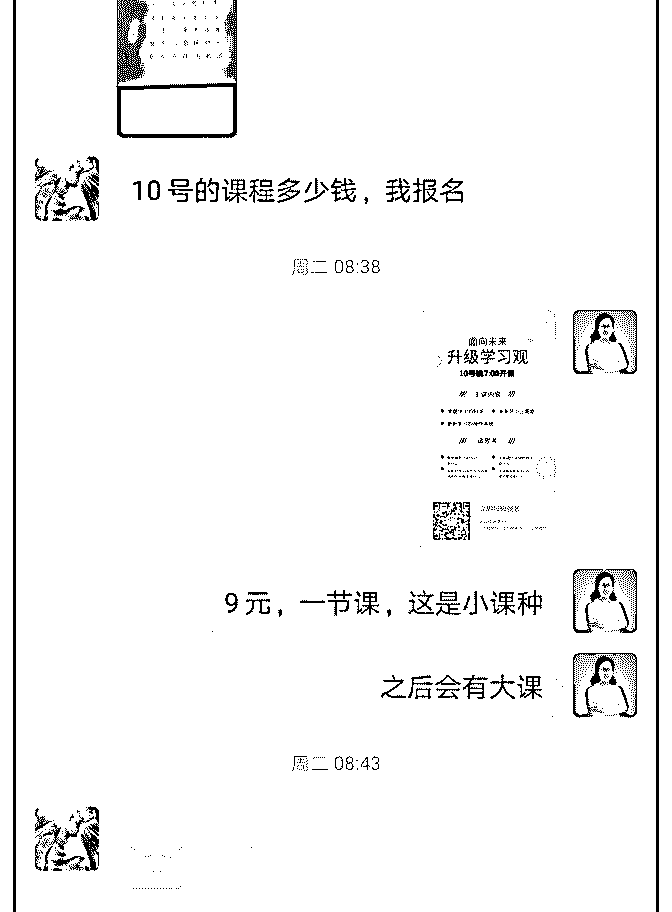
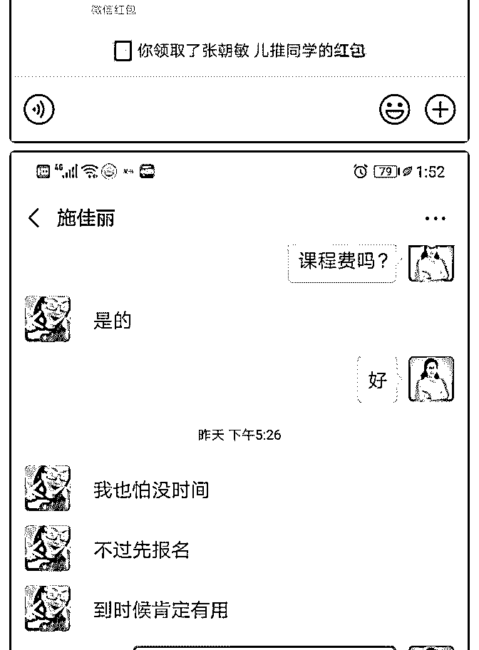
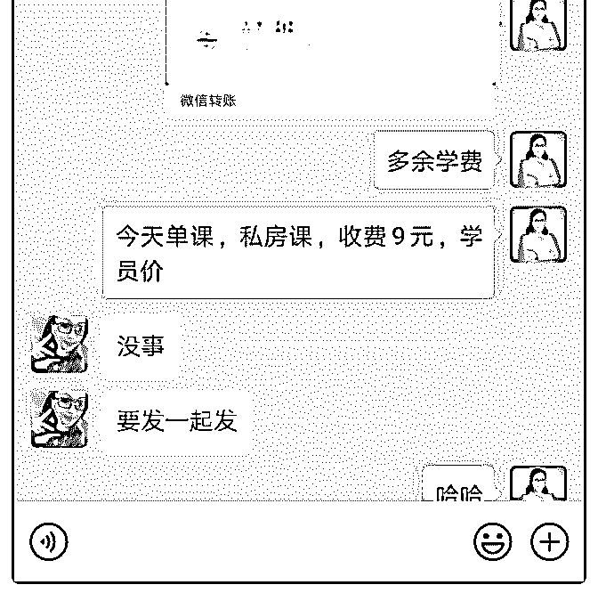

# #庆祝成果 核

#庆祝成果 核心课让我复机，十几倍赚回学费。

我想说核心课让我重新启动身体能量，让我复机了。

为什么这么说？因为家里最近有些问题琐事，加上手诊课程

已经开设了一段时间，后续也没有再去裂变招募新学员，自

己也一直都处于低迷状态，感觉内心焦虑，基本处于停机状

态。

突然有一天看到群里小伙伴都在推荐泽宇的课程，也就跟着 买了，但是没想到，第一节课和第二节课听了两遍后完全打 开了我的任督六脉，发现自己之前不但自我设想，每天焦虑 的状态只会是恶性循环，课程里那些话一直暗暗涌现，即便 我们现在遇到阻力和挫折也是好事，说明走的是上坡路，失 败也不可怕，不为失败找理由，任何的问题都是自己造成 的。而课程中也一直强调要行动，行动，行动。

我开始行动，打磨舌诊课程，在群里做分享，建了几个快散 群，群里分享为什么要学习舌诊和学习舌诊的好处，另外采 取接龙报名的方式，每个群只设定了一定名额的优惠，很快 报名人数就增加到了几十人，而且还很意外的成交了一个高 级手诊 498 的课程。

但是我知道这远远不够，我的思维还需要继续提升，才可以 突破目前的状态，但是核心课确实给了我一个愿意立马行动 的理由，接下来继续学习复盘行动，大家一起加油！

2019-05-11(22 赞)

评论区：

秦 : 涨知识了，还有舌诊，还能线上做，厉害 丽君 : 你好棒！[强]一起加油！

荻野 : 你好，可以联系主编荻野在简书投稿推广并且领取 18.88 红包，如没微信，可添加 wx：VStarOne521

关注公众号"懒人找资源"，星球资源一站式服务