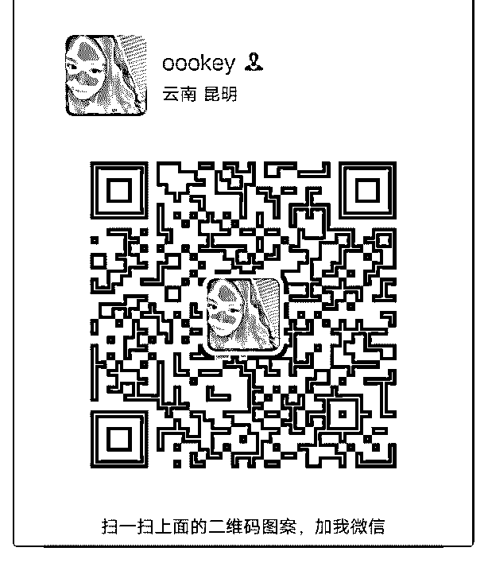
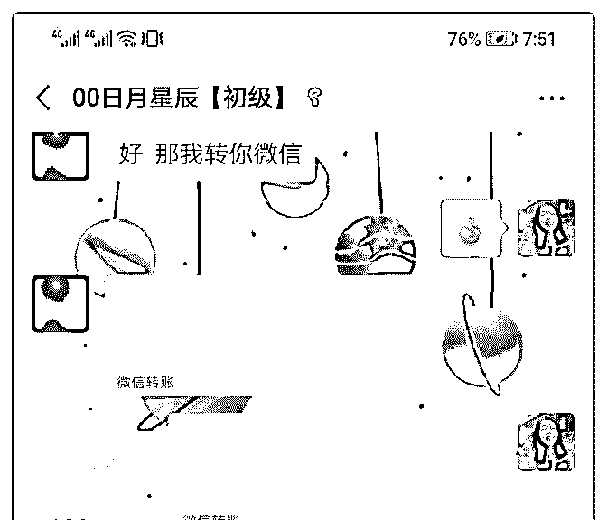
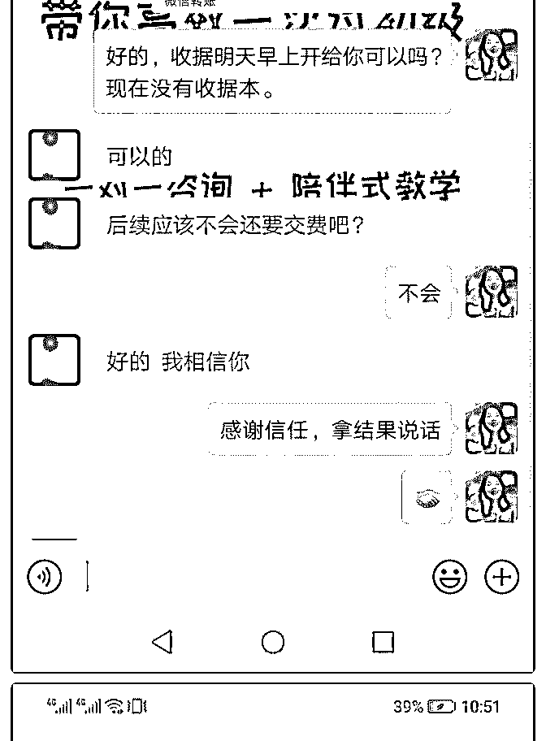

# 0 基础 0 人脉，加入

Bling : 0 基础 0 人脉，加入泽宇教育，48 小时内成功赚回核心 课学费

我叫 Bling，一个目标规划师。我想讲一下我这几天的故事。0 基础 0 人脉，但是在加入泽宇教育后，每天靠着下班后的 3 个 小时进行学习和实践，共计 48 小时内，赚回了核心课学费， 让自己实现了第一个阶段的目标。

先说一下加入泽宇课程之前的自己的状况吧，那时候自己刚 刚脱离长达两年的抑郁症，从黑暗的小屋走入了社会。

微信好友 100 刚出头，大部分都是亲朋好友和同学，平时很少 和人说话，连朋友圈点赞的交情都没有。

后来在手机上想到了两年前加到的泽宇，就去找了他，二话 没说就转账报名了。

于是就认识到了 Lorna 导师，导师发了自我介绍的模板过来， 但自己对于“提前准备”那一部分不知道该怎么写，就打算先 学习课程。

因为工作很忙，就在午休的时候听课，下班后听课，边吃饭 边听，在第 1 天就听完了核心课所有内容。

当天晚上就根据自我介绍的模板，对需要“提前准备”的三 点，边想边写，写了快两千字的分析。

写完已经凌晨一点半了，立马把精简版的发给了导师，导师 居然还没有休息，得知学完核心课之后可以和 Lorna 导师约电

话，超级兴奋，但我没敢说我已经学完了，就说明天我就能 学完。

加入的第 2 天，我听完了核心课全部内容的第 2 遍，刚好看到 群内导师要组织定位的解答，就按着要写的内容进行分析， 又写出了一千多字。

第 3 天和导师语音通话，虽然时间不久，却立马让我知道了朋 友圈打造的注意事项，从头像，到标签，到每日分享。通话 结束后，5 分钟内把能改的都改了，立马就换了一种感觉。

当天晚上导师就让我管理一个群，我吓了一跳，我根本没有 经验，但导师丝毫没有对我有质疑，拉我进群还给大家介绍 我，说我在哪一方面很有能力，我第一次感受到这种信任， 开心兴奋了一晚上。

第 4 天，已经看完一遍导师计划 2.0 的课程，对群内导师的答疑 也旁听了，知道了其他学员会犯的错误，立马明白自己该重 点关注哪些课程。

于是第 5 天开始了核心课和导师计划的第二刷，重点进攻定 位。帮一个小伙伴解答了一下制定计划方面注意的事项，她 给我打了 10 分满分，出乎我的意料。

接下来的几天，在群内旁听过 2~3 次左右的答疑，根本不敢主 动提问，还是 Lorna 导师发现了角落的我，主动问我有没有什 么问题，我才不好意思的说出自己的困惑。

我说自己没什么知识，也没什么技巧，更没有咨询经验，不 敢去指导别人，我很迷茫不知道该怎么办。

导师说你可以给别人定计划定目标，帮助他们考研成功，在

我看来就已经是很厉害的事情了，比很多老师都厉害。我听 得羞愧不已，因为我觉得这种事情和我的关系不大，都是别 人的努力。

导师立马问我，考研成功的人有没有感谢我，我说有的，导 师语气立马变了，那就对啊，你要接受别人对你的感谢，这 种感谢是非常珍贵的礼物，是需要去记在心里的，这种感谢 的情感是不会作假的。

我立马明白自己忽略了什么宝贵的东西。 那天答疑是 5.1，我记得很清楚。

答疑结束我立马写了复盘到星球然后转到了群里，没想到没 一会就有人给我点赞还有人加了我好友。群里也收获到了伙 伴的肯定和鼓励，让我感觉打开了新世界的大门。突然明 白“发声”和“不发声”的区别。

第 9 天，开始主动加以前群里的人（非泽宇群），每天添加 20 左右的人。

第 10 天，有伙伴想我咨询目标选择方面的问题，我只想着尽 我所能的去帮她，在她向我问问题的时候，我写了一大白板 的解决方案，那个白板 2 米长，被我画满了。

解答完，肯定和惊喜在伙伴的语气里格外的多，从屏幕都能 感受到那种开心，我没有想着收费，却收到了第一个感谢红 包。那天，这个伙伴让我发现原来我在目标梳理和分析问题 方面，的确有着很强的能力。

第 11 天，鼓起勇气，给群里的伙伴做了语音答疑，帮助他们 解决目标规划方面的问题，让自己明白，的确很多人有着困 扰着自己的问题，而我能提供力所能及的帮助。

第 13 天，受到一位伙伴的邀请一起练百万营销的话术，在她 的反馈下，让我明白了自己定位的模糊，我立马去思考了定 位如何更加精准和让人易于理解，修改了自己的标签。谢谢 你。

第 15 天，我尝试对以前不认识的人进行自我介绍，没想到有 人说，太好了太好了我最近刚好有目标管理方面的困惑需要 解答。我惊讶缘分是如此的奇妙。就是我来了，而你也刚好 在的感觉。如果我不来，或许我们不会相遇。

和这个潜在顾客约了晚上做咨询，从 10 点一直帮她分析到凌 晨 1 点，期间没有想去找她收费，只是担心自己没有办法帮她 解决问题。我一直认为，收费不是目的，而在于自己是否能 提供相对于的价值和帮助。

最后她说有报名课程的想法，但自己要沉淀一晚上明天再给 我答复。我一听心里有点沉重，是不是我提供的帮助还不够 多，是不是自己还无法提供让她心动的价值。

长达 3 个小时的咨询结束后，立马写了自己在这次咨询中不足 的地方，晚上睡觉一直在想，或许自己要更加努力深耕了， 我要变得能帮助更多人，知道更多的知识和技巧。

第 16 天，她来找我说要给我昨晚咨询费用，别的什么都没 提。我心想，为什么本来给她免费的咨询名额却想给我付 费，看来她是不打算报名课程。

我陷入了两难，一方面不想失去她，一方面又不甘心这么结 束。跑到了群里寻求帮助，没想到三位伙伴非常温暖的安慰 了我，让我心情好转，淡定的接受了这种状况，不再追求顾 客是否报名。

刚好到了中午，我就去午休了，没想到一觉起来，顾客说要 报名，问我学费是否能优惠。我突然感觉柳暗花明又一村。

只是对于是否优惠我把握不好，立马找了言老师询问，言老 师非常及时的回复了我，教给了我方法，我按着言老师教的 去转述了一遍，立刻顾客转账了学费，变成了学员。 感谢言老师的指导！

今天完成了复盘，记录了自己在加入课程后每天的行动。准 确的说，是每天下班后的 3 个小时的行动。

学习、交流、实践，16 天不间断，共 48 小时。 短短 2 周，且怂且勇敢，害怕忧虑担心时不时伴随着我，但我

也会鼓起勇气去做该做的事情、正确的事情。

如果问我为什么改变这么大，那其中的原因有导师教会我的 两句话：

——你要知道你很棒。

——不发声等于不发生。

多谢 Lorna 导师几次给予我前进的信心，还有言老师在关键时 刻对我及时的指导，给我鼓励的每一个泽宇伙伴，感谢之前 遇到的每一个人，你们成就了今天的我，也期待未来会遇到 的每一个人。

我是 Bling，一个目标规划师，一个打扮像男孩子的女生，一 个现代版的“花木兰”，愿意和更多的人交朋友，帮助更多的 人解决目标规划的问题，下面有我的微信，期待我们的相 遇。

2019-05-10(33 赞)

评论区：

千叶 : 这行动力 太赞啦

Bling : 谢谢夸奖，很开心

瓷希儿 : 得到伙伴，泽宇战友！

Bling : 真的，太巧了

丽霞 : Bling 的行动力和目标感都特别强，向你学习

Bling : 谢谢，共同学习

秦 : 厉害，这学习节奏好快，我还在按照一个星期一节课的进度，我看我可以快一点了

丽君 : 你好棒，加油！

关注公众号"懒人找资源"，星球资源一站式服务