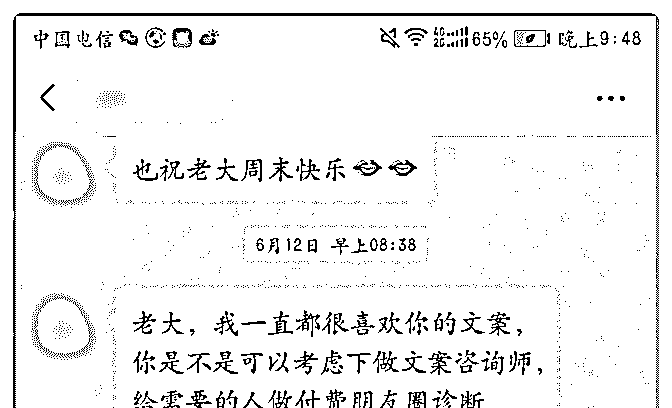
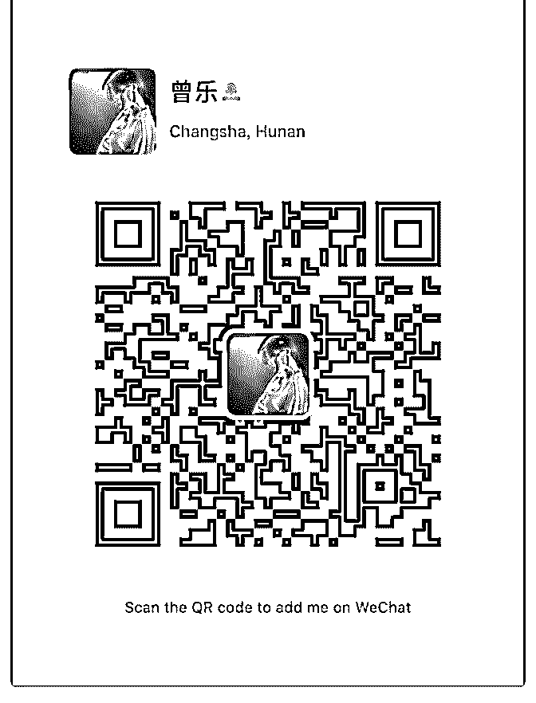
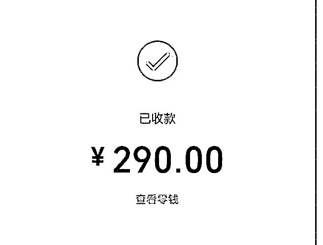
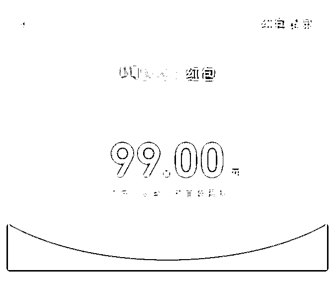
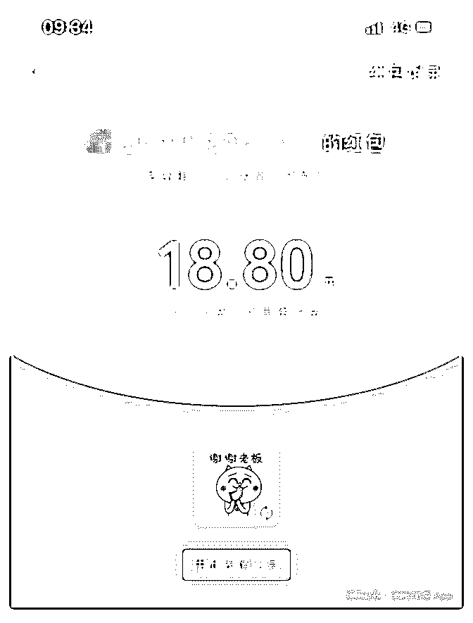
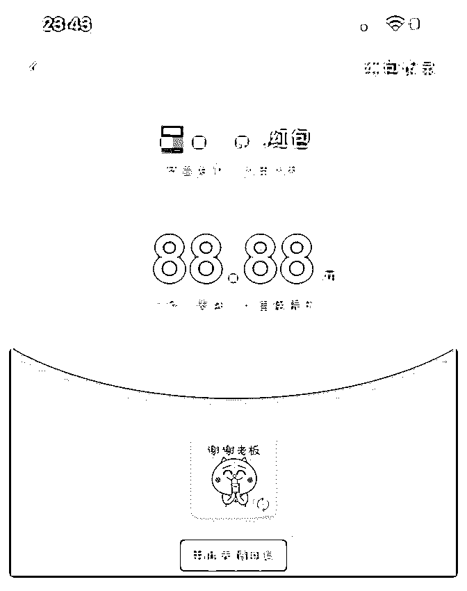
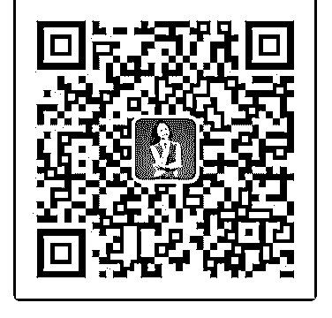
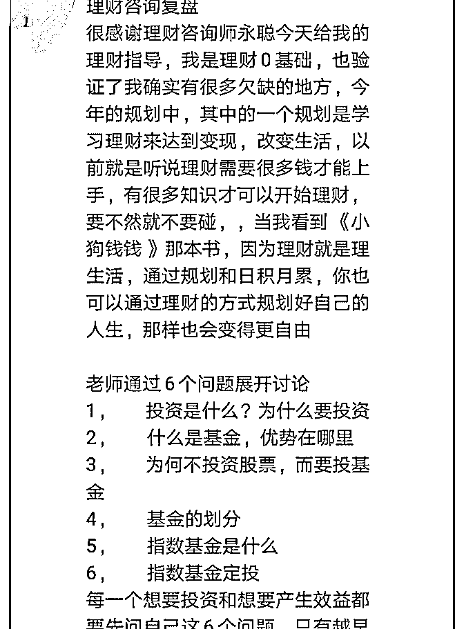

# 庆祝成果：半

莲丨 Cindy : 庆祝成果：半天收了 15187，谁知道我经历 了什么？

4 月 5 号加入聚星会，正好我也在另外一个社群学习，两个社 群都有变现的游戏，于是我也积极的卖自己。 4 月 6 号我发起了一场《买房那些事儿》快闪群，文案如下： 熟悉我的人知道我在深圳买了一些房，也陪伴指导身边好友 买房。我是谁不重要，我能带给你什么结果很重要。

《买房那些事儿》快闪群 时间：4 月 6 日晚 8 点 费用：39.9/人，两人同行 59.9 地点：CINDY 的线上微信群 时长：约 1 小时 福利：发红包抽取 1 对 1 买房指导名额~

一小时快闪分享收费 1878 元，并送出 1 对 1 约聊名额，结果被 一位深圳的小伙伴抢到了， 4 月 9 号兑现承诺，在香蜜湖 1979 见面聊天。

4 月 10 日，社群的一个朋友，有卡点没想通，半夜找我聊了一 两个小时，我没想到她会付费给我，结果第二天一大早收到 5 个 200 的大红包，财富和爱都是流动的，我也回给她 2 个 188， 看到她的卡点解除，社群做得有声有色，真心为她开心呢！

4 月 13 号，老公的一个朋友找到我咨询在异地买房的事儿，她 不仅付费咨询，还帮我转发朋友圈，这样的客户简直太可爱 了

前 2 天，一位同学找我聊换房的事情，语音指导了一个小时，

收费 599。她也清晰了自己要的方向。

昨天参加完郑立峰老师（目前国际性的华人家庭系统排列 师）的系统排列，感到好像有卡点被解除了，需要专心做点 事才行。最让我感到吃惊的是今天，我都不知道发生了什 么！

早上我发了一条朋友圈，如下： 成年人的世界就是一个不断成长自我销售价值交换的过程。 酒香也怕巷子深，在这里介绍一下我自己：15 年家庭投资理 财经验，投资涉及房产写字楼超市餐厅⋯指导身边人投资理财 资产配置买房换房，最高收益数百万，最高打赏 20000 元；接 受《深圳卫视》《悦己 SELF》等采访；中国平安深圳公司特 邀财富分享嘉宾。向有结果的人学习，至少让你少走 2 年弯 路。在社群参加黄金 1 小时游戏：出售我的 1 小时时间，平时 我的价格是 1000 元每小时，同学或朋友友情价 599，游戏期间

（5 月 6 号到 5 月 9 号）特价 399，每天限 3 个名额，并送你 3 个方

法赚回咨询费。咨询范围包括且不限于家庭投资理财⋯⋯

名额稀缺先到先得，别怪我没告诉你哟

后面发生的事情大家也猜到了，我的手机不停地响，也炸出 了许多平时都不和我聊天的人。一言不发就直接转钱给我， 我都不知道发生了什么事。 今日收款 15187，从上个月 5 号到现在，我好像也没花多少时 间，这么神奇的事就发生了。 接下来要好好听课，好好复盘，争取来一波大突破。

经验分享：

1、相信才可能发生。

2、想没有结果，做才有答案。我也就是发了一条朋友圈，在

发之前我还在想：会不会有人给我付款呢？结果却超乎我的

想象。

3、真实、利他。讲我所做的，做我所讲的。前期的积累很重 要。不要只想着赚别人的钱，如何让别人能拿到成果最重 要。

我是 CINDY， 15 年家庭投资理财经验，投资涉及房产写字楼超市餐厅⋯指导 身边人投资理财资产配置买房换房，最高收益数百万，最高 打赏 20000 元；接受《深圳卫视》《悦己 SELF》等采访；中 国平安深圳公司特邀财富分享嘉宾。 欢迎你关注我，一起做四有新人：有钱有闲有颜有趣！

投资理财资产配置买房换房，可以找我。 我的微信号：cindy2019920

2019-05-07(22 赞)

评论区：

龙小糯 : 是您爆发的是代理的[强]

Timmy～坚 : 在深圳买了一些房，这句话很有吸引力啊[强]

丽霞 : Cindy 女神太优秀啦，爆发是必然的

丽君 : 你太棒了，加油！

荻野 : 你好，可以联系泽宇教育主编荻野在简书投稿推广并且领取 18.88 红包，如没微信，可添加 wx：VStarOne521

Sofia :

关注公众号"懒人找资源"，星球资源一站式服务

加入泽宇教育第七天

加入泽宇教育第七天赚回核心课学费

4 月 25 日报名聚星会，从核心课开始学习。刚开始以听课为 主，5 月 1 号开通新的微信号（0 好友，没有导入原有微信的好 友），5 月 3 日新号成交第一位付费客户，成功赚回核心课的 学费。

对于这几年新兴起来的知识付费，我早已不陌生。我付费购 买的第一个知识产品，就是得到 APP 的两个课程，一个是李 笑来的通往财富自由之路，另一个是武志红的心理学课。课 程不贵，周期很长，一年的课程学完，我也觉得收货不少， 得到了很多启发，但课程结束之后，生活好像回到了原点， 没有发生实质性的变化。财富没有真正自由，武老师的心理 学课，倒是给自己解决了不少的内心困惑，让我学会了释 怀，却没有学会变得更加有力。

后来，我加入了 007 的写作社群，怀着饱满的热情开始写作。 每 7 天写一篇，一起写 7 年。我开始努力观察生活，尽量多的 输入使得自己有可以输出的东西。群内的互评机制和每周评 选机制，我还多次获得班内优秀作品，小小的红包，大大的 鼓励。我觉得加入 007，是我做的最正确的投资。

然而渐渐的，写作没有了动力，输入没有了持续性，跟我一 样的，还有其他的小伙伴。但是说好的承诺，就要兑现，于 是我开始为了完成作业而去写，有好几篇甚至是没有实质内 容的标题党，俗话说，先完成再完美嘛。但是一周一周过去 之后，我决定打破这种自我欺骗的谎言，我不要再写这种空 洞的东西了！于是我停更了。

在坚持写作的这 1 年中，我还加入了一个写作社群，但是由于 社群管理的松懈，没有吸取到足够的营养，很快便草草了 之。

在消费了这三个知识付费的产品之后，我开始审视自己的四 周，知识付费琳琅满目，品质良莠不齐。有一些产品，虽然 我没有购买，但是持续关注，取得了很大的成功。有一些产 品，从无到有，也有的，从有到无。那时候心里便开始种 草，我也有价值可以输出，我也想做自己的个人品牌。

这个想法在自己的脑中久久盘旋，我做过内容的设计，我也 做过小规模的市场调研，甚至找过志同道合的朋友一起开设 了公众号，最终却无法成功的迈出第一步。 我输出的价值，是不是受众太小了，可能真的没多少人感 兴…… 花了许多心思写的推文，点赞的人寥寥无几，我无法够到那 些对我的主题感兴趣的人…… 我想在千聊上面开课，可是怎样才能找到我的付费客户，如 何定价…… 我甚至想做 1 元钱的免费课程，但是这真的是引流的最佳路径 吗……

太多太多的问题，我找不到答案，我无法开始。 直到遇到泽宇教育，才颠覆了我的思维，核心课程的学习，

解除了我所以的自我设限，并且给了一套具体可行的方法。

我没有花全部的时间和精力在学习课程并且践行内容，却在

一周之后就拥有了自己的第一个收费学员。好多内容都没有

完全行动，就有学员选择了完全信任我。这让我深信，我有

价值可以输出，而且是他人需要的价值。

核心课，到底给了我什么？ 它带着我跨出了第一步，它让盘旋在我脑海中快 2 年的想法， 找到了落地的方法。感谢领我入门的 Lorna 导师，感谢核心课 的言助教。告别核心课，我将马不停蹄的开始导师计划，冲 击我的下一个目标。

2019-05-07(20 赞)

评论区：

Timmy～坚 : 我第一个买的也是财富自由之路，武志师的也买了，两课都不错。这复盘没看到你的定位是做什么呢

丽霞 : 感觉还没有写完具体怎样变现的，哈哈，不过前面的故事跟我的经历很相似呀。新号通过什么方式加人的呢，我想

听听[呲牙]

荻野 : 你好，可以联系泽宇教育主编荻野在简书投稿推广并且领取 18.88 红包，如没微信，可添加 wx：VStarOne521

关注公众号"懒人找资源"，星球资源一站式服务

【0 资源 0 人脉 0 基

言 : 【0 资源 0 人脉 0 基础的高龄孕妇，月入 35000+】

大家好，我是泽宇教育金牌助教言，我是一个生活在 5 线小城 镇，身体状态欠佳、怀二胎 4 个半月的高龄孕妇。我本以为怀 胎十月只能窝在家里保胎度过，但没想到在我的导师 lorna 手 把手带领下，我活出了一个孕妇最精彩的孕期，并做到副业 收入从 0 到 35000+，实现了自我价值、体验了最高端胎教，还 过上了办公、育儿、养胎、旅行随心所欲的生活。

过去我一直很努力，但始终迷茫： 上过班，一个人做 3 个人的工作领 2 个人的工资，还兼职 1 份工

作。没日没夜没周末、加班加点，最终累坏身体，工资没超

过两万。

创过业，因为创业资金投入大、风险大，投资回报时间长， 为了所谓的事业背负着各种压力、疏远家人，甚至背叛梦 想。

做过全职宝妈，整天忙着家庭琐事，围着老公孩子转，失去 了自我和价值感，曾因此一度忧郁。

我想我的人生不该就这样，一直期待有份自由职业，既能兼 顾家庭事业，也能轻松自由赚钱，还能活出最本真潇洒的自 己。但一直没有找到突破口，因此过去 3 年参加各种社群，做 各种知识付费，希望有提升、有突破，然而更焦虑迷茫，还 怀疑自己可能一辈子就只能平庸了。

直到加入泽宇教育：

1 月 1 日成为泽宇学员；

1 月 15 日聚星会线下现场变现第 3 名，并通过考核成为实习助

教；

2 月初通过严格的笔试和答辩成为正式助教；

3 月不断提升自己、指导近 400 人的核心群，成为泽宇金牌助

教，实现月入 2w+；

4 月提升教学能力，辅导学员出结果，实现月入 3.5w+。

这 4 个月来，我持续不断的突破自我设限，学习个人品牌打 造，输出价值帮助学员变现。人生密度远远超过了我之前所 有人生的总和，也正是在这个优秀的群体里，前 30 年形成的 简陋的世界观，人生观和价值观，都受到了极大的震撼和颠 覆，我的人生也因此进入到了之前从来都不曾想象过的新天 地。

很感恩泽宇、C 宾的大爱！感谢我的大恩人 lorna 导师手把手无 私的教导！谢谢当初带我进入泽宇教育的贵人妮妮姐！谢谢 团队里的每一个小伙伴以及在座信任我的每一个学员！感谢 你们！没有你们没有我的现在！

下面分享几点我这 4 个月来的经历和感悟： 一、方向对了就别怕路难、路远，所要做的只有两个字“坚

持”。

昆明线下成为实习助教回来后，一切并没有想象中那么顺 利。意外发现怀了二胎，检查出孕囊积液需住院保胎，于是 开始长达一个半月吃药打针、卧床保胎、加上孕吐反应不分 白天黑夜越来越厉害，精力不济、工作没有头绪不知从何开 始，开始焦虑和迷茫。

但我心里深知：机会只有一次，没法等，要么放弃，要么坚 持。我选择了坚持，于是每天卧床抱着小垃圾桶边吐边听课 程，边去实践落实，不明白的找 C 宾老师和 lorna 老师问。坚持 了半个月后，我接到了 C 宾老师的助教考核答辩电话，并顺利 通过考核，挂完电话我哭了，我是开心的，方向对了结果也 就对了。

3 月终于熬过孕吐期，孕囊积液也吸收了，3 岁的女儿开始感 冒咳嗽，照顾她的过程中自己中招，整夜咳的无法入睡。因 孕妇大部分药不能用，能用的药和点滴都没起作用，换了 3 家 医院，熬了近一个月才好。期间家人的不理解和反对越来越 强烈，另外没法正常给学员做语音指导了，只能换成了文 字。

相比身体状态给我带来的影响，家人朋友对我的不理解不支 持让我更难过。很多人说我在做传销，屏蔽我，打电话训我 一下午，甚至还有人鄙视我。我知道这些都是关心我打心底 里为我好的人，但前期还是莫名的挫败和难受。

这里想和大家讲的是：万事开头难，有焦虑和困难是必然 的，而且你的不安、迟疑、恐惧随时有可能把你带偏，你所 要做的是认准方向，保持初心，别去追求常识的认可，坚定 坚持，让时间见证一切！

二、怀疑比相信的成本更高！ 核心课是贵人 007 战友妮妮姐引荐的，她没说是什么课程什么

内容，就说了 365，我立马转了，我相信她；看完导师计划课

程大纲，第一次和 C 宾老师接触付聚星会款的时候，微信一直

在提醒谨防诈骗，我选择相信；C 宾老师在朋友圈说，我 2019

年的成就感他们来承包，我笃信；学完泽宇教育课程体系

后，我相信只要认真执行，我也一定能出结果，我做到了。

此刻我感谢所相信的一切，也庆幸自己对凡事都信任大于怀 疑。

被骗的成本并不高，怀疑的成本更高。就算被骗，被骗一次 也成长一次，加速成长。但很多人对认知之外的东西都怀 疑：认为骗人，不去认真了解，直接下定论，一锤子砸死， 丧失机会。迟疑，误了最佳改变时机。

三、选择比努力更重要。 很多人纳闷和不理解，为什么我作为一个二胎高危孕妇这么

拼的争取进泽宇团队。如果从经济角度来说我确实没必要这

么拼，和泽宇接触后我笃信他就是我要追求随的人。

首先是他的价值观和服务理念打动我，“别老想着自己成功， 先帮别人成功，顺便自己成功”“我们要做的服务是，给客户 提供超值服务，为他们打造一生的价值”……见过太多老板一 心只为了钱，没想到这个小青年有如此大的格局。

其次是团队的氛围：在这个团队里工作很自在、很有激情、 很有成就感。泽宇和 C 宾，包括所有导师们从来不会显示自己 有多能干，而是善于调动每个人的积极性，无私帮带、鼓励 尝试、包容失败，激发每个人的潜能，给予无私的爱。

无论你是能人，还是平凡的人，只要你把自己放对了地方， 你就会有正念正见正行正果。因为，人是环境的产物，不要 瞎忙，选对平台、混对圈层、跟对贵人，成功必然。因为平 台不一样，圈层不一样，结果就不一样，所以选择比努力更 重要。

四、任何时候站高一线、看远一点很重要。

我迷茫、心情不好的时候喜欢去爬山。每当站在山脚下时， 我看到的是匆匆忙忙的行人和疾驰而过的车辆，这时我体验 到一成不变压抑的生活场面。当站在半山腰时，我看到的是 各种风格的建筑，站的高些看得远点了，不再觉得被生活琐 碎压的闯不过起来了。当爬到山顶时，我看到了所有的建 筑，农田，产业区，纵横的交通枢纽、河流，大海，还有远 方的高山白云。那一刻我不再觉得自己只是个苟且在生活中 的蝼蚁，更像个翱翔在天空中俯视大地的雄鹰，畅快、自 由、飞的高、看得远。

当初报泽宇课程也是这种心态，1 月 1 号报的导师计划，1 月 2 号报的聚星会，为什么核心课导师计划没学完就报聚星会， 我相信更贵的课程肯定有更贵的理由和价值，也肯定能链接 到更高端的人群。事实证明，这就和爬山一样，你只有站的 更高、看的更全、获取的资源最丰富，走的更快更远。我想 如果当初我没做这个决定，我肯定做不到两个半月成为金牌 助教、4 个月实现副业收入过 3.5W+。所以：任何时候站高一 线、看远一点很重要。

五、跟对人，就是逆袭的捷径。 非常感谢 Lorna，她是我这辈子遇到的最大的贵人，她不仅仅

是我理想生活的对标人物，不仅毫无保留的教我技能上的东

西，她还提升了我的思维和格局。成为实习助教后，我不知

道我该做什么，我能做什么,Lorna 每天无私的不厌其烦的教我 怎么学习、引流、做展示面，百万营销；在我身体状态不

佳，不被家人亲戚朋友理解的时候，开导我鼓励我，在我每 个想懈怠的时候给我激励。

没有她就没有我这 4 个月的逆袭，很庆幸遇到她，万分感恩!对

她无以回报，接下来我会更加努力突破自己像她一样，帮助 大家突破自我，带大家副业变现，打造个人品牌，实现财务 自由，环球旅游办公。

2019-05-05(49 赞)

评论区：

Timmy～坚 : 太让人佩服了。

杨帆-Ada : 宝妈的榜样，像你学习

丽霞 : 一直看，一直流泪。

Seasoul 海蒂 * : 看到宝妈成功就特别激动，因为我们好多宝妈怀孕生孩子没收入都是普遍现象。向你学习，我也要努力

坚持，实现目标。

丽君 : 你太棒了，值得我去学习！你会越来越棒的！加油！

荻野 : 你好，可以联系泽宇教育主编荻野在简书投稿推广并且领取 18.88 红包，如没微信，可添加 wx：VStarOne521

关注公众号"懒人找资源"，星球资源一站式服务

沉淀了一小段时间，

奔跑的蜗牛 婚恋情感* :

沉淀了一小段时间，今天来庆祝下成果。最近有三个收获：

一、刚刚完成一个老朋友的个案情感咨询单。 她，是我们泽宇的学员，很亲切，漂亮，很上进，很善

良……第一次见面，就特别喜欢她，真的，觉得所有美好的 词语来形容她都不为过。

然而，她说她分手了，他是自己的初恋，很伤心。而且分手 了都不批评和指责对方，而是说，自己做错了，因为男方失 信，她一急就提了分手，再主动道歉认错，而男方已不同意 再复合。 而且她说男方有过几段恋情，跟她交往时，与前女友还没分 手。 还有，男子收入低，且不思进取，这傻姑娘辛苦赚的钱每月 都贴补男友。

心疼得我……如果我是未婚男子，我定娶了这姑娘，上前废 了那男子！

等等，深呼吸……再呼吸…… 我是一位心理咨询师，此刻，我知道她很难受，很委屈，很 伤心，很绝望……

那么，我应该要好好陪伴她。

陪着陪着，越聊越深，然后，她说，的聊天特别有用，可以 影响到她下半辈子的生活了，而且坚持从一个 88 元的小红包 再到主动附 300 元的咨询费（后面附图）。

亲爱的，如果你能够看到这篇文章，我想对你说： 谢谢你，让我更真实地看到了曾经的自己，我终于可以对那 段那刻骨铭心的初恋理智地说再见了。 也谢谢你，让我知道，在情感咨询这条路上，我是多么具有 天赋。只要用心就可以做得很好。

情感，婚姻，让我受伤，却也成就了我。 另外两个收获，

一是知乎从 35 个粉丝，到 671，增长了 20 倍。 二是第一期的婚恋情商训练营圆满结束，有学员评价特别

高。不过精力有限，准备训练营暂时不做了，先把一对一的 个案咨询做好，知乎答疑坚持下去，有空了，写写复盘，写 写情感文章。

加油吧，泽宇的小伙伴们！相信坚持和积累的力量！ 我是一位专注于婚恋情感的心理咨询师，关于感情中相处的

矛盾，关于要不要分手，关于如何经营好一段幸福的感情，

可以一起探讨~（微信：sunyanhui1108）

2019-05-04(16 赞)

评论区：

荻野 : 你好，可以联系泽宇教育主编荻野在简书投稿推广并且领取 18.88 红包，如没微信，可添加 wx：VStarOne521

关注公众号"懒人找资源"，星球资源一站式服务

两个礼拜赚回核心课

曦萍 : 两个礼拜赚回核心课学费

2019-05-04(11 赞)

评论区：

荻野 : 你好，可以联系泽宇教育主编荻野在简书投稿推广并且领取 18.88 红包，如没微信，可添加 wx：VStarOne521

关注公众号"懒人找资源"，星球资源一站式服务

复盘，加入两个多月

艺诺 : 复盘，加入两个多月，不知不觉中赚回核心课学费 收获：

1，学了泽宇的核心课，我最大的收获是：从不自信变得自信 了，从几乎不爱发声不展示自己，到现在逐渐喜欢上自我展 示。

2，核心课大大提高了我的思维认知，就像 Mona 说的一天顶 三年，我认识到自己的自我设限，也学会了怎么去打破这个 限制，自我升级，现在内心充满力量。

3，不知不觉中影响了三位小伙伴来学习核心课，我没有主动 去介绍过泽宇教育，都是聊天中自然提到的，然后就引起了 小伙伴的兴趣，他们都是主动要来学习的，就这样我赚回了 核心课的学费。

4，遇到一群优秀的小伙伴，泽宇的社群里满满的正能量，这 里只有鼓励和无私的分享，非常感恩遇到非常优秀负责任的 Lorna 导师，言助教，和我的引路人佳颖老师。

需要改进的：

1，行动力还不够，虽然知道该做什么，但是经常完不成自己 定的计划。现在需要刻意练习提高自己的行动力，在泽宇社 群，提升最快的一定是行动力最强的。

2，定位还不明确，我是零基础零背景零人脉的小白，一开始 我选择的定位是亲子教育，慢慢发现自己对这个定位有了疑

虑，现在再重新寻找自己的定位中。

3，泽宇课程还需要反复学习，我在前期快速的学完核心课并 作了复盘，之后再很少去复习，所以理解的并不够深刻，导 师助教和一直强调课程的重要性，那我就需要不断的去听 课、复盘、行动。

立即行动的点：

1，每天至少花一小时用在学习加复盘上。

2，每天用心打造好朋友圈。

3，一周内明确定位。

2019-05-04(18 赞)

评论区：

只闻花香 : 亲，棒棒哒，向你学习！

荻野 : 你好，可以联系泽宇教育主编荻野在简书投稿推广并且领取 18.88 红包，如没微信，可添加 wx：VStarOne521

关注公众号"懒人找资源"，星球资源一站式服务

微信群成交，帮我招

读心大叔 : 微信群成交，帮我招募到 113 名学员，月收入突破 4 万+

以往我的朋友圈收入，也就是在 2 万+这个水平，在 4 月份，我 利用微信群成交，让收入有了一个突破性的增长，收入翻了 将近一倍，达到了 4 万，今天做一个复盘，分享给大家。

整个变现的逻辑就是：朋友圈打造人设，微信群增加利润。 我在前段时间有一篇文章是讲如何打造三个朋友圈的，在那

篇文章里详细拆解了我是如何通过朋友圈打造人设的，大家

可以翻一翻知识星球，也可以私信我，在这里不过多赘述。

人设打造的好，你在朋友圈做活动，大家才愿意参与。所以 朋友圈打造，一定要重视起来。

今天我给大家分享的微信群成交是分两个环节的。一个环节 是微信群发售，另外一个环节是学员群追销。

我先来分享微信群发售，在 4 月份我做了 3 场群分享。前面两 场是《流年运程》专题，第 3 场是《解读孩子生日，了解孩子 天赋》主题。

这两个主题都是数字读心术的课程，我单独拿出来，用来做 公开课的分享主题，通过三场活动，收获了 116 位学员。成交 了 9300 元

下面我按照微信群发售的流程，把各个环节的重点做一个梳 理。

1、启动人群——付费学员

这三场活动我都是以我的付费学员，作为启动人群的，因为 这个人群，对自己是有信任度的。如果您没有付费学员，就 需要在朋友圈发群二维码，这个时候，你的朋友圈打造就显 得尤为重要。活动启动“热度”取决于大家对你的认可度。

前面两场流年运程主题，我都是采用在群里发群二维码，前

100 名免费进，100 名后控制进群人数

学员进群后，在群里发活动海报加文案。 2、发圈分销的激励机制 发圈分销 100%让利，收 9.9 元拉进群

同时，跟老学员承诺，邀请进来的小伙伴，报名课程后，返 现 50%分成。

前面两场活动，都是 210 多人，也就是说将近 100 名新人 3、群氛围互动与分享形式 由于有 100+老学员，群氛围不用刻意互动就一直很好。分享

形式，我用的是图片+文字，文字分享有利于大家学习，触达

率会比较高，语音分享形式，如果分享时间过长，大家就没

有耐心了，进了群不听分享，后面转化就会打折扣，除非你

有比较强大的 IP 势能。

4、分享时间

三场活动的主题分享，我都安排了两个晚上的时间，这两个 晚上的内容是上下衔接的，单独听其中的一场是不完整的， 两个晚上的分享，有助于充分构建信任，第 2 个晚上分享完， 做转化成交。

5、成交价格选择和付费形式 由于自己个人势能不高，选择了 100 元以内的价格来成交。这

样不至于过多犹豫，因为大家进群是付费 9 块 9 的，课程专栏

价 99.9 元，所以只需付费 90 元（余款）就可进一步学习。

付费形式采用的是微信收款码形式。虽然课程在荔枝微课平 台，有海报也有链接，但都没有采用，因为以前用海报或者 链接的形式，效果不好，毕竟多了一个扫码海报或者点链接 的动作，链接后边会有其他信息量，会延长用户的犹豫时 间，不利于用户快速做决定。

90 元成交，价格低，同时有老学员对课程的高度评价，要求 所有的付款都截屏到群里，大家都有从众心理，三场下来共 收获了 113 名学员。

6、限时限量设定成交福利，同时塑造福利价值。 这次成交的福利，我用的还是是价值 99 元的为期 12 个月的流

月解读，并且分享了一些流月解读的反馈，让大家觉得光这

个流月解读福利很超值，并且设定了截止时间，制造紧迫

感。

7、关于第 3 场活动的改进。 在前面两场活动当中，有一部分免费扫码进群的学员，并没

有发圈，分销进群的新人并不多。

第 3 场活动，在启动方式上做了调整，就是先在学员群提供海 报加文案，大家先发圈分销，有成交记录的截屏私信我，统 一备注，免费进群。群人数满 300 人，封群，这样第 3 场活 动，新人达到了 160 人左右。这场活动，最后的转化学员为 52 人，当然这个儿童版专栏课价格也低，60 元。

8、低价门槛群作为流量池，可多次转化 三场活动的低价付费群，活动结束并没有解散，而是作为流

量池，后续会用其他的专题还可以继续转化。

流年主题分享完后的两个群，在做第 3 场活动时，就用新专题 又转化了一次，因为前面已经听过一次流年主题的分享，已 经建立了一定的信任度，更有利于转化。

最后我来分享一下学员群追销 新学员报名了专栏课后，进入了学员群，因为数字读心的内

容比较多，根据不同的内容，我做了 4 个专栏，在群里老学员 会围绕着课程内容讨论互动，大家经常聊得热火朝天，新学

员，也会慢慢对其他的进阶内容感兴趣，从而形成追销，实 现利润增长。

以上就是我上个月微信成交的实操复盘。在微信群成交的运 用方面，肯定还有很多不足，这个月报名了关老师的第 5 期训 练营，希望通过学习更加精进，收获更多。

2019-05-04(16 赞)

评论区：

读心大叔 : 我的微信号 1619697737，有对朋友圈打造和微信群成交感兴趣的小伙伴，欢迎链接 读心大叔 : 我的微信号 1619697737，有对朋友圈打造和微信群成交感兴趣的小伙伴，欢迎链接 waner : 没想到卢老师也是泽宇教育的优秀学员[强]

荻野 : 你好，可以联系泽宇教育主编荻野在简书投稿推广并且领取 18.88 红包，如没微信，可添加 wx：VStarOne521

关注公众号"懒人找资源"，星球资源一站式服务

两天变现 200+元

小暖爱美学 : 两天变现 200+元，慢慢来比较快

一个月的学习与积累在 5 月份得到小爆发，今天是 5 月 3 日，已 经收到两个美学课程学员。两个女孩子，我只是跟她们聊了 一会，就很爽快地跟我付费学习。

我并没有讲太多，为什么她们很乐意跟我学习呢？答案就在 我的朋友圈，我每天都在朋友圈更新文案和我做的图，无需 解释太多，需要的人自会来找我。

我的朋友圈有我的生活、成长、学习、蜕变轨迹，我的好友 慢慢翻看就能了解我，其实我也是一个很普通的女孩，一个 月之前的我从来不敢想象我竟然可以通过副业赚钱，我不是 很自信，我只会去学，却不会把自己学到的教给别人。

但通过这一个月的不断地练习，以及很多人给予我的帮助， 我慢慢去改变，开始收费把自己的会的教给别人，我发现我 非常享受这个过程，不仅自己能把知识巩固一遍，还能带别 人一起提升自己。

昨天收的一个学员宝宝，她不敢发朋友圈，一直在意别人的 眼光，我给她上完第一课之后，就一直鼓励她发朋友圈，把 自己做的美图发出去。在你能给别人提供价值的时候，一定 会有人默默关注你。

我想带给学员的不仅是单纯的学会技能，而是要带她们突破 自我设限，建立自己的自信，没加入泽宇之前我也是固定思 维总是给自己设限，总觉得这样不行那也不行，之后跟着同 学们以及 coco 老师学习之后，我开始转变思维，我太明白成

长的路上，如果有人点拨一下，会少走很多弯路。

今天收的学员宝宝，她跟我一样本职工作是会计，本人很优 秀，可是她说也想突破自己，去发展一门副业，给自己的人 生多增加一点可能，我真的爱极了自身很优秀然后又很努力 的女孩子。

跟她聊了一下午，她问我上到第几课了，我说现在只收了几 个学员，而且学习课程的进度不同，我都是一对一去教的。 她很惊讶，问我这样会不会太辛苦了。

其实我真的还好，我是很享受把自己所学的知识教给学员， 让她们都有所改变，真真正正的学到自己想要的东西。而且 我的学员宝宝有微商、也有只想学美学然后去变现的，我会 根据个人需求来调整课程。

我喜欢的女孩柚子妹说过：很对人会焦虑，因为总拿别人的 优点和自己的缺点比，最后就陷入了死胡同。以前的自己就 是这样，看到别人进步神速我就焦虑的不行，连学习的心思 都没有，就一直想着自己太没用。

实际上一定不能有这样的想法， 每个人都有自己的节奏，我 们可以学习他人的优点，进而提高自己的技能，我现在开始 接受每天都在进步的自己。

我是小暖，通过美学变现 800+，喜欢作图爱好文案，每天坚 持发 4 条朋友圈动态，欢迎你与我链接，有小惊喜喔。

2019-05-03(15 赞)

评论区：

荻野 : 你好，可以联系泽宇教育主编荻野在简书投稿推广并且领取 18.88 红包，如没微信，可添加 wx：VStarOne521

关注公众号"懒人找资源"，星球资源一站式服务

加入泽宇教育 1 个月

亚敏 : 加入泽宇教育 1 个月，一开始没好好听课，后来仔细听 课并认真梳理自己，找到三个定位，后来参加 c 宾老师答疑， 确定自己定位——学习力咨询。然后开始学习打造朋友圈， 首先第一步删掉负能量的有时效性的朋友圈，换一个真人的 职业头像，引来了很多人点赞，当晚就成交一单。第二天我 又发了我自己的成长经历，吸引了一些人来咨询，又成交了 两单，我还运用了泽宇教的涨价和名额有限等方法促进成 交。 感谢泽宇教育改变了我的思维认知，认识到普通人逆袭的最 短路径，教我从 0 到 1 开辟副业的科学方法，让我从一个只有 死工资的人变成了有副业月入四位数的人，接下来目标是月 入过万，未来可期。

下面附上我的个人介绍，欢迎小伙伴们链接：

【姓名】王亚敏

【坐标】河南

【标签】个人品牌咨询师，中科院女博士

【经历】

985 本科院校毕业，中科院工科博士学位，从农民家庭到参 加“吉林一号”卫星的研制，目前在大学担任教学与科研；

坚持健身 3 年，曾在 1 年之内将体重从 140 斤减到 98 斤，尝试 各种医美，成功提升颜值 1-2 分；

帮助 30+朋友找到个人定位，开启副业变现之路，4 月份变 现 2w+。

【提供的服务】

解决个人定位，精准引流，摆脱迷茫等问题

2019-05-02(16 赞)

评论区：

丽霞 : 我现在才知道，你是一个博士，太棒了~

荻野 : 你好，可以联系泽宇教育主编荻野在简书投稿推广并且领取 18.88 红包，如没微信，可添加 wx：VStarOne521

关注公众号"懒人找资源"，星球资源一站式服务

用【个人品牌故事】

故事女王 | 梓菲 : 用【个人品牌故事】21 天变现 6w+，6 倍挣回聚星会的学费， 我决定重返核心课学习！

我是王梓菲，一名体制内大学编剧讲师，这是我的 4 月总复 盘。

加入泽宇教育一个月，进到聚星会一个周，除去每月固定工 资，附收款截图及 10 天前在核心课+导师计划的部分复盘内 容。

本人深耕故事教育行业二十年，此前已有大学授课经历 10 多 年，线上线下约聊上百单，于是想当然出结果心切，快速听 了大部分课程后匆匆复盘了一次，定位在【迷你品牌故事】 这个稀有赛道开始做课程，开设“1 对 1”故事教练大本营，以

【教人如何从 0 到 1 讲好一个故事】作为输出。

平时只要方便，我都会开着千聊的课程浮窗，把泽宇课程作 为生活背景音，有时入睡前播放直到手机没电，尤其是导师 计划的两三节，泽宇教得如此细致，苦口婆心！

前两天突然意识到事态不妙，发现了自己相当严重的问题

——跳级。经过与助教明哲和导师的沟通、蓉蓉女神和朋友 的侧面敲打，及时勒马。尽管小有成绩，但所幸这个弯路的

过程只有 21 天！

现在真心懂得了【听话照做】的含义！ 以下是发自肺腑的心得体会：

1、如果出现问题，首先是课听得不够！课程是一切的基础， 先做好小学生；

2、别急！跳级返工会相当痛苦，很多学员都吃亏在这上面， 所以希望你接受我的经验教训，死磕概念验证；

3、一定一定多与导师、助教勤沟通、勤复盘，只听课是很难 发现问题的，哪怕偶尔挤进泽宇的语音答疑，偶尔刷群信息 一两分钟，瞥见的寥寥几句话都有可能使你顿悟。

所以我郑重决定—— 放平心态、再次归零，稳扎稳打，摒除傲慢。 重新回到核心课认真听起，一课一复盘，向执行力强的牛人

学习，以实际行动获得泽宇 1 对 1 的咨询，不做好这一步，坚

决不开始下一步！

好饭不怕晚，修心修专注，希望再次回到这里时，一切已然 不同。也欢迎伙伴们与我链接：故事女王，chuyistory。

感谢明哲助教一直以来的贴心鼓励、期待在华丹导师的指点 下奋起前行，感谢泽宇教育！

2019-05-02(21 赞)

评论区：

荻野 : 你好，可以联系泽宇教育主编荻野在简书投稿推广并且领取 18.88 红包，如没微信，可添加 wx：VStarOne521

忘忧草 :

关注公众号"懒人找资源"，星球资源一站式服务

加入泽宇 1 个多月，

加入泽宇 1 个多月，物质精神双层次的收获，不仅赚回学费，

还通过朋友圈美学找到了自我，开启了我自己的个人品牌这

个新世界的大门。

2019 年开始的时候我就想给自己一个突破，我是一名二胎宝 妈，曾经也有属于自己的事业～一间小花店，可随着二宝的 到来我只能忍痛割爱在家做起来全职妈妈，也曾尝试过微商 但结果囤货多出货慢，心理压力特别大，而且不是自己喜欢 的做起来很不舒服，所以即使在家带娃自己的心也没安分 过，总想做点什么却不知道脚下的路该往哪里走？

3 月初我在简书上看到了筱莜的文章链接到她，特别喜欢她的 朋友圈风格，刚开始我还有点犹豫，毕竟在微商那边吃过 亏，宝爸也不是特别支持，但那段时间正好是我心理最困难 的时候，咨询了老师后我害怕自己学不会，老师很耐心了给 我解答了疑惑并鼓励了我，我就想给自己一个机会在 3.16 日报 名了美学课程，同时加入了泽宇教育。

那几天正好赶上我家大宝做手术所以课程我基本上都没听也 没看，真正开始接触是 4 月初，那时候大宝手术成功出院了， 我就想是时候学习改变了，期间 Coco 老师也有说过有问题直 接找她，先好好学习核心课写复盘，我把前两节课来来来回 回听了 N 遍，我的认知和思维开始有了细微的改变，不再那么 自卑那么自我设限了，说实话刚开始我给老师问问题都小心 翼翼的，特别不自信。

后来跟着老师学，有时间就反复课程，用心作图，每天精力 充沛晚上可以作图到十一二点，渐渐的朋友圈形成了自己的

风格，有得到朋友的夸奖，后来有一位原来我的买花客户咨 询后想跟着我学，我怕自己做不好就去咨询老师，老师告诉 我八个字：用心服务，大胆去做。 正是这八个字鼓舞了我，4.10 号我做了第一期招募的海报开始 招收学员，那时候心理还是有点不自信，发了后又删除，怕 招不到丢面子，结果当天那位姐姐就付费了，第一期我定价 68 元，后来几天又发了三次海报，截止到 15 号我收了 7 名学 员，6 人付费，1 人因前期帮助过我我特意给她免费了。成功 变现 408，16 号我就开始了第一期的第一次课程。

那时候我才发现课程里的行动行动的含义，行动力+执行力是 最好答案的诠释。筱筱老师在我报名时曾给我说过，要我证 明给家人看，事实上我做到的，现在他们都很支持我。

特别感恩遇到筱筱老师，遇到泽宇教育，最近我在课程学习 方面脚步又慢了些，我要继续学习听课写复盘，做个好学 生，这条路我会坚持走下去的！

2019-05-01(18 赞)

评论区：

荻野 : 你好，可以联系泽宇教育主编荻野在简书投稿推广并且领取 18.88 红包，如没微信，可添加 wx：VStarOne521

谜 : 庆祝成果

关注公众号"懒人找资源"，星球资源一站式服务

庆祝成果成交第一单

成交第一单价格 99 变现复盘

4 月 30，距离报名泽宇教育过去 17 天，用了半个月看完核心课

及导师计划 1.0 跟 2.0，相比很多刚加入几天就变现好几万的超

级牛人来说，这个进程已经很慢，然而却并没有去着急变

现，只是按着自己的节奏走。那些可以短时间变现的牛人，

大多在各自领域已经有一定基础跟渠道，缺的只是一种思路

而已，而小白不一样，当你没有那些先决条件时，想要实现

野蛮生长，前期就要沉下心去扎根。因此看完核心课后，听

从明哲导师建议先第一时间看完导师计划课程，学习中发现

这个建议无比正确，核心课只是给你一个方向，具体步骤的

干货全在导师计划里，如果没有学完课程依然要走很多坑。

说下这一单的成交过程，这位客户以前线下有过一面之缘，

属于弱链接，通过近段时间的朋友圈发现他对生活对未来充

满迷茫，文字中充满了负能量。这两天我把这半个月所学到

的区分为知识体系跟销售体系，销售体系还没开始整合，展

示面案例也还没开始做，什么都没准备好，通过它的一条朋

友圈，我知道，契机来了。他的那条朋友圈的大概意思是他

怀念以前的女同学，由于定位是情感咨询，且专业领域有一

定基础，我知道这代表什么，窗口期转瞬即逝，于是我在朋

友圈评论回复后切私聊展开“谈判”。由于临时去重温了百万 营销的步骤，短暂闲聊之后了解了一些基本情况，开始进行

深挖痛点之后，发现聊天频率开始有点不平衡，他几次简单 回复，也得不到有用的信息，于是开始引导他说得更多，得 到他的想法，他是有改变的决心的，就是缺一个领路的人。 于是发了自我介绍告诉他有能力帮他，然而没有得到肯定回 复的情况下，发现他对自己的改变又开始持消极态度，于是 进行了鼓励输出帮他找回一点点信心后，报出价格给出解决 方案，同时做了价格激励，以前收学员 199，熟人 99 成交。发

现对方开始犹豫后，发出我报名导师计划的价格截图，目的 是告诉对方我自己投资在学习上的钱跟决心远比他想象的 多，以及告诉他我朋友圈里的人年入几十万的大把，通过这 样的刺激直接促成成交。当客户产生犹豫的时候，说到底是 不信任你这个人，当你没有一些成绩或者案例做背书的时 候，通过这种方法，客户自己会进行对比，再联想到他的当 下，对促成成交有一定的效果。 虽然结果是成交，但谈判过程的百万营销用的稀烂，好在客 户属于强需求，在教的过程中，可以说倾尽所学只为帮客户 成长跟出结果，一些核心课的心法精华都是极力输出。深刻 体会宇哥的一句话，“教是最好的学”，把学到的知识通过自 己去输出一遍，相当于又学了一遍，更加的印象深刻。这两 天会开始整合销售体系，开始打磨自己的专业体系雏形跟收 集案例咨询变现，前期不在快，一步步的稳扎稳打，把每一 个环节都做好，不会没有结果。

良好的沟通来自真诚的自我介绍

【昵称】林森

【坐标】珠海

【标签】一个专注解决脱单问题的情感咨询师

【个人经历】曾经是一个内向且不善言辞的直男，经历情感

失败后，钻研学习并实践两性关系三年，目前情感阅历丰

富，身边异性缘好；期间利用业余时间帮助身边 10+位小伙伴 蜕变成长，成功脱单

【我能提供】情感咨询，失恋挽回，个人成长

朋友，若能为你提供帮助，很乐意提供 1 对 1 免费咨询，由于 时间有限，限每天的前 3 位免费咨询，感兴趣的朋友可以加我 微信聊聊，每天前 10 位的朋友赠送价值 298 的情感自由手册 2019-05-01(12 赞)

评论区：

荻野 : 你好，可以联系泽宇教育主编荻野在简书投稿推广并且领取 18.88 红包，如没微信，可添加 wx：VStarOne521

赚回学费的复盘我在

ˊ_ˋ熊晓苗 : 赚回学费的复盘 我在上星期变现 399 的三天前，明哲问了我一下近况。明哲 说，看我赚回学费没，看能不能给我发优秀学员的证书。

（内心默默感动，要继续加油 ）我那段时间考试感冒连着 来，忙得焦头烂额，又要复习又要去医院，群里的消息基本 都没怎么看。 但一直坚持着每天加人的习惯,每天加人，每天都发自我介 绍。坚持屈原老师心法“不急不停”。我基本没有过焦虑的情 绪，然后就插缝找时间听导师计划的课。在这段生着病又忙 碌的日子里，我有两个特别重要的收获。 1.怕麻烦=畏惧困难。

2.怕无聊=逃避

2.再麻烦也可以一步一步稳打稳扎地把一件一件事做好。

“怕麻烦”的感受我在这段时间常常有，然后我开始做事情的 质量就下降了。而我做事的质量一旦下降，我发现我内在的 充实感就少了很多，我也没有了原来那么专注了。而我做事 的乐趣就因此少了，再往下就形成恶性循环了。觉察到这一 点之后，我就调整了信念。我可以一步一步、认认真真地做 好每件事。运用好镜像原理，认认真真做好一件事，然后把 这样认真的感觉也代入到每一件事中。 “怕无聊”也是很常见的会让我选择拖延的一种感受，但我只 要一真的沉下心来做，那种无聊感基本不存在。我大概就领 悟到，我是怎么创造出无聊感的，当我不专注做事就想逃避 的时候，我就会在做事的时候创造出无聊感。 就是在看明白自己内心这样的感受的来源之后，我做事就踏 实下来了，能更专注地做好手头的事。 正好的是，踏实下来，内心的充实感和丰盈感又来了，整个 人的状态即使病着也比之前清明了很多。

然后就正好遇到一个客户，稳稳当当地赚回了学费。 希望这样对自己的剖析可以为大家带来启发和帮助。然后也 很开心没有辜负明哲一直的用心相助。

2019-04-22(7 赞)

评论区：

荻野 : 你好，可以联系泽宇教育主编荻野在简书投稿推广并且领取 18.88 红包，如没微信，可添加 wx：VStarOne521

ˊ_ˋ熊晓苗 : 没懂[疑问]推广啥？

荻野 : 投稿

ˊ_ˋ熊晓苗 : 就是把我的复盘也发到简书

荻野 : 对，私聊

我叫王梓菲，是一名

故事女王 | 梓菲 : 我叫王梓菲，是一名有着十余年教龄的大学 编剧讲师，澳大利亚影视研究文学硕士，国家公派留学访问 学者，360 导航特邀故事导师。 今天是我加入泽宇教育的第 26 天，截至下午 14：00，用 9 天时 间变现共计 33711。

话不多说，直接上部分收款图，还有些不太明确自身需求伙 伴的款我没收，毕竟咨询师最需要做好的是交付和价值最大 化。 很惭愧，这是我在星球的第一篇复盘。我所理解的“复盘”， 其意义并不在形式，泽宇也明确强调不要自嗨，而是提醒你 行动后及时思考总结！

1、缘起——2016 年，我开始接触知识 IP 界，与秋叶大叔、彭 小六、目标管理导师易仁永澄开始有了交集，并作为“在 行”行家，于去年 10 月底被邀请去北京 360 大厦总部做故事课 的分享，该平台的分享嘉宾咖味十足，有张晓媛、关健明、 师北寰等。机缘巧合的是，此次活动也吸引了卡牌女神石蓉 蓉来到现场。人生的超链接就这样打开了，和蓉蓉互加微信 后，我眼睁睁看着她半年内突飞猛进的成长速度，于是好奇 翻开了她的朋友圈，得知了泽宇教育。 2、起步——关注了泽宇教育的公众号后，我先是饶有兴趣看 了一个又一个的泽宇故事，紧接着被明星学员的精神所打 动。我惊讶于当今年轻人的认知思维，于是在核心课后立即 升级了导师计划。但由于每月沉重的房贷和某些特殊原因， 使我没有多余的预算走入下一步，就计划等赚回学费再报名 聚星会。而这一天远比我预想的要快得多。 3、思变——其实加入泽宇大家庭的前 17 天，自己都是在零散 听课，也没展开任何行动。就在一周前，我突然意识到：如

果再这样下去，就彻底辜负了自己当时想要报名学习的初 心，于是在明哲和蓉蓉不间断的鼓励下，在听取了 C 宾导师群 内专业而耐心的答疑后，心态归零，重新听课程，终于茅塞 顿开！于是才有了文章开始的那一幕。 说实话，我是从导师计划的第二课开始有了恍然大悟的感 受。我习惯边听课边做笔记，关键部分会一遍遍反复听，哪 怕一句看似随口带过的话也能对我产生很大启发。

结合泽宇教育的核心理念，我用自己将近二十年的专业经 验，筹划了 5 月份即将启动的【故事大本营】，在这里简单介 绍一下哦。

告诉大家一个秘密—— 在这个时代，教别人讲故事的人，比自己写故事的人赚得 多！所以，我下了很大决心，准备用一整年时间带出 36 位故 事咨询师来，可以在不同领域教人如何讲好一个故事。故事 思维是可以与任何行业打好组合牌的致胜武器！

这就是为什么泽宇课程与我如此对路的原因。我像一块海 绵，偶尔打开群看到的几句互动话语都能成为我灵感的来 源。

感谢泽宇、C 宾的启发，感谢明哲助教的帮助，感谢蓉蓉女神 的一臂之力！虽然平时教的是大学生，但在个人品牌领域要 虚心个小学生，我会在伙伴们的鞭策与关爱下继续努力！欢 迎大家带着故事方面的一切需求与我交流，感谢泽宇教育！

敬请大家与我链接：chuyistory，故事为王。

2019-04-21(29 赞)

评论区：

荻野 : 你好，可以联系泽宇教育主编荻野在简书投稿推广并且领取 18.88 红包，如没微信，可添加 wx：VStarOne521

关注公众号"懒人找资源"，星球资源一站式服务

【深陷迷茫焦虑新手

店小二 : 【深陷迷茫焦虑新手妈妈用半年赚回 495】 大家好，我是店小二，全网昵称小二翻身做掌柜。半年赚回 大概 495 块钱，这个成绩和时间对很多人来说，是挺久的了。 但对我来说，一个普通得不能再普通，远嫁他乡，怀孕之后 从大城市回到二线城市，没亲戚没朋友，停工没有稳定收 入，只能手心向上的新手妈妈，我看到了自己人生更多的可 能性。

我在 18 年 9 月加入的泽宇教育，当时是在一个手帐群看到有人 推荐波力“链接贵人“的分享，听完后大受启发，因为链接这块 我自己一直做得不好，也是通过分享中的二维码添加了波 力。

关注了波力的朋友圈，从头翻到底，又通过朋友圈的推荐 中，关注了泽宇教育的公众号，开始看公众号文章，添加公 众号里留存的二维码，链接了泽宇教育的诸位助教和大咖 们。

这样关注了 1 个多月，暗暗下决心，一拿到之前的几百块钱的 稿费，我就马上报名。稿费到账后，立马联系了波力报名核 心课。

报完名立马听课，写听课笔记，同时梳理了自己的内容。这 期间因为身体原因停下来一段时间。

11 月份生下孩子之后开始坐月子，新手妈妈对照顾孩子完全 不知所措，生孩子前没有做好相关育儿知识的储备，于是月 子里买了很多育儿相关的书籍进行主题阅读。

虽然没有进行泽宇这边的学习，但是经常会关注大家的状 态，心里也无比向往这种状态。

但我知道自己精力真的有限，从小体质差，没办法像小玉和 其他大咖那样，每天不断进行高强度学习。都说坐月子是女 人第二次改变体质的时机，我想借着坐月子这个时机，好好 地把身体调养好，改变以前那种走 500 米就累得喘气的状态。

11 月和 12 月都在月子里，大部分时间都在照顾宝宝和学习育 儿知识上。

出了月子，决心重新把泽宇教育的课程捡起来，当时特别想 报名导师计划，但是身上并没有这么多钱，于是等到 19 年 1 月 稿费到账，又联系了波力报了名。

期间沉淀了 2 个月，一开始定位是五彩卡牌解读，怀孕的时候 学过，之后又卡位在玛雅解读，但解读的一些公益咨询都不 满意，我对解读的全息感受力把握不了，这两个定位的市场 验证不算成功。

最后在 3 月份卡位在个人品牌咨询，但是对这块有很多疑惑， 以为需要加入泽宇教育团队才能定位个人品牌咨询，于是询 问了波力老师、小鱼老师、小玉老师，之一、范范······，询 问了好多同样定位个人品牌咨询师的助教和学员们，了解清 楚情况之后。

开始学习课程内容，边学习边想着怎么输出，机缘之下报了 小玉的课程和妮妮姐的日更营，用我最擅长的写作方式来输 出价值和传递价值，就这样日更 10 多天，每天有人来咨询讲 热心解答他们的疑惑，收一些小红包。

期间收到最小的红包是一块多，最大的红包是 99，还有一些

没有发红包。

在日更第 16 天，收到第一位真正意义的付费学员，她是通过 文章关注和添加我的，进行了一些解答之后，很快地支付了 199 咨询费。

反思自己在泽宇教育的整个过程，我得出几点总结：

1、即使现在没变现，也别放弃。比起几天、十几天就变现的 人，我算是久的了，中间还碰上生娃坐月子，但是我心理是 很清楚，泽宇教育可以带我翻身，唯一需要的就是我自己去 行动。

2、调整心态很重要，大部分人都焦虑，越焦虑越静不下心来 学习，越难变现。我自己也有过这个状态，我经常会觉得愧 对老公，想快点赚钱帮他分担一下，越是这样想越没办法静 心来学习沉淀。我们的房贷车贷卡债生活开销，全部都压在 他一个人身上，尽管他一个月工资在合肥这样的城市还算挺 高，但需要每天六七点出门，晚上九点多，甚至有时候十一 二点才能回到家。

在意识到自己的心态后，我便给自己一个期限，既然怀孕生 娃期间停了那么久，那么我是否可以再停下来不急着赚钱， 好好沉淀自己打造价值，再给自己两个月时间，按照泽宇的 方法聚焦的学习行动，也够我出结果了。

这样想着便不再焦急了，大家也是一样，既然你都持续那么 久之前的状态了，那么不着急变现，再给自己一两个月的时 间，一边上班一边打造个人品牌。

心态的转变，让我好像变得快了起来，今天一下子涌进来 3 个

主动咨询的人，慢慢来比较快。

3、有清晰的行动指令，一开始听了课，但还是不知道从哪着 手，于是询问了屈源、他给我发了自己总结的流程，波力也 是一样，给我发了流程，有了流程设置自己的行动指令，我 知道自己接下来需要做什么动作，慢慢这样去输出和传递价 值。

诚然，如果你有 Judy 和屈源的超强的行动力，你可以快速变 现，但是没有的，或许这样想，他们用一个月做成的事，我 就用两个月，他们用 3 个月月入 5 万，那我用五六个月。

只要我认可了这条路是可行的，是最终能够跟泽宇他们一样 过上全球旅行办公的生活，那我就按照自己的节奏来。毕竟 每个人之前的积累沉淀各不相同，对客户课程内容的吸收不 同，行动力也不同。

只要导航仪没有问题，总是会走到目的地，何必要求自己 15 分钟就到呢？

同时，我给自己接下来的变现过程设置了两个行动指令：

1、提升复盘的能力，最起码的要求是课程复盘+行动复盘， 学习课程的复盘，听到的分享的复盘，导师助教加餐的复 盘，以及每次变现过程的复盘。

2、提高行动的能力，想做的事情，譬如复盘，以及导师助教 的指令下达后，最迟不超过 50 小时完成。我还在哺乳期，睡 眠对我很重要，暂时做不到跟 Judy 一样的执行力，但也不能 无止境拖延，给自己设置一个 deadline。

最后，特别特别感谢泽宇和 C 宾的智慧，研究出这一套针对普

通人的逆袭课程。感谢波力的分享，带我进入泽宇教育的大 门。感谢小玉，带我从 0 到 1。感谢范范和之一，给我解答了 定位的困惑。感谢 Judy，用自己的行动让我看到普通宝妈翻 转人生的可能。感谢屈源，经常的变现复盘让我有对自己行 动力的反思。感谢所有行动中的小伙伴，你们的存在让我更 加坚信自己的蜕变。

我很普通，力量也还有限，但我会尽自己所能，用文字输出 的方式，让更多人看到泽宇教育，看见大家。

2019-04-19(34 赞)

评论区：

微成长|高效阅读 : 好赞 666

丽霞 : 加油

旧情人，我是时间的新* : 加油，持之以恒，细水长流

荻野 : 你好，可以联系泽宇教育主编荻野在简书投稿推广并且领取 18.88 红包，如没微信，可添加 wx：VStarOne521

丽君 : 加油！

关注公众号"懒人找资源"，星球资源一站式服务

明确定位 43 天线上

红姐 : 明确定位 43 天线上变现 650＋，我是怎么做到的？ 你好，我是擅长销售策略的红姐，我专注于帮大家梳理销售

成交问题，一对一辅助 0 基础销售小白提高个人销售能力，提 升销售业绩。

明确定位 43 天线上变现 650＋，与优秀的伙伴比是相当慢的， 但对我来说是一个突破。因为我进泽宇教育比较早，不是大 学生，得不到家里人的支持与祝福，还笑话我：线上变现是 大学生的菜，奉劝我线下脚踏实地好好努力。

如今的我在家带娃，每天看到群里的伙伴各种变现，心里很 着急，很焦虑，向助教老师请教线上变现问题是我一直想做 却做不好的事情，理由是自己的问题卡在哪里不明确。

刚好看到小鱼晋升为金牌助教，刺激到啦，也很想知道他为 什么可以在最短时间做到金牌助教，觉得成功是有法可循 的，向有结果的老师学习是减少自己走弯路的时间，符合一 对一指导条件。

3 月 4 日小鱼老师和我一对一指导收获

①懂得定位要细分。把自己天赋和喜欢的事情区分，以及自

己获得的成就事件罗列，明确自己的定位是为他人提供销售

策略服务，一对一指导，帮助 0 基础的销售小白提升个人销售 能力，提升销售业绩。

②关于引流。在对等的社群输出高价值，在对的时间里做对 的事，每天添加好友，保持源源不断的流量。

③关于答疑。带着问题参加答疑，解决问题的同时增长见 识。

小鱼老师的一番指导，一针见血，解决了困惑我已久的问 题。还提供自我介绍模块给我参考，我尝试写了几份，老师 都耐心的指导我并帮忙修改了自我介绍。

老师这么尽职尽责帮助学员的精神如同父母对待孩子的关 爱，这么好的待遇也许错过就是最大的损失。

我听话照做，必须要出成绩的心态行动起来，定位内容高价 值输出，做了 20 几个免费咨询，在 3 月 8 日收获了第一个内测 88 元的学员，打破了我对线上变现的自我设限，开启了我线 上行动的超能力。

更惊喜的是 3 月 9 日我的第一个内测学员从原来不懂销售，聊 天焦虑，不懂谈单，在参与我的销售内测指导后，用我教导 的方法 2 倍以上赚回学费，比我自己赚钱还高兴。

那么短的时间，不仅让自己变现，也让学员实践摆脱了不懂 销售，一直没有出单的焦虑和迷惘。学员在其它社群也提到 了我，一下子更多的人知道了我的成长。

收获成果后，我又遇到了新的问题，想着怎么才能更好地服 务好学员，焦虑中我又参与了一对八答疑，受益匪浅，懂得 时间花在对的地方，持续做正确的事情，多做正确的事情， 和寻找有效粉丝的方法，在老师的指导下我一步步向着目标 奋进。

我把学员的成长，及反馈我的内测价格物超所值，超出了期 望值（文末有截图作证）的成果复盘及定位高价值内容，发 布星球，社群后，主动过来加我的好友多了起来。

这种方式也见证了群里不少伙伴说，群里输出价值，朋友圈 输出价值，感觉没有多少人关注自己。其实这种情况是不用 顾虑的，认准方向就努力前行，不用担心别人看不到你的努 力，认为是对的开始了就坚持去做！没有被人关注不等于别 人没有看见，而是你输出价值的份量不足，没有给他人可靠 的信任，所以即使有需求的人，还是在默默的观望 ，当你输 出的价值有了一定的份量，潜在客户自动吸过来了。

有了这样效果我更加有动力了，想把自己专注擅长的本领做 精，做强，别人才容易看见。我早起晚睡，早上四点左右起 来学习，晚上有时很晚才睡，因为我是宝妈在孩子睡觉后能 更专心的学习。

越努力越幸运，4 月 1 日开始天天有惊喜，每天有人过来咨 询，有小问题主动发红包的，有说我是她的贵人主动发红包 的，有爽快付款参与内测一对一指导的，就这样到 4 月 16 日止 线上变现了 650 多元。（那时知识星球在升级，成果复盘发布 社群后，知识星球正常运行有的我没有重复发布星球）这个 成绩对于优秀的伙伴来说是不起眼的，但对于我来说是突破 了线上变现的第一个里程碑。

从 0 到 1 的变现感悟:

①认真听课，把学到的理论实践行动输出，遇到新问题及时

反馈请教老师，这样反复运用才能把学到的知识内化成自己

的

②不要自我设限，认为没有学历，没有背景做不到，方向对

了就专注，持续行动，剩下的交给时间

③不要等厉害了才开始，而是开始了才厉害

④教是最好的学，利人利己，帮助他人的同时体现了自己的 价值

⑤取得了成果就要展示，展示专业知识让人知道你有实力

⑥服务好学员就是活广告

⑦不忘初心，才能有始有终

感恩小鱼老师的耐心指导和同学们的抱团成长鼓励！好好听 课好好学习，争取早日实现下一个里程碑。

我是 0 收入宝妈逆袭成长，如果你对我的成长感兴趣，欢迎链 接我，乐意分享我逆袭成长可复制的方法给你。

微信：lantian9668 下面是我的的部分成交截图及学员反馈图

2019-04-18(28 赞)

评论区：

杨承节 : “进泽宇教育比较早，不是大学生，得不到家里人的支持与祝福，还笑话我：线上变现是大学生的菜，奉劝我线下 脚踏实地好好努力。” 我跟你是一样一样的！

红姐 : 一起加油

荻野 : 你好，可以联系泽宇教育主编荻野在简书投稿推广并且领取 18.88 红包，如没微信，可添加 wx：VStarOne521

红姐 : 知道了，谢谢老师！

关注公众号"懒人找资源"，星球资源一站式服务