# 3 天赚 3 千的复盘首

展翼 : 3 天赚 3 千的复盘 首先，说一下我的流量来源，主要是来自于知乎的，因为可 以直接留个人微信，我也仅仅玩知乎二十天，但是每天加好 友的人还是挺多的，主要是一句话介绍那里，写的加我送资 料，所以很多人都很想要资料。我看有的人只留了微信，没 有其他方面的刺激，可能引流效果就不是太理想了。

其次就是持续输出价值。想要别人关注你，首先要输出有价 值的观点。而不是吃瓜群众。更重要的是，持续输出，如果 仅仅写了篇干货，别人收藏了，为什么要关注你呢，一定是 看了这个人不止写的好，而且还在持续输出，所以才会关注 你。有流量自然有钱赚。

最后就是人设，拆解知乎大号，前三篇都是人设文，这方面 我做的不太好，最近在丰富自己的人设 成交方面，比较容易，别人看了我的文章，就来找我买课 了，课程也是录好的，都比较容易。

最重要的就是诊断别人的问题，我是做公务员培训的我就 会，直接指出她分数没提高的原因，原因也都是大同小异， 但是能说到他心里去，让她觉得我很懂她，知道她的病因所 在。再说我是怎么讲的，别的机构是怎么讲的，对比出差 异，加上前期的平台输出，基本就报名了。所以还是要自己 专业知识过硬，我也一直在强化自己专业水平。

我知乎玩了 21 天了，783 个粉丝。多篇文章成为全站热点内 容，有喜欢玩知乎的，欢迎联系我

2019-04-18(21 赞)

评论区：

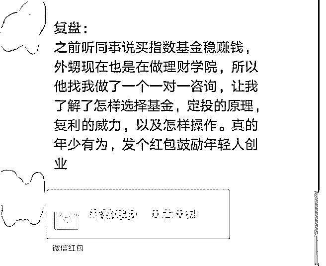

唐芳 : 好厉害啊

丽霞 : 还没有用过知乎的我，赶紧去注册个账号[微笑]

荻野 : 你好，可以联系泽宇教育主编荻野在简书投稿推广并且领取 18.88 红包，如没微信，可添加 wx：VStarOne521

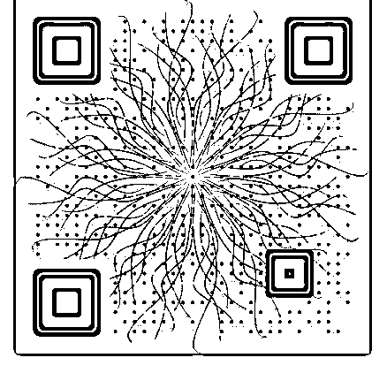

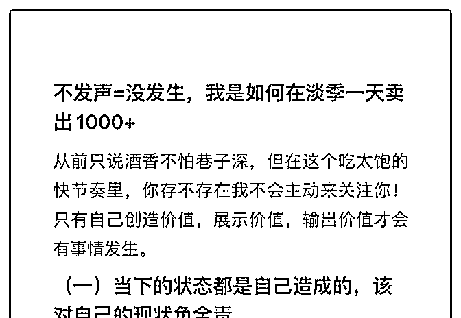

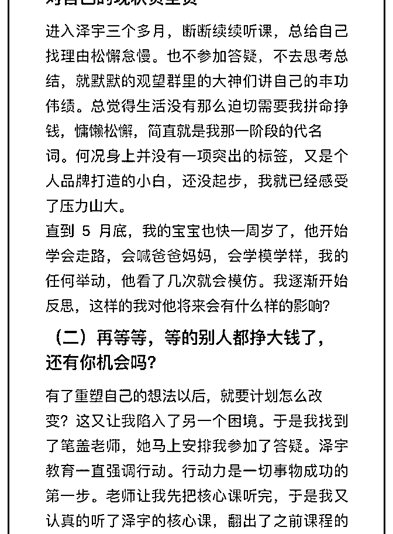

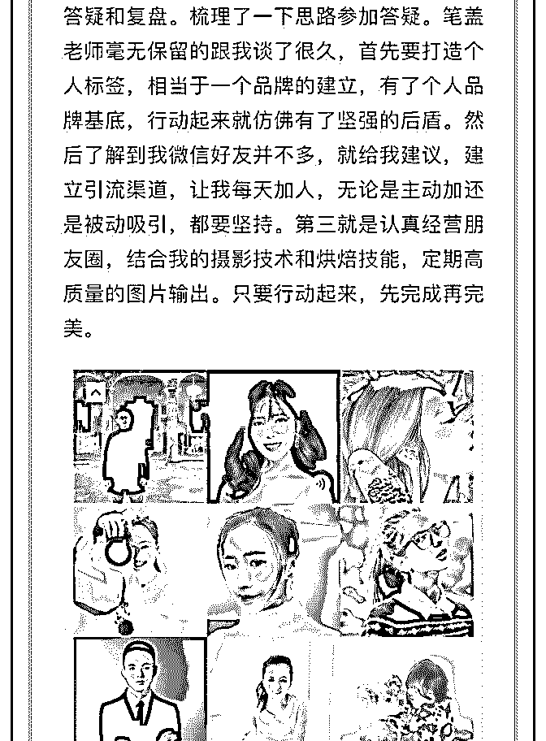

关注公众号"懒人找资源"，星球资源一站式服务

自我介绍更新 经明

bingo : 自我介绍更新 经明哲老师指导价格策略，一早上成交 4 位，收入 400+

良好的沟通来自真诚的自我介绍

【姓名】：bingo

【坐标】：广州

【标签】：基金投资理财教练

【个人经历】：

1）指数基金投资者：30%+

2）5 年股票价值投资践行者：2 年 11 倍

【擅长领域】：投资理财

【我可以提供】：基金投资咨询，如果你有这方面需求，我

乐意为你理一理

曾经的我，也像大多数人一样，在刚刚入市的时候，信誓旦 旦豪言壮语的说：进股市我不可能亏钱的，因为低价买高价 卖，谁不会呀！那就有人问：要是一买进就跌亏了怎么办， 我说那就放着，反正等到盈利了我再卖就可以了，我不会亏 钱的！

然后进入市场，同期也有很多同事，大家都这么想。但是事 情远非你想象，一买入就跌，别的股票蹭蹭往上涨，那个眼 红！然后就想目前亏点没事儿我先卖了去买那只涨得好的， 很快就赚回来了。然后就是一卖就涨一买就跌，我是小资金 在试仓，我同事们比我大胆，我是眼睁睁的看着她这样操作 亏了好几万，即使在 2015 年初牛市来临也没赚到钱，到下半 年后股灾千股跌停时全线被套，损失惨重，一想到当年那些 加杠杆的 倾家荡产的跳楼的还胆战心惊！

我自己是从牛市的小赚到股灾来临后全部亏回去了，本金也 损失了 50%，然后果断清仓出局！然后我就去向我们生物药 研究所注册部的总监请教！听说在我们所里就他一个在股灾 来临前成功逃顶了！他是我们公司出了名的投资人，据说炒 股也是超级厉害，传奇人物！也就是通过向他请教以他为榜 样，我才有了最终股票 2 年 11 倍，基金保持 30%+的收益成 果！

同时我也不断看书，看各种理财书籍，看专业书籍，考取了 证券从业资格，记得是去另外一个城市考试的，认识了很多 操盘手，证券公司从业者以及大佬，至今都时常联系，他们 对我影响深远！

在舍费尔的《财务自由之路》中也有提到，你的一生中一定 要去找到你的理财教练，他的成功经历会帮助你升级认知打 开格局看到不一样的世界！

因此，在我这些年的经历中，我很诚恳的告诉大家，在这个 市场里，不懂不碰，不跟风，不想一夜暴富，向有结果的人 学习，多看书多学习，前人走过的路你没有那么多时间再去 经历了，最好的方法就是多读书多结识贵人，站在巨人的肩 膀上看世界，会让我们少走很多弯路。

认知和金钱都是复利， 我不急，慢慢变得智慧和富有。

我不急，人生很长。当我老的时候，身体健康，做人有意 思，口袋有钱，那老的时候，我比年轻人还快乐。

昨天根据明哲老师价格定制策略，最后 3 个名额涨价到 399， 立即成交 4 位，收入 400+真的是超级感激明哲老师，他说我会 很快实现月入过万，嗯，听从老师的指导，不断优化迭代自 己的专业知识和咨询沟通，相信自己会实现目标的！

同时昨晚也非常的感谢沁心老师，为我解答疑惑，她总能一 针见血指出问题并给出解决方案！真的是太厉害了！大家一 定要向优秀的人多请教！ 今后真心站在学员角度，把他们当朋友，其实很多学员是高 中同学老朋友，他们对我的这些经历比较了解和信任，都是 直接付费了，本来也不想杀熟，看来人品还行吧。但是以后 也要好好筛选客户，喜欢大赌的，幻想一夜暴富的不收，如 果心态和思维都没有对，怎么教都是浪费，只会在股市里交 学费！

2019-04-18(13 赞)

评论区：

荻野 : 你好，可以联系泽宇教育主编荻野在简书投稿推广并且领取 18.88 红包，如没微信，可添加 wx：VStarOne521

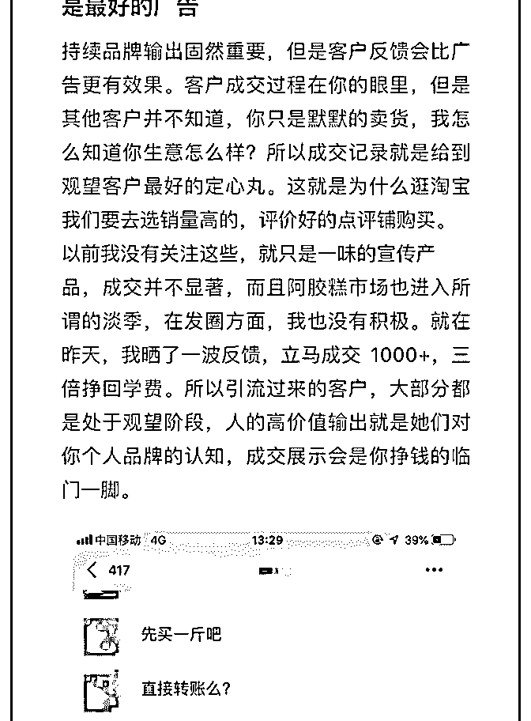

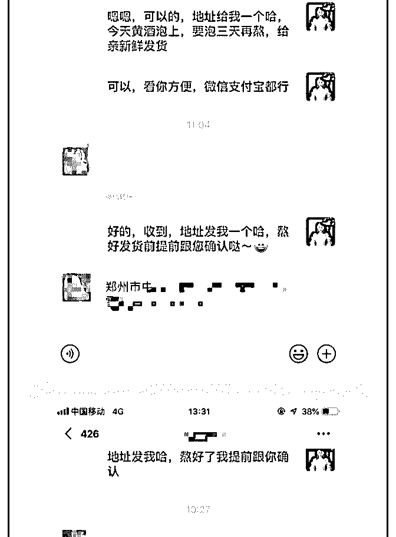

关注公众号"懒人找资源"，星球资源一站式服务

你好，我是解忧人向

专业解忧人 : 你好，我是解忧人向世柳，我是个很关注心灵的 人，所以我也只想说说在泽宇的真实感受。

我在一个很小的公司的专职心理师，2018 年末加入泽宇的， 过了三个多月才赚回核心课的学费。而且期间也已经加入了 导师计划了。而且赚回这个核心课的学费还离不开笔盖的帮 助。 我不想说自己是小白，虽然在心理咨询专业领域待得时间虽 然不长，但是我的实际能力已经得到了很多资深的业内老师 的认可，同时期出来的新手咨询师和我已经不再一个水平 了，我遇到了一个很大的麻烦就是只能依靠平台去接来访 者，这样的绵薄收入，根本无发满足我自己的支出，为了开 拓更多的赚钱渠道我，几乎在三秒钟之内就决定了加入泽 宇。

我看到泽宇有很多人都在加入第一天就赚回了学费，心里充 满了羡慕，我承认前期自己动力特别强，几乎放下手头上认 为最重要的事情去学泽宇。但并没有很快实现赚会学费的美 梦。 后来我就慢慢的冷静下来了，我仔细回忆那些第一天就赚回 了学费的人，为什么别人零基础，第一天就能赚回学费，而 我不可以了呢？想来想去我发现他们根本就不可能是零基 础，他们已经有些基础，比如他们有的已经在某行业有了好 几年，甚至是几十年的沉淀了。但是他们并没有完全的利用 起自己的资源来实现变现。泽宇能给到这样的帮助，他们变 现的潜力几乎在瞬间就爆发出来了。所以他们有基础的，只 是缺乏变现能力。

我之所以这样说，因为我知道泽宇还有很多默默无闻的陪跑

者。我相信加入泽宇的人都是有理想的人，所以我也想真实 的分享我自己的心路历程。并没有其他的意思。只是我觉得 我自己作为一个偏底层的个体，如果想要一夜暴富，还不如 去做个梦吧。赚钱的每一步都是实打实积累起来的。那些实 现了在第一天就好几十倍赚回学费的人，他们之前就沉淀了 很久了。绝不是传统意义上的零基础。

泽宇教人变现，也不是让人一飞冲天的，从核心课到聚星 会，是需要时间沉淀的。如果不是直升机，起飞是需要加速 冲刺的，现在就来聊聊我加速冲刺的过程吧。

最开始的时候，我跟着课程打开了一些新的认知。于是开始 注重微信朋友圈的展示，打开了朋友圈，设置成可见所有内 容。另外也去执行每天都添加一个新朋友，有与朋友圈人脉 是在太少，只有四百多，在跟笔盖讨教以后，她建议我一天 加 20 个陌生人。

现在我朋友圈虽然人也是不多，但和之前相比已经翻了一番 了。如果没有泽宇，我是不会有要去添加新朋友建立弱连接 的意识的。可能现在还是守着那么几个可量的流量白日做梦 般期待着成交。

开始积累案例的时候，因为自己线下会谈 300，让我免费去做 咨询确实会让我觉得很不舒服，于是我就弄了个小活动，一 杯咖啡换一次心理咨询，当时有两个人找了我做了咨询。后 来我把这两个案例晒在朋友圈就真的额开始有人主动来找我 做咨询了。

除了小红包，还有雇我单次解忧的稍大点的红包。 还吸引了一部分同行来跟我进行技术探讨，我也都有给她们

提供了技术上的支持和帮助。

为了增加流量，我根据课程内容去加入微信群，免费给群里 的朋友们做心理学的分享，结果让我特别惊喜的是，在我分 享结束之后，居然有人主动添加我的微信，来给我发红包。

另外由于朋友圈的展示，我也和一个正在创业的朋友建立了 链接，和他合作做个课程，我负责课程的录制，他负责卖。 直到今天晚上，课程的内容已经全部做好发给他了。接下来 就等他去买，然后等他来分钱。

另外还有一个心理咨询机构也联系上了我，让我为他们帮一 个年业绩四十亿的享受团队做一次心理素拓。我也已经把方 案做好发给他了。

甚至还有一位老师连续给我倒了好几次电话让我，去公立学 校，在操场上给一千多人的学生做减压的心理素拓。这个因 为最近我自己的工作多，另外他叫的有点太急了，我婉拒 了，当我还是给他做了一个方案，并告诉他这次不方便，未 来如果有需要，可以继续来找我。

我很感谢泽宇，他让我真正摆脱了单一的收入来源，同时也 引导我打通了和各种平台合作的基础。让我知道要展示自己 价值，才能实现有变现能力的价值输出。

好的这就是我的分享，我希望我的分享能够给你们带来一些 感触。

2019-04-17(20 赞)

评论区：

Mr.D : 泽宇的核心课，强调观念改变和执行力，让我真正开始行动。你的复盘中，“泽宇教人变现，也不是让人一飞冲天

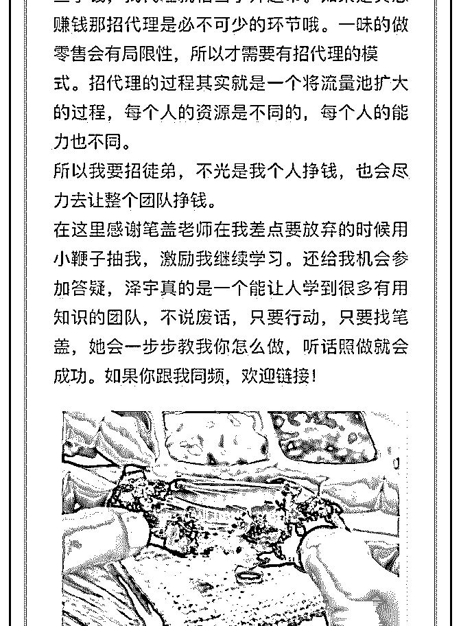

的，从核心课到聚星会，是需要时间沉淀的”这句话，也笃定了我一些想法，谢谢你！

袁立|专注股票价值投* : 复盘真的很棒，学习了。加入泽宇教育之后，对我的影响也很大，颠覆了我的认知，发现原来是自

己的自我设限制约了我这么多年，泽宇教育让我从认知和行动上做出了改变。正在学习核心课！

Smile : 的确，那些在刚加入核心课就能快速变现的前辈都是有他们多年的经验积累做支撑。很赞同您说的：这些需要时间 的沉淀，但更多的也是靠个人的努力、坚持与不断学习。

荻野 : 你好，可以联系泽宇教育主编荻野在简书投稿推广并且领取 18.88 红包，如没微信，可添加 wx：VStarOne521

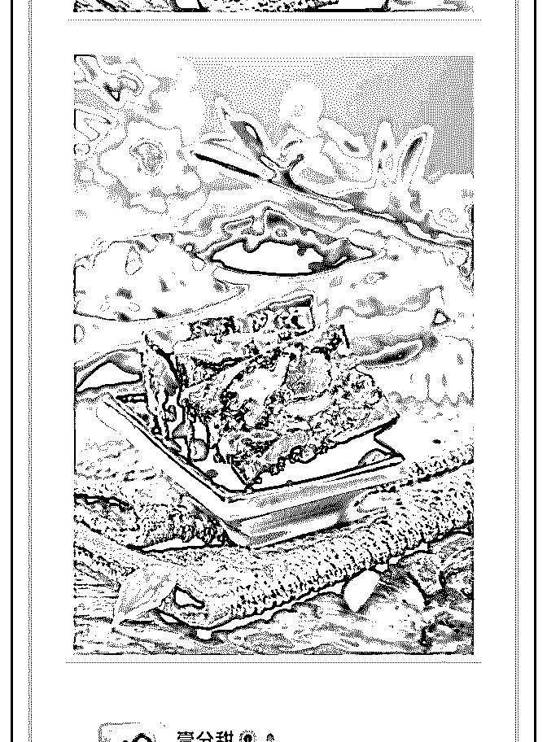

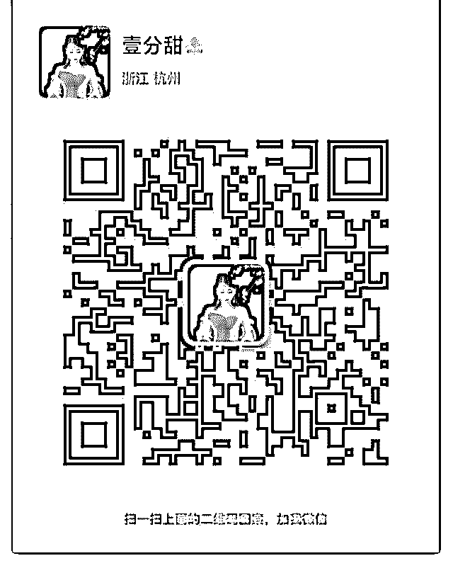

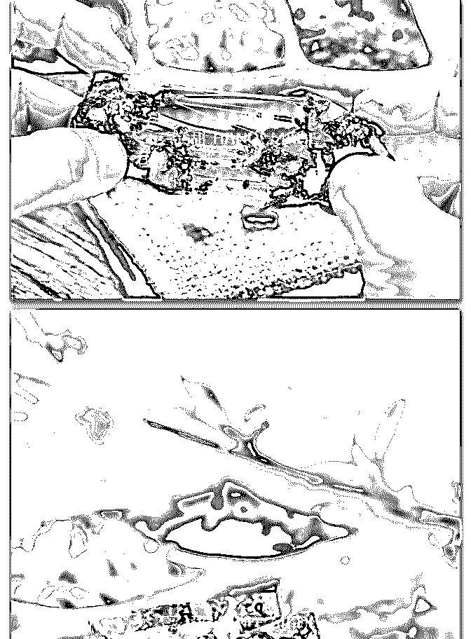

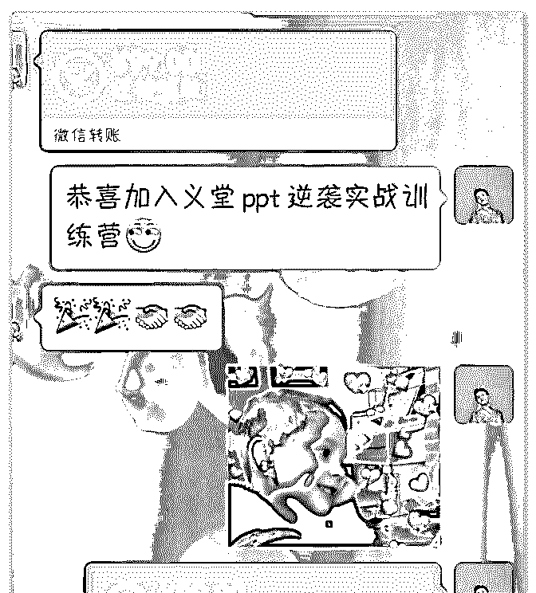

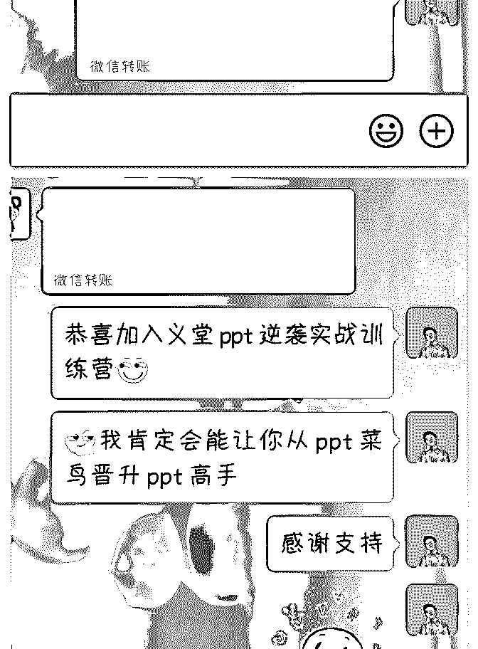

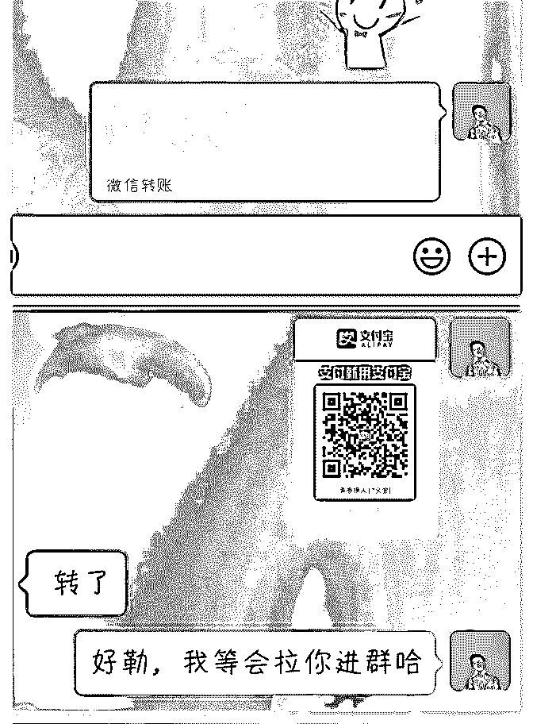

和平 :

庆祝成果：

庆祝成果：加入泽宇

加入泽宇教育后第一次成功变现，谈代理 2 位，变现 1000+ 你好！我叫付和平，是传奇今生红樱桃健康唇膏的代理商。

我早在情感自由群的时候就已经加入了核心课程，由于工作 原因根本没有时间去听课，每天瞎忙。昏天黑地的，忙得不 亦乐乎，课程一再耽搁，囤在那里没有动过，偶尔有空去群 里转转，看见同学们个个都在出成绩，我越发心焦，越是心 焦越是没有头绪，越没有头绪就越心焦，干脆就这样了，一 副死猪不怕开水烫的架势，不去听课更没有复盘，可是看见 别人出成绩了，还是挺羡慕的，心想，牛逼的那个人是我， 那该多好，于是乎找同学去聊，去发现我的问题到底在哪 里，得出的结论是自我设限太严重。告诉我人生不设限一切 皆有可能。 于是我硬着头皮找到了小鱼老师，老师帮我重新梳理了标签

（理财，情绪管理咨询，销售）定位销售，从上周又开始学 习核心课程，努力复盘，这期间顺带谈成了俩个代理，零售 也在逐步增加，对于我来说也是一个质的飞跃。 感谢泽宇教育让我明白卖货首先是卖人，卖自己，在小的个 体也有自己的品牌，只有打造好个人品牌，才能经营好产 品，接下来要认真学好核心课程，努力做好复盘，为早日加 入导师计划做准备。 我是和平，欢迎加我一起互相交流学习，路上有你，有我， 生命更有活力，更精彩。

2019-04-17(11 赞)

评论区： 和平 :

范范 : 和平姐好棒

和平 : 范，你都甩了我八条街了

霜夜 : 很棒哦。我才加入核心课 4 天，现在我很迷茫，因为我在半个月前就说做微商，卖珍珠饰品，但是我到现在都没有踏

出第一步，因为我不知道该怎么做，该如何踏出这第一步呢？不知道你能否为我指一条明路[微笑]

和平 : 私聊我

和平 : 像小时候学过的小马过河一样，水深水浅自己下去试了才知道，想做就要敢于迈出第一步，第一步其实没那么 难，不要自我设限，打破枷锁关键靠自己，相信你可以做的很好，相信自己，鼓励自己，自己是自己最好的贵人。 荻野 : 你好，可以联系泽宇教育主编荻野在简书投稿推广并且领取 18.88 红包，如没微信，可添加 wx：VStarOne521

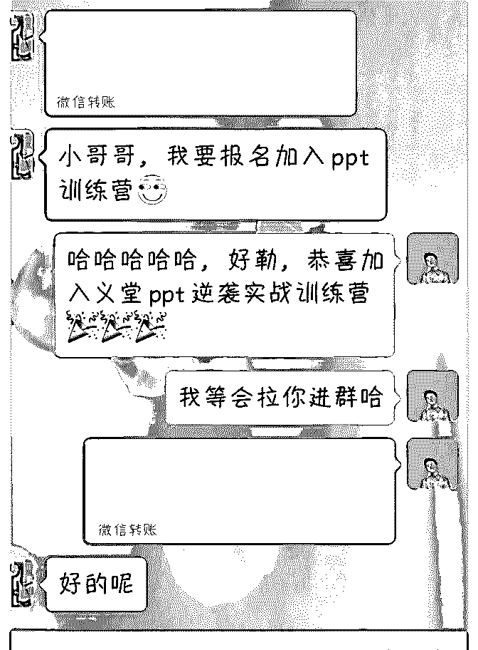

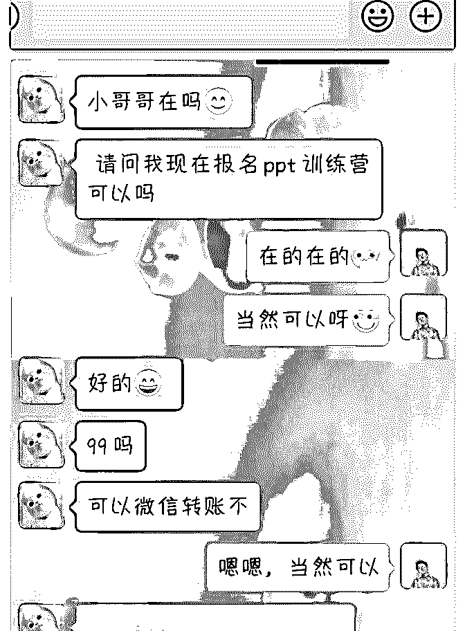

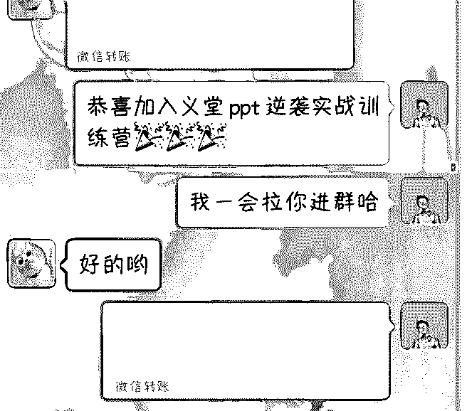

朋友圈价值输出 3 天

bingo : 朋友圈价值输出 3 天成功转化 5 个，变现 495 元 白天上班，晚上做了 1 个咨询，然后娃各种黏着，一看见我拿 起手机就过来抢，所以又到这个点了。

曾经的我各种自我设限，总觉得自己不够优秀，拼命买课程 学东西考证书，总想着变优秀了再让别人知道，再发朋友 圈。

遇到泽宇教育，学了课程，参加了一次一对八语音中听到明 哲助教的指导，他说你当初跟 Judy 一个起点，你有证券从业 资格，甚至你更有优势，她能做到今天的成就，你为什么不 相信自己呢！你看你的自我设限浪费了多少时间！像是一语 惊醒梦中人，感觉立马就开窍了！对啊！就是行动起来，相 信自己能做到，想都是问题，做才有答案。

结合前期教朋友们买基金，不管是今年刚投资的还是去年大 跌时投资基金的，她们按照我的方法都取得了很好的收益， 有些 25%以上，拿出来做了价值展示，果然就有好几个小伙 伴咨询了，目前为止成交了 5 个，这是我之前想都不敢想的！ 完成了 0 到 1 的突破，期待以后的 0 到 100！大家也都加油，真 的，按课程学习照做，然后就发现自然而然的成交了！

目前还有三个表示感兴趣，在跟进中，明哲老师说我的单价 99 太低亲，成交三个就应该涨了！但一开始在小伙伴们咨询 时说了“原价 399，目前优惠价 99”，我都不敢涨价，那我要是 之后涨到 399 不会太高吧？我是就我自己觉得是不高，因为给 别人带来的价值真的是不可限量的，早日加入的学费也很快 就赚到了！ 目前微信好友 600 多，有十几个群，但是我以前都没怎么加

人，没怎么互动，之后要做好引流，同时服务好每一位学 员！帮大家盈利持续长久稳定的盈利！始终相信利他是最好 的利己！

在此感谢泽宇教育，大家一起加油 ，持续学习！持续输 出！持续变现！

我是 bingo 基金汇创始人：bingo 如果有理财方面的困扰可以扫一扫添加我的微信，我乐意替 您理一理

2019-04-17(10 赞)

评论区：

荻野 : 你好，可以联系泽宇教育主编荻野在简书投稿推广并且领取 18.88 红包，如没微信，可添加 wx：VStarOne521

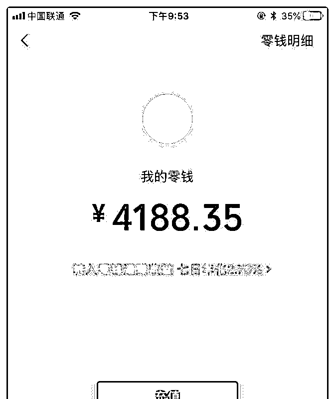

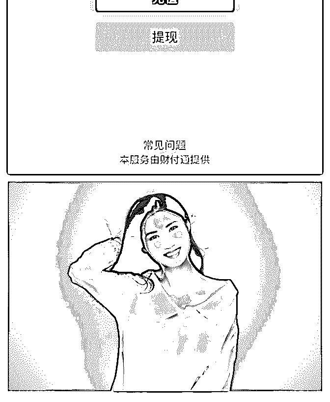

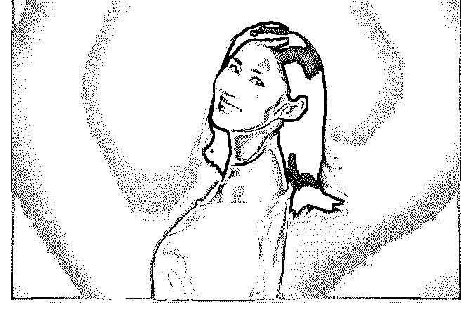

《“一路开挂”的变

圆圆 Mia - 专* : 《“一路开挂”的变现心得分享》

又实现了一个小小的里程碑，变现【3000+】赚回导师计划学 费。

昨晚在核心课群里被小鱼老师邀请做分享。简单分享下"一路 开挂"的心得。

一、心态要好，聚焦做事。 刚开始加入泽宇时，看到同学们天天晒单，我内心也很慌。 后来我就想，大家其实都是有自己的积累的，现在的成果都

是之前积累的结果，在我看不见的地方。

所以我就转换心态，告诉自己，那些出成果的同学的现在就 是我的未来，只要我踩着他们的脚印 一步步往前走，不懂 就问老师，我也一定能够出成果。

所以在转换好心态之后：我就把注意力聚焦到自己每天要做 的事情身上。

二、以终为始，量化目标 我自己会有一个半年度和年度的收入目标。 每周会给自己设置一项工作重点。 每天设置一些必做的 daily list。

然后每天早晨起来后给自己设立今日目标和任务，然后明确 我的产出标准。

然后目标倒逼过程，去完成任务即可。 三、持续行动，每天复盘 每天完成任务后，第二天对前一天进行复盘。 做的好的地方是否可以固定为流程。 做的不好的为什么不好，要怎么改进。 如何通过优化流程做得更好？ 四、勤加思考，不懂再问 现在有种感觉，每天想得会比做得更多。

我觉得这是一种很好的状态，多思考怎么去做得更快更好。 而不是一直盲目地去行动。 当然也不是不行动，只是要更有策略和目标性地行动。 当自己想不明白的时候就积极去询问老师。

有时候自己思考很久可能想不明白，但是老师稍微一点拨自 己就通了。

所以不要害怕提问，可以带着自己的问题和理解去提问。

去对比你的答案和老师的答案的区别点。

哪些是你已经想到的，哪些是你没有想到并且做做得不够好 的。去优化。

20190416

---------------------------------

PS：大家好，我是圆圆，帮助微商、个人品牌咨询师、中小

企业，进行微信精准引流，通过 1 对 1 带教，让目标用户主动

找上你，实现流量变现。若您对引流有兴趣，我很乐意帮你

理一理。微信号：buchiy，暗号【泽宇】～

2019-04-16(8 赞)

评论区：

荻野 : 你好，可以联系泽宇教育主编荻野在简书投稿推广并且领取 18.88 红包，如没微信，可添加 wx：VStarOne521

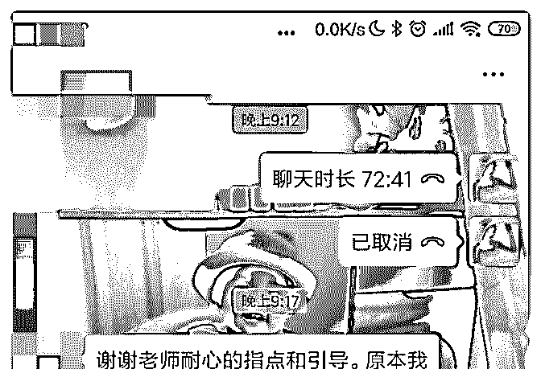

圆圆 Mia - 专* : 好哒，谢谢主编

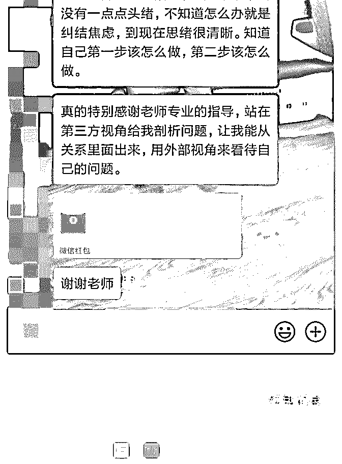

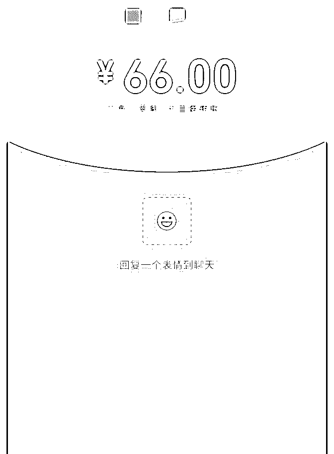

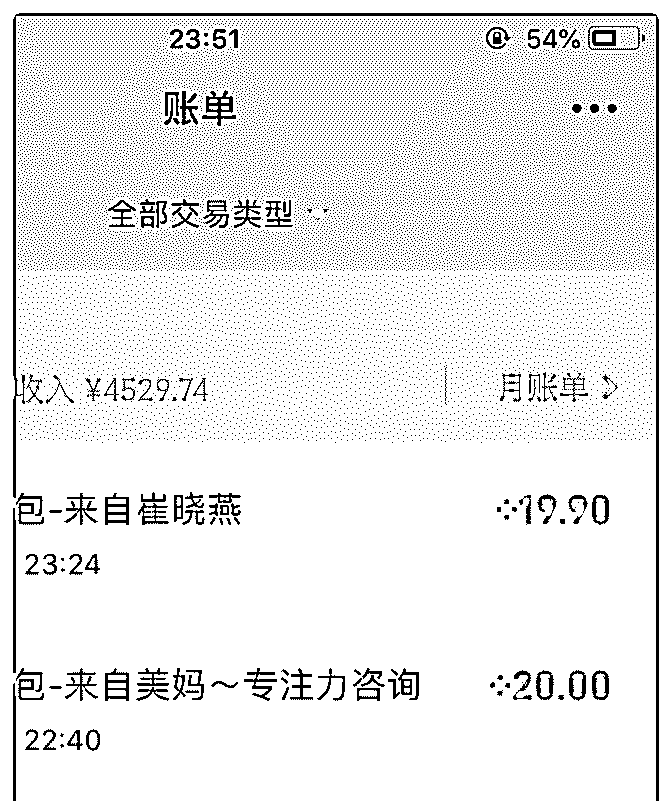

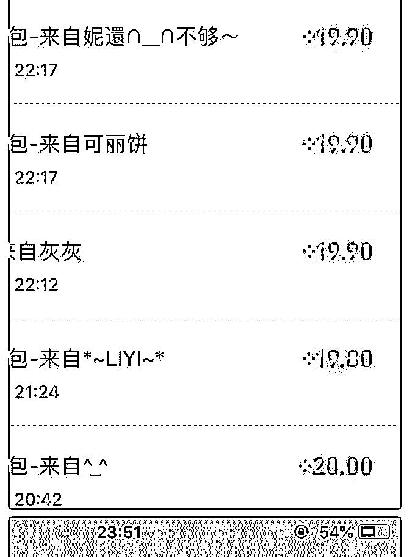

关注公众号"懒人找资源"，星球资源一站式服务

2 天收款 20400 屈源 : 2 天收款 20400，我是怎么做到的？ 你好，我是屈源！

曾经的我是每个月拿着 3000 元死工资的人，从来不相信什么 屌丝逆袭。月入过万等等字眼，这些都是骗人的。都是成功 学。

甚至看到别人说我这个月月入过万，内心非常鄙视。这小子 又吹牛，并且还不打草稿。自己内心也非常期待月入过万， 但是我没有经历过。也不知道怎么去做

工厂上班的我 直到后来学习目标管理，打造个人品牌。改变了我的人生轨 迹，目前我已经 2 天月入 20440 了。所以也想把我自己当中的 坑，以及一路走过来的复盘毫无保留的分享给大家。

部分收款截图 这里我并不是炫耀自己挣了多少钱，而且一个证据。现在喷 子太多，我只用结果来证明一切。

接下来就直接进入正题，我凭什么做到 2 天就可以收入

20440。

现在互联网时代，太多太多的网红一夜爆红。这也让人们内 心焦躁起来，总想急功近利。就算最后我们有结果了我们能 够驾驭住吗？

分享个我的案例，曾经我一个月收入 3000 元。但有一次因为 运气那个月收入了 2 万，但是我没有办法去驾驭这金钱。20 岁 的我从来没有一个月拿过 2 万，也从来没见过这么多钱。

当这笔钱来到我的身边，却给我带来了非常大的伤害。我内 心膨胀起来了，认为自己牛逼，厉害。不仅内心膨胀起来， 也伤害了身边的朋友。自己也非常的自责。

而且后面自己也摔的很重，摔的很重并不是生活上。而是心 理上，因为自己的膨胀。而忘记了那些曾经帮助过自己的 人，让他们灰心对自己失望。

事后自己内心真的非常难受，后来这件事儿一直刻骨铭心。 时时刻刻警惕着我，沉下来，永远不要忘记帮助过自己的 人。

接下来就是给大家分享凭什么 1 个月入 3000 的流水线工人通过 互联网 2 天收款 20440.

1、打造个人品牌 逻辑思维 CEO 罗振宇曾经说，个人品牌是个体最好跃迁的利

器。

个人品牌 那么什么叫做个人品牌呢？

个人品牌就是你进入 1 个房间 10 分钟过后这些人对于你的影 响，个人品牌由 2 个部分组合而成。

个人品牌=内核+外核 内核=你的价值观，为人处世，原则等等。 外核=你的专业技能，特长，外貌，声音等等 而正是这两部分组建而成的你的个人品牌，现在是互联网时

代。在小的个体都是自媒体，都是行走的播音机。好好利用

这个趋势，来实现自己的跃迁。

不发声=不发生 假如你什么都不去做，当然就没有可能实现跃迁的机会。也

没有任何机会和你的用户以及粉丝发生链接，而说，写是最

好的发生的利器。不断的说，不断的写。

2、不问收获，只问耕耘。 成功不是一蹴而就的，我屈源也不是一下子就从月入 3000 到 2

天收款 20440。当中也经历了非常多的事情，也付出了非常多

的努力。

例如、最开始打造自己个人品牌目标管理的时候，我从每天 早上 5 点起来学习专业知识。然后到 8 点上班，晚上 21:00 下

班，回到家过后继续学习实践直到凌晨 1 点。几乎每天只睡 4 个小时，有时还不到。

有时后中午坐着，坐着就睡着了。自己就疲倦到这种程度。 再例如、上个月 21 号的时候。我的合伙人艾哥从武汉过来，

我俩在一起打磨目标管理的课程。连续 20 天时间，从早上 9 点

起来一直忙到晚上凌晨 1 点，中间为了节约吃饭时间就去外面

买了一些牛奶，面包放在家里，只有偶尔出去吃下饭。

这些都是我们前期的付出，而且前期我们也积累了非常多的 粉丝。并不是一下子短短几天从 0 就到 2 天收款 20440.中间是需 要我们时间的积累。

很多小伙伴包括之前的我，急功近利。还没有付出多少，就 想要收获。就好比我们春种秋收的庄稼，还没有种完种子就 想收获了。不问收获，只问耕耘，结果永远不会迟到的。

不急不停，不急不停。不急不停

3、用心服务好学员 我是做目标管理咨询，就是为学员解决拖延，迷茫，达成目

标等问题。用心服务好学员是非常关键的一步，为什么这样

说呢？

第一、他们对我付费了，我也收钱了。必须对他们负责 第二、信任，他们信任我。所以我也必须担当起这责任 我的学员每一个我都是在非常用心的关注，有时候为他们答

疑直到凌晨 1 点也是常有的事儿。但最后换的结果是好的。

在这段时间已经帮助 300+的小伙伴解决拖延，迷茫，内驱动 力不足，目标达成的问题。

去帮助他们突破，帮助口红微商宝妈实现 2 天收款 1W+，帮助 形象管理咨询师 30 分钟收款 3000+,帮助摄影咨询师 60 分钟招 收 21 名学员还拒绝 6 名。

这些案例确实太多太多，但是中间我们都付出了非常多的努 力。最后服务好这些小伙伴的同时，他们也在源源不断的给 我介绍客户

例如这位伙伴，是一位情绪管理咨询师。同时她也是重庆 FM 特邀分享嘉宾，重庆报业集团的情绪管理导师。他们都在为 了源源不断的介绍客户，所以也非常感谢他们

4、贵人相助 说实在，我屈源真的命好。在创业路上能够得到许多大咖的

支持以及帮助，非常感谢您们的支持和帮助。

第一位：香港第一自媒体，得到 APP 精品课老师 Spenser(陈立 飞）

和叔的截图 平时都叫 Spenser 为 S 叔，我这边为了偷懒就叫叔。最开始的时 候叔为了帮助我推广还幸苦力力写了一天的文案，因为我自 己写过文案。也知道背后付出的精力，真的非常感动。

他是一个高高在上的大咖，也能够这样帮助我这个无名之 辈。内心感动之极，后来和叔的深入了解。发现他虽然社会 地位非常高，但从来没有那一套架子。并且还对我说有创业 的问题可以找他，内心太开心了

第二位：年入百万的个人品牌打造导师波力

凌晨 2 点波力哥为我解答 波力哥，是我个人品牌打造方面的导师。但很多时候我有问 题就马上找波力哥，而他也是耐心的为我解答。而且经常聊 到凌晨 2 天。

2 月 27 号的时候波力哥来成都，我和他面基了。因为当时自己 的钱都拿出去学习了，也没什么钱请波力哥吃豪华的大餐。 波力哥看出我的窘迫，他就主动请我和明哲兄弟去成都豪华 的餐厅吃饭。说实在内心非常不好意思

第三位：国内某上市公司 CEO，推动粤港澳大湾区建设，雨 哥

我这里就不发截图了，雨哥一直是我精神的支柱。他的价值 观一直引导我前行，以前自己能量低的时候总会去看雨哥的 朋友圈。

并且当自己价值观出现问题，雨哥也会直说出我的问题。帮 我化解让我避免走上错误的道路之上。

说到这里，我，屈源内心的真非常开心。同时也感到非常的 幸运，能够有这么多厉害的人过来帮助我。

他们都是我成长路上的贵人，因为有太多太多的贵人了。屈 源这里就不一一到来了，用实际行动回馈您们

5、感恩 没有人会去帮助不懂的感恩的人，并且感恩并不是嘴上说的

而已。是用实际行动来证明的

这是我今年发的红包 虽然红包并不是很多，但对于目前的我是非常大的一部份 了。我自己也会努力强大自己，来报答贵人以及相信我的伙 伴。

目前已经发了红包 12274，寄出去 31 份礼物。总价值 20000 左 右，感谢您们屈源也不会仅仅在口上说说而已。

最后今天的分享也到此结束了 不急不停，不急不停，不急不停

2019-04-16(43 赞)

评论区：

寇洁 : 一步一步看屈源哥走来，真的牛逼，实力典范 熙冉 : 最服屈源啦！好棒！

屈源 : 一起加油，不急不停 屈源 : 咱一起加油，不急不停 Lavender : 优秀！！！ Mirror 镜子 : 源哥好棒！

丽霞 : 见过 Spenser，好年轻，又帅气 丽霞 : 你真棒

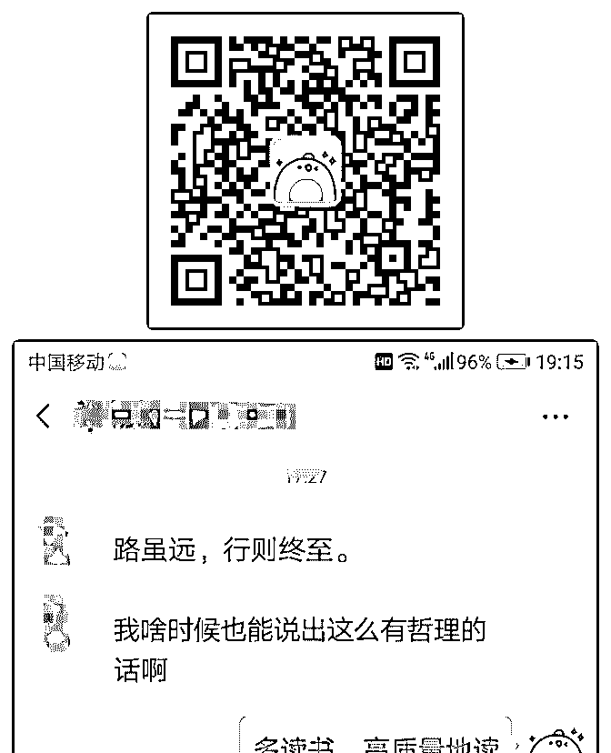

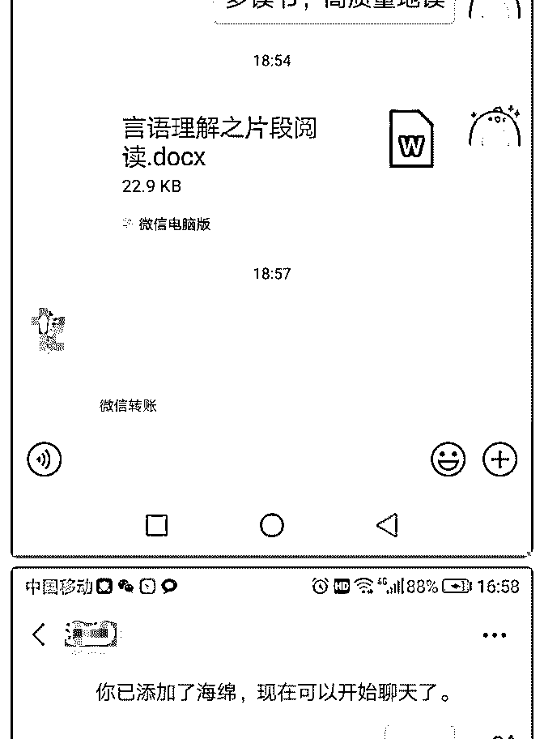

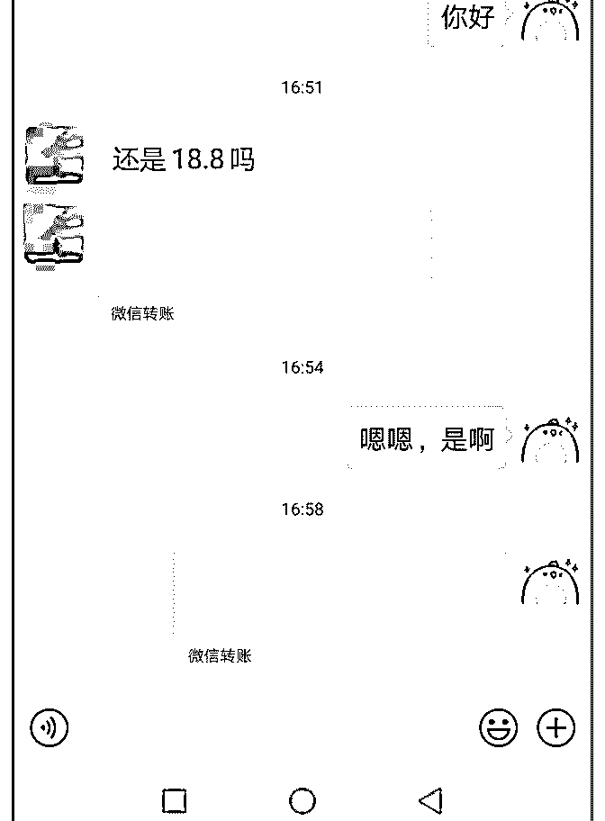

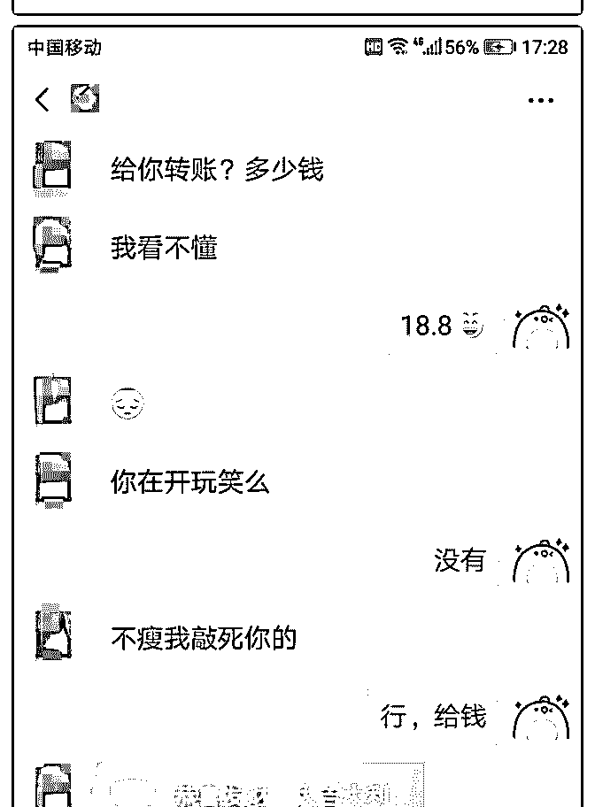

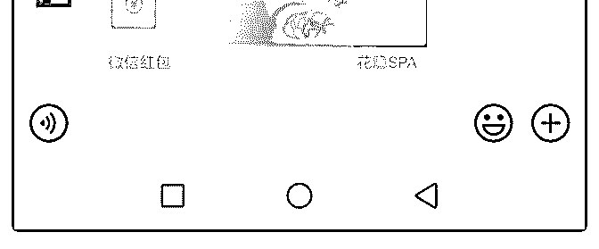

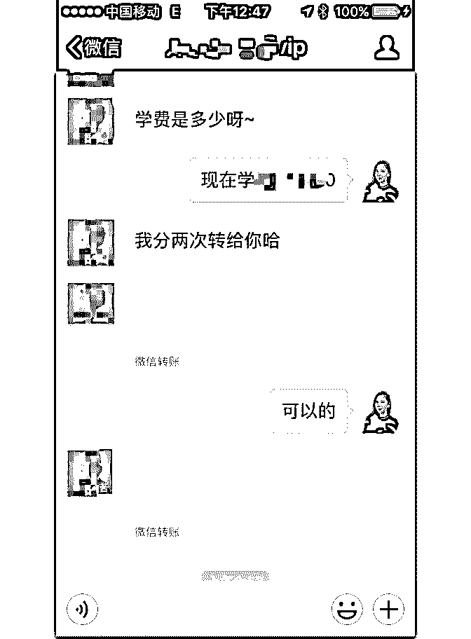

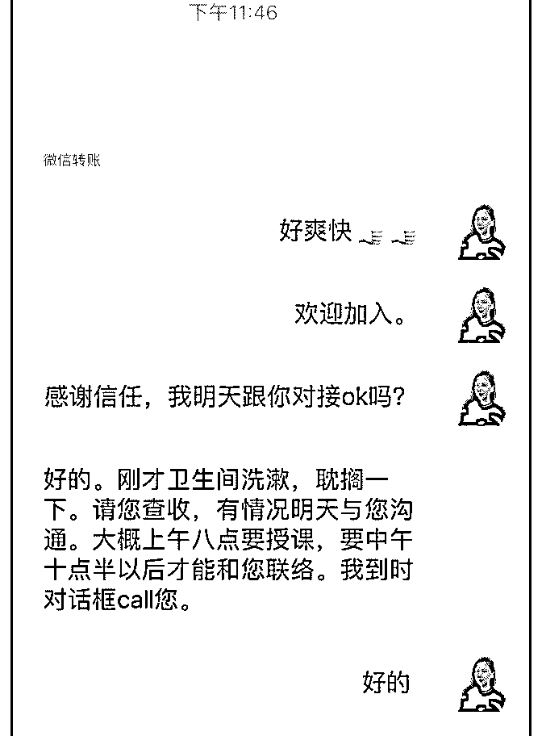

关注公众号"懒人找资源"，星球资源一站式服务

核心课心得体会加入

展翼 : 核心课心得体会 加入泽宇教育有几天了，正好昨晚参加华丹导师的线上答 疑，受益匪浅。

先把昨天复盘一下:解决了我一直苦恼的问题，如何从一个没 有 ip 的文章写手，到有个人品牌的个人导师。其实就是增加人 设。

之前学过知乎课程，尝试写人设文，但是效果不太好，就没 继续，只会写过于干的干货文。能给别人带来价值，但是无 法加强了解。想建立个人品牌，必须有自己的品牌故事，走 进读者内心，让读者更了解自己，因为我们做的就是个人品 牌，人都不了解，如何营销。

今天想的多，就多说一点。为什么 2019 年是建立个人品牌的 好时机。

首先是趋势，我们经常听到的一句话是，站在风口上，猪都 能飞起来。小富靠能力，大富一定靠趋势。逆风行走，顺势 而为。现在就是知识付费的时代，但是几年前很少有人愿意 为知识而付费。

其实是 ip 变现能力强，这个时代，papi 酱拍小视频能火，陈二 发，冯提莫打游戏能火，最搞笑的是一个小姐姐接受采访， 说男朋友只要能带我吃饭就好，这特么都能火

知乎上有个问题，知乎上有个问题，为什么现在香港小姐一 届比一届臭，因为现在成绩的渠道太多了，不像八九十年代 只能唱歌拍电影。只要火了就有钱赚。

最后个人 ip 成本低。做生意要投资，但是做个人品牌唯一的投 资就是投资自己，这是最合适的的，所以很多平民百姓，都 能通过个人品牌实现自己的价值。

宇哥的核心课和导师计划都听了，我最大的收获是做个人品 牌不仅教别人方法，更重要的是传递企业核心价值观和文化 内涵。这就是将目光放在将来，而不是眼下。

最后说一下我是如何三天赚三千的，建立知乎号快二十天 了。每天知乎上写文章，虽然马上就要考试了，报班的人很 少，但前几天还是有人加我买视频。都是之前录好的，直接 发了就好，边际成本逐渐削薄。接下来一个月是淡季，正好 潜心修炼，准备迎接下一次的浪潮。

2019-04-16(7 赞)

评论区：

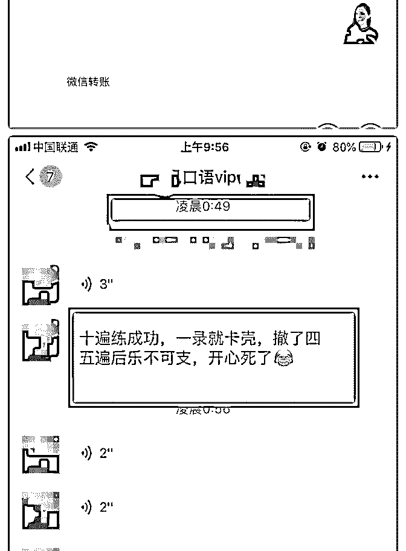

荻野 : 你好，可以联系泽宇教育主编荻野在简书投稿推广并且领取 18.88 红包，如没微信，可添加 wx：VStarOne521

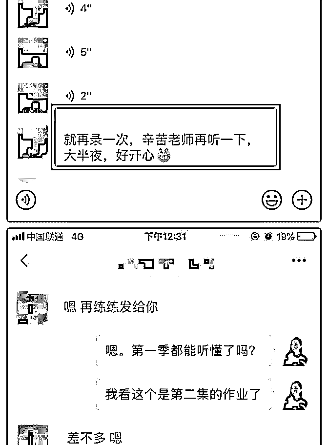

关注公众号"懒人找资源"，星球资源一站式服务

加入泽宇教育后第二

雯 : 加入泽宇教育后第二个月月入 2 万+复盘

【姓名】雯雯老师

【个人经历】

*从前我也是一枚英语小白，考试总也拿不到高分，和老外交 流急得手心出汗话到嘴边说不出口，上英语课从来不敢发

言。 后来我找到了学习英语的好方法并满满摸索出教给别人的经 验，让自己从英文菜鸟变成英文老师又一步步成为美国上市 培训机构新东方高级培训师，教研组组长，校级优秀英文教 师，代课量第一名。并继续精进成为中国人民大学教育管理 学在职研究生。

*担任郑州市卫生系统英文演讲比赛两届评委，并作为主评委 总结发言。所带学员水平从零基础提升到可以在国外定居交 流无碍，学员年龄从小学生到博士生都有，所带英文演讲学 员取得市级比赛第一名。

*担任澳洲商会翻译，结识墨尔本旅游业大亨，赴澳洲游学半 年，访问有悉尼大学，莫纳什大学，新南威尔士大学，迪肯 大学等，并单人接受墨尔本前市长苏震西亲切接见。

*20 岁通过全国选拔成为河南省唯一国家公派赴英国文化交流 九名年轻人之一，赴英国爱丁堡进行国际志愿者交流，并接 受上海东方卫视近半小时采访。成为建校以来第一个由国家 公派出国的在校生。

*受邀培训企业和学校包括：世界 500 强企业卡特彼勒，河南 省郑州市金水区政府，中国银行，郑州大学第一附属医院，

中国南方航空，河南省儿童医院，郑州大学，河南省中医药 大学，河南工业大学，郑州交通职业技术学院，黄河水利职 业技术学院，郑州炮兵学院等

这个是我目前的个人简介。很多人都觉得机构大，平台好， 好好做好自己的本职工作就好了，但我始终觉得自己的品牌 是在平台基础上的，在我开始正式地介绍自己个人品牌变现 之前我想先介绍一下我怎么是什么时候开始意识到个人品牌 是一件很重要的事情。事情起源于 2018 年的暑假。暑假大家 都知道是我们教育培训行业最忙的时候。整个七月和八月没 有周末的休息的一直在上课，每天连轴转，平均每天 8 小时讲 课，还有的时候一天还要奔波几个校区，甚至还要跑到各个 企业做英文讲座。这张图就是我去年在河南省儿童医院的口 语讲座，但讲大讲座和面对小班级对体能的消耗是不同的。 所以我偶尔会讲完大讲座的时候，会有一种体力耗尽的感 觉，真的应了那一句，蜡炬成灰泪始干。我时常觉得自己就 是一颗燃烧的蜡烛啊，在燃烧自己的生命。有时候在想，还 有什么方法能够让自己的时间更加有效率。尤其是在有了小 孩之后。希望能够更多陪伴他的成长。我在最忙的暑假给他 买了一把尤克丽丽作为生日礼物。并且我想与其送给他，不 如我先学会了，于是我在每天晚上哄完孩子睡觉，再悄悄出 来备课，备课到午夜 12 点的时候再开始自学尤克里里的弹 唱。终于用了将近两个星期的时间，学会了一些简单的曲 子。并且在儿子的生日当天，送上了我为他精心准备的尤克 丽丽弹唱。当暑假结束人整个放松下来的时候才开始意识到 身体有一些异样。一直以为是一些普通的炎症，吃吃药，打 打针做检查就好了。后来不断的抽血化验之后才发现自己怀 孕了。但是孕酮非常低，怀过孕生过孩子的女人应该都清楚 孕酮低代表着什么，也就是说这个胚胎发展是不好的。后面 滴事情啊，更超出我的想象，不仅是孕酮低的问题，而且是 医生发现阿，在我的宫腔根本就看不到孕囊。也就是说这是 危险的宫外孕。经过了保守治疗，化疗还是躲不过要做手

术，在医院前前后后半个月，一共花费将近 3 万元，并且在接 下来的休养期间我也完全中断了我所有的课程。 但是在这几个月里面，我想到了很多事情。首先。当一个企 业里面在你不再能为他做贡献的时候。哪怕是非常有人性的 一个企业。它也无法在你不能继续为他提供服务的时候，为 你提供服务。所以对于我的工作性质来讲，上课。就好像计 件收费一样。上一节课，挣一节课的课时费，不上课就没有 钱。所以我在休息的三个月了，在学校方面是没有工资的。 当然，你如果有足够的实力以及不可替代性的话。仍然还是 有自己的市场价值的。所以我尝试在这几个月里学习更多我 感兴趣的技能，有正面管教家长讲师的学习，商务演讲的学 习等等，所以当我的领导跟我说，你身体如果可以的话，希 望你继续回来代课。我虽然又回去上课了，但我越来越深的 感受到我的价值并不由我自己来决定。而是更多由我的代课 量来决定，而我已经越来越清楚我要提高的是的我单小时价 值，而不是通过积累大量的课时来增加我的工资。也就是在 这个时候呢，我第一次接触到了个人品牌。不过并不是泽宇 教育，而是一名我们行业的网红老师，他自己开了一期免费 的个人品牌营，我们一共学了大概五节课，但已经完全打开 了我很多的思路，比如开放的朋友圈，文案的编写。在这之 前我都觉得文案营销是需要团队去做的。虽然后期可能他也 比较忙，这件事情没有再进行下去，但是个人品牌这个意识 已经根深蒂固扎在我的脑海中了，而我也在每天不断的践 行，但如何变现仍然是我很好奇的一件事情，因为我们还没 有学习到如何变现。后来有一天我注意到笔盖姑娘的朋友 圈，讲到一个泽宇教育。那我当我看到简介的时候，其实内 心是有一点点觉得质疑的，因为九七年的人对于我来讲真的 是太小了，我第一批带的学生都是九三年的人啊，我只想我 觉得九七年，不知道是噱头更大一些呢，还是真的有料呢。 但笔盖姑娘我们因为英语平台相互认识，知道她也是一个特 别靠谱的人，她的全情投入让我觉得可以试着多关注一些， 从星球体验到，我加入了核心课，还没听完。很快就有了自

己的第一笔线上收入 7000 元。这是我第一次线上收入变现的 一个经历。但我我除了归功于泽宇，我打开了一个心态以后 呢，因为这些人是我认识的，并不是不认识的人，所以我心 里面对是否能够继续进行引流是有疑惑的。那通过我在导师 计划里面发的文字和自我介绍，有一些泽宇的小伙伴加我的 微信啊，但大部分大家是一种共同学习，共同成长的心态， 互相加好友的。在这个时候呢，也有一些小伙伴咨询我英语 学习的问题。也就在这时结交了第一个，我不认识但是出于 信任我而跟我学习的小伙伴。我十分感谢她对我的信任。我 也非常认真的为他做了一个一个月的执行计划，详细到每周 的任务是什么样的。 她第一次跟我语音的时候是希望等到下周再来学习，那我主 观的认为，可能她只是说说而已，并不是真的想要学，但是 他非常信守承诺的在第二周给我转了 2500 元。这件事呢，让 我非常相信泽宇这个群体内的小伙伴，都是一群愿意为了成 长精进的群体，愿意花钱花时间和花精力的向上的小伙伴 们。所以我用挣到的学费晋级了导师计划。在导师计划里 面，我又见识到了传说中的 C 宾老师。他也是一位非常年轻 的小伙子。但是他的逻辑非常的缜密，而且能够迅速的判断 出你的问题是怎么样的，可能是大部分我们在学习过程中很 多人的问题是有共同性的，所以他总能非常一针见血地指出 你的问题是什么。但我无论有了什么问题。我也非常喜欢请 教笔盖姑娘。她也非常的专业。

再加入导师计划的中后段我开始尝试自己做训练营，因为有 了做老师的经验，所以我直接跳开了 1 对 1 的咨询直接进入到 了训练营部分，那训练营部分呢嗯，我的训练营的定位是， 嗯，亲子英文指导。

这是我第一期内测营，398-498 元，很多都是认识我的朋友 们，两个小时就报名 20 人，因为第一次做，所以我限制人 数。 7 天的训练营边做准备，边上课，在做的过程中总结了一 些经验和训练营会遇到的问题。当时就感受到了 旅行办公的

意义。带孩子在公园边，他睡觉，我备课。在酒店角落里， 孩子和家人在玩，我抽身一小时上课。由于当月收入过万， 所以立刻报名了聚星会。

而聚星会恰好解决了我所疑惑的课程问题，目前我正在学习 和提炼过程中。第二期我准备做成课程+语音指导的形式。这 是第二期的招募文案。

在聚星会的群里的确是大咖云集，都是各个领域里的翘楚， 销售冠军，变现大王，而且都是通过变现达到了自己一开始 设定目标的人群才会毫不犹豫要加入聚星会。我很庆幸，我 在今年看到了笔盖姑娘的朋友圈，加入了泽宇教育，开启了 自己线上教育的篇章，我目前的成绩在聚星会简直是小蚂蚁 一样的存在，但我相信通过泽宇教育的学习和不断精进自 己，我也一定可以做到全球旅游办公。

2019-04-16(10 赞)

评论区：

荻野 : 你好，可以联系泽宇教育主编荻野在简书投稿推广并且领取 18.88 红包，如没微信，可添加 wx：VStarOne521

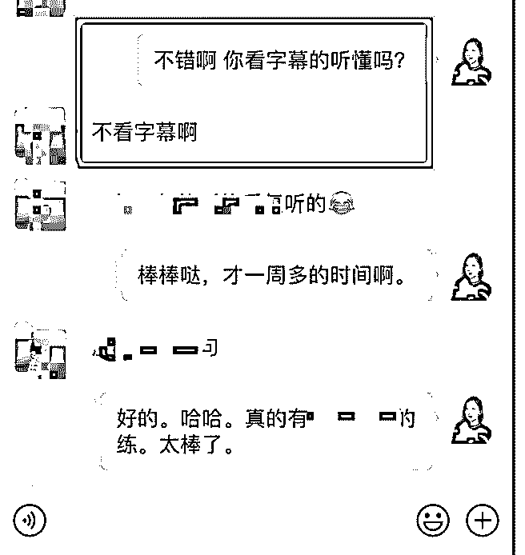

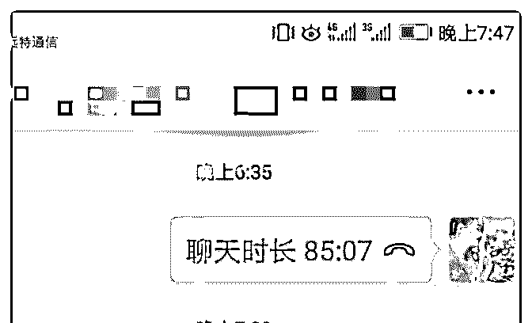

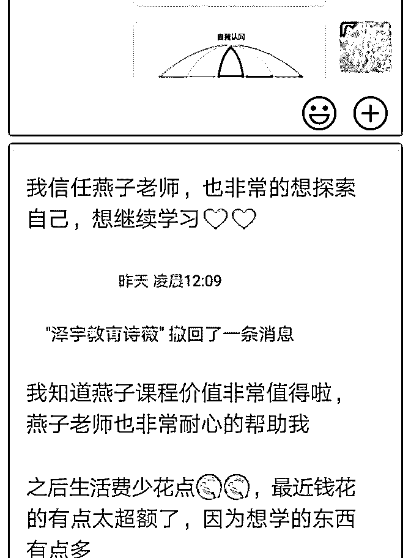

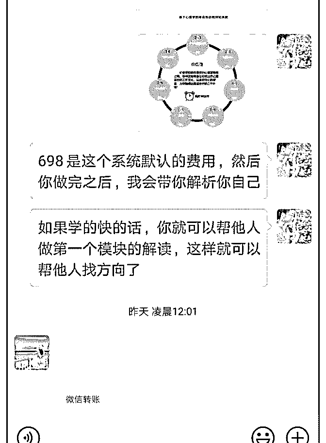

关注公众号"懒人找资源"，星球资源一站式服务

【赚回学费】核心课

天洋 : 【赚回学费】 核心课复盘

我是如何用两周的时间赚回核心课程学费的？ 我是在泽宇还是社交课的时候就加入了泽宇教育，但是那时 候没有好好听课，所以也没有什么进步。每天看到小伙伴们 在群里的进步，我也很是羡慕，但一直在准备学校中的事情 和考研，也就一直没有行动起来，前一阵考研结束了，终于 我可以全身心的跟着泽宇学习了，我去好好听课程，认真的 跟着课程中的步骤一步一步执行下去。 前两周的课程，是要正确的认识自己，突破现在的自己，去 打破所有的自我设限，我给自己设定了最低标准，每天学习 专业知识、每天健身、每天健康饮食。并且每天执行一直到 现在。 但是，按照课程中的严格执行进度就会太慢了，我去请教小 鱼老师，小鱼老师告诉我可以在每节课都认真做好复盘的前 提下快速的去先学完课程，这样会快很多。 所以大家什么问题一定要多去问老师，比自己想要效率高的 多，因为老师们都是一步一步实践过来的，我们只要照着做 就可以保证没有问题了。 第三周的课程是每天认识一个新朋友，我去每天在核心课群 里加一个新朋友。 第四周的课程真正的重点来了，教你怎么成为真正的咨询 师，因为我大学是学的跆拳道和健身专业，我也很热爱健 身，所以定位自然就是健身，然后通过三天的时间把我自己 所学的知识整理出了一套完整可执行的解决方案，慢慢在朋 友圈开始输出价值，在这个过程中，小鱼老师帮助我修改自 我介绍，改了很多次，我一遍一遍的发给小鱼老师，他都十 分有耐心的帮助我一点点修改，直到修改成功，然后我再星 球里面打卡，每天加一位新朋友并且发送我的自我介绍

后面看到可爱的 Christina 正在招募她的小灶群成员，我毫不犹 豫的就报名了，进入小灶群之后，我的进步非常大， Christina 解决了我很多的问题，也感受到了身为泽宇助教可爱的 Christina 的认真负责，以及专业。加入小灶群之前，我还不懂 如何输出价值，也一个咨询的学员也没有，更没有变现成 功。在小灶群里，Christina 给我解决了这些问题，亲自一个一 个人的看朋友圈头像以及展示面和内容，并指出存在的问 题，给出改正意见。 还教会了我如何高效学习，正确的高效学习的步骤应该是： 高价值输入-认真做笔记-对于不理解的内容找人问明白-实践 学习到的内容-在实践的过程中遇到问题在找人问-做复盘。 做复盘真的很重要，这点我深有体会，之前没有加入泽宇教 育的时候，我是非常不爱复习的，学过一遍之后就觉得自己 什么都会，也不愿意去复习，过一段时间忘的一干二净，又 恢复了原本什么也不会的状态，Christina 给我们反复强调复盘 的重要性，并且告诉我们：只有真正把一个知识内化成自己 的下意识的行为的时候，那么这个知识才是真正属于你的。 这里特别夸奖一下可爱的 Christina，真的是一位非常好的老 师，认真负责、专业、有耐心，思路清晰，每天都会来问我 今天遇到那些问题，并给出改正办法，有这样一位优秀的助 教，想不赚钱都难。 后来我还在 Christina 助教的帮助下发了第一篇招募文案，当时 我还很不愿意，觉得时机还不成熟，但是可爱的 Christina 跟我 说，不去尝试怎么知道没有人呢，不要自我设限不要自我设 限，强调了很多遍。所以在老师的鼓励下我鼓起勇气发了出 去。 当时只有一个人报名，但是我还是非常高兴的，毕竟这就已 经变现成功了，对我来说达到了一个新的里程碑。但是由于 也不会什么技巧，每一个向我咨询的人我都倾囊相授，并且 过几天就去问效果怎么样，并且慢慢在朋友圈输出价值，几 天之后之前向我咨询的人也终于向我付费。终于收获了四单 赚了 400 块钱赚回来核心课程的学费。

从我听课程开始到赚回学费也就两周的时间，我知道我的速 度不算是快的，比我快的小伙伴太多了，但是这对于我个人 来说是一个很大的突破，并且让我更加相信泽宇是正确的， 只要跟着泽宇，有问题多问老师，就一定会收获自己想要的 结果，非常感谢各位导师以及助教们的支持与帮助，接下来 我会更加努力的，争取早日达到月入过万的里程碑。 下面做个自我介绍：

【姓名】天洋

【坐标】沈阳

【标签】国家职业健身教练

【个人经历】

1\. 体脂率 11%，六块腹肌，海南省健身先生比赛，第四 名；

2\. 国家职业健身教练，国家高级营养师，帮助 10+小伙伴 瘦身成功

3\. 17 年获得全国跆拳道冠军，并接受市电视台采访

【我能提供】

一对一指导，教你高效科学的减脂以及塑形，落地实操的方

法以及饮食方法，助你锤炼完美身材。

2019-04-16(7 赞)

评论区：

荻野 : 你好，可以联系泽宇教育主编荻野在简书投稿推广并且领取 18.88 红包，如没微信，可添加 wx：VStarOne521

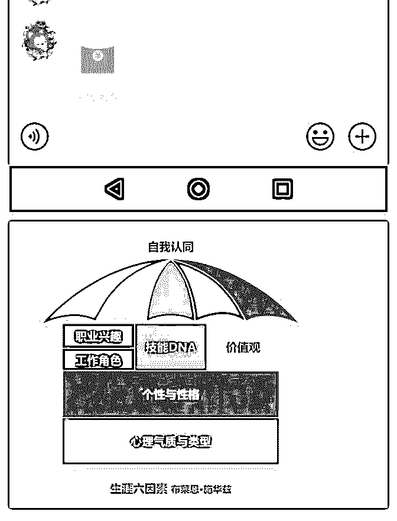

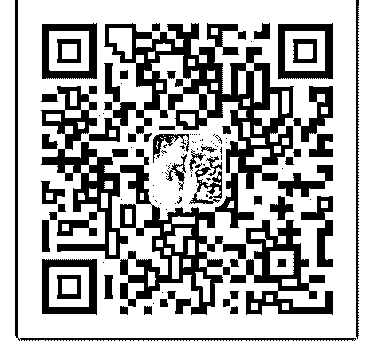

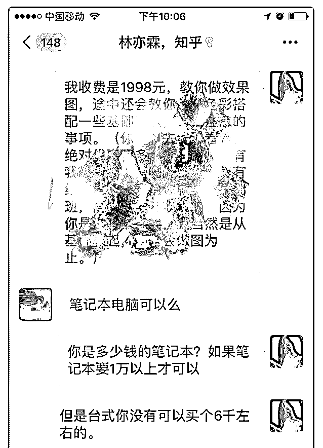

关注公众号"懒人找资源"，星球资源一站式服务

＃庆祝成果＃赚回学 Lavender : ＃庆祝成果＃赚回学费的心路历程 文/萍儿姑娘

泽宇教育，一个改变认知的地方，俗话说思维决定出路，思 维先行，之后再去行动，就会事半功倍，行动是挖掘潜能的 唯一途径。

2.18 加入泽宇，那时候是每周听一节课，复盘两次，两节课 听完以后，在之后把手上理财课程结束以后就开始加快行动 了，三月初始复盘，听课，复盘，听课，去找标签，那时候 看到小伙伴们一个个出成果，有焦虑有迷茫，因为我什么都 还没有，但是我也知道每个人的资源基础经历是不一样的， 成长的速度也是不一样的，有时候慢慢来，比较快，不急不 慌不忙。

3.15 我那时候在学朋友圈美学和自律管理，只是在学习但是 不知道后续怎么所以我带着问题去找答案去找笔盖，笔盖说 边学边输出，用输出倒逼输入，因为这样子能检验自己是否 合适。也因为基础差没有任何的积累，所以我就细细分析了 一下如今的优势和兴趣，找到一个不仅喜欢易学更加容易变 现的那就是美学，是最简单被市场接受的，零基础易理解我 就去往这个方向去做去输出，用输出倒逼输入，找到标签最 好的方式就是向市场检验。

在这之前我都没有去答疑，我想说小伙伴们有问题去找导 师，去向牛逼的人请教，自己一个人闭门造车是会钻牛角尖 的，多问多问，思路就会打开，打开再打开，一切难题就会 游刃而解。

3.22 之后又去找笔盖(我的贵人)，概念验证，发招募令然后 免费咨询，那时候积累不够引流不够所以咨询人数很少，就 非常的难过，当时小伙伴们都安慰我，所以我又去写了复盘 发到核心群里等等，就有很多小伙伴们的咨询，得到了很多 正向反馈，反思做的不够好的就是没有去朋友圈反馈，也一 直在改变。

因此不管做什么，如果得到了回报好的反馈就要去输出，才 能让别人看见你的价值，让自身的价值放大，吸引到别人。

3.23 后来就有很多人咨询，当我和小伙伴在聊天的时候感受 到了他们对我的信任，双手翻飞在手机上， 只差跟他们面对 面讲了，后来又吸引到了两位小伙伴，她们就是(我的贵人)因 为想要深入了解打造朋友圈，按照勾勾(也是我的贵人)在咨询 的时候给我讲的方法给他们深入分析想要去打造背后以后的 原因，然后去输出自己能够提供的价值，他们打造朋友圈的 目的微商，所以朋友圈都要去好好经营，用些美图还有发圈 思路，个人名片，背景页面，如何晒单等等去打造朋友圈。 我的承诺是一对一的指导，给予他们充分保证，最后成交， 所以你们也是我最最大的贵人，真的超级超级感动，置身在 这样一个圈子中，能量就很满满。那么方向是对的，接下来 在一对一指导中把方法改善进步，再去迭代。

还有真心换真心，自身的价值服务远远大于所给予的价格， 给予最好的服务，当学员有疑问时就去解答，在问题中成 长，迭代更新。

之后第三个学员到了 4.3 有个理财群的小伙伴特别同频就看到 了我的朋友圈说你的朋友圈好好看呀，怎么样做的呐，就吸 引了她的注意力，真的很开心能够给别人带来一些感动，然

后我就很真诚的和她讨论和提供服务，她的目的只是想去打 造的美美的又好看的，所以给她看这个课程的大纲，没谈两 句就成交了，因为她也是一个舍得对自己投资的人，因为信 任，所以成交。

4.5 第四个学员是自律群的时候，可能真的是同频，遇见的一 加上来就问朋友圈美学怎么样学，学什么怎么做，我就耐心 的说可以教给你作图，小视频等文案的打造，她就说想学 习，我最后还问了句真的现在你需要嘛？她说是的，所以我 就收下了她，只带想学习的人。搞清楚学习的动机，也不要 去盲报。

当朋友圈进行打造时我们还需要去坚持利他，利他才能利 己，这个是格格告诉我的，我现在也在践行，输出自己的价 值干货，对朋友们做出分享，利他利他利他。当我们没有干 货时就要去制造干货，输出价值。也是因为如此收获了很多 财富能量包感恩红包，很多鼓励很多正能量的话，很多高阶 的思维。

至 4 月 5 日，三个 69+一个 99 还有给很多小伙伴的作图和两篇 复盘的投稿就这样我也赚回了学费累计 400。

还有这句话也同样分享给你们，感悟多多， 爱出者爱返，福 往者福来，财出者财进！

美学之路很漫长，还有其他的领域，也必须要有自己的稀缺 性，差异性，要持续不断地进行自我建设，增加自身的稀缺 性，怀疑比信任的成本更高人和人的差距是认知、信息上的 差距，这两个会把人之间的拉得越来越远。所以得去修炼自 己，提高自己的差异性，向下一步前进。

希望一起共勉，一个从 0-1 小白的变现的心路历程，希望对你

有所启发。

2019-04-15(6 赞)

——来自还是学生的萍儿姑娘

评论区：

荻野 : 你好，可以联系泽宇教育主编荻野在简书投稿推广并且领取 18.88 红包，如没微信，可添加 wx：VStarOne521

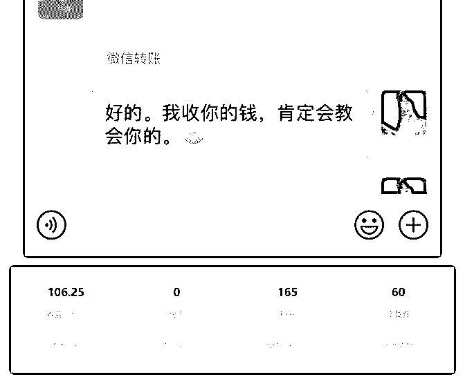

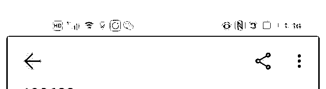

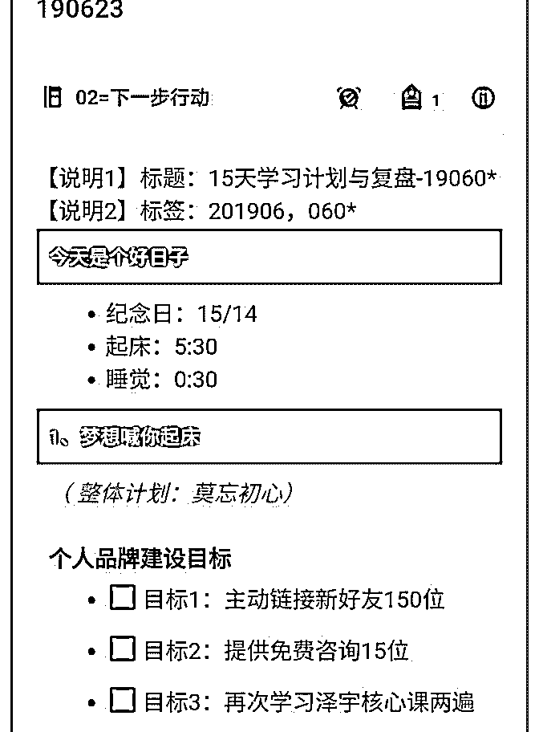

关注公众号"懒人找资源"，星球资源一站式服务

庆祝成果《变现复盘

茉莉香 : 庆祝成果《变现复盘》 说实话我并没有想过自己一个上班族，也能那么快通过改变 认知实现知识变现。实现了从 0 到 1 的飞越。现在实现了从 0 到 2，有了从 0 到 1 那么要想实现从 0 到 100 到 1000 甚至更多就完全 有可能。因为有了 1 说明方向，方法对路了，剩下的就是不断 修正，完美。 先说说怎样获取第一个付费用户的吧！听完了核心课，参加 了一次笔盖的答疑，导师清晰的告诉我： 第一步是要找到标签，怎么找：一句话可以具体描述清楚你 可以解决现实中啥问题，比如：帮助别人练出马甲线。后来 我拟定了“干细胞保”健，“养生减肥”，“品饮普洱茶文化”三个 标签。再次与笔盖联系，她给我的指导意见是，是否是自己 喜欢，擅长，真正能解决问题的领域；是否大众化有大量市 场需求；你的方法是否与众不同。回答完以上问题后，我决 定了养生减肥领域，因为自己曾是个胖子，经过了痛苦的减 肥过程也走过很多弯路，什么吃药，吃产品，疯狂运动，节 食等等我都试过但收效甚微。最后通过自学进修营养学，了 解了减肥的底层逻辑，现在已恢复到很多人羡慕的窈窕身 材。 第二步朋友圈打造，概念验证。在导师的指导下删除了与标 签不相符合的所有内容，然后我利用两周的时间重新打造了 朋友圈。怎么打造：学了一点朋友圈美学，做了艺术二维 码，持续输出与标签相符又是普通人不知道的瘦身知识。发 布了招募令获取了第一批免费用户并做好服务，当我看到免 费学员取得了很好的减肥效果后，我知道我的方法是可行的 是确实能解决问题的，于是我完成了概念验证。这下我坚定 了做这个标签的决心。我把用户反馈在朋友圈发布，继续输 出价值。后来老师说我案例积累还不够，我就开始在星球和 群里活跃，输出价值，当天就有了客户主动加我咨询，紧接

着我把自己与众不同的方法特别是不反弹的原理体系化告诉 顾客，可是客户犹豫徘徊了，当时我不知所措，幸好及时和 笔盖取得联系，她给了我定价和谈判的建议，也突然想起老 师教的让客户收到高于价格价值的礼物的小技巧。于是我承 诺送给客户一个价值高于咨询价格的手册，她很快就下单 了！晚上和客户约了一对一，认真的给予了指导，拉她进了 自己建的减肥群，继续辅导好她达到理想体重。这就是我第 一个付费客户。 第三步持续增加弱连接，过去我是很讨厌加不认识的人为好 友的，但听课之后完全改变了我的认知，我不但不拒绝陌生 人更是主动添加陌生人。我去自己以前进过的群，知识星球 等去增加弱连接，因为你永远不知道谁将会是你的贵人，谁 将会是你的客户，短短不到一个月，朋友基数翻了一倍，而 就在这些人当中产生了我的第二个付费用户。 事物发展规律就是这样有了一就会有二有三甚至更多。没过 多久就又有人来咨询，我当时还没学完百万营销课程，于是 我随意与客户聊的，完全没有按什么套路话术，结果可以想 像就是没有成交。这时候我赶紧联系了助教。她帮我看了聊 天记录，笔盖助教一针见血的指出了我完全没有按百万营销 话术来经营客户的问题，还有积累不够的问题。我才意识到 应该尽快学完课程，再积累一些低价用户，再涨价。于是我 赶快抽时间初学了百万营销，但领会不深刻，也没有总结出 自己的一套话术。紧接着又有人来咨询，这一次我很重视， 拿出自己学习笔记，看着提示的每个步骤与客人聊天，很快 她就下单了。当时我很惊奇这个百万营销话术真是神奇，回 过头来看第一次成交聊天记录，原来第一次成交的聊天是鬼 使神差巧合的符合百万营销话术步骤所以成交了。 以上是我从 0 到 1 到 2 的过程，总结反思一下，听课是前提，是 基础，泽宇教育的课程初学不觉有什么牛逼，但当你真正按 步骤实践后你会发现它的伟大。最想说的是导师辅导，他们 不但能帮助出谋划策，修正方向的，更重要的是能扶持你让 你走的更稳，更远。但如果不听课不改变认知，不按课程付

出实践作出改变，那一切都是空谈。只要听话照做，不断训 练，变现那是迟早的事。 接下来要做的就是好好服务现有客户，获取更多口碑和好 评，同时继续精进营养学专业知识更好的输出价值。狠狠磨 练百万营销话术，总结出一套实用技巧并请导师帮忙指导！ 在实战中不断改进，争取收获更多用户。

我是健康养生减肥咨询师，坚决抵制节食，卖产品，打针， 吃药等减肥方法，倡导科学合理饮食达到健康减肥不反弹的 效果！如果你有需要我很愿意教会你如何好好吃饭，做好体 重管理，健康享瘦一生！期待链接优秀的你！

2019-04-15(14 赞)

评论区：

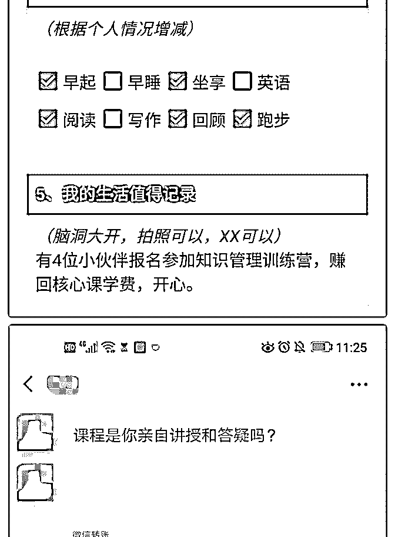

荻野 : 你好，可以联系泽宇教育主编荻野在简书投稿推广并且领取 18.88 红包，如没微信，可添加 wx：VStarOne521

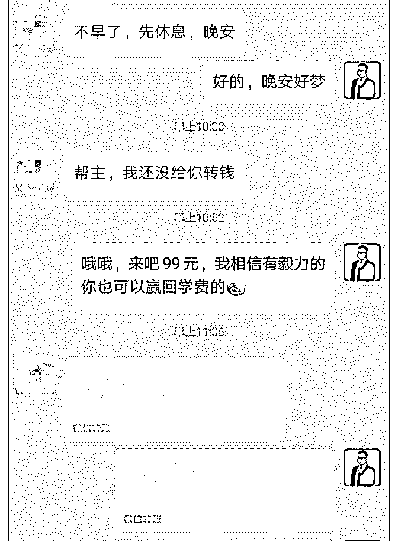

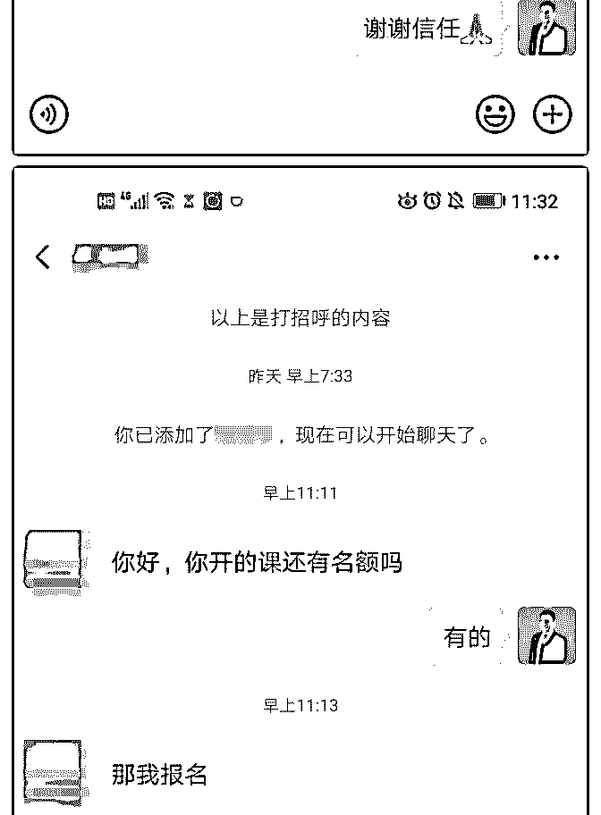

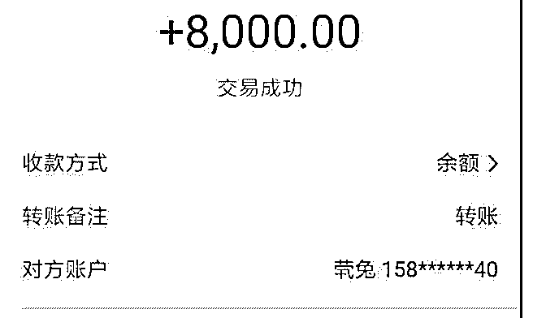

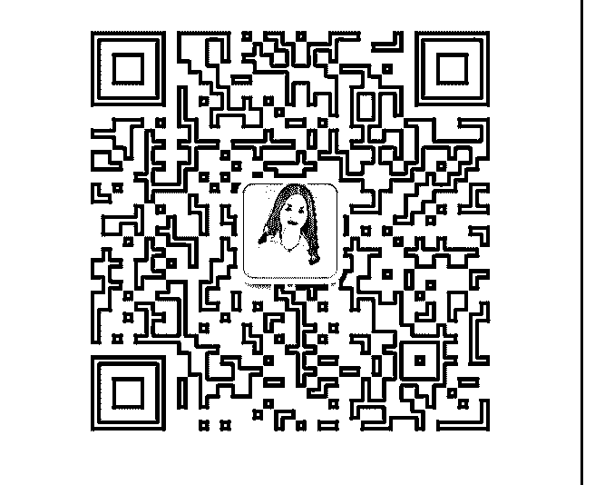

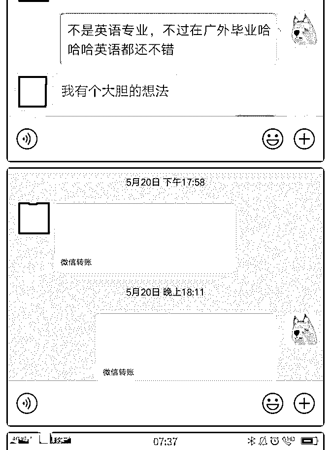

关注公众号"懒人找资源"，星球资源一站式服务

从 0-1 从 1 到 2

光年 : 从 0-1 从 1 到 2 从 2 到多 副业 0 元到两个 999 元 变现的故事

从 0 到 1 我加入泽宇教育有很长时间了，大概加入的时间是 2018 年 5 月，但是一直没有很大的突破。 看到群里不停有人晒红包，自己默默地不敢说话。

一直想业余收入过万，可是怎么也不知道如何下手，不知道 自己做什么。这期间，我不止一次想要放弃，我在找个人定 位的时候遇到了很多问题，不知道自己擅长什么。画画是我 一直很喜欢的，但是我做了一段时间，发现并没有人来咨询 或者是跟我学习。然后发现变现是一个很大的难题。后来我 又去做了穿搭，本想跟朋友一块儿做穿搭咨询，还没做起 来，我们就散伙了。然后，我就遇到了【之一】和【菡 冰】，请他们给我免费做了一些跟定位有关的咨询，我明确 了自己要做手绘，不能再摇摆不定了！然后持续发朋友圈。 先给人免费画图，收到过一个卡通头像也不过是 29.9 元

3 月 12 号那天我遇到了【沁心】，她很用心地帮我梳理了自己 的问题。有什么问题，我随时请教她，她每天像打了鸡血一 样……她问我自己遇到的什么问题，然后一起研究解决，开 始我不知道怎么教人家讲课，【沁心】说这些都可以灵活运 用，先教一个人，带出结果来。既然是 1 个人，可以一对一， 直接视频教，自己要做好教案，在教案的问题上，我们也事 先做过预演。发现准备工作还是直接文案好，不用放在第一 节课。第一节一定要让人觉得值，赚到了。我马上调整方 案，第二天就写好了文案，发给了学员。跟他沟通了，问了 他自己想学的课程，然后，发现这跟我想的有很大出入。他 最想学的是几何结构、动物素描、场景素描、人物素描。我 说了可以调整方案，就按着他最想学的教，他最终付款了。

我觉得最高兴的不是多少钱，而是自己能给人提供多大价 值，一定要让他觉得物超所值。我对看不见的事，不太容易 相信，也不是特别积极的感觉，觉得赚钱是离我很遥远的事 情。今天终于有了一个新的突破，新的开始！加油，光 年！！！

从 1 到 2 我想做萌手绘，针对 7 岁以上的孩子还有针对 0 基础的宝妈、 有一颗童心的成人，我决定开这个训练营，大家聚在一起， 一起学习，相互交流，之所以要做萌手绘，我觉得这种画有 种治愈的能力，能让你忘掉烦恼，心情变好，当你有这种能 力，就可以面对一切了，问题不再是问题了。 我每天发自己的萌手绘，一天一幅画，制作持续吸引力，有 人点赞，也有人咨询，这更加坚定了我的信心。

4 月 1 日 我写了详细的计划，找一个在留言下说要报名我的客 户去谈，她问的最多的是上课的形式，和时间，对我怎么教 倒没有特别的问题，把她的问题一一解答了，然后还说现在 报名送创意课程，她自然就报名了,这点可以看出来是对我的 信任，我心情还是很激动，这是一种新的开始，我要教小孩 子学画画，如果这个打通了，以后孩子找我学的会很多。

第一个客户是成人素描，第二个客户是儿童萌手绘，这两个 方向都走通了，以后会有很多客户。

从 2 到多 我决定建一个光年 365 天绘画日更营，我发现坚持是最简单， 也是最难的事。买了再多的课程，不画也是零，自己闭门造 车是不可取的，要跟厉害的人多接触，提高自己的认知。 一个人会走的很累，一群人会走的很远。这里让我们重新出 发。

这就是我做个人品牌的故事！

2019-04-15(12 赞)

评论区：

荻野 : 你好，可以联系泽宇教育主编荻野在简书投稿推广并且领取 18.88 红包，如没微信，可添加 wx：VStarOne521

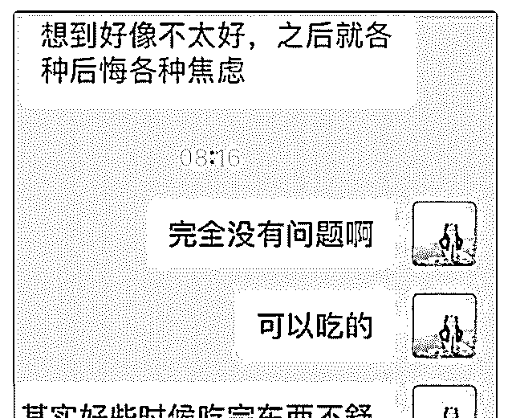

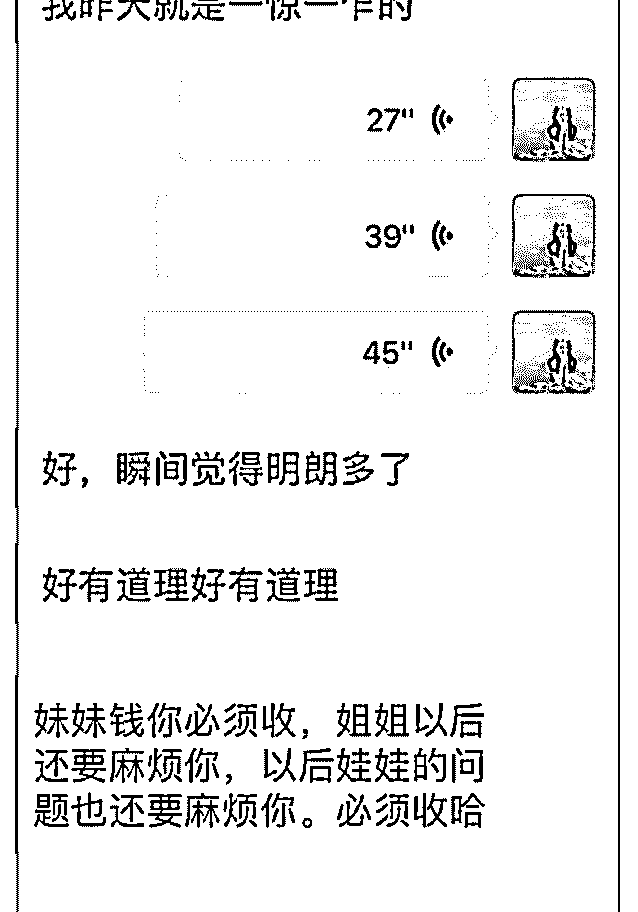

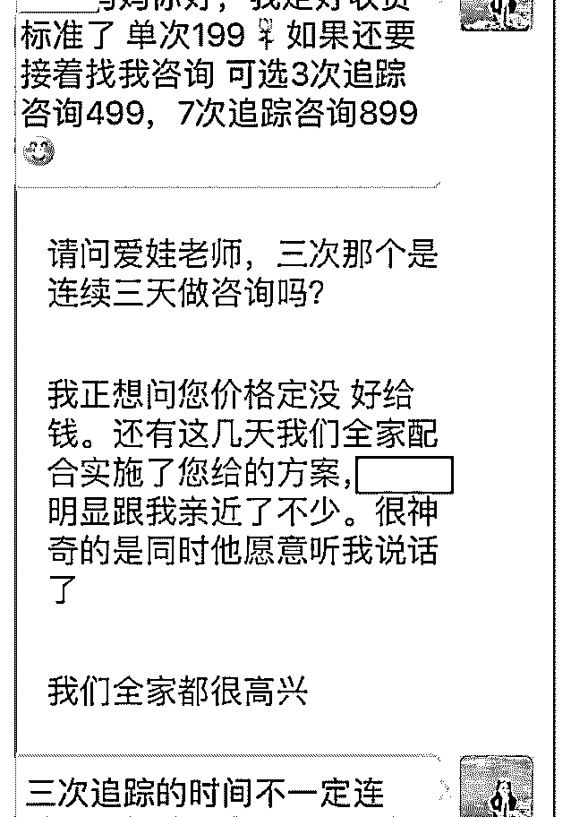

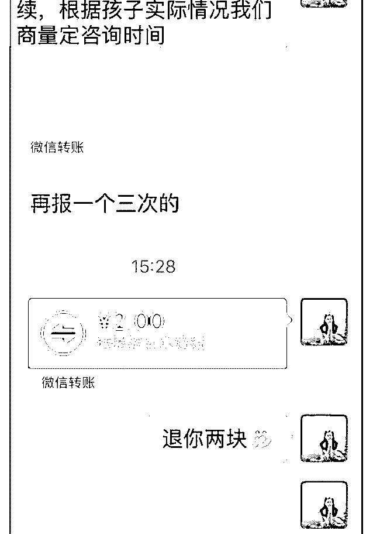

关注公众号"懒人找资源"，星球资源一站式服务

【一天时间从“名字

雅雅 : 【一天时间从“名字都没想好”到“3 倍赚回学费”】 大家好，我是雅雅，是一名身心整合疗愈师，专注身心整体

健康 3 年，以前是给我的老师做课堂助教。加入泽宇家庭已经 有半个月了。报名前很激动，想着一报名肯定能很快就学

完，早早赚回学费。没想到，一开始就遇到了自己的心魔。

在报名后，笔盖助教邀请进群，我从下午拖到了晚上，因为 写不出来进群的自我介绍，最后简单几句拼凑了事。

开始听课也遇到问题，连自己要用哪个名字都确定不下来， 完不成练习，也不想写复盘。泽宇说课程不要跳着听，要一 课课完成。然后我就卡壳了，序言听了 2、3 遍，第一课听了 4、5 遍。但就是一点进展都没有，默默羡慕的看着大家的学 习成长，也不敢问助教，觉得这是自己的问题，其实是自我 设限啦。

终于在昨天遇到熟人约我咨询，鼓起勇气问笔盖助教要不要 提钱，该怎么提钱？在笔盖的帮助下，指出我的问题，确定 了报价，迈出了一大步，一切都开始转起来了的感觉。还意 外的进入了重点群，太开心了！

好的开端真的是成功的一半，当我有了收钱的底气，就有一 位做了我身心整合的朋友，主动转了 520 元感谢我。本来是没 打算收这位朋友钱的。

当天在笔盖助教的建议下，用两张反馈图第一次发了自己在 干嘛的朋友圈，昭告天下我能提供的价值。也是这个朋友圈 又给我带来了三个咨询预约，还有一些没想到的朋友也点赞

了。

一天时间一共收款 885 元。收到钱，也是我能力被认可的一种 体现，自己也很有价值感。

重要的是，我终于突破自我设限，行动起来了！最大的感触 就是先行动，用行动带动计划。撬动一个点，整体就推动起 来啦！

虽然我已经赚回学费了，但我还有很多需要改进的地方。继 续好好听课努力学习！感恩笔盖助教的专业指导，和同学们 的陪伴。2019.04.02

2019-04-15(6 赞)

评论区：

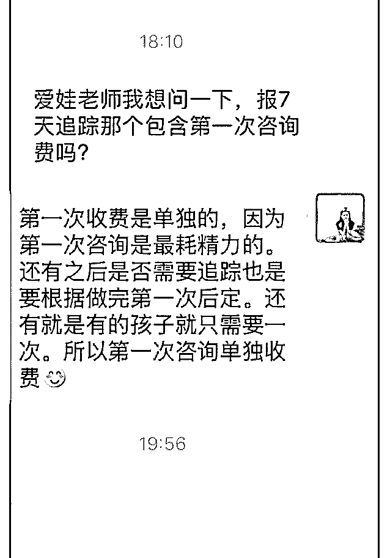

荻野 : 你好，可以联系泽宇教育主编荻野在简书投稿推广并且领取 18.88 红包，如没微信，可添加 wx：VStarOne521

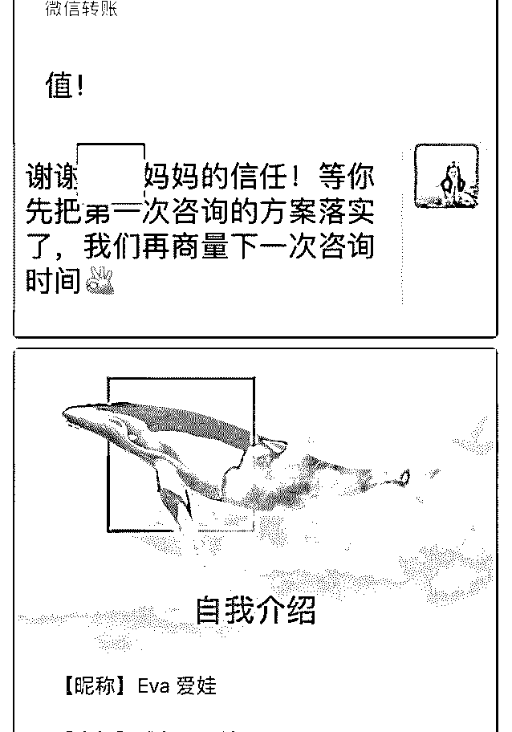

