# #庆祝成果#4 月 7

4 月 7 日也就是昨天我收了第一位朋友圈美学研习社的学员， 收费 19.9。这是我准备美学变现的第二天。

先讲讲我的故事吧。 不记得在哪加了牛肉的微信，她的自我介绍很吸引人，于是

我加入她的美学训练营，开始学朋友圈美学。牛肉的课程内

容很丰富，包括朋友圈打造、配色原则、以及各种修图软件

的使用，学习过程中我学会一些软件的使用、美图的制作，

还帮裴先生做了一张工作海报，听说老板还推荐给他其他同

事使用，感觉很开心。这时我也有了美学变现的念头，但是

有很多困惑:1.训练营的小伙伴们经常发的精美底图是怎么制 作的，2.总在被安利新的软件，有好多我并不会，3.多数软件 我只会几个功能并不精通，4.就我掌握的这些东西，录个小视 频就能说清图片怎么做的，那课程核心是什么呢。总之就是 觉得困难多多，还没准备好，还不能开始。

4 月 6 号出现了转折。牛肉拉了个美学变现指导群，我开始思 考是什么阻止我开课；我在 FM 训练营给自己立了个 Flag:周末 我要在群里开一次朋友圈美学课；我在星文案训练班发了一 张晒单图，被动引流 6 人，教了燕子一些美易使用技巧，收到 一个她的红包。包含但不局限于上述理由，我开始思考自己 的课程体系，并列了大纲，写完后发现怎么核心内容还是教 各种 app 的使用呢！

图片发自简书 App 晚上躺在床上，在浏览器中搜索#朋友圈美学#，搜到筱筱老

师的简书文章，然后在简书中搜索，看了一系列文章，美学 变现的伙伴很多，当然很多都是筱筱的学员，于是加了筱筱 微信。半夜把筱筱的朋友圈翻到了 18 年 10 月，试图寻找她是 如何通过朋友圈美学形成个人品牌的，也许她的成功是幸存 者偏差呢，个人经验的积累我能成功复制吗。从筱筱的朋友 圈中可以看出跟她学美学的学员很多实现了变现，开始自己 的课，这很诱惑我，我也想通过美学变现。

4 月 7 号跟筱筱沟通后，购买了个人品牌课程，开启泽宇 2.0 的 学习，同时进了她的美学训练营。

上午在 Coco 的指导下，我梳理出第一份自我介绍，这个过程 并不轻松，个人经历写的很不好意思，因为没有什么成绩。 下午，燕子评论我的朋友圈，问我要美学素材，在筱筱的鼓 励下我跟她谈了自己想开课的想法，她表示理解并想参加。 可是我的课程还没有内容啊，还只是个想法啊，怎么办，硬 着头皮上吧。跟燕子直言，课程还在摸索阶段，现在加入可 以一对一指导，于是这个姑娘成为我的第一个学员。当晚我 们上了第一次课:如何设计自己专属的二维码。

图片发自简书 App 在这个过程中，收获很多:

1.不要等准备好了才开始，最好的行动就是马上做

2.不要对自己设限，不要说我做不好、做不到，常常思考我怎 么才能做到

3.敢于输出，学到新知识怎样才能内化成自己的，就是输出

4.教是最好的学。

2019-04-13(7 赞)

评论区：

微成长|高效阅读 : 恭喜哈，一旦突破零，相信成长起来会超出自己的想象[强][强][强]

荻野 : 你好，可以联系泽宇教育主编荻野在简书投稿推广并且领取 18.88 红包，如没微信，可添加 wx：VStarOne521

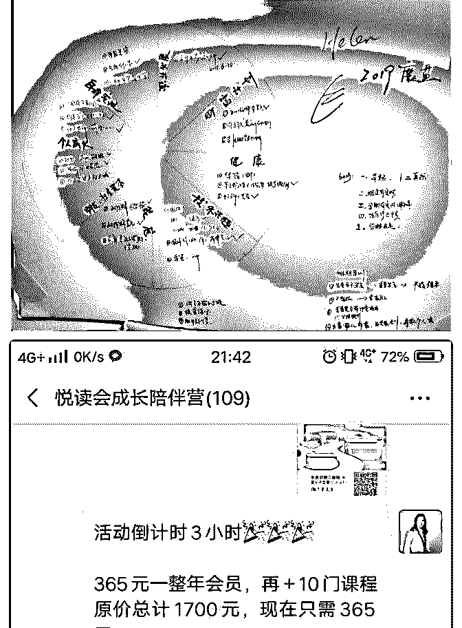

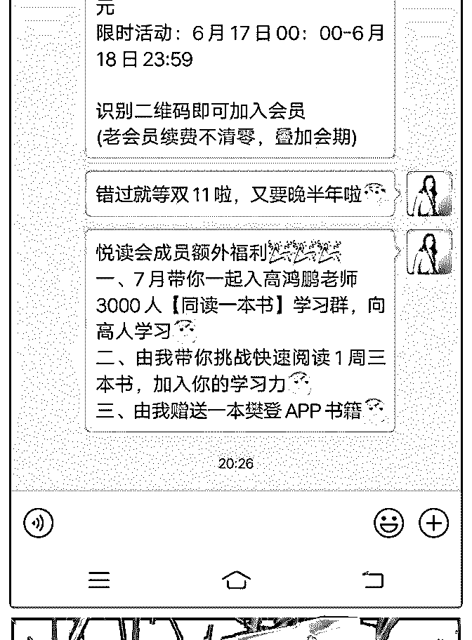

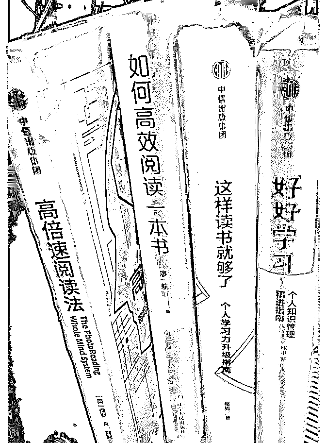

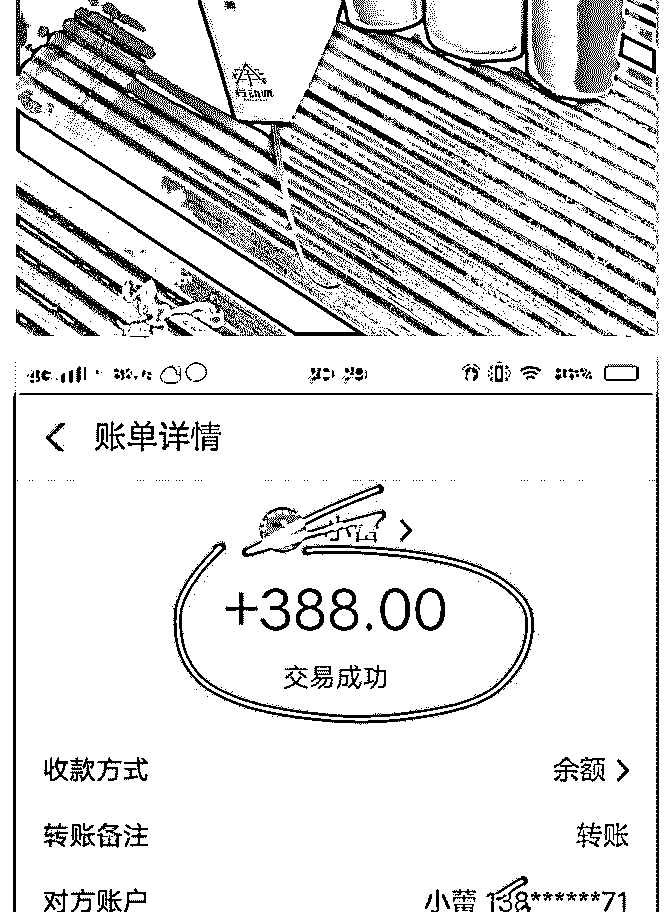

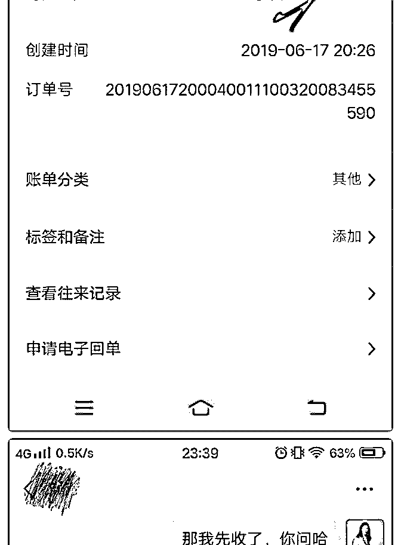

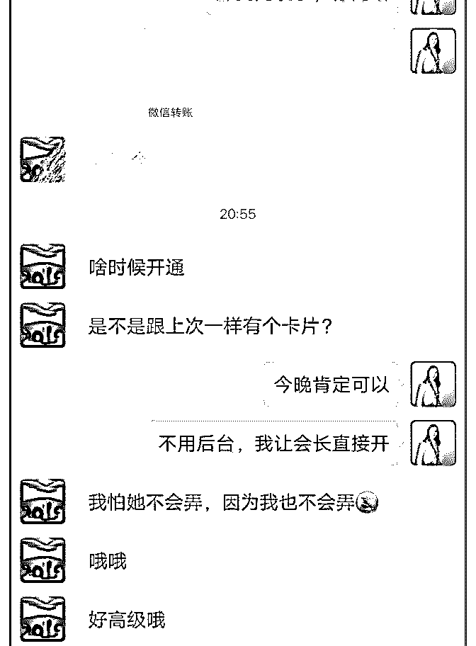

莫曦 :

关注公众号"懒人找资源"，星球资源一站式服务

零收入全职妈妈，如

零收入全职妈妈，如何逆袭为月入 30000，加入泽宇 7 天变现

7000。

大家好，我是莫曦，三岁萌宝妈，国家认证心理咨询师，高 级萨提亚家庭治疗师，国内最大心理咨询 App 家庭情感导师， 线下教育机构心理咨询顾问及培训师。

2019 年 2 月份，我身上又多了一个标签——【心咨师孵化计 划】发起人。我的梦想是帮助更多的心理学爱好者，实现自 我完善、家庭幸福，副业收入大于主业，最终实现职业自由 和心灵自由，未来一起实现财富自由。

01 一路平坦 回想过去的成长岁月，仿佛冥冥之中，每到人生的一个重要

转折点，总有贵人相助。

学生时代，特别有老师缘，初中 高中 大学都有一位恩师，在 我遭遇生活学习上的挫折时，给我金玉良言的指引；

考研时，托了贵人的福，我成为那一届唯一纳入导师门下的 学生；

工作以后，托贵人的福，进入当地一家老牌企业，虽说薪资 不高，但对于那时候追求朝九晚五、安逸生活的我，已经超 级满足。以上是现实版遇贵人。

02 跌宕迷茫

如果说这篇文章的标题是《我的前半生》，那么按照与这部 电视剧相同的开篇，应该从这里开始。接着往下看……

婚后不久，为了陪伴孩子的成长（当然也有部分原因是当时 正经历公司裁员，我也在裁员名单上），于是我正式成为一 名全职妈妈。

跟所有全职妈妈的生活一样，每天看起来无所事事，就像有 些男人说的“不就带个娃么”（这句话已经被全职妈妈吐槽无 数次了）。事实情况是，真的忙到连上大号的时间都没有， 至于都在忙什么？一个人带过娃的全职妈妈都懂得，这里不 多解释。好奇的话私信我，我会给你罗列一长串育儿事项和 家务杂事的事项给你。

当然，全职妈妈的辛苦并不在那些看不见的琐碎的事情上， 而是在于家庭关系的纠葛。婆媳矛盾自然不能幸免，就算生 娃前以前再怎么亲如母女，住到一起时间久了照样产生摩 擦；而且婆媳和夫妻关系相互影响，中国的男人能处理好婆 媳关系得少之又少，要么是掺和到里面和稀泥，要么就是站 到母亲那边一起指责自己的妻子，结果导致三角关系更加复 杂更加恶劣。

03 人生重启

2016 年 12 月份，偶尔在朋友圈看到 Angie 老师的时间管理训练 营，第一次接触时间管理的概念，那时候 Angie 老师的训练营 价格才 299 元，现在已经涨到几千块。我果断报了名，从此走 上了自律成长的道路。所以我认为 Angie 老师，是我线上社交 圈的第一位贵人，如果没有遇见她，或许我还是一个每天围 着孩子转、没有工作、没有爱好、没有收入全职妈妈。

正是因为建立了自律的生活，我才能靠着一年的坚持自学考 取国家心理咨询师，又凭借着一年的坚持，多次辛苦往返北 京去接受萨提亚家庭心理治疗技术的系统培训。在这两年 中，随着我的咨询经验的积累，我的个案咨费从 0 元、39 元、 69 元、199、399、499……一直到 849 元、2999 元、6340 元。

第二个贵人是石蓉蓉老师，记得第一次与蓉蓉老师相遇，是 在 2018 年 6 月份在价值变现研习社里，当与她产生链接时，我 被她的能量场所震撼。

2018 年 8 月研习社举办创意交易游戏比赛，蓉蓉老师凭借她超 强的执行力、变现力、影响力在当月稳居变现第一名。我也 跟她学习了五彩性格卡牌技术，一秒读懂人心，非常有趣， 也亲身感受了他的社群商业变现模式。

自 2019 年开始，我发现蓉蓉老师的朋友圈开始天天晒收款红 包，财富能量越来越大，而且朋友圈的版面和风格更加高大 上了。我心想蓉蓉老师的商业模式越来越厉害了，不过我还 不是能看得明白。

04 奇点元年

2019 年 2 月份，再一次有朋友来问我如何入行心理咨询领域， 我瞬间萌发了一个念头，既然这么多人想要学习心理学，那 我何不把自己学到的咨询技术教会他们。因为我知道线下动 辄两三万起步的培训费，还不包含多次往返外地的机票住宿 费等，对大多数人来说是望而却步的。

2019 年 2 月 14 日情人节当天，我做了一个决定，开办一个线上 的萨提亚家庭心咨师的培训计划。在冷启动、0 资源、0 人 脉、没有课程大纲、没有任何课程信息的情况下，简简单单 做了一张海报发到朋友圈，二十多天时间收入 23000＋。这里

也要感谢朋友圈的大力支持，很多朋友是第一时间盲报，因 为信任。

但是，之后我发现再想招生就很难，因为我的好友一共才 1500 人左右，该报名的精准客户已经报名了。那么再想吸纳 学员就步履维艰。

期间有一次蓉蓉老师主动来找到我，说看到我现在赚钱太辛 苦，可以罩我带我一起飞。我当时是拒绝的，一来是因为近 期刚刚缴纳了两笔资金在线上和线下培训上，预算超支；二 来，我想蓉蓉老师前期有投资行业的资源、人脉、背景，她 能走到今天是自然的，我总觉得即使我加入了 她的学习圈， 我也不会达到像她那样的效果，这里其实是一种自我设限。 现在想来是有眼不识泰山啊。

2019 年 3 月的一天，我偶然在蓉蓉老师的社群里，记录了她自 己一步步从月入四千块一直到现在月入几十万的成长经历。 我明白了她走到今天，也不是完全因为前期有很多资源和人 脉，而是加入了新的高端商业圈子，我瞬间非常心动。这不 就是我要找的吗？于是，我主动联系了蓉蓉老师，让她帮我 引荐，后来证明我的选择是对的。

05 裂变重生 加入泽宇老师的课程之后，我发现里面果然都是牛人，30 天

变现 1300 万，一小时变现 10 万……等等，我顿时觉得这里面

是一个超级强大的财富能量场，而且也是一个超高质量的同

频圈子。这里没有浮夸的口号和洗脑，大家每天都在认真听

课、复盘、践行、一起庆祝变现的成果。

我开始从第一课开始听，听了核心课之后，我发现宇哥果然 是同频之人，他的商业思维里很多的理念特别符合萨提亚心

理学，比如：“自我设限”，相当于萨提亚里面的毒性教 条，“程序人生”，则是转化不合理限制性认知、观点和信 念。“人格设计”，则是关于如何建立高自我价值感。看来一 切的商业，都离不开对人性和心理的剖析，不管是商业者本 身，还是客户。

我听了核心课就开始落地实践，没想到真的很有效，我只是 把一篇自我介绍发到社群里，几天之内源源不断有新的好友 添加，每天都会成交一单。加入 7 天以来，已经变现 7000，平 均一天 1000。这对进入变现瓶颈期的我来说，已经是很不错 的成绩，迎来了商业变现的又一春。

目前泽宇老师的课我还没听完，真正厉害的聚星会课程开没 开始，但是我相信听完后一定威力无穷。

我从没想过一个曾经朝九晚五拿着 4000 死工资的人，一位产 后失业零收入全职妈妈，能够实现月入三万，而且还是在不 需要早起晚归和风吹雨打得上班的情况下。这完全颠覆了我 对于金钱的认知！

06 感悟 我一直有个限制性信念是，金钱的获得一定要经历非常辛苦

的过程，而且必须是一步一步小步提升。但是在现在这个时

代，科技和商业模式变化如此之快，只要你跟上了时代，你

会发现赚钱其实是一件很轻松的事情，关键要学会两件事：

一是学会剖析人性，二是学会新的商业思维和方法。

通过这段成长经历，我还学会了一个非常重要的道理：要始 终感恩引荐你进入一个高端圈子的人，因为你们没有血缘关 系，你成不成长、成不成功、牛不牛逼、赚不赚钱、幸不幸 福，跟他没有任何关系。他愿意珍惜你们的缘分，所以 ta 毫不 吝啬把自己的圈子分享给你。

接近什么样的人，就会走什么样的路。穷人只会教你节衣缩 食，成功的人却会教你投资自己取得成功。人生最大的运 气，就是有人可以带你走向更高的圈层。

世界之大，人海茫茫，能链接到一起，是一种缘分。请好好 珍惜你身边这样对你的人。

2019 年，心怀感恩，继续前行❤

我是莫曦，2019 年专注于孵化家庭心理流派的咨询师，帮助 心理学爱好者实现自我完善、家庭幸福和职业自由，未来一 起实现财富自由。

目前【心咨师成长计划】正在启动中。期待与同频的你产生 能量的共振和链接，未来一起创造财富和幸福❤

2019-04-13(10 赞)

评论区：

Miss fu : 你们文案功底好好啊，感觉心里有万字奔腾，写不出来啊

莫曦 : 哈 我上学的时候最头疼就是写作文。有没有发现我的文章没有华丽的辞藻，全都是白话，记录真实的故事和感受

麦田 : 我希望可以链接到这么会写文章，又是怎么厉害的心理咨询师。 举手大喊 请链接

莫曦 : 哈哈！来来来，链接起来

麦田 : 微信链接中[耶]

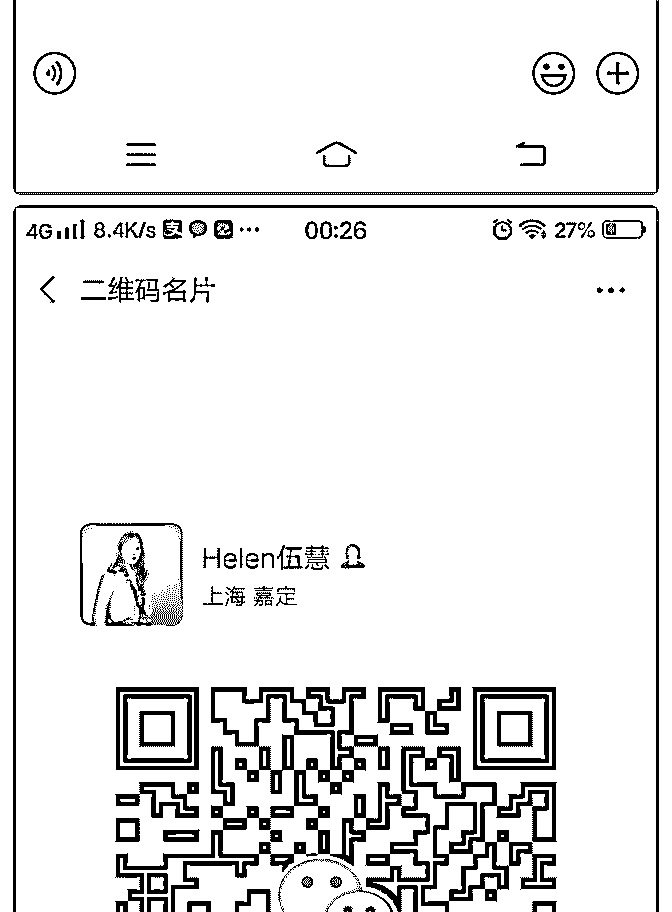

荻野 : 你好，可以联系泽宇教育主编荻野在简书投稿推广并且领取 18.88 红包，如没微信，可添加 wx：VStarOne521

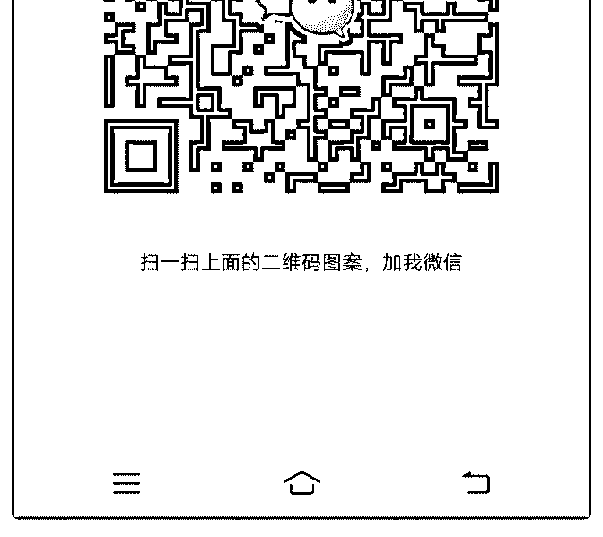

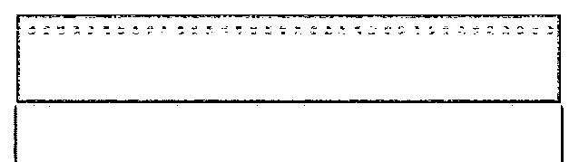

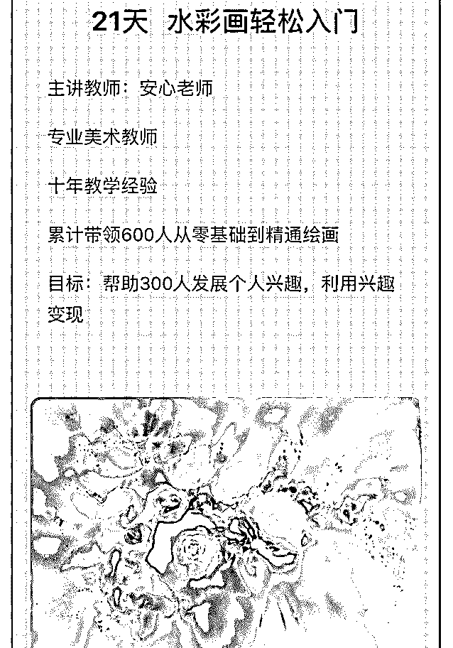

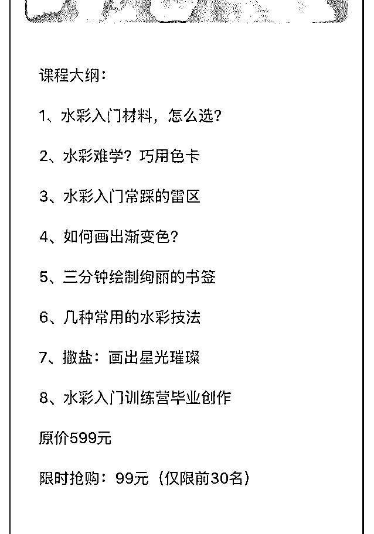

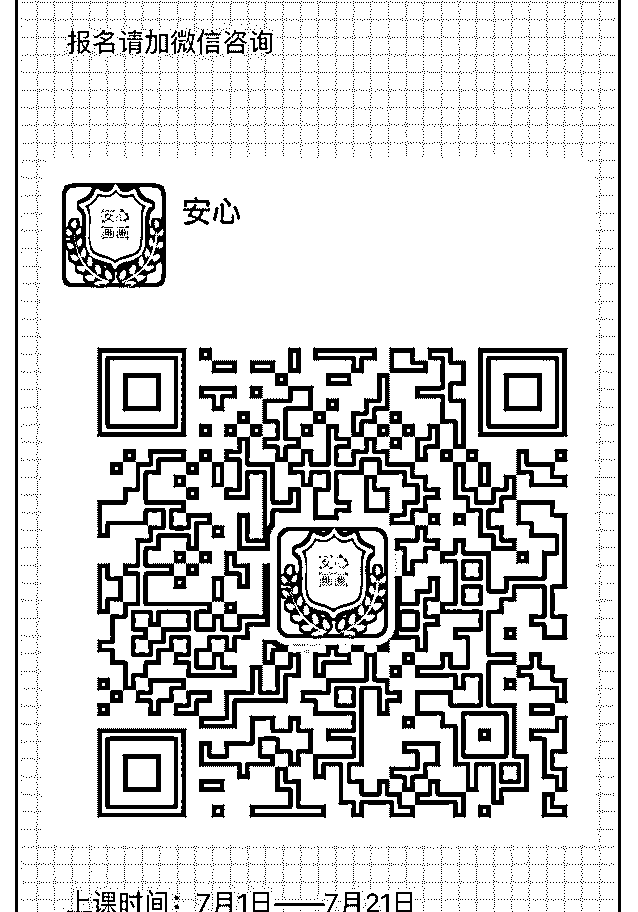

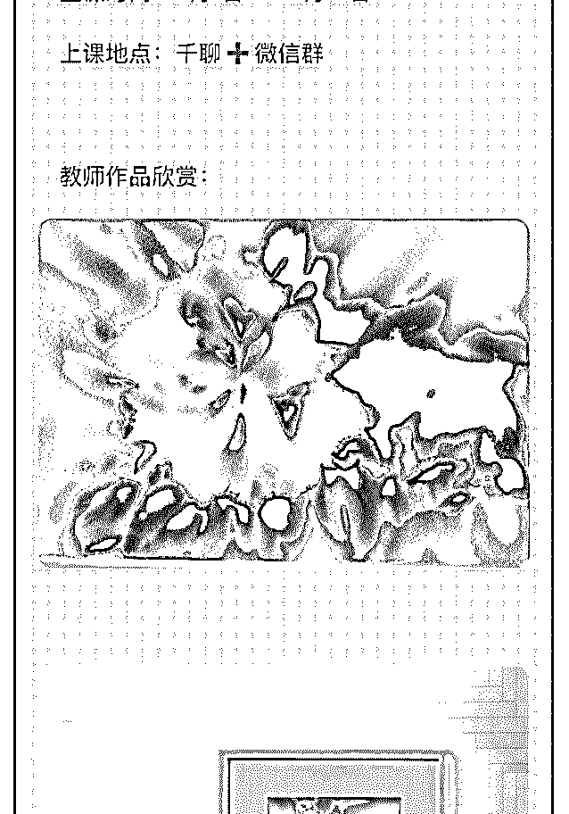

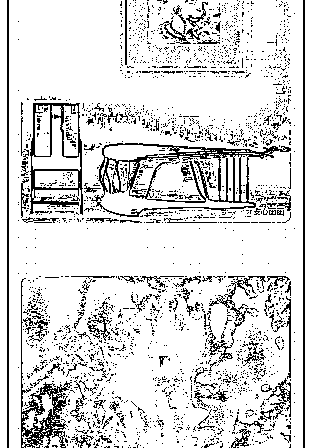

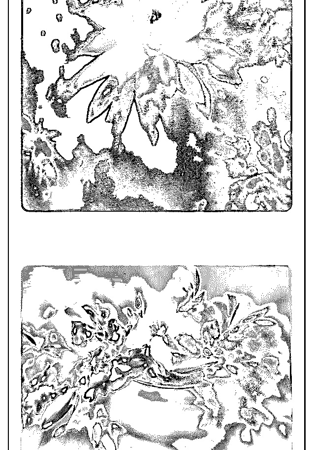

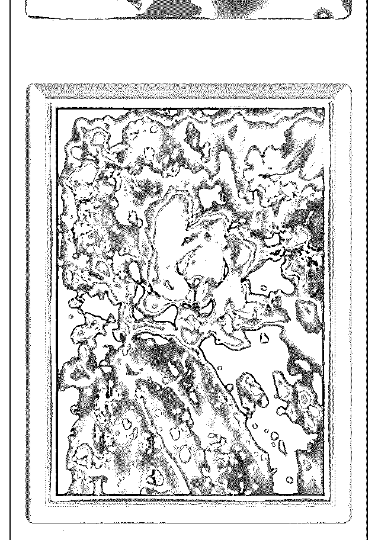

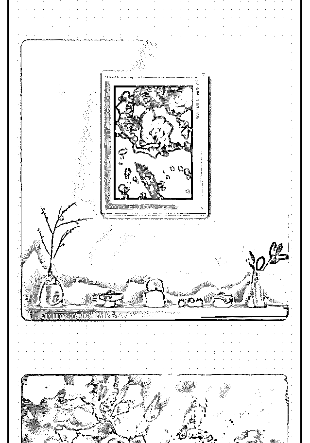

关注公众号"懒人找资源"，星球资源一站式服务

加入泽宇教育第 65

沁心｜情感咨询 : 加入泽宇教育第 65 天，累计变现：4460 元， 赚回导师计划学费！

我是 2019 年 2 月 6 号付费，2 月 7 号正式加入泽宇教育的。3 月 13 号，我收了第一个学员。目前，学员 4 人！

【一】 3 月 19 号我帮她收了第一个学员，4 月 1 号帮她收了第二个学 员，她累计变现 999+999 元。

我对她的一对一指导，包括：

①指导课程设置，课程打磨。

②指导定价和成交话术。

③下达明确的指令，告诉她每一步怎么执行。

④跟踪，监督；发现问题，给出针对性解决方案。

⑤朋友圈文案指导。

⑥指导撰写高价值自我介绍。

⑦指导写出高价值复盘。

……

【二】 第 2 个学员，按我的指导和方案，正专注于打造自己的抖音。

第 4 个学员，是之前退费的，现在又重新来做我学员。因为之 前，觉得我节奏太快，怕自己跟不上。现在再次付费，并不 急着赚钱，只是希望我陪伴她慢慢成长！

【三】 第 3 个学员，从 0 学员，0 收入，到昨晚已经 9 个付费学员。累

计收入：

99+99+99+99+99+99+99+99+99 元

我对他的一对一指导，是以疗愈他为前提：

①帮他分析卡在瓶颈、原地踏步，没有进展的根本原因。然

后，给出方向和解决方案！在认识我的第 8 天，他收到第一个 付费用户，首单变现 99 元。

②帮他修改文案，教他怎么发朋友圈。

③一句一句教他成交话术，引出成交环节，让用户心甘情愿

付费。

④我每次为他布置任务，都指令明确，他只要“听话照做”， 效果都是立竿见影的！

……

【四】感悟总结

①带学员，以结果为导向。

②布置任务，指令明确，避免学员出现茫然无措的状态！

③跟踪、督促、监督和指导，紧密结合。

④识别、找到，并靠近我自己的贵人，努力和她发生深度链

接。

⑤常怀感恩的心，让自己活在爱里：

感谢小玉老师在我低频时，一次次及时出现，为我赋能；感

谢冰瑶老师为我想到特别适合我的新标签——【爱成长能量 导师】。

同时，还要感谢我【疗愈成交销冠班】的同学们，一次次给 了我感动和灵感！

最后，要特别特别感谢的，是我的销冠教练｜小公主，她给 了我超多能量和自信，她的每一句话都能给我思路和灵感， 让我把朋友圈做到温暖有爱，用爱成交、去成就他人……

如果你也想结识我所提到的贵人，我很乐意为你牵线搭桥。 如果你也想做我的学员，我一定倾囊相授，带你飞！

我是沁心，专注个人成长，擅长营销策划、被动引流和定位 分析，靠近我的你，一定会→心中有爱会赚钱！

2019-04-12(3 赞)

评论区：

荻野 : 你好，可以联系泽宇教育主编荻野在简书投稿推广并且领取 18.88 红包，如没微信，可添加 wx：VStarOne521 沁心｜情感咨询 : 谢谢主编的认可！4 月中旬已在简书投稿【泽宇教育】专题，审核已通过，已领红包！再次感谢！ 荻野 : 好的，其他好的复盘也可投稿

沁心｜情感咨询 : 好嘞！

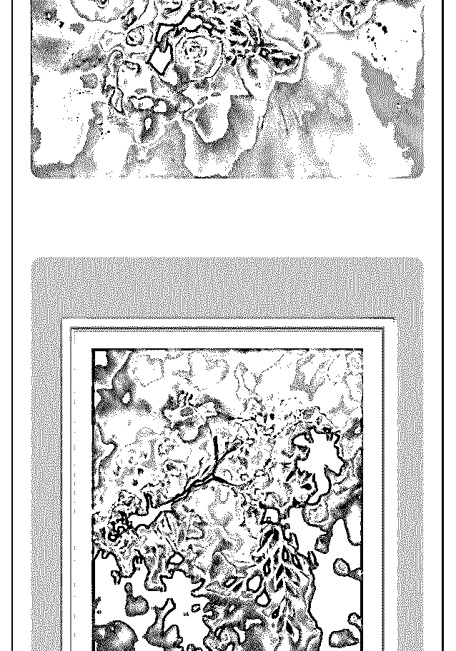

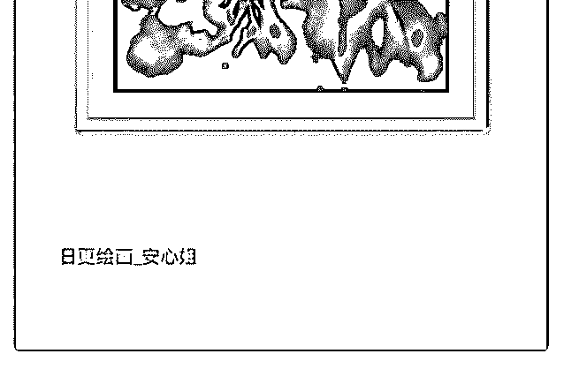

关注公众号"懒人找资源"，星球资源一站式服务

【庆祝成果】一次朋

200-BruceL* : 【庆祝成果】 一次朋友圈招募，2 个小时变现 2500。

去年就加入了泽宇核心课，看到社群内的小伙伴飞速成长， 不断晒出自己的进步，内心很是焦虑。一直犹豫不决，对于 自己的定位非常迷茫，不知道自己能做什么，兴趣爱好很 多，幻想成为一个斜杠青年，想把某个兴趣作为自己的定 位。

后来咨询波力老师，确定了自己的定位。把积累最多，已经 变现过的数学教育作为自己的定位，因为我发现在跟学生讲 奥数题的时候，学生对于我的讲解比较认可，觉得一听就 懂。重要的一点是定位是可以随着阶段的不同而改变的，泽 宇以前是做穿搭，后来做社交，现在做个人品牌。先把最有 可能成功的方向作为自己的定位，作出成果后也可以根据情 况改变自己的定位。以前我认为每个方向都有可能，放弃哪 一个都很可惜，现在则是先把一个方向走通，一个定位做 好。

听课做笔记，一直处于一个人摸索的状态，感觉上学到了东 西，其实并没有多大变化，因为没有行动。刚加入导师计划 的时候，发现里面的学员都超级厉害，于是更加焦虑。

迈出行动的第一步是我发现认识的小伙伴里，有不少都换了 头像，换成了精神的职业照，以前很 low 的朋友圈，突然高大 上了起来。于是我也去花了几百块钱去拍了一张形象照。一 下子收到几十个赞，原来朋友圈里也有很多人再关注你。

找到定位后，波力老师告诉我要在精准粉丝群内输出高价

值，吸引粉丝。于是，我在我们班级群内连续做了三场学习 分享，收获很多家长的点赞，也被班主任当面感谢，当即就 有家长想请我去给她们家小孩补课，我考虑到想做线上转 型，就没有答应。每次分享我都会有意识地加一些给我点赞 的家长，大多数情况下都能通过。输出价值就是最好的广 告。

此时，我仍然没有头绪，没有变现的路径。无意之中看到小 鱼老师的定位咨询，当时就想先改一改自我介绍，因为自己 写得实在是太烂。发到群里都没有人主动加你。一遍遍地修 改，不断从中提炼高价值点，更换背景头像，突出定位。

接下来，我又咨询了 C 宾老师，让他帮忙点评一下朋友圈定 位，原来朋友圈里面没有付费截图，别人没有付费意识，于 是相应的发了一些转账截图，让别人知道找李老师咨询或学 习是要付费的，提前埋下付费的心理预期。

本来想去写知乎引流，后来小鱼老师提醒：你真的缺流量 吗？一语惊醒梦中人，总是看到别人做什么，自己就跟着做 什么，而没有考虑自己的实际情况，粉丝我有的呀，虽然不 多。

最重要的是先开始概念验证，看看哪些才是家长们真正关心 的问题，而不是空想一些自己所谓的重要问题。说到底还是 不敢成交，不敢变现，怕家长问我奇怪的问题，怕我的解决 方案没有用，因为除了线下面对面上课，我从来没想过线上 也能解决别人问题，也不知道怎么解决。

但是一定要做线上，因为这是我时间自由的开始。就因为没 把握才要去概念验证；就因为不知道自己方案有没有效，才 应该在验证过程中去完善。

硬着头皮准备上，先收集了一波老学员的成绩反馈，提前准 备好几个模版，会写的让家长自己写，不会的让家长套用模 版。只要自己手上出过成绩的学员，你让她们去写一下反 馈，她们基本都不会拒绝。

收集完学员反馈后是朋友圈预热，收到不少点赞评论。第二 天白天开始案例轰炸，提前让家长感受到价值。接着晚上黄 金时间发布招募令，同时根据小鱼老师的模版整理出自己的 1.0 版本，这个非常重要，会凸显出你的专业，更有说服力。 刚发招募令的时候就有人给我转账，立刻截图发圈，告知还 剩几个名额。一个晚上就收满 5 位学员，每人 499，成功变现 2500。同时把很多之前隐藏在朋友圈的家长都炸了出来，感 觉很不可思议。

总结一下：碰到问题及时咨询导师，严格按照流程来执行， 不想当然跳过某些步骤。同时及时复盘，行动才能出结果。 2019-03-29(7 赞)

评论区：

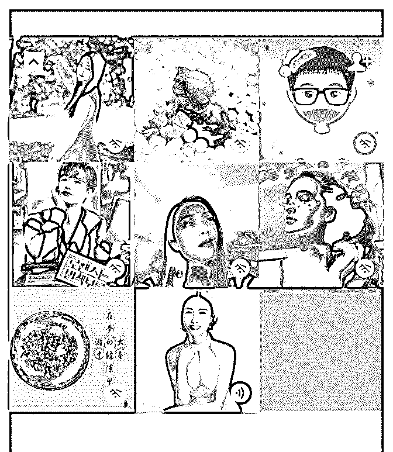

荻野 : 你好，可以联系泽宇教育主编荻野在简书投稿推广并且领取 18.88 红包，如没微信，可添加 wx：VStarOne521

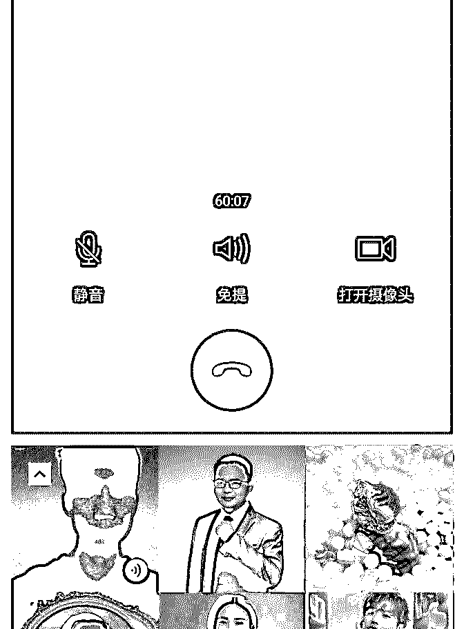

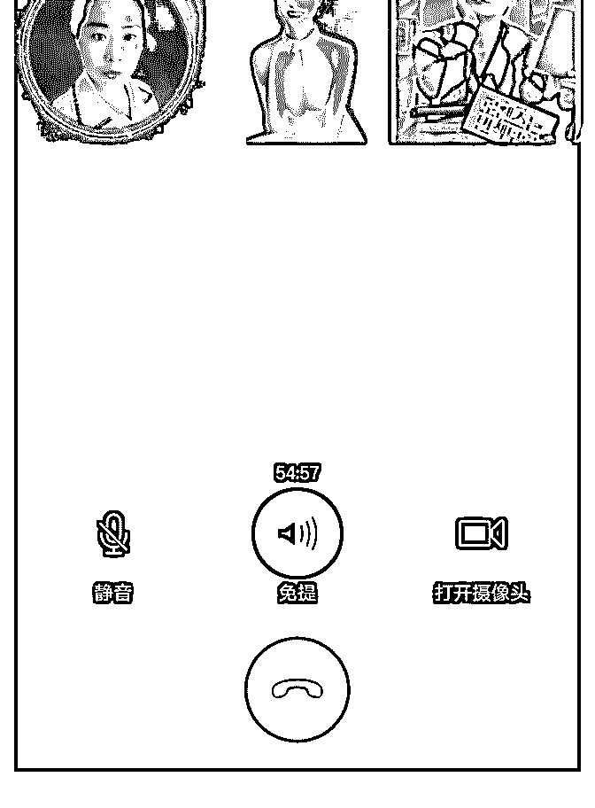

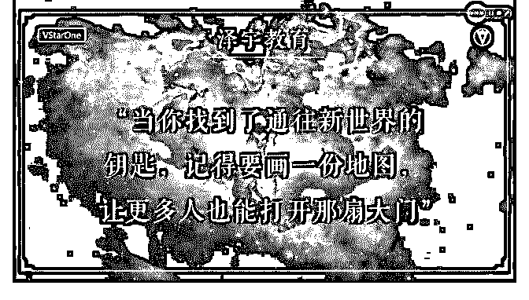

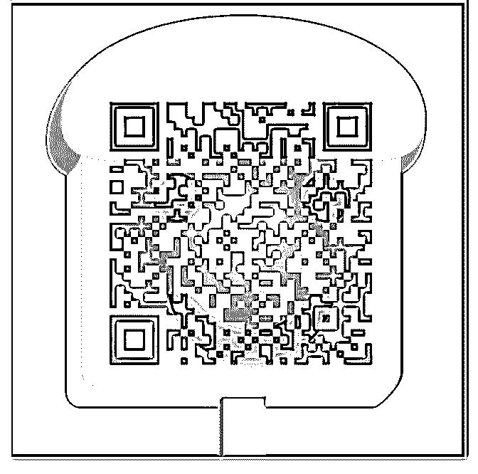

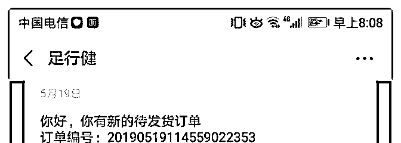

关注公众号"懒人找资源"，星球资源一站式服务

加入泽宇教育第 36

沁心｜情感咨询 : 加入泽宇教育第 36 天，一个自我介绍赚回

999 元

今晚的成果，有“利他”起的作用，有价值前置起的作用，但 是这都不是最重要的！

最重要的原因是：我没有自我设限，我对自己信心十足，同 时我对我的眼光极其自信，我看到了她的价值：她有能力， 却没有方法！刚好跟之前的我一模一样，这也可以说是缘 分！

她是 2018 年 6 月加入核心课的泽宇学员，了解了她的基本情况 之后，我发现她的自我设限非常严重！我问她，你觉得自己 通过自己的手绘要多久能月入过千，她说不确定。

我心里真的为她着急，明明手绘那么好，分分钟就能变现的 能力在手，却对赚钱一点把握都没有。我真心为她觉得可 惜，白白浪费了自己的才能。

明明很厉害，自我介绍却写得超级普通。看完她的自我介 绍，我发给她我自己的自我介绍，她惊讶地说“我的妈，好厉 害”。之后，我忍不住和她谈起自我介绍，并且建议她让她的 导师或者助教帮忙修改。并且说，如果他们忙得顾不上，再 来找我，我帮你改。后来，她找我，我跟她说了修改思路， 刚好该吃午饭了，我让她把第一条改完发给我。

一直到了昨天傍晚也没发，后来她在我朋友圈留言，我回 了。我心想，你怎么还不发来呢？是不认同我的思路吗？如 果是，我就不管你了，正好我最近很忙！到了今天下午 3 点

多，她把改好的发来了，问我那么改可以吗？我看完，指出 了她的错别字，又说“语气上要带劲！”“自我介绍，重点是： 精简！”“读着要顺嘴带劲”。

她的原句：2005 年开始画画，热衷画画至今已有 14 年，后来 学习了 MAYA,从事 3D 美术这个职业至今。

我给修改的：2005 年开始画画，一画就是 14 年，不断精进， 同时又学了 MAYA，从事 3D 美术至今！

我说：“你读读，我给你改的，感觉怎么样？” 她说：“的确不一样，专业”

得到她的认同，我继续帮她修改，帮她挖掘，提供思路，引 导她挖掘她做过的事情背后的价值。 附上修改前后的对比图（图一）

需要强调的是：所有修改内容都是立足实际！没有杜撰！挖 掘潜能和事件背后的价值是我的强项！

补充说明：

①我最近一直没什么动作，其实我在努力钻研课程，反复

听，反复琢磨，哲哲老师说我是他见过把核心课玩得最 6 的 人。这句话给了我启发，既然我把课程学得这么透彻，为什

么不用起来？

刚好，主动加我的光年，核心课没学好，我想把我学到的内 容教给她。想把自己所学教给别人，成了我的热情，同时这 正好帮我验证市场。

②我用了两个半小时，认认真真，帮她反复修改，直到我们 都满意。这个过程她感受到了我的能力，也获得了她的信

任。改完之后，她强烈要为我画手绘头像，奈何我刚花钱拍 的头像才用了一天，我舍不得换。就让她先为我保留特权， 等我想到别的内容再画。

③通过给她改自我介绍，我觉得她确实是有本事的人，忍不 住又去星球和她朋友圈进一步了解她。看到，今年三月份她 才接到第一个付费客户。忍不住问她价格多少，又问她要画 多久？听她一说，忍不住心疼！明明价格很低了，还担心别 人会觉得贵！更加想帮她认清自身优势，并且帮她正式开启 自己的副业，多多赚钱，帮她提升自我价值感！

④然后，又聊到核心课程，我引导她，让她再学一遍，并问 她多久能学透，又问她结果会怎样？她的回答是“应该可以

（学透）”，并不是“一定能学透”。然后，我跟她说我要收学

徒。又跟她说了，具体涉及到哪些内容，刚好是她需要的。

⑤她说想来，但是又觉得价格贵，于是，我给出三种报价方 案供她选择。每一种都没法拒绝！！！因为都是绝对的高价 值！

⑥最最重要的是，我对自己的服务内容绝对自信，针对她目 前的问题，我脑子里早就有了一整套解决方案。胸有成竹！

⑦杀手锏是三个月赚不回学费就全额退学费！之所以定三个 月，原因有二：一是最长出结果的期限不会超过三个月！二 是她自己对月入过千没有明确的概念，三个月可能有点长， 但是她能接受！

⑧这是一个双赢的决策：我能提升自己的能力，验证市场， 完善流程，系统化课程；她能实实在在学到东西，又没有后 顾之忧！

⑨我之所以定 999，其实价格很低了，因为价值绝对超值！但 是，考虑到是第一期，又考虑到我必须赶紧验证市场，完善 流程，同时她确实适合我——可以做我的合伙人！

⑩第二期，一定会涨价，现在还有一个名额！ 我最开始就说过，往后只会涨不会降，因为我的价值在那 里！我擅长的是情感分析和心理疗愈，但我的能力远超情感 分析和心理疗愈！商业知识和营销技巧，我也学了十几年， 现在正处于整合提升阶段！今天又一次想到那个词“一鸣惊 人”——进入泽宇之后，这个词第二次从我脑子里蹦出来！

我的小宇宙充满能量，急待爆发！同时，我会全力服务好我 自己的学员，以结果为导向！！！价值与信任相伴！！！

配图二是她的手绘，看看是不是超级厉害啊？配图三是她的 微信二维码，对手绘感兴趣的朋友可以链接她！

我是沁心专注个人成长的心理疗愈师，擅长情感分析和优势 挖掘，助你成为更好的自己！

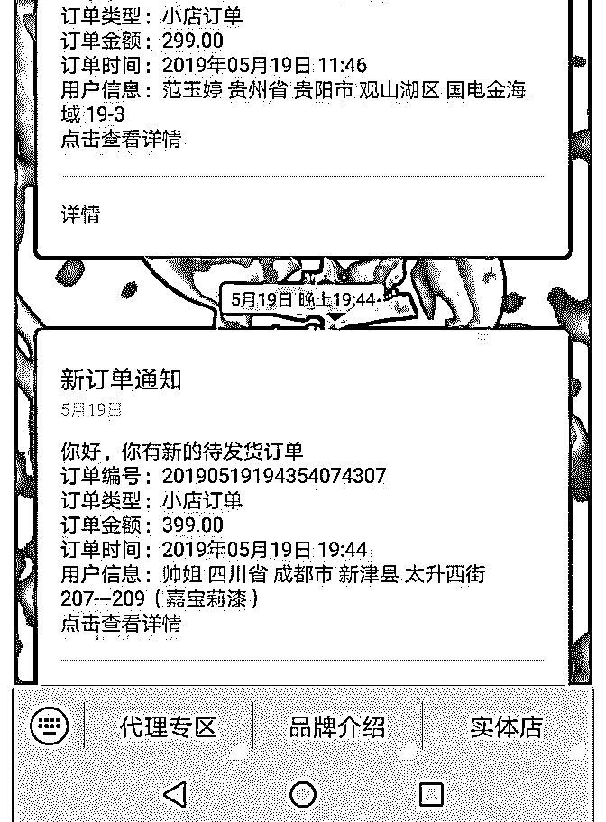

2019-03-14(6 赞)

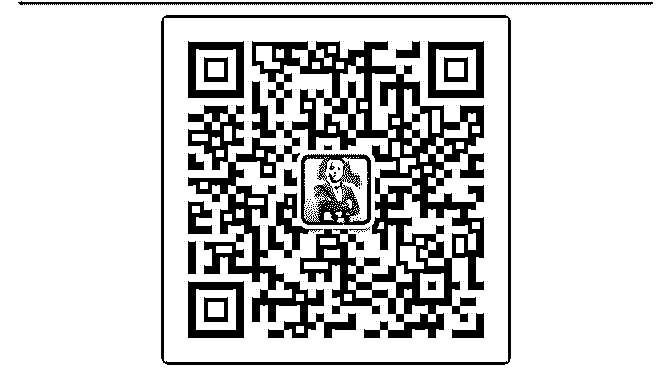

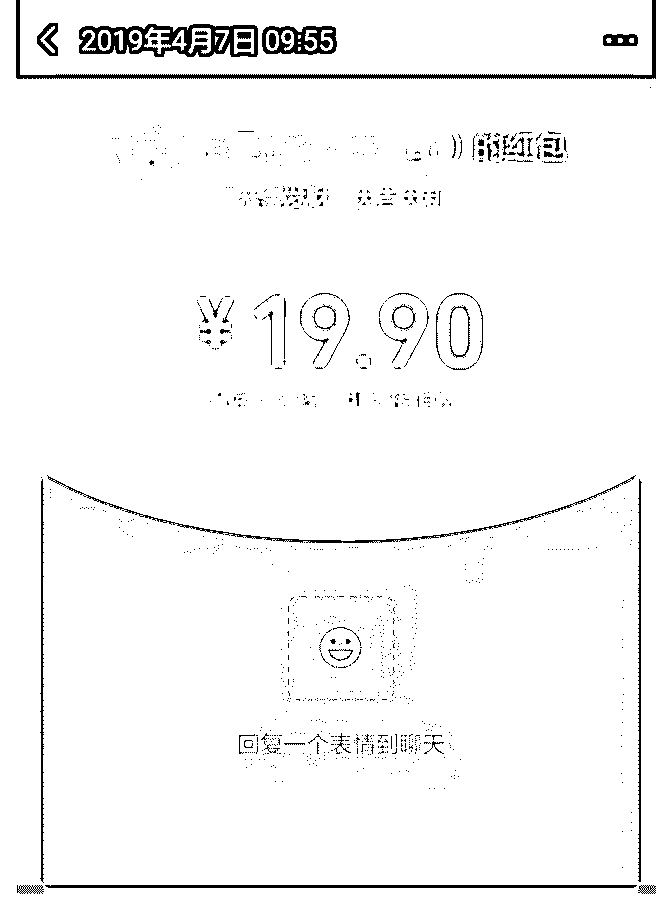

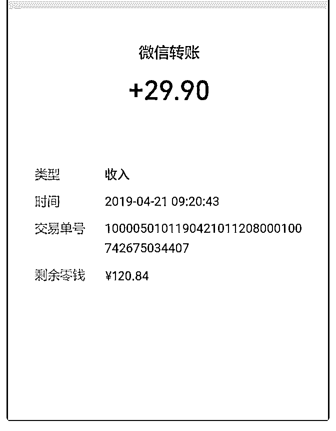

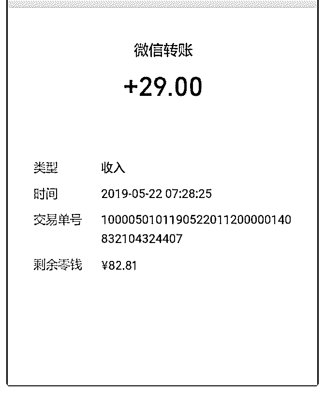

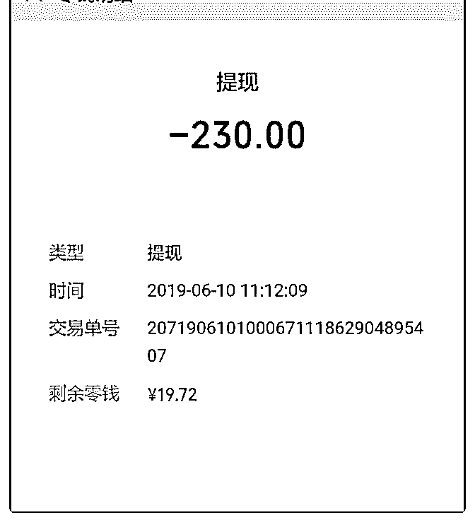

咨询师 逆袭人生的

易之梅 : 咨询师 逆袭人生的正确姿势 加入核心课 10 天，变现 500+赚回学费 个人标签：梅花易数预测，基金定投 首先是个人标签的确定，我的标签就是梅花易数预测和基金 定投，标签就是让别人在人群中一眼认出你，看到你能提供 的价值。 咨询的本质，就是帮助别人从当下状态大道理想状态，为别 人提供价值。我在给别人预测一些事情的时候，状态是非常 好的，因为真的是想帮助人。 我报名核心课大概 10 天左右吧，我已经赚了 500+了，虽然可 能不能和大家比，但是我用的的标签和输出的价值帮助了别 人，我是高兴的。 很多人听到预测，可能有些不了解，预测嘛就是算命，这个 理解也可以这么说，但是不仅仅是这样的。 预测也有它正确的使用姿势，我在变现的过程中确实运用了 所学的知识帮助到了别人。 这也是我的一个兴趣，能帮助别人解决一些问题，有些人可 能在自己不知道的情况下错过姻缘，有些人因为居住环境， 影响了婚姻，事业，财运，健康等，也有人，几年不顺，感 觉人生灰暗，不知道好运就要到来。 我在实践的过程中，帮助了一些人，重新认识了自己，定位 了人生方向，找到适合自己发展的职业，重新获取自信，努 力生活（我说预测师也是很好的心理咨询师，可能有人会说 我的，哈哈）。 也帮一些人，分析了身体的健康状况，提出了合理的建议， 提前注意下，健康还是重要的。

后期我还会继续学习，不断的提高自己的能力，为大家提供 更好的服务。

基金定投这块，也是我的另一个标签，和我一起学习基金定 投的伙伴，我也愿意为他们提供财运，事业等方面的指导， 让大家不仅在基金理财方面有收益，其他方面也更好！

2019-03-12(2 赞)

评论区：

荻野 : 你好，可以联系泽宇教育主编荻野在简书投稿推广并且领取 18.88 红包，如没微信，可添加 wx：VStarOne521

旋旋 :