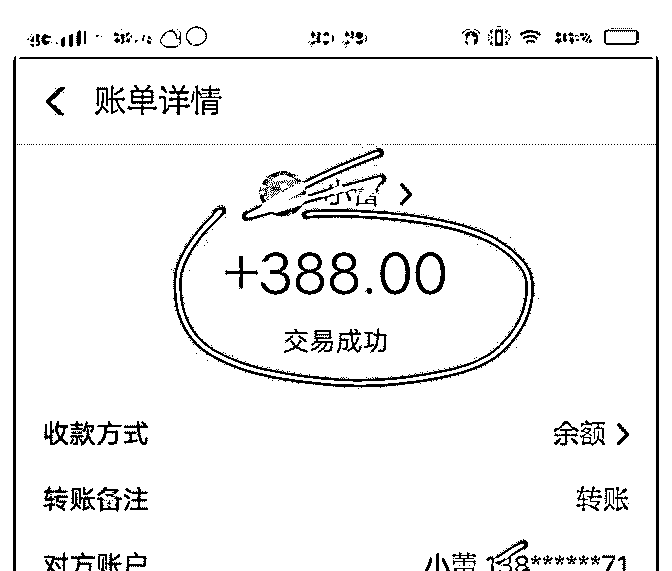
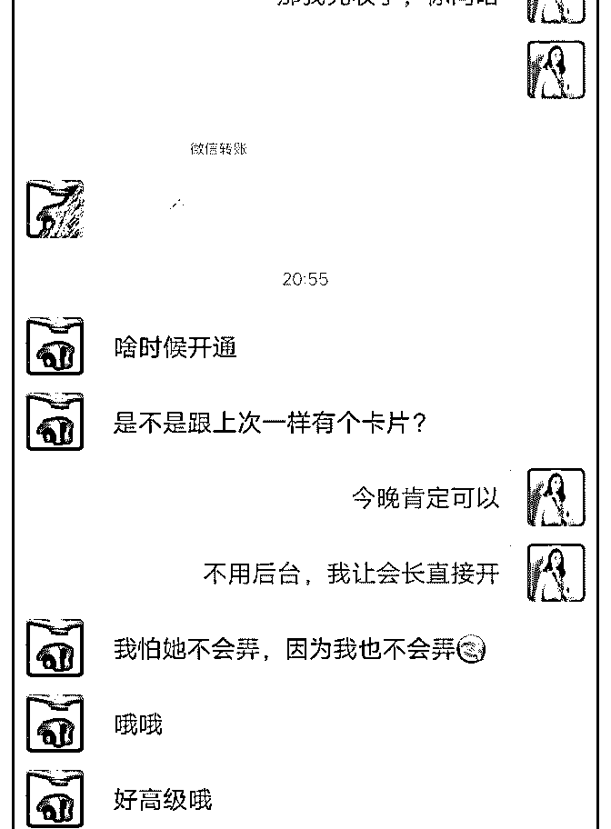
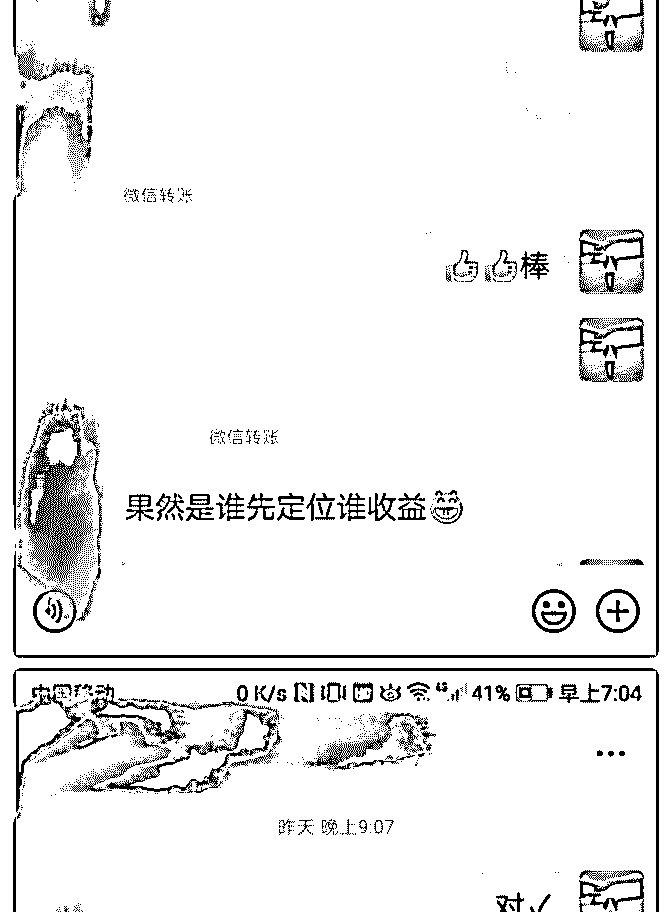
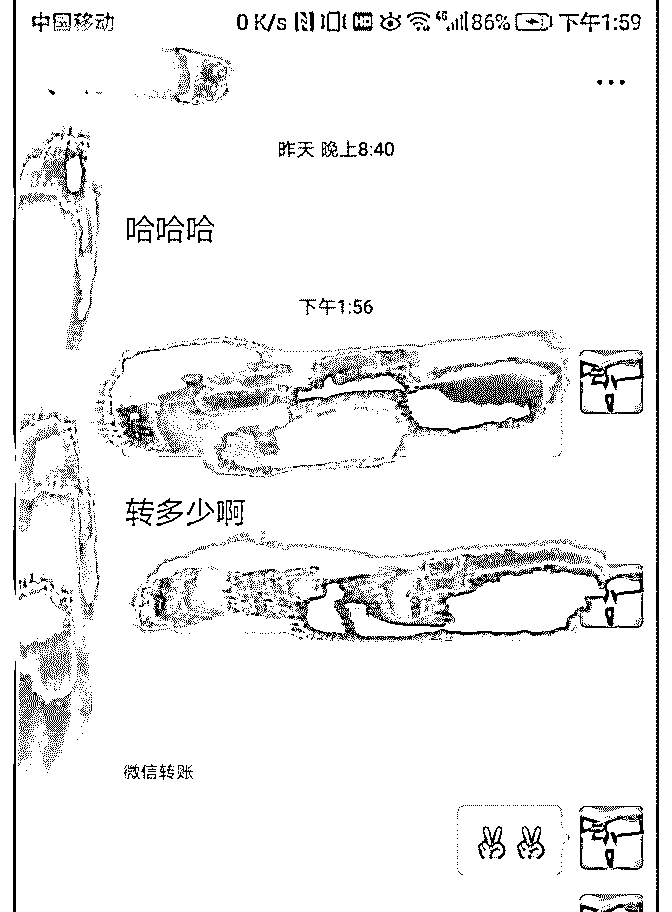
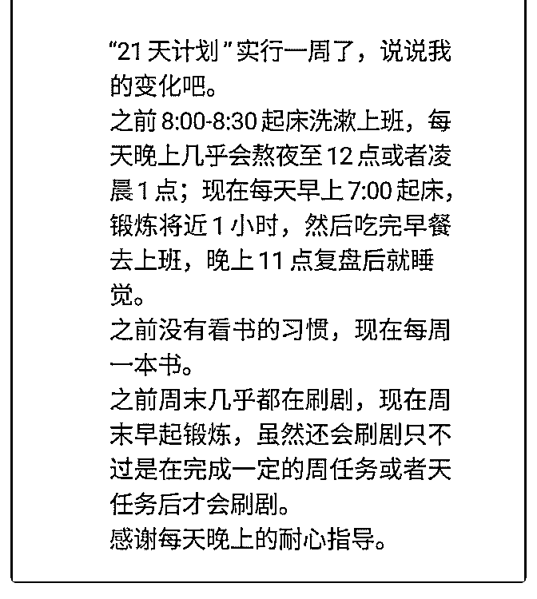

# 15 天，在朋友圈好

15 天，在朋友圈好友 500+的情况下变现 14000+，做为一个只 会观望，几乎不在群里冒泡的小伙伴，我做了什么事情？

（首先特别感谢范范，那个潜水很深，不常展示的姑娘[害 羞]）

我是干嘛的？

1 我是旋旋，一个来自农村的种田娃，身高 151.3，后来到了上 海，在时装公司里从开始被嘲笑矮土丑的助理到最后逆袭成 时尚的国际设计师，并通过艰辛努力有幸成为 ZARA 总监的学 生。 2 一年前加入泽宇，但是半年前才确认下副业做私人形象顾 问，打造简乐搭品牌。国际设计师的审美训练与严苛的形象 学习训练，让我有了形象顾问方面的基础。

在开始做招募前我做了哪些准备工作？

1 首先持续在简书上输出时尚文章 70000+，每日在意向群分享 半年以上，这是我粉丝流量的基点 2，开始确定活动前，有两个特别信任我的朋友首先报名，然 后开始展示自己的价值，和训练营的一些附加值，这吸引到 很多学员（核心根本：自身的价值和训练营的价值）

稳步发展的核心点

1，找到为你赋能的人，比如波力老师，小鱼老师等，我遇到 了范范，她是我第一批的训练营学员，之前也没有怎么交流

过，报名了训练营后，才了解到她是一个很努力，成长很快 的女孩，她告诉我很多价值展示的方法，比如发朋友圈，其 他社群展示，她帮我细扣到每一个细节点，包括我的表达， 我个人的成长，朋友圈的文案，简乐搭的社群运营等等，真 的很感谢她，为我赋能，让我能这么快又这么稳的发展。

2 强执行力，老师指点后要超强行动力才能完成最后的目标， 所以自己的执行力也要跟上，老师说东就要往东，西就是 西，先干了再说，因为好多道理一开始自己也弄不明白的， 就是去做，发现后来道理是这样的，原来逻辑是那样的，学 习和成长也很快。

自己一直有专业能力，就是苦于变现，但在范范的指导下， 在我的韧劲和行动下，在学员伙伴的支持信任下，在助理

（雅欣，郁欣）的超强支持下，突破了自己，完成了目标， 感谢她们也感谢自己，也感谢伙伴们的鼓励赋能，不要迟疑 就是去做，行动就会有结果。

那也想和大家分享几点关于心态的影响和成长

1 价值决定价格。我经常问范范，这个定价高了？低了？但是 范范总是会跟我说一句话，价值比价格更重要，价值一定要 大于价格，不要纠结价格高低，要想的是怎么让学员感受到 超高的价值，给到她们结果，所以不断学习和提升很重要， 也要敢于定价，这是对自己的价值认可和底气，努力要为学 员创造更高的价值 2 莫急莫躁，收了钱带学员，总怕自己给不到别人高价值，出 不了优秀结果（事实上她们已经开始在其他群晒对比照 了），开始焦虑了。这时候范范就会调整我的状态，告诉我 要调频，要相信自己，学员都相信她，自己也一定要认可自 己，努力的去做就好，她一直和我说：打造个人品牌要一言 一行的去践行，要时刻想着学员第一，要稳扎稳打的去做

我是旋旋，穷苦人家出来的丑孩子，通过 8 年严苛训练成为时 尚国际设计师，现在成立简乐搭小团队，我们的使命是要用 百元为别人打造精致时尚，要时尚，更要省钱。

2019-03-10(10 赞)

评论区：

荻野 : 你好，可以联系泽宇教育主编荻野在简书投稿推广并且领取 18.88 红包，如没微信，可添加 wx：VStarOne521

关注公众号"懒人找资源"，星球资源一站式服务

欧欧成果庆祝及干货

欧欧 : 欧欧成果庆祝及干货分享:三个星期，接单 5 笔，收入

3293。

第一，成交并持续变现的核心—— 自己是否能为对方提供他 需要的价值，帮助对方达到理想状态。

我的这几单能成交，是最近客户咨询后反 馈真的非常好，好几个客户良心好评！觉得 有真正帮他们解决原生家庭问题，自我性 格，亲子沟通等问题。其中一名来访者写了 2347 个字的咨询 心得，真的是最好的背书。

最近我在做概念验证，收费 399—499 的心理咨询是否可以被 多数客户接受。泽宇一直在课程里面说能给对方提供价值， 能帮助对方实现理想状态就是适合的定价。

第二，每次咨询的截图都可以去成交下一位客户 ，只要能让 你的潜在客户看到你的价值 看到你有解决问题的能力。

别人向你进行咨询的内容也可以截图发朋友圈 ，别人对你的 正面反馈也可以发朋友圈， 这些都是你的案例积累 是打造朋 友圈的高价值内容 。

我在这个过程中越来越觉得是否能真正解决客户目前的问 题，你的产品和提供的服务永远在第一。除了做展示面，做 好引流，当然离不开内在核心竞争力的打造。

第三，如何面对进泽宇后的迷茫和焦虑？

特别是迟迟没有变现的小伙伴，天天在群里面看其它学员好 牛逼，庆祝成果，就开始自我怀疑，觉得哪儿哪儿都做不 对，老是没进

步。 这就是之前的我！

私下有学员说他已经足够的努力，没有办法 变现，焦虑指数五颗星。我个人觉得是时间 问题。我们每个人目前所拥有的资源，基础，人脉都有差 异。

嗯，我进泽宇的时候就是一个小白，作为一 个小白觉得需要学习的内容真的是很多很 多。因为起步比较晚，所以我们的成长路径 就和别人的就有差异。请允许自己慢一点！

那些一开始就接大单的学员一定是在此之前 在本领域已经有了大量的累积。我们只看到 了大单表面的风光，却忽略了这些牛人之前 所有付出的努力。我相信他们现在的成果， 也是在之前经历了无数个此时我们所感受的 迷茫，痛苦，煎熬和焦虑叠加而成。今天的 牛人，也是从小白变成小牛，小牛到大牛的 过程。

下面是泽宇优秀学员月入上万的萌姐朋友圈分享： 萌姐的这个故事分享，我有很深的感触。 时刻提醒自己需要再努力一点！ 重新认清自己，立足当下，积极行动。这样我们才有可能减 少焦虑，不再做能量内耗。

最后，我是心理师欧欧，有需要沟通交流的亲欢迎来撩: 2019-02-28(44 赞)

评论区：

春柳 爱己及娃 : 向你学习。积累不同，变现时间不同，但迟早，一定会成功。 狒狒君 : 每个人的基础、圈子各有差异，需要时间的积累

荻野 : 你好，可以联系泽宇教育主编荻野在简书投稿推广并且领取 18.88 红包，如没微信，可添加 wx：VStarOne521

周翠婷 :

关注公众号"懒人找资源"，星球资源一站式服务

一天里从免费咨询到

一天里从免费咨询到成交 3 个学员

昨天非常的意外，有个宝宝主动说要跟我学习，问了费用后 直接把 88 元的学费转给了我。在此之前，我没有发过任何一 条招收学员的信息，我所做的事情就是每天在很用心的打造 我的朋友圈，让朋友圈具有杂志般的美感。我想她是被我的 朋友圈吸引了，我自己真的很喜欢朋友圈美学，一直在研究 制作各种美图，再加上我原本也是微商，深知打造朋友圈的 逻辑，因此我可以在短时间内打造好朋友圈并让自己变现。

在第一个学员付费前，有个宝宝也说要跟我学习，她说我的 朋友圈真的很好看，并且说看过那么多朋友圈美学，真正吸 引她的，只有我的朋友圈，这句话对我来说特别有力量，我 一定会继续精进我的专长，致力于成为打造杂志般朋友圈的 黄埔军校。晚上的时候这个宝宝转账给我，并叫我快点开始 课程，她很期待我的课，于是我有了第二个学员。

我把今天的以及之前的一些经历写了一篇文章《涨粉 30 多， 被写进公众号，我做了什么？》发到星球和社群里，这篇文 章让我涨粉近 20 人。加进来的小伙伴大部分都说朋友圈很漂 亮，今天里我的朋友圈被高度赞扬。

临睡之前，一个宝宝加了我，是个心理咨询师，她说在星球 看了三篇文章只加了我，她被我的那篇文章《涨粉 30 多，被 写进公众号，我做了什么？》给吸引了。她加了我就叫我师 傅，很快就付费学习。于是今天我有了第三个学员。

我没想过自己能这么快变现，也许是因为朋友圈美学比较容

易变现，我更相信是因为我呈现出的理想状态是别人想要达 到的。

总结起来就是，找到标签，围绕标签行动，持续输出你的价 值，用心把朋友圈美学做好，我的光芒别人一定会看得见。

如果你对朋友圈美学感兴趣，对变现感兴趣，那么欢迎你来 链接我，我一定是你朋友圈里的一本杂志，我也可以让你通 过朋友圈美学变现。

最后附上我的没学作品。

2019-02-11(42 赞)

评论区：

荻野 : 你好，可以联系泽宇教育主编荻野在简书投稿推广并且领取 18.88 红包，如没微信，可添加 wx：VStarOne521

明哲 :

关注公众号"懒人找资源"，星球资源一站式服务

到今天，打造个人品

到今天，打造个人品牌刚好一个月。这一个月感觉过了好

久，因为每一天都有想象不到的惊喜。

从收入上来说，一个月的时间，还在摸索阶段，就有了

8000+的收入，这个水平是我家乡这里平均工资的两倍。

从个人发展上来说，有摄影工作室、美妆工作室，还有很多 约拍的，主动来找我谈合作。因为专业强，口碑好，我的导 师找我加入了我的学习社群，还推荐朋友来找我学习；我社 群的小伙伴在自己朋友圈发了我指导她之后的作品，她公司 的许多小伙伴也要了我的联系方式，要向我学习。现在我的 社群伙伴们遍布世界三个大洲。现在都不敢随便接大单，怕 自己精力分配不过来，有种被钱追着走的感觉……

从人际交往上来说，认识了很多行业大咖、学界精英，和各 种有趣且优秀的人，昨天那个万里挑一的考上哈佛的小妹妹 居然主动来加我了……

从个人影响力来说，我居然影响了我一直敬佩的前辈——Q 姐！她是国内坐拥行业内第一公众大号“邮轮那些事儿”的运 营者，目前还在海外工作，级别高，收入可观，影响力大， 没想到她一直在关注我，并且被我影响，决定跟我一样开始 打造个人品牌，更大程度的提升自己、发挥自己的价值。“我 喜欢和实力派的人交朋友。”

这一个月也有朋友质疑我，善意提醒我，我反而更能理性的 看待这些事情，以一个市场的角度来对待这些声音。你不是 我的客户，那就做个路人好了，你不理解我，那我们就活在

不同的世界好了。很简单。

这一个月的收获，比我预期的要多很多。谢谢泽宇教育给了 我一个发挥自己价值的机会和平台。我会继续努力，月入三 万的时候我就开启全世界旅游模式。留下更多作品，挣更多 钱，认识更多有趣的朋友，做一个艺术家。

2019-01-11(40 赞)

评论区：

HD－个人品牌咨询师 : 牛逼哄哄！3w 出发

明哲 : 好！不设限，我可以！

娜娜 : 我是新手，来学习复盘的

荻野 : 你好，可以联系泽宇教育主编荻野在简书投稿推广并且领取 18.88 红包，如没微信，可添加 wx：VStarOne521

关注公众号"懒人找资源"，星球资源一站式服务

从 0 开始到 1.5W

屈源 : 从 0 开始到 1.5W、这 25 天中我经历了哪些坑！

1、着急，最开始听核心课以及社交课的时候内心非常非常激 动。但每天看着群里大神不断的晒截图，不断的晒收入。这 时内心就非常着急了，然后又不知道从哪里入手。整个人就 是懵逼状态

2、自我设限，在做第一期训练营最开始招募的时候（没有做 过线上的）。我内心是恐惧的，我也不知道结果会招募到多 少人。这个训练营我在内心构思了 3 年的时间，一直不敢去行 动。就是害怕没人儿，但这次我去干了也成功帮助训练营学 员摆脱拖延了。

3、三天打鱼两天晒网，激动的时候想起来就去学一下动一 下，心情不好的时候就一点儿也不动。这样断断续续的，然 后给学员引流的效果也并不是很好。

4、不去实践，课程里面都是精华中的精华。很多同学只是学 习复盘了，但是从来没有去写过 1 个践行清单。把课程里面的 内容用可行动践行的方式去行动起来。屈源最开始也是这 样，但这段时间只要学到任何东西。我都会弄 1 个践行清单把 他罗列出来一步一步去践行。结果大家都共有所见

5、拖延，之前我收了 1 位泽宇的同学。和她聊的时候她也非 常焦虑。去年她一共去买了 1W+的课程，其中包括泽宇这边 课程。当我问到他学习以及一些进步的时候，她既然回答没 有去学习。当然现在进入我训练营已实现成功变现了。

6、自闭，有问题不知道去问请教老师。我开始在找定位的时

候非常迷茫，但只知道自己憋着。却不知道去请教哪些有结 果的人，自己憋着越来越焦虑。直到影响自己的情绪，导致 错误的行为。所以屈源走来也不是一帆风顺，当中我也走了 非常多错误的道路。有问题也可以过来找我，我一定用我的 经验为你解答。

7、怀疑，我很相信的一句话。你想的和结果一模一样，很多 伙伴也是因为自己原因不去执行。渐渐的对于泽宇教育产生 怀疑，但从来没有思考过自己的原因。泽宇教育能够在这么 短的时间发展这么壮大一定有他的原因。并且也已经帮助这 么多伙伴实现月入过 W 的目的。相信，傻傻的相信去干就行 了。

上面每 1 个问题，我都给出了答案。期望能够对于现在迷茫的 你有帮助。

2019-01-11(61 赞)

评论区：

西梅子姐姐 : 真的超级棒！摆脱拖延症是个难题。 屈源 : 哈哈哈，可以加我微信。一招给你解决 SONG 手机摄影 : 很客观 加油

屈源 : [奋斗][奋斗][奋斗]一起加油

晨轩 : 今天一口气把屈老师星球所有文章看完了，从年底到现在屈老师改变真的很大，指数级增长，真棒，向你学习。

屈源 : 定也兄弟，你真的牛逼

安妮 Anne : 哇，有沉淀，才会感悟这么深，好棒呀

Cindy : 很厉害，我也有超级拖延症，知道要去做，但总想着等一会去，一拖再拖[难过]

关注公众号"懒人找资源"，星球资源一站式服务

如何从 0 基础小白，

屈源 : 如何从 0 基础小白，到 20 天变现 1W+

你好，我是屈源。屈源正式开始是在 11 月 22 号，到目前为止 还没有 50 天的时间。然后通过最近 20 天成功实现变现 1W+

屈源成长并不是一路顺风，最开始学习完核心课后。每天我 和你们一样都是望着这些大神一天疯狂的晒单。

我内心是相当着急，但着急过后呢。自己就把泽宇课程停了 下来，足足停了半个月。现在想起来挺后悔的，假如不停这 半个月。我目前就可以月入 2W 了。

OK，那接下来就直接扔干货说下我是怎么把他一步一步做起 来的。

这个训练营在我内心一直沉淀了 3 年，自己想去做但没执行。 现在终于去行动了

最开始我跑去 S 叔的刷新自我星球招募第一期学员，但当时自 己内心也没有底。我不知道会有多少人过来加入。

嘿，这样一弄没想到居然有 30 来位的学员过来报名。然后自 己筛选淘汰出了 22 位报名的学员，只剩下 8 位。于是第一期训 练营开始了。

当然第一期只是小试牛刀，嘿。没想到的学员结果还挺棒 的，之前每天睡到中午 12 点起来现在每天 7 点就起来了。之前 说了几年看书的，现在每天坚持 1 小时读书。并且还有一位收 入直接翻倍了。

当然这只是第一期实验而已，到了第二期的时候我收费了。 学员复报率到达百分百，说明我的服务非常有价值。

而现在他们还在不断的为我转介绍客户过来，所以一定要以 客户为核心。他们会为你带来无用无尽的价值。

后来再通过导师计划里面的东西，就更加爆炸。每天收款收 到手软，可以看到我下面收款截图中很多都是还没收款的。

不是我不收款，是我真的收不过来。 其次我这边还要强调 1 个非常重要的问题，拖延。有很多同学

看到我有结果了，就过来找我咨询。问我怎么做的。

然后我把我的成长经历以及化解成长当中问题给他分享过 后，他还是不去行动（当然不是我的学员）。

其次我也发现自己做了一个很好的东西，帮助学员摆脱拖 延。而且不仅帮助学员养成自律的生活习惯，其次外貌，生 活状态，以及收入都得到了非常大的提升。

就像泽宇老师在课程里面说的，一定要行动，行动。很多都 是比我早起来很久的伙伴，不知道你们有没有真正思考过。 为什么我有结果，而你们为什么没有结果呢？

拖延，我说的没错吧！那就来找我吧，很乐意帮你解决[机智] [机智]

2019-01-05(41 赞)

