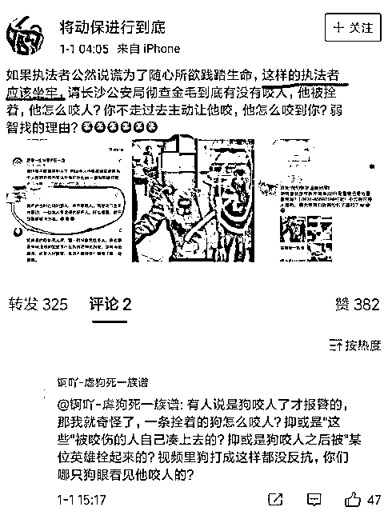

# 中国狗伤人的数据触目惊心，狗霸王们却视若无睹

昨天，我写了一篇关于异烟肼的报道帖子，目前是推进文明养狗，号召狗主人遛狗要带狗绳，然后突然就火了，一夜之间这个词居然成了热搜词汇，并激发了全社会大规模的热议，还有一波“爱狗人士”组织起来要搞万人举报把那篇帖子封掉，并组织了大批水军发布黑贴，还组织了大批人到我这里专门来喷我。恭喜他们，这篇帖子终于被无脑狗粉们给封掉了，他们得逞了，他们出门遛狗可以继续不带狗绳了。

但是我在后台看了一下，支持我的人远远大于喷我的人，在黑粉有组织的情况下，依然有 20 比 1 的比例，一天之内收获 5.2 万赞，历史最高。而外面博主支持和反对的帖子也是同样一边倒的态势，讨厌狗的占绝大多数。为何双方力量悬殊差距如此之大，因为中国狗伤人的数据实在太过触目惊心，绝大部分中国人都对狗抱有厌恶情绪，其核心原因不在狗，而在那些狗主人，也就俗称的狗粉或者说是**狗霸王**。

中国每年多少人被狗咬

中国每年卖出的人用狂犬疫苗，都在 1000-1500 万人份左右，差不多相当于 5000-7500 万支疫苗，产销量都高居世界第一，是全球数据的 80%，也就是说全球 80%的狂犬疫苗都让中国人打了。

2017 年的数据图中没有，我给大家报一下，上市的疫苗总支数为 7448 万支，差不多也是 1500 万人份，可以认为，中国每年的狂犬疫苗产销量，为 1000-1500 万人份左右，我们取最低值 1000 万人考虑，为什么按照最低值呢，因为狗伤人数据太过恐怖，所有公开数据我一律按照最低值去考虑，他也依然很恐怖。

实际注射狂犬疫苗的人数不止 1000 万人，因为很多人只打 2 针疫苗就停了，根据十日观察法没事之后就可以不继续打了，无需注射 5 针完成一人份。所以实际注射人数是超过 1000 万人的。还有很多农村人被狗咬了舍不得花钱打疫苗，根据防疫专家的估计，中国每 2~3 个被狗咬伤的人，才会有一个选择注射狂犬疫苗，不注射的人主要集中在偏远穷困地区。

当然，还有一些人是因为无知选择不注射狂犬疫苗，他们认为每次被狗咬都是被注射微量狂犬病毒，所以等于被注射了一次疫苗。故自己现在已经有抗体了，无需注射疫苗，真是不知道死字怎么写。

换句话说，中国每年至少 1000 万人被狗咬伤，这个是按照最低值限度去考虑的，实际被咬伤的人数应该在 2000~3000 万左右，这里我们按照最低值 1000 万人去考虑。

有很多无知的狗粉说这些疫苗都是给狗打的，给人打的没这么多，我这里强调一下，这里写的全部是**人用**狂犬疫苗，中国的**兽用**狂犬疫苗成本仅为人用狂犬疫苗的 1/10 以下，非常的便宜，即便是进口的也不贵，所以国产兽用狂犬疫苗没有销路，大家都倾向于使用进口兽用狂犬疫苗。

2010 年，为了有效减少狂犬病的传播，青岛决定对本市的犬类进行狂犬病接种费用从 40 元降低到 10 元，据政府人士介绍，这 10 元仅为更换免疫标志牌的工本费，狂犬疫苗本身等于是免费接种，青岛的兽用狂犬疫苗为法国进口疫苗，采购价为 17 元一支。10 元是亏本的，相当于政府掏钱补贴给市民接种，但是主动给宠物进行狂犬免疫接种的市民依然很少。

所以，1000 万人份的人用狂犬疫苗全部是给人注射的，这里不含给狗注射的那一份，兽用疫苗归农业部管，人用疫苗归卫生部管。而同期，美国每年注射的人用狂犬疫苗为 4~5 万人份，兽用狂犬疫苗注射量倒是远超中国，不过那个没意义，也就是说，**中国人被狗咬的数量降低个 99%，都比美国高一倍**，这个差距不是一点点，是天地之差。

海因里西法则

那么每年 1000 万中国人被咬伤这个数据是不是很吓人的，是挺吓人的，不过还算好，因为后面的数据更吓人。

美国的海因里西统计了全美 55 万件安全事故，得出了著名的 300∶29∶1 法则，也就是海因里西法则。什么意思呢，那就是企业每发生 1 次重伤或者死亡的重大事故，背后一定曾发生过 29 起轻伤或者故障，并曾发生过 300 起隐患或者违章。

中国的狗咬人我并没有精细数据，但是类比可得到每发生 1 起狗咬人事件，背后应该发生 29 起狗对人围扑、呲牙吠叫这种轻度惊吓事件，同时应该还会发生 300 起狗主人遛狗不栓绳这种安全隐患事件。

这个比例可以这么简单类比吗，我觉得这个比例数据还是挺靠谱的。我举个例子，很多人都被狗围扑、呲牙吠叫过，10 次里面你被咬过 1 次吗，应该没有，29 次被咬 1 次应该是很正常的比例。而遛狗不栓绳出门 10 次就会导致有一人被狗围扑、呲牙吠叫等危险行为惊吓，出门 300 次就会导致一人被咬，我觉得也是比较符合正常经验的。

还有一个最重要的证据就是，被咬的人基数太大了，1000 万人啊，就算按照 1 比 10，那也有 1 亿人被吓过，按照 1 比 30，有 3 亿人被吓过。这个比例越大，代表被吓的人数越多，所以 1 比 29 是非常合适，每年 2.9 亿人被狗惊吓。

有狗粉不想承认，想拼命缩小数据，但是我可以告诉你这个比例越小，代表养狗危险性越大，如果达到 1 比 1，那就代表狗会没有任何预兆的对任何人类进行攻击，属于极度危险的物种，应彻底灭杀。所以这个数据小不了，越小越应该禁止养狗。

所以每年被狗惊吓的人会远超直接被狗咬的人，会达到 2.9 亿人的惊人数字。注意哦，这只是一年的数据，每年被狗咬的不可能是同一批人，每年被狗吓的也不可能是同一批人，多年累积下来，从来没被狗咬过或吓过的中国人，可能不足 1%。

这是中国人讨厌狗的群众基础吗，是的，但是不全是，因为**还有更重要的数据基础在后面**。

放狗咬中国人的成本太低了

中国人讨厌狗的重要原因，是**狗主人放狗咬人的成本太低了**，低到足以肆无忌惮咬人的地步。被狗咬了不仅要忍受剧痛，还要花钱看病，分 5 次跑防疫站注射狂犬疫苗非常的误工，损失极为巨大，甚至还要承担小概率狂犬病发**死亡的风险**，属于飞来横祸。

但是狗主人会因此承担什么责任呢，肯自愿赔付狂犬疫苗费用的狗主人，都自称为良心主人，有时候需要闹到派出所才愿意出这个疫苗钱。

碰到这种狗主人，你能说什么？你能打他吗？不能，打他你要巨额赔偿的。费劲千辛万苦找警察，才勉强同意赔你个疫苗钱，要是万一狂犬病发死了，那和他自然是没有一毛钱关系的。

如果被狗咬的重，需要医院治疗，狗主人会心甘情愿赔医药费吗，很难，还是需要大量扯皮。。。

赔个疫苗钱，居然也被法院称之为圆满解决，可以看到在中国被狗咬了**索赔有多难**。

狗咬人赔钱不多，狗咬狗赔钱倒是挺多的，有人赔了 8500，还是在自己未栓牵引绳，没有办理养狗证所以承担 50%过失情况下，因为**狗很贵**，价值 1.7 万元。

中国有狗咬人赔偿 10 万元的案例吗？没有，如果有一定轰动媒体了，我穷尽整个网络搜索，目前搜到的最高赔偿是 3 万元，这还是在自己宠物犬被咬死的情况下才赔偿这么多的。

李大爷的狗被咬了之后，抢救了一周还是死了，赔偿的 3.4 万元里，属于狗的有医疗费 10409.5 元＋宠物狗价款 2000 元，赔给李大爷的大概还剩 2.2 万，其中还有自己躺医院花费的医疗费 1.4 万和医院伙食补助 0.2 万。这个赔偿金额最高的案例，对狗主人也几乎是没有惩罚，赔偿医药费就可以了，这次之所以赔的高，纯粹是因为医药费高。。。

单纯狗咬人，目前中国可查的案例，赔偿为 2 万元，这是因为被害人已经被咬成了 10 级伤残，且医药费花了 7800，所以，放狗把一个中国人**咬成 10 级伤残**的代价，只需要**1.22 万****元**。。。

所以，放狗咬中国人的成本低到超过所有人的想象。如果你不相信狗咬人的赔偿金如此之低，可以穷搜整个网络，看看有没有一例高额赔偿。

放狗咬中国人的成本实在太低了，在中国人打狗的代价都远超过狗咬人的代价，因为很多**狗还挺贵的**。

放狗咬美国人的成本太高了

我们都知道，全世界狗权最高的国家，就是美国，中国很多的狗粉和所谓的动物保护人士都在号召中国人像美国人那么爱狗，美国人的确很爱狗，但是却**不怎么爱狗主人**，对狗主人的素质要求是特别的高，这一点那些狗粉却从来不提。

在中国狗咬人的赔偿微乎其微，所以中国的狗粉放开了狗绳让狗随便咬人，那么在美国，狗咬人要赔多少钱呢？先看大数据。

看一家保险公司的数据，美国州立农业保险，去年共处理了 3800 件狗咬伤的索赔案，赔偿 1.09 亿美元，单次被狗咬伤赔偿 2.87 万美元。

2011 年，加州共处理了 527 件狗咬伤索赔申请，理赔金达 2030 万美元，单次被狗咬伤赔偿 3.85 万美元。

所以，在美国放狗咬人的代价，大概是**3 万美元一次**，而且这只是保险公司赔付的合理部分，超过限额的，由狗主人自己承担，这个数额有多大呢，我们看看法院的判决。

美国女童遭恶犬撕咬致残，狗主人被判赔**7200 万美元**，该女童的医疗费用预计在 100 万美元左右。

美国一男子遭到 11 条恶狗吞咬，部分肢体被“活吞”，狗主人被判决**1 亿美金**的赔偿，所有涉案犬只被美国警察安乐死。

你以为赔了一亿美元，处死所有犬只就完事了？这名狗主人被刑拘，被指控三项饲养危险动物罪名，每一项指控最高刑期都为 4 年，罚金 2000 美元。最高可以被判处**12 年监禁，并处罚金 8000 美元**。

狗把人咬伤，居然最低也要赔三万美元，如果咬伤的程度严重，狗主人甚至要赔偿 7200 万美元甚至上亿美元，这是在讹诈吧，法院不可能支持如此之高的赔偿金的。

不好意思，上面那个 7200 万美金和一亿美金，是已经正式生效的法院判决书，美国提起狗咬人的赔偿金最高请求额度，为 2 万亿亿亿亿美元，而他只是被狗咬伤了手指，流了几滴血而已。

在前一篇文章中说，在美国，如果纵狗咬人导致死亡，就算是比尔盖茨都会倾家荡产，很多人说我是不是写错了，狗咬人而已，能赔多少钱。这些粉丝之所以这么想，是因为他们没有见过美国法律对狗主人的严格要求和巨额赔偿。

为什么美国一年只卖出 5 万人份狂犬疫苗，因为在美国纵狗咬人的赔偿金太高了，美国狗主人赔不起，他们只能出门栓绳，严防自家的狗咬人。

美国人也不喜欢拴狗绳，也希望自家狗狗在街道上放飞自我到处乱窜，这样才符合狗狗的天性，但是放狗咬美国人的成本实在是太高了，所以**狗主人不敢纵狗咬美国人**。

中国狗霸王的强盗逻辑

中国很多狗主人，披着动物保护的外衣，**行流氓强盗之实**，根本不和你讲理，也不和你讲法律，而且还有组织有纪律，喜欢集体行动，纯粹就是一黑社会，我称之为**狗霸王**。

为什么用这么激烈的词汇呢，我们来看看很多中国狗主人的无赖言行。首先，出门遛狗不栓绳是违法违规行为，严重威胁他人安全，那么我们推进立法对狗主人的行为作出限制如何？看看以下对话。

不栓狗绳罚 1000 元行不行，不行，我家狗狗又不咬人，只是不栓绳而已，等咬了你再说。

等狗咬了人，罚 1 万元行不行，不行，只不过咬一口而已，又不会死人，怎么能罚这么多，顶多我赔你疫苗钱，你去打一下狂犬疫苗呗。

等有倒霉鬼狂犬病发作死亡了，罚几百万赔偿死者家属行不行，当然不行，我给他打了疫苗了，死了管我什么事，我家穷，赔不起，而且你也不能证明他这病就是因为我家狗咬的啊，这么长时间了，鬼晓得他在其他地方有没有被其他狗咬过，反正不关我的事。

最后还有更离谱的，有人被咬了气不过，提出要求，你让我也找条狗咬一口，咱俩扯平我也赔你一盒疫苗你看怎样。当然还是不行，**狗主人的身体这么金贵，怎么能被狗咬**，自然是一口回绝掉，你被我家狗咬了是活该，但是**你不能用其他狗来咬我，那是犯罪**。

以上对话熟悉不熟悉，中国每年有千万以上这样的争执，最后闹到派出所，如果咬的轻，只负责赔个疫苗，咬的重，只要没咬成残疾，基本都是赔个医药费了事，咬成残疾了，十级残疾大概也只值 1.22 万元。

这是赤裸裸的霸王条款，属于严重的权责不对等，欺压凌虐普通非狗主人，这不叫狗粉，叫**狗霸王**。

这些狗霸王们，我给你一盒疫苗，你让我找条狗咬一口好不好，咬成 10 级残疾了我愿意赔你 1.2 万，你看怎么样，同样的霸王条款，你愿意签吗？

中国自古以来都口口相传：**已所不欲，勿施于人**。

我家狗不咬人，被咬肯定是你的错

这里还必须为“**我家狗不咬人，被咬肯定是你的错**”这句名言单独写上一小段，因为这句话实在是太出名了，中国人皆知之，还有另外一句名言是“**被强奸了肯定是女孩子的错**”。

很多中国人有一种奇怪的思想，如果发生了性侵案，第一时间就去怪罪女孩子：

肯定那个女孩子穿的太性感了，要不然怎么会被人强奸呢？

那个女孩子回家怎么这么晚，被强奸了不是咎由自取嘛！

好女孩怎么会去酒吧那种地方，她自己性饥渴了想找人上床吧！

大街上那么多人，他怎么不去强奸别人，就去强奸你，肯定是你有问题。

中国男人不强奸，被强奸了肯定是你的错。

。。。。。

诸如种种，不胜枚举，只要是强奸案，都是女的责任，男的没责任，不是被勾引，就是那个女孩子自己有错等等，但是恕我直言，只要发生了强奸案，那一律是强奸犯的责任，被害人是永远没有责任的，她就是穿的再性感，在大街上走的再晚，只要她的行为合法，那就不是她的错。

同理，狗咬人，狗就是那个强奸犯，而人就是被害者，你把狗锁在家里，狗能咬人吗？你把狗栓在你身边一米，它能咬人吗？在你把狗松开放飞自我的一瞬间，你已经违法了，那么在任意条件下它咬人，都是狗的错。

强奸犯无责是**男霸王**们的强盗逻辑，我家狗不咬人是**狗霸王**们的强盗逻辑。而实际上，你家的狗，不仅会咬人，而且可能会咬很多人，据美国防止虐待动物协会预测，美国有一半儿童 12 岁前会被狗咬，且多是自己家、邻居家或朋友的狗。

美国对狗的限制如此严格，尚且有一半的儿童会被狗咬，中国有多少儿童会被狗咬，80%，还是 90%？

美国防止虐待动物协会不断的对狗伤人的行为进行预测，呼吁狗主人管好自己的狗，而与此同时，中国的所谓动物保护协会，以防止狗狗被虐待的名义，行非法打砸抢等**黑社会**之实。

中国狗霸王们的非法行为

在中国，不管儿童们被狗咬的多惨，狗霸王们都视若无睹，而且拒不赔偿，咬你一次肯给疫苗钱，已经属于很良心的人了。而且，他们还有组织有纪律的，公开干扰合法做犬只生意的人，甚至敢于公开干扰**依法办事**的公安机关。

这个孩子都被咬毁容了，赔钱了吗？没有，就付个医药费，还是在法院判决下强制执行的。

这个孩子就更惨了，连医药费都没人愿意赔。

这个时候狗霸王的动保组织出来保护他们的权益了吗？**没有**，他们在忙着做打砸抢的事情。

每年的玉林运狗车，都会遭到非法打砸抢的行为，这里都是玉林狗肉商铺依法购入的合法肉犬，如果你认为这些商铺属于非法经营，或者犬只来源属于非法，大可以去举报，直接封掉店铺釜底抽薪以绝后患，老是组织人去高速上拦车直接打砸抢是个什么事，请问狗霸王们知道，在中国打砸抢是属于违法行为吗？

寿光马老太被不栓绳的狗咬伤，不仅没有拿到狗主人的赔偿，反而因为其子为了替母报仇摔死了小狗，被狗主人要求四万元的赔偿，这位狗霸王的逻辑很明确，我家狗狗不咬人，肯定是那个老太自己的错。

也是，中国女人被强奸的应该都是自己犯贱去勾引别人，和强奸犯有什么关系，强奸犯才是受害者，要是你抵抗的时候不小心弄断了强奸犯的作案工具，你还得**赔钱**呢。

所以啊，在中国被狗咬了，千万别抵抗，被咬活该，要是反击了，你是要赔狗霸王钱的。

另外，这些黑社会狗霸王们，欺压凌虐平民百姓也就算了，他们连**公安**都敢欺压。2017 年 12 月 31 日，长沙一条流浪犬在街头疯狂咬人，10 分钟内咬伤 4 人，负责民警果断**依法仗毙**，依据的法律法规是《长沙市城市养犬管理规范》。

宁波的老虎在自家院子里吃个违规开车门的外卖都被依法击毙，长沙流浪犬在街道马路这种公开场合到处**违法咬人**，被击毙不是理所当然的事情吗？但是这个长沙民警可是捅了狗霸王们的马蜂窝，违法人肉涉事民警，非法集会在公开场所为这只金毛办丧事，并进行全国规模有组织有预谋的集合行动，并**里通外国，挟洋自重**。

依法办事的民警惹怒了狗霸王，狗霸王根本不和你讲理，也不和你讲法，黑社会不认国家立的法，只认自己立的法，那就是中国人就应该被狗咬。我家的狗狗只是咬不起美国人而已，因为他们太贵了，不然我里通外国干嘛。还有人要求这位保护普通人民生命安全的好民警，坐牢给这条金毛谢罪。

哦对了，在 8 个月前闹的沸沸扬扬的长沙事件中，所有抨击狗霸王们的帖子，全部被狗霸王们集体组织，用万人举报战术给封掉了，例如这一篇。

关于长沙事件，我这里只想问一下，这只狗咬伤了 4 个无辜路人，那些到长沙公开非法集会的狗霸王们，**先把这四个人的赔偿金付了好吗**？不多，一人 3 万美金，你们应该付得起。

美国人是怎么打击狗霸王的

为什么中国的**狗霸王**人数虽少，能量却非常的大，因为他们组织严密，并使用打砸抢和舆论压制来干涉**正常执法**的国家机关。他们为什么要成立这种类似黑社会的组织，原因很简单，他们在保护自己的非法权益，他们通过对政府施压来确保政府不敢对他们立法来规范养狗行为。

在美国，养狗的成本是非常高的，大家不要看美国的狗狗生活的多么幸福，也要看到美国养狗成本之高，养狗之难，中国的狗霸王们希望低成本的无拘无束的让自家狗放飞自我，坚决不同意对自家狗有任何限制，同时扼杀一切可能产生这种苗头的事件。

在美国，专门针对狗主人的法律有很多条，其中最出名的有三条，这三条法律严厉打击了狗霸王，让狗霸王们变成了合法的狗主人，守法的好公民。

这三部法律分别是《联邦动物保护法》、《恶犬法》和《妨碍公共利益法》，这些法律共同构成了全面的养狗法治体系，既赋予公民养狗的权利，也同时有力约束美国人的养狗行为。

**《联邦动物保护法》**规定因狗致人损伤或其主人疏忽致使他人受到伤害的，狗的主人要承担法律责任。任何狗都不得用散养的办法饲养，必须关在庭院中或房间里；但拴狗时要留有足够的空间，不能将狗锁在比较狭窄的地方。

**《恶犬法案》**规定，狗的饲养者必须在庭院明显处竖立标牌，提醒过往行人注意；在公共场所，主人必须每时每刻都要为其戴上约束皮带和防止咬人的口套。否则一经发现，执法部门有权将其充公或者杀死，并且要视情节轻重追查狗主人的刑事责任，甚至可**刑拘并判入狱 90 天**。

**《妨碍公共利益法》(“睦邻法”)**规定养狗不得影响他人生活，以此保护不养狗的人不受邻家“恶犬”干扰的权利，法律要求主人无论何时都要严格控制狗吠，狗的主人要遵循**“三吠”**原则处理邻里关系。

这三部法律里，处罚最严重的就是《恶犬法案》，但是要求最变态的，其实是《妨碍公共利益法》的“三吠”原则。

美国狗主人必须遵守“三吠”原则规定：如果任何一家的狗在美国居民区内任何地方狂吠超过三声，就将被**视为扰民**，狗主人会立刻被举报，然后收到一张法庭的传票，这种要求可以说是极度变态了，法律不管狗有没有智商，能不能听懂人话，反正狗主人就是不能让狗狗叫，否则就罚狗主人。

即便你家的狗不是连续狂吠，而是有一声没一声的叫，也会另一条《重罚噪音制造者法》严厉处罚，一次 75-175 美金哦，差不多 1000 人民币吧。

而在德国，养狗需要考驾照、交保险，经过层层考核考取“养狗执照”后，养狗需要每年交 50-150 欧元不等的“第三方责任险”。同时，德国重罚对狗的遗弃行为，这是对全体国民的极度不负责，一旦被德国警方发现遗弃犬只，被罚款最高至 25000 欧元（约合人民币 19 万元）。

在英国，所有的狗脖子必须挂牌，说明主人姓名、住址，否则将作为无主犬收容，直接处理掉。并严格规定狗每年必须注射疫苗，否则将重罚。不清理狗粪便、狗伤人、狗主人都将被重罚。

西方国家对狗主人的限制实在太严厉了，这些限制导致西方的狗狗恶的一面被控制住了，体现出的都是善的一面，所以对应的，西方人普遍都很热爱狗狗，而不像中国人对狗那么**民怨沸腾**。

中国的法律缺陷，导致狗主人成为了狗霸王，而西方的完善法律，却让狗霸王重新变回了狗主人，并能够依法保护他们狗狗的生命安全不被全社会所排斥。

中国的法律拿**狗霸王**们无可奈何，所以当同样钻法律漏洞的异烟肼出现的时候，长期被欺压凌虐的平民百姓才会那么兴奋的广为传播，因为这种药物替代了法律的作用，让狗霸王重新变回了狗主人。

这位狗霸王，让你**遛狗拴狗绳，戴口罩**就这么难吗？非得逼到这个份上你才肯这么做？早干嘛去了。

“狗伤人，人打针”这种魔幻事情在全地球只有中国才会发生，其他国家都是选择给狗注射兽用狂犬疫苗并立法遛狗必须栓绳，难道中国人天生就活该被咬？

每个人都要行动起来

为什么狗主人能变成狗霸王，因为他们有组织，经常集合在一起为自己的利益发声，从而导致他们可以肆意践踏普通人的利益。而我们这些不想被狗咬的中国人，如果要战胜他们，也要集合在一起为自己发声，年初攻击长沙狗霸王的帖子全部被删了，我昨天发的帖子也被删了，今天我公开**一人挑战全国狗霸王**，他们的黑社会组织很快就会找我报复，说不定我整个号都能被无所不能的狗霸王组织给灭掉。

> *起初他们禁止政府机关合法扑杀流浪犬，你没有说话，因为你觉得流浪犬咬不到你。*
> 
> *接着他们要求长沙依法保护民众安全的警察进监狱，你没有说话，因为你觉得挺好玩的。*
> 
> *后来他们拒绝给被狗咬伤的人大额赔偿金，你没有说话，因为你目前没有被狗咬。*
> 
> *此后他们疯狂的投诉那些希望他们遛狗栓绳，呼吁他们文明养狗的大 V，你没有说话，因为你喜欢看热闹。*
> 
> *最后他们的一条狗突然把你孩子扑倒并狠狠的咬了一口，却再也没人站出来为你说话了。*
> 
> *紫竹张先生写于 2018 年 8 月 9 日*

**狗霸王**甩在你脸上 5 支疫苗，冷冷的说：“赔偿金没有，按期打疫苗，记得要跑 5 次防疫站，对了疫苗我已经给你了，要是你孩子将来死了，可不能怪我”。

觉得此文的分析有道理，对你有所帮助，请随手转发。

长按下方图片，识别二维码，即可关注我

近期精彩文章回顾（回复“目录”关键词可查看更多）

华为员工都这么穷，怪不得拼多多能火 | 房价跌 20%就会全面崩盘，地产杠杆远比你想的要脆弱 |  为什么碧桂园的质量那么差 | 清醒点，放弃全面开征房产税的幻想 | 央行和财政部隔空掐架，我支持央妈|税务总局出手了，明星税率从 6%改为 42%