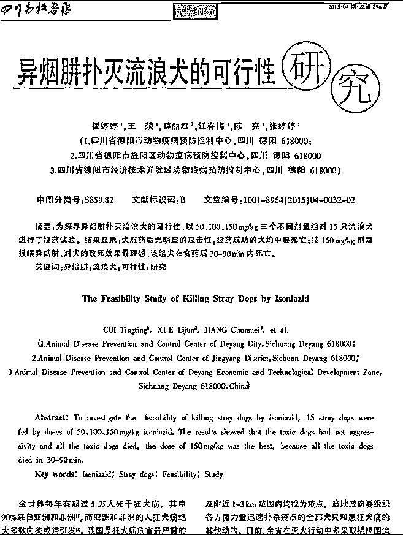
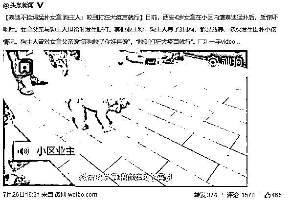
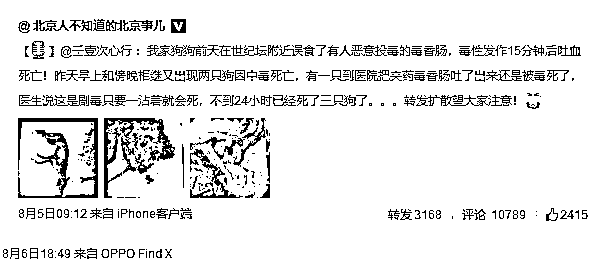
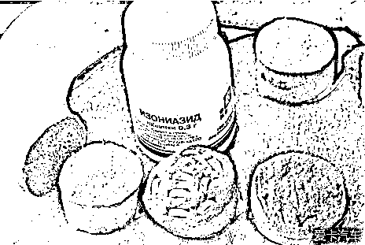
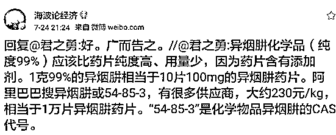
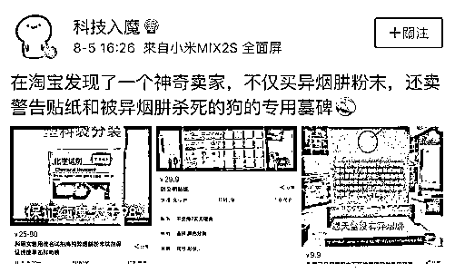
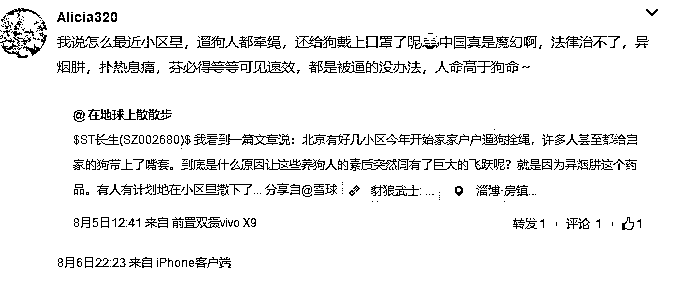
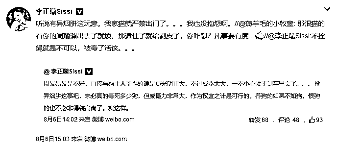
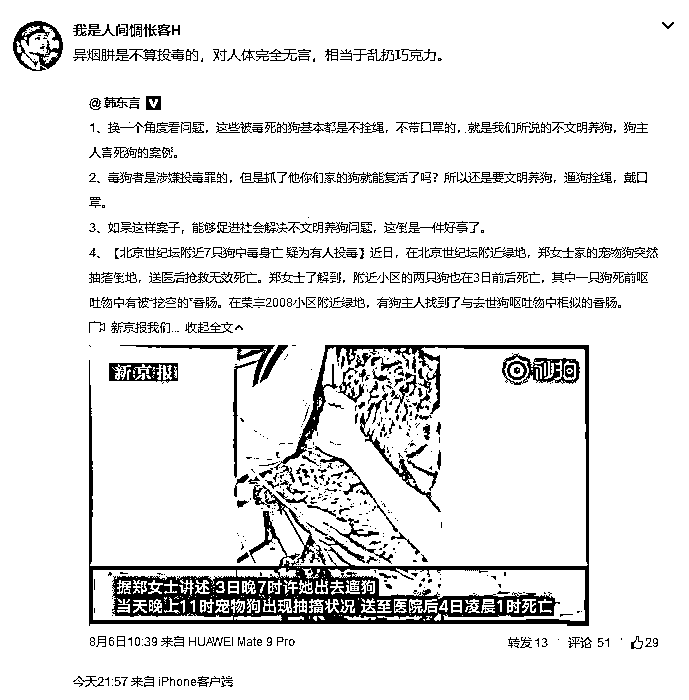

# 遛狗要栓绳，异烟肼倒逼中国养狗文明进步

看完标题，很多人困惑了，异烟肼是个什么东西，它怎么能倒逼中国养狗文明的进步呢，所以我先给大家介绍一下异烟肼，然后再展开论述。

异烟肼是一种抗结核病的药物，发明于 1952 年，一直到现在为止，它都是人类抗结核的主药，异烟肼对结核杆菌有高度选择性，抗菌力强，是目前人类所有抗结核药物中具有最强杀菌作用的合成抗菌药，对其他细菌几乎无作用。所以异烟肼是一款好药，对人类无害且非常有益。

但是 2015 年，四川德阳动物防疫站的一篇学术论文，让世界重新认识了异烟肼，这篇论文用实验数据证明，异烟肼虽然对人类完全无害，但是对犬类具备非常强的毒杀作用，按 0.15g/kg 进行投药，90 分钟内必死。

这篇论文发布后，并没有引起国人太大的关注，甚至没有引起农业部门的关注，国内很多地方政府直到现在扑灭流浪犬还在用费时费力的人工捕捉办法就可见一斑。但是这篇文章阐述的办法，在俄罗斯却发扬光大了。

俄罗斯是一个地广人稀的国家，由于缺乏经费长期关闭了收容站，所以流浪犬泛滥成灾，每隔一段时间，俄罗斯就要动用大量人力物力进行运动式的捕杀。所以，有些俄罗斯人慢慢的摸索出可以使用异烟肼进行投食，杀流浪犬的成本大大降低，根据俄罗斯人的经验，使用异烟肼杀一条流浪犬只需要 0.3 美元的成本，相比人力捕杀，非常便宜。

这一届世界杯在俄罗斯举办，在世界杯开始之前，俄罗斯再一次的进行了全国范围的流浪犬灭杀行动，这让异烟肼的使用被一些中国人知晓。

但是这个时候，异烟肼依然没有引起国人过多的关注，直到狂犬疫苗造假案件的爆发。

1**造假狂犬疫苗全面激化了中国人狗矛盾**

在中国，人狗矛盾是一直存在的，而且很激烈，狗的权利和义务始终没有得到法律的明确界定，所以在很多小区经常出现狗到处大便甚至伤人这种严重侵犯其他居民权利的事情，也经常出现有人恶意杀狗、偷狗但是法律却很难惩罚这种严重侵犯守法宠物犬权利的事情。

而在中国的现实状态中，恶狗的数量明显多于恶人，守法公民权利被侵犯的案件数量也远远多于守法宠物犬权利被侵犯的数量，所以中国大城市的居民大多数都很讨厌不栓绳的宠物狗。

例如下图这只狗公然放养，多次发生围扑小孩情况，遭到邻居抗议后，狗主人宣称，**“等狗咬了你娃再说”**，**“咬到打狂犬疫苗就行”**。这种明显侵犯别人合法权利的行为非常的普遍，而且大多数人对这种现象无可奈何，法律无法保护合法公民的权利。

本来双方之间的矛盾只是在网络上打打口水战，最多动手互殴一顿已经是很严重的事件了，而狂犬疫苗的造假案件导致了国人的全面恐慌。到处都是随时可能咬人的狗，而狂犬疫苗却不一定保证是真的，万一碰到小概率事件，**自己死的好冤**，所以全面激发了中国的人狗矛盾。

从 7 月中旬开始，不知道谁把俄罗斯使用异烟肼的事情发布到了网上，并引起了大量网民的关注，这半个月来急速的发酵，并直接改变了中国的宠物犬生存状态，在北京，已经出现了有人在小区内故意大面积撒播含有异烟肼的饵料对不栓绳的宠物犬进行清除的事件。

这里所谓的毒香肠，就是夹有异烟肼药片的香肠，大概就是下面这个样子，6 片以上大型犬都得死。

中国的首例异烟肼毒杀狗狗案，发生在北京，出现第一例后，迅速在北京城蔓延，因为他灭杀的是**不栓绳**的狗狗，所以火爆网络而且是一片叫好之声，流传速度非常之快。异烟肼属于处方药，是抗结核病的第一药物，几乎所有药店都有存货，虽然是处方药但是还是很容易搞到的。

更为甚者，还有人专门在淘宝贩卖科研用高纯度异烟肼粉末，效率十倍于普通异烟肼药片，只需要 1 克粉末，就可以完成灭杀。

还有人嚣张的在淘宝上售卖异烟肼专用狗狗墓碑，什么意义都没有，纯粹是示威。。。

异烟肼这个药物的用法普及，现在已经搞的北京的狗主人草木皆兵，**出门必栓绳，甚至连口罩都带上了**，严禁自家狗狗离开身边以防他们顺嘴吃下去什么不该吃的东西。

大城市养狗出门要拴狗绳这是最起码的道德要求，但是在中国几十年里爆发了无数次冲突都没有实现，如今在异烟肼的核威慑之下，居然奇迹般的实现了。

狗主人出门遛狗开始栓绳，不是因为法律要求，而是因为异烟肼的威慑才实现的，真是**魔幻的中国社会**。

2**为什么以前无人毒狗**

大家都知道，农村的狗基本都是放养的，因为地广人稀不像大城市小区那么密集，所以人狗矛盾是比较少的。但是与此同时，农村的偷狗贼是比较猖狂的，投毒杀狗很常见，使用的大多数都是氰化钾或者毒鼠强这种剧毒物质，尤其是毒鼠强，非常容易得到。

既然撒播毒鼠强也能灭狗，那为什么要等到异烟肼出现，大城市的小区毒狗才开始火起来呢。因为毒鼠强是剧毒物质，在公开场合放养狗导致潜在的咬人威胁这的确不对，但是你如果在公开场合直接投毒，那就不属于不对的范畴了，那是违法的。如果你在小区内大面积撒播毒鼠强，万一被小孩吃到了导致死亡，你是要进监狱的，就算没有人吃到，一旦被举报抓住，也可以直接送进局子。

而且，小区内的人狗矛盾，虽然气愤而且无可奈何，但是大家都是守法良民，你如果让他购买毒药在公众场合无差别投毒，大多数人还是不敢的，过不去这个心理障碍。

但是异烟肼就不一样了，他对人类不仅无毒，甚至是治病的良药，但是因为人和狗的基因不同，这种药物在狗的体内无法代谢从而产生致死效应。所以大面积撒播异烟肼不属于投毒，很多人也没有心理障碍，被捅到网上还没有一个星期，就迅速的火起来了，非常流行。

异烟肼，给予了小区内不养狗之人一个犀利的武器，让他们和宠物犬主人之间争斗的攻守之势发生了逆转。

3**美国人是怎么养狗的**

我们都知道，这个地球上，狗权最高的地方就是美国，在美国如果故意伤害他人的宠物犬，处罚是非常严厉的，甚至虐待自家的宠物犬，也会被告上法庭。那么美国是如何保证宠物犬不伤及其他人的自由和权力来化解人狗矛盾呢？

美国法律规定，3 个月龄以上的狗都要登记。要养狗先到当地政府申请并登记，注册收费一般是每犬 10 美元至 15 美元，做过绝育手术的狗减免 5 美元，疫苗必须打，无证的狗直接按流浪犬灭杀处理。

美国法律还规定，所有的狗，出门必须栓狗绳，有些州还要求必须带口罩来确保宠物犬不咬伤他人。一旦有人出门不拴狗导致他人被咬伤，那么狗主人会被罚几万到几十万美金，如果这个人因为被狗咬伤而致病，即使你富如比尔·盖茨，法律也会让你赔得**倾家荡产**都不够。

如果被人发现有狗上街而附近无狗主人，无论此狗有没有证，一律按照流浪犬处理。有一个案例，美国一位老太太花园里闯入一条陌生狗，老太太马上报警，3 分钟不到一名大汉驾着一辆捕狗车赶来直接捕获了这条狗带回警局。

随后，警局会公布照片供人认领，时间只有 3 天，一经确认，主人马上奔赴警局，交够罚金，接受一番教育后才能带回狗。

如果超过 3 天无人认领，主人就失去了拥有此狗的权利，警局有权利按流浪犬身份任意处置此狗。美国法律保护的是持证合法宠物狗的权利，对于流浪犬可就不那么友善了。

美国对守法宠物犬的权利保护非常严格，但是对不守法宠物犬的处罚也非常严厉，所以才能服众，让全体美国人都接受了宠物犬的存在，可以说在美国宠物犬的地位非常高，无限接近于家庭成员，人狗关系为世界最和谐。

关于我对此事的看法，我基本上是中立态度，我很喜欢狗，但是也很讨厌那些在人群密集的小区、广场、公园等公共场合让宠物狗撒丫子乱跑的人，除了狗主人不怕被自家狗咬，这对其他所有人的生命安全都是巨大的威胁。

对于异烟肼目前在全国出现疯狂流行之事，首先法律是肯定管不了这些在小区里到处投放异烟肼饵料之人的，而且你很难抓到他，最后就算抓住了他也无罪，因为罪名和到处乱扔感冒药是一样的。

这种事对宠物犬主人公平吗，不公平，对宠物犬造成了巨大的生命安全威胁，法律无能为力。但是之前宠物犬不栓绳到处乱跑对其他人造成巨大的生命安全威胁的时候，法律也是无能为力，所以现在只能算打一个平手。法律管不了这个事，而以前的现状严重有利于养狗人，所以出现了异烟肼，只是让攻守之势逆转而已。

从目前的状态看，凡是出门栓狗绳，不让狗狗在外面乱跑乱吃东西的狗主人，异烟肼都威胁不了他们。异烟肼只是一种威慑，你要说真的毒杀多少狗狗，那也是很难做到的。

所以我对这种状况的出现，支持大于反对，如果能趁此机会倒逼中国养狗文明的进步，让所有的宠物犬出门**必栓绳**，我想也能洗脱养狗人这么多年积攒的恶名，能让中国全社会更快的接受宠物犬的存在。

毕竟，出门栓绳甚至戴口罩的狗狗，真的很**可爱**，不会对周围邻居造成威胁还这么可爱的狗狗，谁不喜欢呢？

觉得此文的分析有道理，对你有所帮助，请随手转发。

长按下方图片，识别二维码，即可关注我

近期精彩文章回顾（回复“目录”关键词可查看更多）

华为员工都这么穷，怪不得拼多多能火 | 房价跌 20%就会全面崩盘，地产杠杆远比你想的要脆弱 |  为什么碧桂园的质量那么差 | 清醒点，放弃全面开征房产税的幻想 | 央行和财政部隔空掐架，我支持央妈