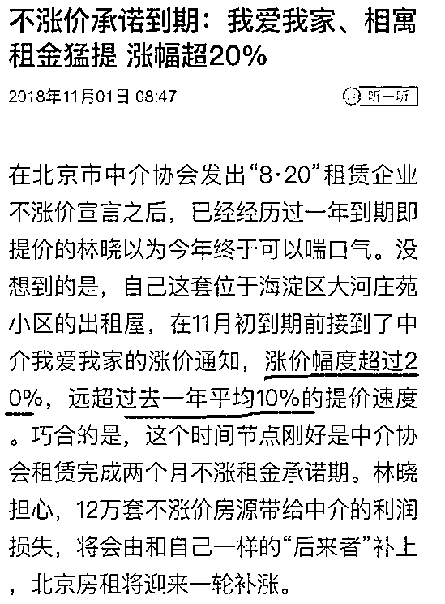

# 房租宗初现苗头，我爱我家房租暴涨 20%

喜欢我的都关注我了~

2008 的 11 月，我国推出了四万亿计划，掀起了十年货币大放水的序幕。狂涌而入的货币，让雪崩的房地产瞬间起死回生，各地房价开始突飞猛进。

2010 年 1 月 10 日，国十一条出台，增加二套房首付，以此为开端掀起了一轮对房价的强力打压调控，各地纷纷出台政策严控房价，猛涨的房价戛然而止，开始回落。与此同时，反弹的股市也开始见顶回落，股市楼市双跌，超发的货币无处可去。

从 2010 年五六月份开始，大蒜、绿豆、生姜开始轮番涨价，蒜你狠、豆你玩、姜你军的词汇脍炙人口，大蒜的价格甚至贵过猪肉，有关部门的解释是，北方倒春寒影响农产品的收成。

表面上虽然是这么说的，但是大家心里都清楚是怎么回事，政府当然也知道，超发的货币才是罪魁祸首，这些货币没办法去股市，没办法去楼市，那就只能爆炒农产品了，摁下葫芦起来瓢，刚压下大蒜，生姜就要跑出来凑热闹。

所以，2010 年底，央行果断关掉了放水的闸门，开始控制货币，但是印钞放水这东西，像吸毒，只要你吃了第一口，你就很难戒掉，因为等你停药的时候，副作用会双倍反馈出来，药不能停啊。

所以，2011 年全国爆发小钱荒，各地民企极度缺钱，民间放贷利率均价从月 1%飙升到 3%左右，高的甚至可以达到 6~8%，这意味着 100%的年化利率，这些民企为什么借高利贷，因为不借立刻死，借了还能缓一缓，实体经济极度缺钱。

但是效果也是有的，2011 年各地农产品的价格一落千丈，2010 年金乡的蒜价一度冲破 8 元/斤，但是在 2011 年却跌至 0.6 元/斤，无数炒蒜客赔的血本无归，再怎么离谱的歉收和丰收，都无法解释如此巨大的价格波动，2010 年的蒜价暴涨就是恶意爆炒的结果，毋庸置疑。

到了 2011 年，各地缺钱，利率飙升，直接放贷给别人比炒大蒜要舒服多了，没有资本接盘的蒜价自然开始大幅暴跌。但是对经济的伤害非常明显，这么高的利率，实体经济压根活不过一年。

所以 2012 年，央行再次启动印钞机，当年中国占全球新增货币供应量近一半，戒毒的人再次复吸，用药量通常比之前还大。。。

如此之大的货币供应，利率自然就下去了，各地的企业主、工厂主开始欢呼雀跃，终于活下来了。但是如此海量的货币供应，自然要找一个去处，炒农产品的人在 2011 年差点跳楼，暂时不敢炒了，于是 2013 年，各地房价再次抬头，试图上涨。

严控房价是中央大计，怎么能容忍再次复辟，既然民间借贷利率已经压下去了，实体经济应该暂时没事了，于是央行再次关掉了水龙头。

然后又闹钱荒了，这次的规模和力度比上一次大多了，不仅民间借贷利率飙升，连银行的利率都开始飙升，银行的隔夜拆借利率在 2013 年 5 月 7 日还是 2.36%，到了 6 月 20 日，就已经飙升到了 13.44%，资金市场完全失控了。

换言之，以前风险很大的民间微小企业借钱年化才 12%，在钱荒的时候，银行出面找人借钱年化居然都要 13%，民间微小企业的借贷成本可想而知，再次突破 100%。

于是，央行被迫再次放水，为了吸纳货币，不至于对民生领域产生巨大冲击，中央在 2014 年掀起 A 股牛市，引导资金进入股市。在股市不小心玩崩盘之后，2015 年底再次启动房地产作为货币蓄水池，导致 2016 年的楼市暴涨。

后面的事情，大家就很熟悉了，回顾这段历史就是要告诉大家，货币超发是一定要有去处的，资本是闲不住的。

房租宗初现苗头

今年房地产开始全面回调，各地售楼处被砸之后，我就开始想，下一个暴涨的投机品种是谁。因为楼市下跌，股市下跌，而货币还在不断释放的情况，非常的类似于 2010 年，那一年诞生了蒜你狠，今年会是谁呢？

而今天的一个新闻，让我看到了新的投机品种的苗头，虽然只是苗头还没有成型，但是这个投机品种的可怕程度远胜于蒜你狠和逗你玩，因为它叫房租宗。。。

今年 8 月份，租房贷风波爆发之后，有关部门严查长租公寓相关问题，公寓方表态，2 个月内提供 12 万套租赁房源，且绝不涨价。

到了 10 月底，2 个月时间刚结束，公寓方就开始迫不及待的涨价，据北京商报的报道，北京的林晓房租到期后打算和我爱我家续签，租金被要求一口气提升 22%，林晓认为，这是公寓方想弥补 2 个月时间房源不涨价的巨大损失。

大家见惯了楼市的大涨特涨，觉得房租上涨 20%不是事对吧，那换成具体数据大家就感到很刺眼了。

林晓的出租房首租于 2016 年 11 月，当时的租金是 5100 元/月左右，2017 年 11 月第一次续约的时候，中介通知要上涨 10%，租金改成了 5700 元/月，林女士觉得还能忍受就同意了。

但是 2018 年 11 月，林女士打算再次续签的时候，我爱我家同时租金要从 5700 元/月上调到 7000 元/月，租金涨幅高达 22.8%，同时即便是续租，林女士也要再交一次中介费。

租金上涨 22%的概念就是，你每个月的工资要多拿出了 1300 元人间蒸发，这可比吃蒜吃绿豆什么的狠多了，这个市场容纳的资本量和能剥削的利润，都远大于农产品市场，哪怕只涨 20%，带来的利润也超过农产品市场之和，不信你盘算一下，你上个月吃了多少农产品下去。

更可怕的是，报道中还有一句，远超过去一年平均上涨 10%的提价速度。我这里想问一下，10%很少吗？有多少人一年能稳定加薪 10%，站出来我看一看，凤毛麟角吧。

即便按这个 10%的增速去考虑，林女士的这套房子，明年的月租会涨到 7700 元，后年的月租会涨到 8440 元，如果她不能每年稳定加薪，她的生活水准就会节节下降，最后开始吃土。

房租上涨的速度远超居民收入的增速，加上房租的刚需程度和其费用基数的庞大，对人民群众造成了巨大的伤害。可以说，大蒜价格上涨一百倍，对民生领域的扰动也没有房租上涨 10%恐怖，因为你根本吃不了几颗大蒜。

资本可以爆炒大蒜、绿豆、生姜等生活必需品，只需要垄断后哄抬价格就可以了，但是我们同时也要看到，租房领域是一个更容易被爆炒的市场。首先，租房肯定是生活必须品，其次，租房市场的供应是有限的，不可能迅速扩大。二个特点一结合，简直就是炒作的极佳品种，爆炒个大蒜顶多每个家庭每个月剥削十几块钱出来，房租就不一样了，分分钟每个月多剥削上千块钱，而一线城市的租房率大概在 40-50%之间，有一小半的人，宁可让资本去炒大蒜，也不希望资本来炒房租。

所以，房租宗一旦出现，对民生领域造成的压力会远大于任何品种的涨价，生活必需品不仅有食物，还有房子，我可以不买，但是总要给个地方租吧。

目前的房租宗只是初露苗头，还没有彻底成型，如果政府不强力打压，明年再涨个 20%，那才是真正的猛虎出笼。正常的房租应该和居民收入增速呈正比增长，绝对不应该允许资本入场爆炒。

所以，我这里呼吁监管尽快加强租房市场的管控，不要让房租宗这种东西出现，趁早掐灭在萌芽状态，它比十个蒜你狠还具备危害性。

觉得此文的分析有道理，对你有所帮助，请随手转发。

长按下方图片，识别二维码，即可关注我

近期精彩文章回顾（回复“目录”关键词可查看更多）

华为员工都这么穷，怪不得拼多多能火 | 房价跌 20%就会全面崩盘，地产杠杆远比你想的要脆弱 |  为什么碧桂园的质量那么差 | 清醒点，放弃全面开征房产税的幻想 | 央行和财政部隔空掐架，我支持央妈 |中国土地制度源自香港，但是香港却是劏房密布 | 为什么中介哄抢租赁房源，因为贩毒都没它来钱快