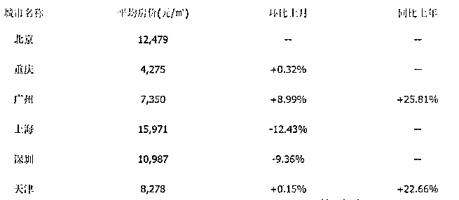
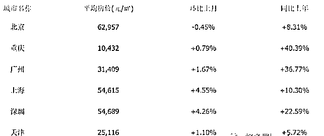

# GDP 排第一，也不代表你强大

中国人有一个很大的误区，那就是把 GDP 和国力划等号，认为 GDP 上去了，国家自然就强大了。而当中国的 GDP 排到全球第二的时候，就开始飘飘然自我陶醉了。实际上，GDP 排全球第二不代表你强，就算排到全球第一，也依然不能代表你强。

中国的 GDP 即便超过美国，也不代表你就崛起了。很多人不理解 GDP 排全球第一的话怎么就不强了，那是因为 GDP 从来就不代表国力啊，GDP 只是生产总值，历史上 GDP 高但是国力弱的例子比比皆是。

曾经的中国 GDP 排世界第一

要论 GDP 高但是国力弱的最典型例子，清朝是当之无愧的第一。鸦片战争的时候，中国的 GDP 占据全球 1/3，不仅是第一，而且超过当时的全球第二英国的 GDP 高达 7 倍，可以说是巨无霸的存在。

这么强的国家，有人敢挑战他吗？尤其是远涉重洋跑到这个国家的主场去战斗，这是在送死吧。英国人一开始也是这么认为的，所以鸦片战争开启前，英国国会争论非常激烈，一半的人反对出兵中国，认为胜算太低，军事行动以 271 票对 262 票勉强通过，英政府始终未正式宣战，对外宣称这次军事行动只是一种报复，而非战争。

执行此次军事行动的，只是英国一只远征队，初始军事目的我认为应该就是封锁中国沿海，逼迫清政府打开贸易，如果能赔点钱就更好了。否则不至于派出如此弱小的一支舰队攻击万里之外的庞大帝国，就冲这个配置的兵力也知道英政府一开始真的只是要报复，而不是战争。清政府看不起英国，英国自己也不认为能轻易击败中国，第一波远征军只是试探。

但是随着战斗的展开，远征队取得了难以置信的轻松胜利，屡战屡胜，攻占了中国多处战略要地，每次战役死亡都只是个位数，而且主要是印度兵。鸦片战争打了 2 年，英军把船只能开到的战略要地全部打了个遍。

这场战争，暴露了清政府的虚弱，从此清朝不再是让西方列强恐惧天朝上国，而是人见人爱的肥羊，各帝国主义国家，随便找个由头就敢发动战争，而战争的结果无一例外是清朝不断的割地赔款，这更加刺激了帝国列强的贪欲。

为什么英国能轻松打败 GDP 为自己 7 倍的清政府，其核心原因把 GDP 数据等同于国力是非常荒谬的。

鸦片战争的时候，虽然英国的 GDP 低，但是英国的生铁和煤的产量却占据了世界的一半，在那个时代，铁和煤炭就代表世界最高科技产品。《大国的兴衰》书中认为，经济总量本身并无太大意义，其质量和构成更为重要。

鸦片战争时，英国的 GDP 构成，是机器、是大炮，而清政府的构成，是瓷器、丝绸和粮食，当双方碰撞到一起的时候，自然就一败涂地了。

鸦片战争没有打醒中国，却打醒了日本，日本开始大力学习西方进行工业化革命，把武士刀给换成火枪，到了 1894 年，连弱小的日本都敢挑战中国了。

1894 年的甲午中日战争，中国惨败，赔偿给日本的白银相当于日本 7 年的 GDP 总和，日本 GDP 低没关系，直接抢中国的就行了。

今天的中国 GDP 高在哪

改革开放后，中国的 GDP 数据突飞猛进，人们的生活水平得到了巨大的提升，但是质量并没有同步跟上。

曾经的中国，GDP 主要靠陶瓷、丝绸和粮食撑起来，而今天的中国主要靠什么呢。靠房地产、纺织和烟酒。花一亿元去制造原子弹，其产生的 GDP 和花一亿元去生产衬衫是一样的，但是当战争降临的时候，那是完全不可同日而语的。

而中国的 GDP 之所以大而不强，不仅仅和科技含量低，原创精神缺失有关，也和 08 年以来的三次大放水有很大关系。

08 年以来，中国的货币放水非常有规律，大概每 3 年放一次，放水的结果就是中国目前的 M2 数据已经超过美国的一倍，而且放水效果越来越弱，GDP 未老而 M2 潜力先衰。

第一轮放水始于 08 年底，降息 5 次降准 3 次，推出四万亿计划，大水漫灌，效果非常显著，GDP 增速从 6.4%直线反弹到 12.2%。

第二轮放水始于 2012 年，降息 2 次降准 3 次，对冲欧洲经济问题对我们产生的不利影响，效果也还可以，GDP 增速从 7.5%最高反弹到 8.1%。

第三轮放水始于 2015 年，说的是不搞大水漫灌，要搞喷灌滴灌，结果 6 次降息 5 次降准，效果很弱，GDP 增速从 6.7%最高反弹到 6.9%，几乎原地不动。

从历史来看，每一次放水，都只能刺激一年左右的经济，然后形势又会急转直下，刺激效果一次比一次弱，已经接近到了无效的边缘。但是释放的海量 M2 却没有消失，08 年的时候，中国的 M2 数据为 47 万亿，而 17 年末 M2 数据为 168 万亿，翻了 4 倍，而 17 年美国的 M2 折算成人民币，也仅为此数值的一半。

大量的人民币充斥市场，并以中国特色的汇率管制限制出境，导致本土的 GDP 严重虚胖。上面说中国的 GDP 组成是房地产、纺织和烟酒，那么其中的大头是什么呢，没错就是房地产，房地产的上下游行业经济，组成了中国 GDP 的绝对大头，说占据半壁江山都不算太夸张。

2008 年，北京房价暴跌，如果从暴跌的最低点算起，北京房价 10 年来涨了 10 倍，如果从暴跌前的房价算起，也涨了 5 倍。

2008 年 1 月房价

2018 年 1 月房价

可以看出，超发的人民币一点没浪费，全部堆积到房子上面去了，中国的 GDP 是靠印钞印出来的，是靠房地产泡沫堆出来的。

2008 年，中国每年房地产销售 6.2 亿平米，折合 700 万套，而 2017 年中国房地产销售 17 亿平米，折合 1700 万套，单价还翻了四五倍，政府收了卖地的钱又去修地铁搞基建，你说这 GDP 能不高吗？

靠房地产堆砌出来的 GDP，不堪一击。如果到了战争年代，一套北京的房子能换成一台战斗机发动机，我觉得那也很值，但是能换的来吗？换不来的！核心科技产品，必须靠自己造。

前事不忘，后事之师

鸦片战争，中国输给英国的核心原因，除了 GDP 大而不强之外，还有重要的一点就是人均 GDP 很低。1840 年上亿中国农民的总产出会让 500 万英国工人自愧不如，但是中国农民的产出大部分都被自己给消耗掉了，很难再筹集出多余的物资给政府用作军事用途，而英国政府实际能从 500 万英国工人身上筹集的资源，是远大于清政府的。

所以，即便当时清政府拥有和英国政府一样的科技树，最终结果也是会输掉的，输的原因居然是财力不如英国。而今天的中国人，当战争降临的时候，你还能在房贷的压力下再多缴 10%的收入来当军费吗？我觉得很难。

决定一个国家实力的，不是 GDP，而是剩余可调集财富数量以及科技产品的生产力，房地产支撑不了大国崛起。

肥大不等于强大，摆脱 GDP 幻觉，把精力投入到原创和研发，才是中国的出路。前事不忘，后事之师，一叶障目，实为害国。

觉得此文的分析有道理，对你有所帮助，请随手转发。

长按下方图片，识别二维码，即可关注我

近期精彩文章回顾（回复“目录”关键词可查看更多）

华为员工都这么穷，怪不得拼多多能火 | 房价跌 20%就会全面崩盘，地产杠杆远比你想的要脆弱 |  为什么碧桂园的质量那么差 | 清醒点，放弃全面开征房产税的幻想 | 央行和财政部隔空掐架，我支持央妈