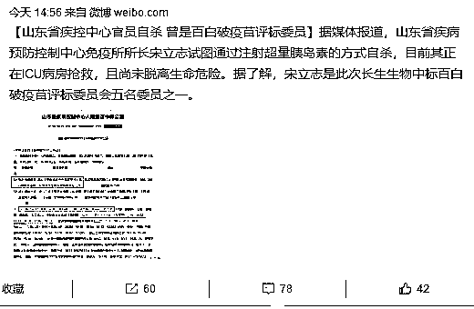

# 夜报|| 市值 600 亿的医疗上市公司实锤造假

昨天，美年健康被自媒体爆出造假，政府部门反映迅速，立刻前往查实，而美年健康公司还在狡辩，于是今天搞笑的一幕出现了，美年健康刚刚发布澄清声明，就被政府公告给实锤造假。

图 1

图 2

注意看时间哦，一个是今晚 8 点 40 分，一个是 8 点 51 分钟，堪称年度最巧合事件。而这种被实锤造假的公司，毫无疑问要被市场抛弃，证监会刚修订了退市法，又来一个不怕死的。如果借此机会能整顿中国的歪风邪气，我认为是非常好的一件事情。

~~~

拼多多打算举报别人拉。今天上午，拼多多创始人黄峥连续发声，认为近期网络舆情对拼多多属于恶意污蔑。下午，拼多多又召开了媒体发布会，称“针对拼多多不公平”。

而且拼多多还要举报恶意污蔑者，我想问你打算举报谁？卖假货的去举报正规厂家吗？

~~~

据媒体报道，山东省疾控中心免疫所所长试图注射超量胰岛素自杀，目前正抢救；其系长生生物中标百白破疫苗评标委员会委员。(华夏时报)

但是到了晚上，官方出来辟谣，山东疾控中心官员自杀不实，只是糖尿病。（凤凰网）。

那么你到底相信哪个呢？其实我们心里都有判断了，老百姓不傻。

~~~~

7 月 31 日下午，深圳发布楼市新政。具体内容包括：暂停企事业单位、社会组织等法人单位在本市购买商品住房；居民家庭新购买商品住房的（不含人才住房、安居型商品房），自取得不动产权利证书之日起 3 年内禁止转让。对购房人离婚 2 年内申请住房商业贷款或公积金贷款的，各商业银行、市公积金中心按贷款首付款比例不低于 70%执行。

国家放水的时候，深圳继续打压房价，这份力度和决心可以说是非常大了，这几年还打算房价继续暴涨翻倍的人可以放弃幻想了。

其实根本不用政府出手调控，假设政府不管，北上深的房价再涨个 100%，我可以明确的告诉大家，不用调控了，中国房价直接崩盘，杠杆断裂失控后，从 20 万一平跌到 2 万都有可能。

不让涨，实际上是为了保护房价，懂经济的人都懂这个道理。

~~

今天股市没有操作，继续不动，我觉得至少也能再拿半个月。