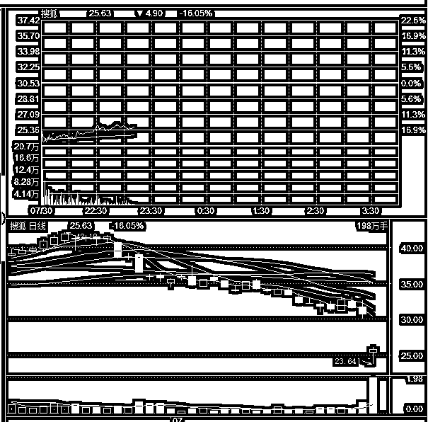
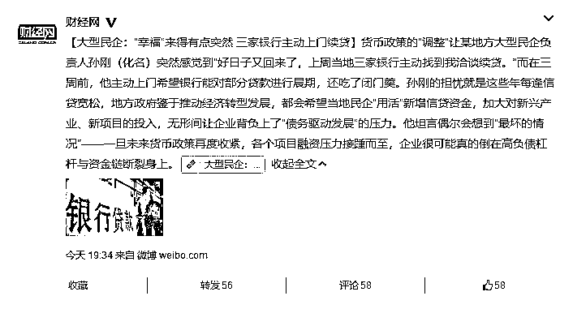
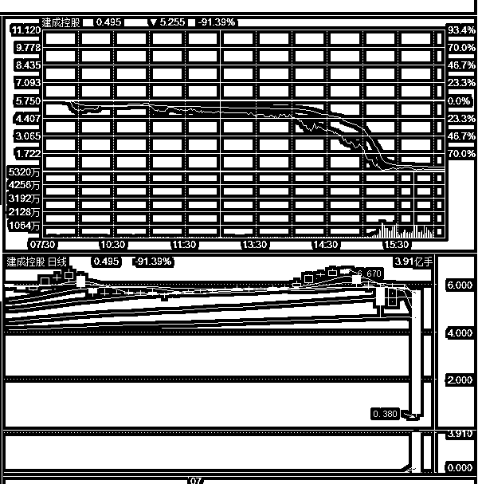

# 夜报|| 科技股全球连续受挫

今天，搜狐网公布财报，总营收、盈利情况均低于市场预期，所以今天夜间开盘，大幅暴跌。

而上周，脸书和推特均大幅暴跌，今天搜狐居然也走出了类似的跌幅，原因也是财报不佳，美股的科技股连续大幅受挫，导致 A 股创业板今天也跟着暴跌，其背后的逻辑，是质疑全球的科技公司能否继续实现高增长。

今天创业板的下跌真的很烦，好不容易走好的姿态，又给砸破了，今天这种形式其实算破位了，要不是看到上证 50 拼命拉盘那基本就没戏了。

但是看到有人在护盘之后，加上国家的确是在开始放水，我觉得这里怎么也是个筑底吧，顶多重新回去一次呗。

来看一下这个新闻，三周前到处求爷爷告奶奶都没有银行愿意展期的民企，这周突然有三家银行主动找上门要求续贷。这一下资金链就续上了，不然银行全面抽贷的话只有死路一条。

那么银行怎么那么好心突然就不抽贷了，很明显，这一波又开始放水了。政府主动放水的时候能否挽救经济不好说，但是股市应该不会再度股灾了，这一点概率还是挺大的。

~~~~

港股建成控股今天突然暴跌 90%，这个曾经一年 10 倍的股，一天之内回到了起点。

是不是很吓人，其实 A 股里也有很多类似的股票，都是曾经莫名利空大幅拉升，崩盘之后连续 N 个跌停的，A 股有跌停保护制度，所以不会出现一天 90%这样的惨状，但是连吃六七个跌停的，还是大有人在的，还不如一天跌到位呢。

那么有没有什么办法来鉴别这种股票呢，其实是有的，以这个建成控股为例，他每天的成交量，大概在 0.2%左右，凡是这么低的成交量，又是民企+小盘股的，我可以直接判定 95%的概率那就是庄股，哪天一个不注意就崩盘了，这个小知识点给大家说一下。