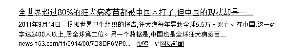
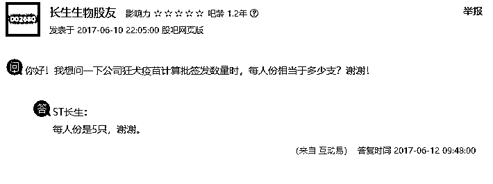
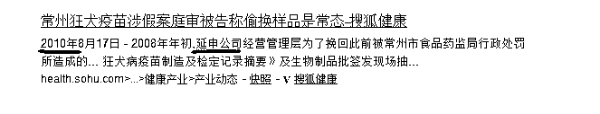
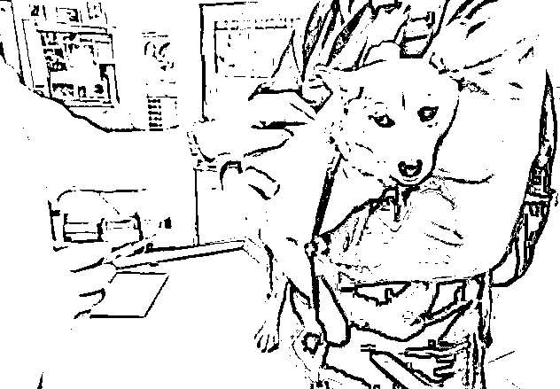
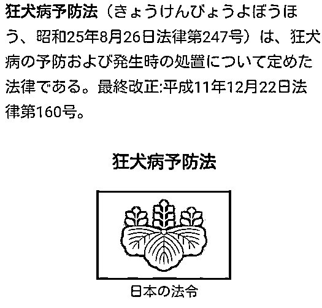

# 中国的人和狗，谁更应该打狂犬疫苗

我们都知道，狂犬病是一种很恐怖的疾病，一旦发病则死亡率 100%，而他又 100%可预防。所以在我国每年有大量的人被狗咬伤注射狂犬疫苗，可以说狂犬疫苗在中国属于一种救命药，销量非常之大，大到什么程度呢，全球 80%的狂犬疫苗都是在中国被注射的。

按照 2011 年的公开数据，中国狂犬疫苗的使用量达到了每年 1500 万人份，相当于 7500 万支疫苗。

这个数量，超过全球生产所有狂犬疫苗的 80%，据全球历史卫生数据进行估算，如果完全不打狂犬疫苗，那么中国每年会有 3 万人死于狂犬病。相比 1500 万人份的疫苗数量，这意味着 99.8%的人群就算不接种疫苗，也不会有事。

这么高的比例，也是这次疫苗造假的理论基础，哪怕注射的是清水，你也有 99.8%的概率是没事的，如果里面大部分疫苗是有效的，少部分疫苗因为质量把控问题是无效的，那么你没事的概率可能高达 99.9%以上。至于剩下的发病死亡之人，推给小概率事件就可以了，冷链运输环节失效、医院储存失效、注射方法不当，直接被病犬咬中神经系统，都有可能导致疫苗无效，**所以狂犬疫苗造假很难被公众发现，医药公司根本不慌**。

和长生生物同一股东的江苏延申

不过这次案件，直接引出了我们今天的主要话题，那就是**中国的人和狗，谁更应该打狂犬疫苗。**

外国人是不打狂犬疫苗的

我们从上图的数据看到，全球 80%的狂犬疫苗都给中国人打了，这个时候就引出一个问题，欧美日等发达国家他们为什么不打狂犬疫苗。

欧美发达国家是出了名的爱养狗，在美国吃狗肉、虐待狗都是违法行为，狗狗数量极多。难道欧美的狗都是高素质的狗，这么多狗居然不咬人？他们的狗通灵了？

事实当然不是，发达国家的狗，和中国的狗，咬人的概率是一样的，但是国外的人被狗咬了，不会去注射狂犬疫苗，所以狂犬疫苗的用量很低。

这又奇怪了，外国人不怕死吗，哪怕只有 0.2%的几率挂掉，你也得去打狂犬疫苗啊，几百块钱而已，一条人命啊，还是自己的命。

其核心原因是，欧美日的所有犬类，都是要申请养狗证的，所有注册犬只，每年都要定期注射犬用狂犬疫苗，被狗咬了之后，只要翻出这只狗的健康证查看其疫苗注射记录，被咬的人就不用注射疫苗了。而现在美国已经达到了 50 年零发病的标准，连狗狗的健康证都不用翻了，直接默认没事。

所以，在美国，人用狂犬疫苗一年总共消耗 5 万人份，和中国的 1500 万人份形成鲜明对比，在美国的狂犬疫苗，一般是给被无证野狗咬伤、被野生动物如狼、獾等咬伤，以及被蝙蝠攻击咬伤之人使用的。

目前，狂犬病在芬兰、丹麦、英国、法国、德国、瑞士、加拿大、美国、日本等，马来西亚和一些拉丁美洲国家都已宣布消除。世卫组织认为这些国家的家养犬为“无狂犬病风险”，也就是安全动物，不会再传播狂犬病。

目前，对狂犬病的潜伏期有长达十余年的传说，但是世界卫生组织（WHO）认定的狂犬病最长潜伏期为 6 年。大家知道这个数据怎么来的吗，其实对中国而言很具有讽刺意义，该病例是一位美国的菲利宾移民，在移民美国后从未离开过美国，然后突然狂犬病发作身亡，引发全美恐惧，因为美国几十年前就宣称已经在本土消灭了狂犬病了。

所以，美国人花费了巨大的代价研究这个病例，从死者脑中分离出了狂犬病毒，然后和记录在案的美国本土曾出现的狂犬病毒以及死者来源国家菲利宾流行的狂犬病毒毒株进行基因库对比，最后证实这名死者是在美国入境前就感染了狂犬病毒，因此证明狂犬病的最长潜伏期为 6 年。

这个案例，一方面说明了狂犬病潜伏期十余年的说法没有详尽完备的科学依据可以证实，目前得到世界公认的数据为 6 年，一方面说明了在美国因为狂犬病而死亡一人是多么不可思议以及轰动全国的事情。

实际上，世界各地都存在狂犬病，但是 95%以上的人类死亡案例，都发生在亚洲和非洲国家。

日本的狂犬病

既然 95%的死亡案例都发生在亚洲和非洲国家，那么同在亚洲的日本，是不是也饱受困扰呢。实际上，日本已经半个多世纪没有出现一例狂犬病了，也彻底消灭了狂犬病。

这一切，起源于日本在 1950 年制定的《狂犬病预防法》，规定家养宠物猫狗必须进行注册登记，且每年都要接种一次狂犬疫苗。对于无人认领的无证流浪猫狗实行彻底扣留制度，发现后立刻送卫生站进行处理。

所以，从 1951 年开始，日本的狂犬病案例急剧减少，从 1956 年开始实现零发病。按照世卫组织的规定，50 年之内未出现过狂犬病的国家，狗狗伤人后无需注射狂犬疫苗，而日本已经 62 年了。

所以，在日本，人用狂犬疫苗的储备量非常的少，只有极个别医院会有储备。在中国曾有人在出国前被狗咬了，国内注射了第一针疫苗后，到了日本准备打第二针，结果抓瞎了，所有的医院都说自己没有狂犬疫苗。到处打听后终于听说东京医科大学附属医院储备有少量人用狂犬疫苗，如获至宝的奔过去打救命药了，注射的时候医生还特别奇怪的盯着他看，因为从业后第一次打这种疫苗，还反复问他是不是确定要注射，因为很贵。

中国的狂犬病

在中国，狂犬病案例也被当成是政绩污点来处理，如果哪个省的的狂犬病案例排在了全国前三名，卫生部门铁定是会被责罚的，而其余名次的省份则基本不管。

所以在中国历史上，在狂犬病失控的时候，曾多次出现全城屠狗的事件，上世纪 90 年代，汉中市曾爆发过全城狂犬病疫情，应对方案就是全城屠狗，政府的解释是“人命大于狗命”，当时的确遏制住了狂犬病的流行，但是十年之后，一切如故。

捕杀政策对遏制狂犬病效果甚微，其核心原因是犬只的繁殖速度实在太快了，捕杀耗资巨大，只能应急而不可能持续，在全世界所有曾经采用捕杀政策来遏制狂犬病的地区，无一例外全部失败了。而且捕杀政策容易伤及无辜的家养犬，很容易引起民间爱犬人士的抵制。

所以，这种投入大，效果差的方案很快就被中国政府所淘汰了，政府换了另外一套方案来遏制狂犬病，那就是大力普及人用疫苗，只要你被狗咬了，就给你打狂犬疫苗，这样发病率就下去了。

这一手段粗暴省事，效果显著，于是很快得到了滥用。据宁波市疾控中心传染病所所长易波介绍，中国每年消耗人用狂犬疫苗 1500 万人份，耗资约 100 亿元，而宁波市每年消耗疫苗高达 12 万人份，**“狗伤人，人打针”**的本末倒置现象非常严重。

卫生专家严家新告诉记者，据卫生部等 4 部门 2009 年发布的“中国狂犬病防治现状”估算，如果我国所有的狂犬病暴露后病例均得到预防处置，每年约需 245 亿元，换句话说，还有一半多的人，被狗咬伤后没有选择打狂犬疫苗，这些人以农村居多。

为什么中国宁愿给人打狂犬疫苗也不愿意给狗打疫苗，是不是狗用狂犬疫苗很贵呢，当然不是，1 支人用疫苗成本就能生产 20 支兽用疫苗，狗用狂犬疫苗非常便宜，即便是进口的都不贵。

2010 年，为了有效减少狂犬病的传播，青岛决定对本市的犬类进行狂犬病接种费用从 40 元降低到 10 元，据政府人士介绍，这 10 元仅为更换免疫标志牌的工本费，狂犬疫苗本身等于是免费接种，青岛的兽用狂犬疫苗为法国进口疫苗，采购价为 17 元一支。10 元是亏本的，相当于政府掏钱补贴给市民接种，但是主动给宠物进行狂犬免疫接种的市民依然很少，没有这个观念。

为什么会出现**狗伤人、人打针**这种现象，核心原因是狂犬病的防治工作归卫生部管，但是狗却属于兽类，归农业部管。兽用狂犬疫苗与人用狂犬疫苗甚至是分别由农业部和卫生部进行审批和管理的，彼此之间严重缺乏合作互动。

**“农业部管的狗咬了卫生部管的人”**——这是严家新的名言，按理说，狗咬人导致狂犬病人死亡，狗应该负主要责任，管狗的农业部责任应该比管人的卫生部要大。但是实际行政操作中，如果一个省份出现大量的狂犬病人死亡案例，第一个责罚的一定是当地卫生部门而不是是农业部门。

所以，卫生部门推广人用狂犬病疫苗非常积极，但是农业部推广兽用狂犬疫苗却并不积极，费事没政绩，严重缺乏动力。

最后就导致了这么一个现象，中国人用狂犬疫苗产销量占据全球 80%，防治狂犬病耗资比美日欧发达国家还要多，但是狂犬病毒仍然大量存在于犬类种族体内，始终未能消灭，大力推广廉价兽用狂犬疫苗的国家，反而彻底消灭了狂犬病。

我们应该怎么办

世卫组织曾提出在 2030 年之前全球消灭狂犬病，并在上个世纪在全球大规模的展开了给犬类接种兽用狂犬疫苗的活动，目前在全球大约有一半的国家，已经彻底消灭了狂犬病，还有差不多 50 个国家，多年来的狂犬病发病人数为零。

而我国，显然离这个目标差距很远，1 和 0 的差距，和 1 到 99 的差距其实是差不多的，在全国范围内保持狂犬病零发病，这个难度是非常大的，那么我们应该怎么做呢。

首先，应该在全国范围内实行强制犬类登记工作，所有的宠物犬，应该主动到防疫部门登记注册，进行防疫、驱虫、绝育的宠物犬，才是真正的合法犬只。没有证件登记的宠物犬，一律划为流浪犬，不享受狗权，应该捕捉处理。

写到这里，部分爱狗人士恐怕已经激动的扑上来了，狗狗那么可爱，怎么能捕捉它，狗狗怎么可能会咬人呢，这世界上不存在咬人的狗，所以不用登记，不用打疫苗，流浪狗一样是狗，应该享受同等权利。

其实在我看来，这些爱狗人士这么做，不是在爱狗，实际上是在害狗。不管你杀还是不杀，中国总共就只能容纳一二亿只狗，不可能说存在你拼命保护流浪狗，狗群数量就能达到 10 亿甚至几百亿的，中国有 13 亿人，300 亿狗，出门之后发现大马路上全是野狗，我就问你怕不怕。

所以就算把狗群数量保护到了 300 亿，还是会引来大规模捕杀行为，狗群数量一样会降低到 1~2 亿，这是中国人所需要的宠物犬数量。

那么，这个大道理我们明白了，我们就开始考虑一下怎么增加这 1~2 亿宠物犬的权益了。首先，人是有身份证的，人的行为是要受法律约束的，所以狗也需要有证，狗的行为也应该受到法律约束，人权和狗权可以平等，但是如果出现狗权大于人权，这就不对了。

但是义务和权力都是对等的，当狗受到法律约束的时候，狗一样会受到法律的保护，中国很多人可以公开虐狗、杀狗亦不犯法，顶多只能道德谴责。为什么呢，因为狗没有什么义务，所以它也不享受任何权力。

这时候我们看一下美国，在美国狗权是非常大的，虐狗、杀狗都是严重违法行为，罚金非常之重甚至可以判刑入狱。但是与此同时，在美国所有的犬只都是要严格登记的，疫苗驱虫绝育一个不能少，如果狗主人没有保养好自家狗狗，也是严重违法行为。

狗是人类最好的伙伴，既然你选择了养它，就要给它最好的生活环境，定期注射狂犬疫苗既是对它负责，也是对其他人负责，要知道狂犬病第一个伤害的是狗，然后才能传染到人。

对于那些不愿意进行疫苗防疫，不愿意进行驱虫绝育，只顾自己玩狗开心的所谓“爱狗人士”，这种行为比虐狗还要过分。虐狗只是伤害了一只狗，反而会激起全社会对狗的同情和保护，而这种不负责任的养狗行为，会激起全社会对狗的反感和痛恨，**这种人配当“爱狗人士”吗？不配**。

让所有的犬只注册登记，接受管理，让所有的宠物犬主人定期给狗注射疫苗，检查身体，最终实现全社会对狗的接纳和爱护。狗主人承担的义务变多了，狗的权利也就增加了，那个时候虐狗杀狗才会受到法律制裁，从而实现全社会爱狗的目的，无人敢偷犬、杀犬，像美国一样实现人狗和谐。这才是爱狗，像**现在中国的爱狗行动，只能称之为乱象**。

根据目前全球其他国家的经验，当犬类疫苗注射率达到 70%以上的时候，在非狂犬疫区，就会有效阻断狂犬病毒在犬群中的链式传播，进而达到消灭狂犬病毒的目的，最终实现人和狗均零发病零死亡的效果。

这个目标其实并不难，兽用狂犬疫苗其实很便宜，全面接种也没多少钱，核心关键还是对全社会的犬只进行登记管理的工作上，这个应该列入法律，而不只是规章制度，靠民众自觉。

中国的人和狗，谁更应该打狂犬疫苗，这本不是什么问题，答案一目了然，但是现在就偏偏成了问题，我希望未来的中国人，不会再受到这个问题的困扰。

觉得此文的分析有道理，对你有所帮助，请随手转发。

长按下方图片，识别二维码，即可关注我

近期精彩文章回顾（回复“目录”关键词可查看更多）

华为员工都这么穷，怪不得拼多多能火 | 房价跌 20%就会全面崩盘，地产杠杆远比你想的要脆弱 |  为什么碧桂园的质量那么差 | 清醒点，放弃全面开征房产税的幻想 | 央行和财政部隔空掐架，我支持央妈