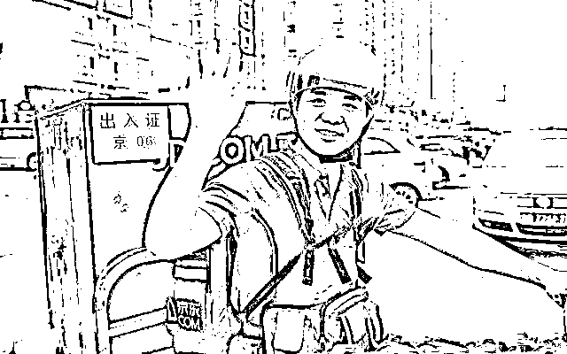
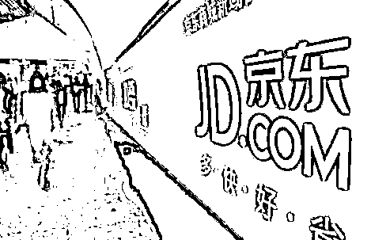
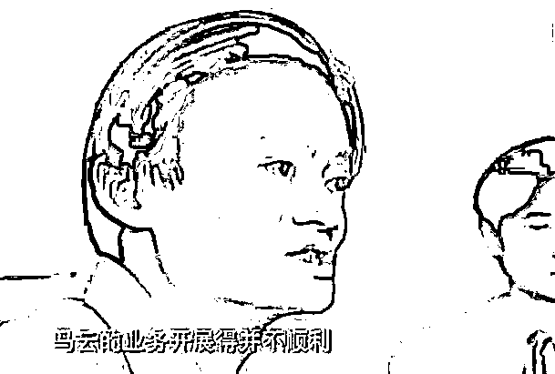

# 荐读|| 真正有能力的人你根本拦不住

文/小飞

少不经事时总对那些所谓的「成功之路」不屑一顾——轻轻松松一本书甚至几句话就能概括的，算什么秘诀？

若要真这么简单容易，岂非人人都能成功？

所以，必定有真正的关键之处有所保留。

不然的话，后起之秀越来越多，那前期成功的「前辈」早晚被拍死在沙滩上。

历史的车轮滚滚前进，确实有不少「前辈」已经被拍死在沙滩上。

但是拍死前辈们的后起之秀，并没有因为前辈们的有所保留就停止前进。

而时至今日我才明白，根本不存在「有所保留」这一说法。

就算成功的前辈毫不分享自己的经验，也拦不住真正有能力的人。而对于没有能力的人，即使将巴菲特派去给他当家庭教师，那也是扶不起的阿斗。

下绊子理论

每个人念书的时候，班上总会有一两个成绩优异，但是却不受大家喜欢的学生。我们那时候也有。

然后就有几个调皮的学生约好了要给他下绊子，想要阻止他考试拿高分。

比如，

考试前期轮流向他问问题，不给他自习的机会。

总是在他之前霸占住老师，不给他答疑的机会。

假装有门路偷偷给他透题，试图让他抓错重点。

于是，他们的努力终于有了回报——由于天天琢磨着给人下绊子，心思不在学习上，于是成绩一落千丈。

反而被下绊子的人，看到他们如此努力学习（找他问问题、找老师问问题），危机感愈发强烈，学习越发刻苦，然后成绩再一次突破天际。

至此，他们才明白，真正有能力的人，你根本拦不住。

与其浪费时间，花心思去想着拖别人后腿，还不如将精力用在缩短与别人的差距上。

后来，他们也不吝于对成绩比他们差的同学解惑。因为他们知道，若该同学有能力的话，早晚会追上你，那何不做个顺水人情呢。

若没能力追上你的话，那更不必担忧受到威胁了，还能落个「乐于助人」的好名声。

就如同被他们下绊子的学生曾经做的一样。

这个道理，我给他定义为，下绊子理论。

适用于每一个人

这个理论适用于每一个人身上，包括你，包括我，包括马云，包括刘强东。

这里我们得先定义一下成功，我认为在这里严格来说，应该是圆满达成一个短期或者长期的目的。

比如考试取得好成绩，比如减肥二十斤。

有了目的，并付出相应的努力。能做到的人，早晚能成功。

成功的方法从来的都不是秘密，前辈们也根本不屑于要隐瞒，因为真正有能力的人你根本拦不住。

都说「寒门再难出贵子」，在城镇与乡村教育资源分配严重不均的情况下，贫穷确实是一道难以逾越的障碍，但这并不能拦住真正的优质生源。

每年高考过后，媒体总会报道许多家境贫困的准大学生，其中不少人甚至拿到的是北大与清华的录取通知书。

还记得前两天那个收到北大通知书时还在拌砂浆的小伙子么？

大家在看到他的录取通知书时，请不要忽略掉他的勤奋、乐观、孝顺和懂事。

这样的一个小伙子，就算与大学失之交臂了，将来未必不会脱离拌砂浆这样的工作，走得更远、更好。

一时的贫困与苦难根本拦不住他的。

比如刘强东。

当年考上大学时，集齐全家人包括全村人之力，才凑出区区 500 元钱和 76 个鸡蛋，他就这样，带着这 500 元钱和 76 个鸡蛋到了大学。真正意义上的出身寒门。

到了大学，不仅要学习，还要想着如何养活自己，如何生存下去。家教、刷广告、抄写邀请函、推销书籍……

只要能赚钱的基本都尝试过，这一关基本上所有的寒门学子都能成功闯过，但是很多人也都止步于此。

解决完生存问题后，开始思考事业问题。

一开始选择的方向是开餐厅。对员工及其信任，待遇也不错，但还是失败了。收银的小姑娘和大厨谈起了恋爱，把餐厅亏没了。

餐厅事业失败了后，他找到的原因是自己不懂管理，又有针对性地到了管理最好的日本企业去学习。期间不断反思并总结自己失败的原因，也因此更坚定了自己创业的决心。

后来又去中关村租了个柜台开始卖电脑，一边卖一边培训，生意越来越火，品牌也渐渐打响。6 年时间，在全国有了 12 个门面。

而这 6 年的线下传统销售，让他知道了零售最核心的关键点：前端用户体验、后端成本和效率。

后来，将线下所有的门店关掉，转为线上。因为不看好此次转型，有十几个共同创业的兄弟离开了公司。

再后来，由只做电子产品扩展到全品类。

创业期间，最困难的时候为了省房租，整整六年都住在农民搭的工棚里，绝对的四处漏风。

后来四年住进了自己的办公室，不仅为了省房租，还因为要做客服。为了确保服务最好，而企业也没有钱，所以刘强东只能自己做客服。

因为要保证 24 小时都有客服回答客户服务问题，而很多客户都是夜猫子，所以刘强东每天晚上都要定闹钟，每隔两小时响一次，起来回答问题，就这样坚持了四年时间。

再后来的事，也不用说了，京东已经成了国内数一数二的电商品牌。

贫穷没有拦得住他，被员工背叛没有拦得住他，共同创业的兄弟离开没有拦得住他，持续十年的黑暗时光没有拦得住他……我实在想不到还有什么能把他拦下来。

刘强东这样的一个人，有想法、敢行动、会总结、有眼光、还能坚持，拦不住的！

我敢说，就算他没有整出京东，也会造出京西。

看看马云。

马云连着落榜三次，最后是凭借着英语特招才进的大学，但是这绝非运气。

那个年代，MP3 都还没有出现，也根本没有英语教学机构和老师。马云为了学英语，不仅坚持每天听英文广播，长年累月地练习英语。

还经常徘徊在酒店周围，寻找看起来会讲英语的人。急切地想要抓住每一个认识老外、练习英语口语、认识世界的机会。

就这样一个有明确目的，并不顾一切地为之努力的人，就算当年没有考上大学，也必然能成为一位优秀的英语教师。

再后来，马云毕业后成为了杭州市优秀青年教师，发起了西湖边上的第一个英语角，再后来为了满足市场、解决退休老师们的问题，成立了海博翻译社。

而这一过程，也并不顺利。曾为了让翻译社能生产下去，马云甚至亲自背着麻袋倒卖小商品，到处推销，维持翻译社的运营。

最终，翻译社也开始扭亏为盈。

其实我毫不怀疑，就算马云如今仍在运营着翻译社，其取得的成就也将处于行业内的顶尖水平。

再往后的事情，大家基本耳熟能详了。

你看，就这样一个为了达到目的、在合法范围内无所不用其极的人，

为了达到目的、能屈尊降贵低三下四的人，

为了达到目的、事必躬亲眼光独到的人，

就算没有创立阿里巴巴，也必然会打造出一个四十大盗。

他有能力、有目标、能坚持，要想达到目的的话，又有谁、又有什么事情能拦得住呢？

如今，马云说了，他创业的目的是为了给社会创造更大的价值。

不知道你们相不相信，反正我相信。

淘宝就已经改变了大多数人的购物方式，支付宝的出现也颠覆了传统金融行业。

接下来会是什么，我很期待。不止期待，我还会表示支持。

毕竟，这样一个人想做的事，普通人根本拦不住。既然拦不住，何不顺水推舟，让他能走得更远、更好呢？

跟人有关

在我看来，成功虽然跟机遇有一定的关系，但最主要的根本在「人」。

你若空有抱负、却不想着如何提升实力，目的永远只是目的。

你若有抱负有能力，却迟迟不敢行动，目的也不会朝你走进一步。

你若有抱负有能力也敢行动，但是少了坚持，那更大的可能是「死」在半路。

你若有抱负有能力敢行动也坚持了，但却没有达到目的，那请看看是否有意外收获？

放心吧，成功人士是不会吝于分享成功经验的，因为他们知道，能做到的人只是少数。

而这少数真正有能力的人，根本拦不住。大多数人，已经被各种人、物、借口拦在了路上，根本不足为虑。

就像胖子都知道运动能减肥，但是真正能通过运动做到健康减肥的有几个呢？

