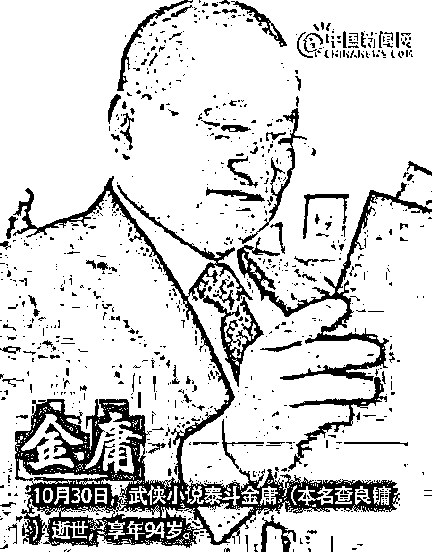
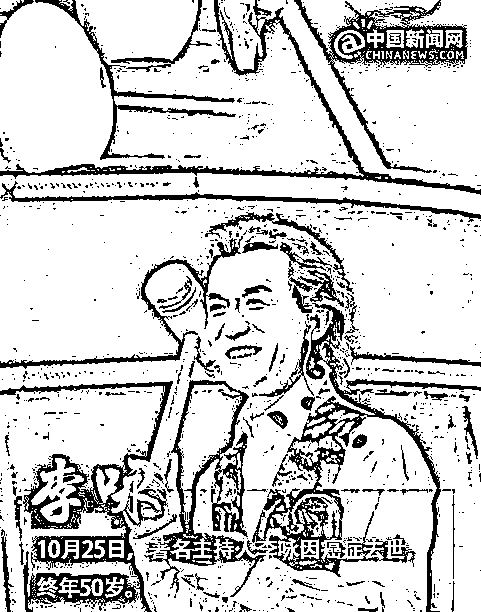
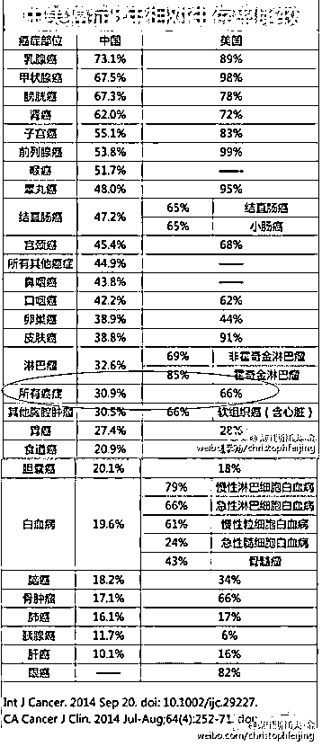
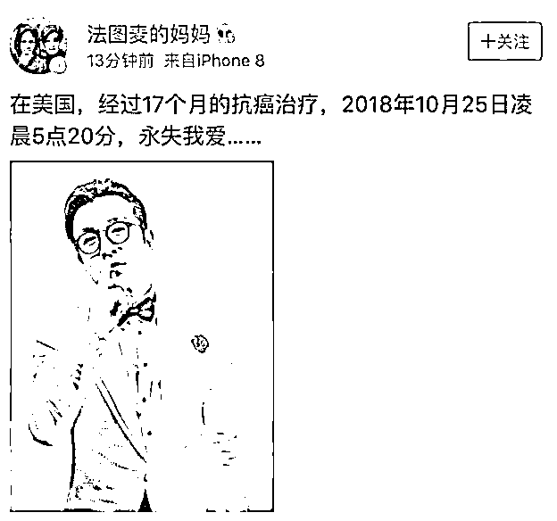

# 李咏和金庸都走了，生命无常，多陪陪家人

喜欢我的都关注我了~

昨天，金庸老爷子去世了，享年 94 岁，从任何角度去衡量，这个年龄都属于高寿了，老爷子走的并无遗憾。

但是就在前几天，央视著名主持人李咏也去世了，去世时年仅 50 岁，在这个年龄去世，毫无疑问是李咏家庭的损失，也是社会的损失。

金庸老爷子是文艺界的泰斗，而李咏也算是一方诸侯，他们都有德、有才、也有钱，但是彼此的生命轨迹却相差巨大，金庸 50 岁的时候正当壮年，而李咏却已经去世。

永失我爱

金庸老爷子晚年享受了最好的医疗服务，但是这并不是他长命百岁的核心原因，因为李咏也同样有钱，李咏的财富地位的确比不过金老爷子，但是享受完善的医疗服务还是绰绰有余的。

这次李咏的死因是癌症，在去世之前，他前往美国接受了抗癌治疗，为期 17 个月。之所以选择去美国接受抗癌治疗，是因为美国的癌症治疗技术远远高于中国，癌症病人 5 年生存率中美双方有明显的差异。

美国的医疗技术的确好，但是缺点也很明显，那就是贵。赴美留学生街头晕倒之前，用尽最后的力气叮嘱同伴，千万不要叫救护车。这不是一个段子，而是一个事实，因为美国的医疗费用太贵了，医院真的进不起。

李咏肯定是有能力支付美国高额的医疗费用的，但是即便如此，也没能逃过癌症的魔爪，因为美国的癌症生存率再高，它也不是 100%，只是相对于中国好而已。

虽然没有钱是万万不能的，但是有钱也并不是万能的，死亡面前人人平等，才华、品德、财富、地位都不能给你带来特权。

李咏的妻子哈文今年的微博一直坚持每天发早安，最初的时候人们都是莫名其妙，现在回想起来，这是哈文对李咏的期盼，是对命运的祈祷和抗争，她非常珍惜李咏还能和她在一起的每一天。

哈文的早安贴，停留在 10 月 17 日，随后再也没有发过任何早安，一直到 10 月 29 日宣布李咏去世的消息。

永失我爱，那个和哈文每天一起早安的人，永远的不在了。

高寿的金庸

李咏去世的时候，一定是充满遗憾的，他和哈文还有几十年的晚年没有度过，他甚至还没有看到女儿结婚。但是与此同时，金庸老爷子却享有 94 岁高寿，儿孙绕膝、颐养天年，可以说是毫无遗憾的走了。

金庸少年离家、顶峰封笔，可以说是一生传奇，年轻时的金庸也是拼命三郎，工作压力和工作强度丝毫不比李咏逊色，一手创立的明报曾让金庸位列香港富豪榜百强之内。虽说金庸有才，但是再有才的人，想白手起家获得金庸这样的江湖地位和财富，那一定是付出了巨大的努力和牺牲的。

但是，年轻时的拼搏和奋斗，并没有熬垮金庸的身体，老爷子很多年前就曾因为年龄太大，网上多次传出他去世的谣言，但是每一次都被证明是虚假的，一直到这一次为止。

金庸老爷子的身体硬朗到什么地步呢，21 年前，也就是 1997 年，香港作家马家辉在一次聚会中见到了金庸，当时金庸刚完成心脏手术不久，拄着拐杖，非常非常的虚弱，一副风烛残年随时可能会倒下的样子。当时马家辉在报社担任副总编辑，旁边有位姓赵的同事，目睹此景后回到报社立刻排了个讣告的版面，准备悼念金庸先生。

这并非诅咒金庸，而是记者和编辑的专业行规，例如很多火箭发射之前，记者都会提前准备好发射成功和失败的二份稿件，以备事件发生后第一时间上报纸。

这份金庸的讣告版面，放在赵编辑的抽屉里备用，一放就是 20 年。多年前，马家辉遇到赵编辑，笑问他金老爷子的讣告还留着吗，他笑道，还在我抽屉呢，并且年年更新！

2018 年，金老爷子真的去世了，这份讣告版面终于可以派上用场了，但是却不是赵编辑来安排这件事情，因为早在 10 年前，赵编辑就去世了，享年 48 岁。

人生就是这么奇妙，年富力强的人，可能寿命还比不过风烛残年的人。

生命无常

梁实秋先生说过：“人生过了四五十，谁先死都不好说呢”，人至中年，各种意外随时可能到来，也许你只能活到 50 岁，也许你可以活到 94 岁，这和你的财富地位并无必然联系，和你是否善于养生也无必然联系。

生命很短，短到可能你觉得自己才刚步入事业正轨，生命就戛然而止，而你生命中的某个亲人，可能你还没来得及和他告别，彼此之间就成了永别。

生命的不可预测性，让世界变得多姿多彩，但是同样让人人都难逃死亡的阴影，任何医疗技术，任何养生技巧，都只能提升你高寿的概率而已，仅仅只是概率，而不是必然。

所以，我们不应该刻意的去追求寿命，而是应该利用现有的时间，多陪陪家人，不要让意外到来之时，让自己留有遗憾。

生命无常，一辈子很短，珍惜每一分你和家人的时间，希望大家永远都不会永失我爱。

觉得此文的分析有道理，对你有所帮助，请随手转发。

长按下方图片，识别二维码，即可关注我

近期精彩文章回顾（回复“目录”关键词可查看更多）

华为员工都这么穷，怪不得拼多多能火 | 房价跌 20%就会全面崩盘，地产杠杆远比你想的要脆弱 |  为什么碧桂园的质量那么差 | 清醒点，放弃全面开征房产税的幻想 | 央行和财政部隔空掐架，我支持央妈 |中国土地制度源自香港，但是香港却是劏房密布 | 为什么中介哄抢租赁房源，因为贩毒都没它来钱快