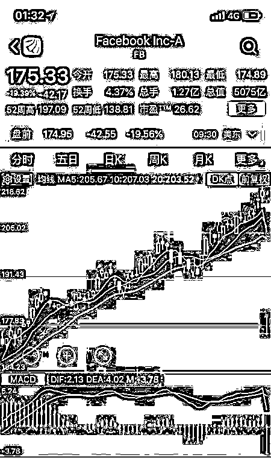
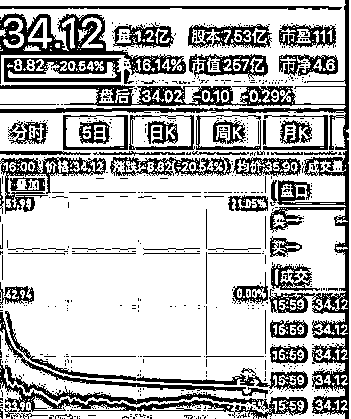
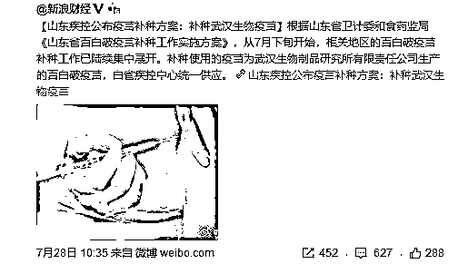
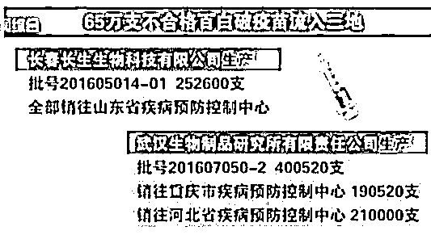

# 夜报|| 证监会专门为一家公司量身定做了最新退市法规

周末，证监会发布《关于修改的决定》。关于改革完善并严格实施上市公司退市制度的若干意见>

在这个新规定里，明确上市公司涉及国家安全、公共安全、生态安全、生产安全和公众健康安全等领域的重大违法行为的，强制退市。

这个新加入的部分，很明显是针对长生生物的，毕竟以前从来没有提及生产安全和公众健康安全这么冷僻的字眼。

这一次长生生物千夫所指，让它退市是顺应全国民意，也符合证监会的利益，毕竟现在每年退市这么少，也一直在被人骂，退的越多越好。但是让长生生物退市这件事合情合理，但是居然找不到法律依据。

据小道消息，证监会高层要求长生生物必须退市，但是法律部居然没找到相应的法律法规，被领导喊去骂，于是干脆重新修订了退市法规，新增加的部分针对长生生物的重合度高达 99%

为了一家公司，证监会特地修改了退市规定，这份殊荣可以说是非常难得了。不过换句话说，长生生物的退市那是铁板钉钉了，这次是从党中央到街头吃瓜群众，一致判他死刑，用以前革命时代的话说就是自绝于人民。

没有其他可能性了，退市把，就是陷在里面的股民小心点，自认倒霉算了，再吃 N 跌停后，开板立刻跑。

~~~~

美国 Face Book，脸书公司，美国的腾讯级别霸主社交软件，周五异常暴跌 19%，原因至今不明，一天市值蒸发了 8000 亿人民币。

紧接着，推特又暴跌 20%，让吃瓜群众目瞪口呆。

关于这些社交公司股价的暴跌，很多人众生纷纭，至今没有明确说法，有人说是因为欧美关于用户隐私的制裁，有人说是脸书在中国杭州开设分公司被拒，但是这些都没有说服力。

目前最有说服力的原因，是因为这些公司的用户增长陷入瓶颈，多年来的高增长戛然而止，甚至二季度还出现了负增长，用户增长减少且财务业绩不佳，让这些公司的估值大幅降低，没有高速业绩增长的公司不应该拥有那么高的市盈，故而暴跌。

事件证明，美国是一家纯粹是价值投资公司，一切以业绩数据说话，而中国的上市公司，公告出来的业绩和财务数据，10 个里面 8 个是不能信的，中国股民真是苦啊，不是不想价值投资，是真正的数据根本拿不到啊，鬼知道这家公司到底是什么样子。

~~~

插播一个小新闻，关于山东孩子的补种问题。

怕敏感被删就不详细展开了，如图所示，如果非要有什么评论的话，那就是。。。

这方案的脑回路和正常人怎么区别那么大呢，简直笑死人了，难道中国就没有其他公司了吗？

山东孩子应该怎么办呢，唉，我也不知道。。。

~~~

周五的时候股市横盘，说实话我现在采用的是波段慢节奏操作，一个月以上一次，平时也没啥好说的，我现在不打算卖，分批卖不是这么个卖法，而且形势非常好，打破抄底最低点后，最危险的断头暴跌时候已经过去了，不买最低点，也不卖最高点是股市精髓。

但是，这里离反弹最高点还有很远，不值得卖，耐心。