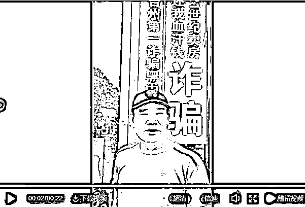
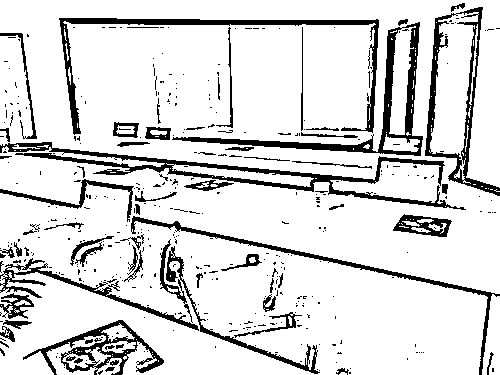

# 数千万卖房款被中介卷跑，如何才能让自己的房款更安全

昨天，台州爆发一起恶性房地产诈骗案，数十名业主齐聚台州高薪区的 21 世纪不动产景隆店进行维权。而这家地产中介已经人去楼空，数千万房款不知所踪。

据媒体报道，这数十名业主均是在 21 世纪不动产进行交易的，中介带他们和买主签订合同后，买家把 3 成的首付打给他们，约定过户后办理住房抵押贷款，贷款下来之后打给卖方。

按理说，这是一个非常正常的交易，但是台州数十名业主发现，房产过户之后，自己迟迟没有收到 7 成卖房款，屡次三番去催促都被中介给搪塞拖延下去，过一段时间之后，业主发现 21 世纪不动产居然偷偷关门跑路了。

这下业主慌了，报警维权，发现有几十家业主都是这样的情况。而实际上买家是不存在的，现在业主找到了这几个买主，但是买主二手一摊，我们也是穷鬼，身上一分钱没有，是中介请来的演员。

原来所有的业主的房子都是被地产中介找来的几个演员给买走的，过户后中介直接拿着房产证办理了抵押，然后带着抵押款跑路了，据初步统计，损失款高达几千万元。现在中介带着钱跑路了，房子产权抵押给银行了，就留几个被中介忽悠过来穷鬼演员买主，你说怎么办。

现在唯一的指望就是警察把跑路的骗子中介赶紧抓回来还能挽回损失，但是实际操作中这几乎不可能，如果没能在款项挥霍殆尽之前抓到骗子中介，这几千万就只能认栽了，对于绝大多数家庭来说，卖房款如果拿不到那是伤筋动骨的损失，没有几个家庭能接受这样的现实。

但是实际上，先收 30%定金，房屋过户后再收尾款是很正常的操作啊，如果不然买家也不放心，要是我全部的钱都给你了，你不过户怎么办？这样被坑的买家也不少。在实际操作中，有很多卖方业主隐瞒产权被抵押问题，在收到全部款项后拒不过户。台州的例子是坑了卖家，但是实际上买家被坑的也不在少数。

例如，卖家对外负债，但是故意隐瞒，等收到卖房款后，房屋被法院起诉查封，买家就彻底凉了，房款二空。

还有一种更恶劣，就是房价上涨的时候，卖家突然不想卖了，觉得自己卖亏了，但是又不想支付违约金，就虚拟一个债务出来找人起诉自己，买家起诉后，法院只能判决解除合同，卖家退还款项，但是这并不能帮买家挽回房价上涨的损失，在前几年的房价暴涨中，这种恶劣的故意违约案例很多。

还有一点是，很多人一辈子可能就买卖一次房子，没有什么经验，中介说什么就是什么。**任由中介安排，非常听话。**

在二手房交易中，正常情况下完成过户需要一个月左右的时间，买卖双方互相不熟悉也互相不信任，交易无法推进下去，很多时候甚至由中介来进行现金的代收代付，极其容易出问题，如果中介一口气全部卷款跑路的，买卖双方都傻眼了。

但是实际上，国家早有出台规定，二手房交易实行交易资金银行监管，在资金转账的时候，银行、买卖双方、中介四方到场，款项进入银行第三方账户后，买卖双方过户，过户完成后，银行将款项打给卖方，彻底解除双方可能被骗的后顾之忧。

那么为什么台州会出现数十人被诈骗的情况呢，原因很简单，很多人一辈子就买卖一次房子，根本不清楚规则，中介说什么就是什么，根本就不知道有银行四方托管这个条例在。中介不说，买家是中介找来的演员，台州那些业主还不是任由中介安排，说打款 30%后得过户才能支付尾款，他们还真的去过户了，最后被骗，家庭遭到重创。

这次是台州的卖家被骗，下次也有可能是你买房子的时候被骗，款项打过去了，卖房人跑了，留下房屋产权被债务查封，所以不要觉得自己不卖房子，就跟自己没关系，买方被骗的案例也不比卖方被骗的案例少，我就不赘述了。

今天晚上我给大家谈这个新闻，主要原因是我询问了周围的一圈人，好像真的没几个人知道二手房交易有银行四方托管这个规矩在，因为很多人根本没有二手房交易经历，也盲目相信中介。几乎所有的人，都认为中介会告诉自己全部交易流程规则。。。

所以，你和你身边的亲人，都应该了解这个购房资金四方监管的规则，以后涉及二手房买卖可得留个心眼，万一被骗，那可不是闹着玩的事情。

**为了更简单粗暴的让没有二手房交易经验的人了解这个交易流程和规则以防被中介欺骗，我今天重新给大家理一下顺序。**

1、产权审核

在交易之前，买方要彻底审查卖方提供的房产证，确定房屋产权归属，抵押状态，以及有无因债务纠纷被查封等等情况。

2、交定金

确认房屋产权没有问题后，买方就要交定金了，这也不是小钱，一般 5~20%，就算按照最低 5%计算也动辄几十万元，哪怕四线城市 100 万的房子也要 5 万呢，所以千万不能交给中介。这个定金，是应该交给银行做一个资金监管的，银行做第三方。交完定金后，就可以签一份预约买卖合同了。

3、赎楼

交定金的时候，风险在于买方，而下一步风险就到了卖方头上了，在买家缴纳定金之后，卖方必须进行赎楼，也就是解除这套房的抵押状态，还清银行贷款，确保这个房子是干干净净的产权，处于抵押状态的房子是无法过户的。

4、付首付

卖方赎楼后，又轮到买方负担风险了，这个时候买方要支付首付，注意，这个首付是必须必须必须支付给银行做第三方监管的，台州那群被骗的可怜人，就是倒在了这一环节，被中介忽悠直接把首付款支付给卖方了。

支付首付之后，双方签订正式的买卖合同。

5、办按揭

签订正式的买卖合同之后，如果不是一次性付款，那么买方要开始办理按揭了，正常情况放款很快的，所以只要买家和银行签署了按揭贷款协议，卖方过目之后就可以确认过户了。这个是不存在过户之后买方拒绝按揭的，所以不用害怕，因为办理贷款的时候银行是要求买卖双方都到场的，签字之后买方和银行的欠债关系直接成立，按揭款是直接打给卖方的，但是一般来说，完成过户之后银行才给放尾款。

所以到了所以到了 18 年这种银行放款极其缓慢困难的时候，很多卖方就拒绝贷款交易，只接受全款交易了，为什么这么做，就是怕这一步出问题，风险太大。

如果卖方信任，可以选择按揭贷款，不过万一银行贷款因为种种原因批不下来，已经完成过户的卖方就会极其被动，合同中可以约定解决办法，但是不管怎么解决，都很难弥补卖方的损失。

6、过户

按揭手续完成之后，卖方会开始过户，完成过户之后，贷款的银行会自动去国土房管局办理抵押手续，在 5 个工作日后放款给业主，同时，之前在银行四方监管的所有资金也会同时交给卖方。至此，交易完成。

7、其他小事

还有些其他小事需要注意，那就是这套房子的物业费、水电费、家具家电等，也是需要一一核实的，和房子比都是小钱了，但是实际上，他也不是一笔小钱。。。

好了，总共 7 步，这才是正规的二手房买卖流程，不管你是打算买还是打算卖，这个知识点你都是用得着的，以后二手房交易可千万别被中介瞎忽悠了，自己要知道行规到底是怎么回事，这么大笔款项绝对不能出一丝问题，一旦出问题，后果不是哪个家庭能负担的起的。

觉得此文的分析有道理，对你有所帮助，请随手转发。

往期回顾（回复“目录”关键词可查看更多）

香港人说，香港房价必须这么贵！| 刚性兑付是一种骗局 |成本 200 的百姓救命药卖到 2 万一盒，难道没钱就得死？| 中国的房价什么时候会崩盘？| 你根本不知道烟草公司有多赚钱 | 中央这次打击三四线城市房价的决心为何如此坚定| 我是如何保证自己不近视的 | 魏忠贤其实是个贤臣 | 2 分钟了解中国 50 年的艰辛发展史 |历史数据表明：中国最赚钱的职业十年一个轮回 |房价大利空，货币化棚改权限被收回