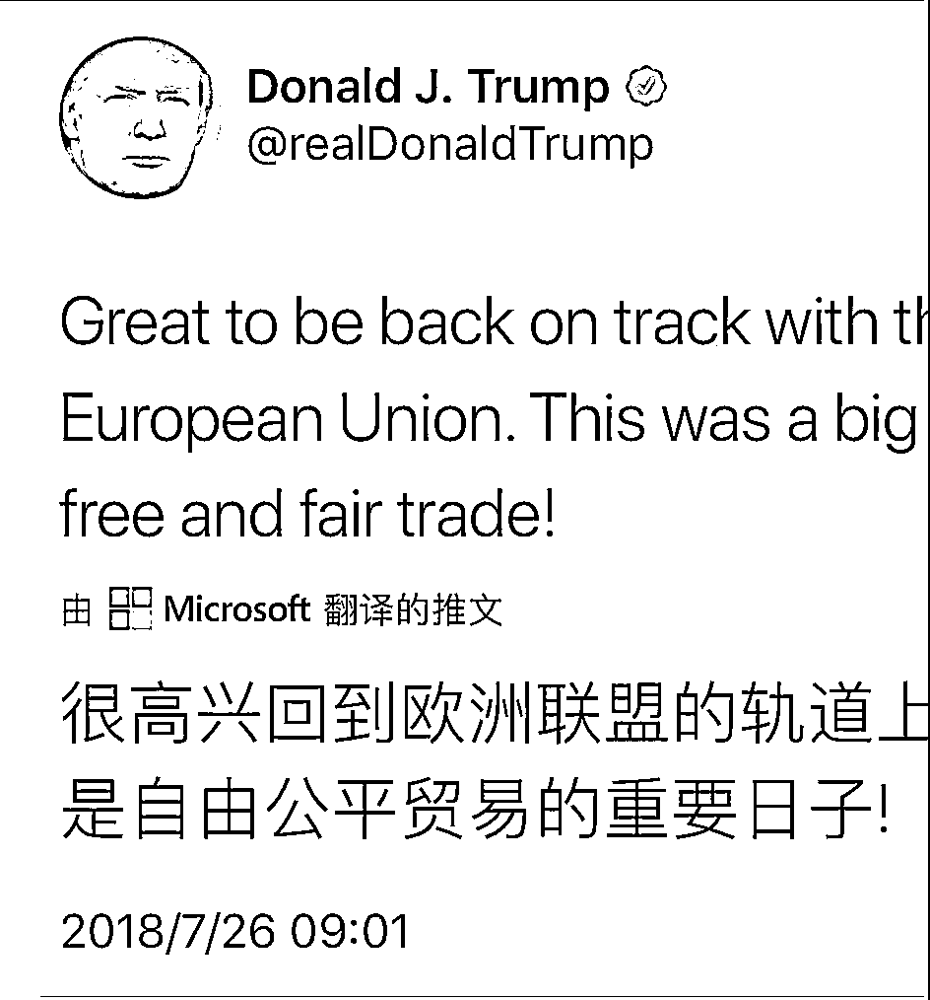
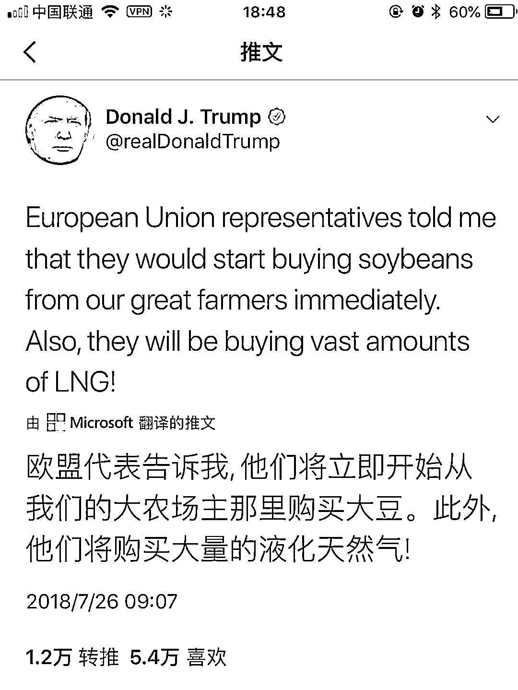

# 夜报|| 大事件，美欧日达成零关税自贸协定

lass="" data-copyright="0" data-ratio="0.0828125" data-s="300,640" src="http://mmbiz.qpic.cn/mmbiz_jpg/vVoVQ59VnF7pjKibM5nc3cXt2QIbjAjfRPFKsE447q0Gd6NhZ60rnLUGiayiblD7bJjicw3Px3Yfiadf5YcDrO9mabA/640?wx_fmt=jpeg" data-type="jpeg" data-w="1280" style=""/>

今天的最大突发新闻，是美国和欧洲突然宣布达成零关税自贸协定，互相之间零关税、零门槛、零补贴，达成自由贸易。再结合前一段时间欧洲和日本已经达成了零关税自贸协定，至此，美欧日发达国家已经达成了全面贸易新协定，这是足以绕开 WTO 的里程碑事件。

这个事情是奥巴马曾经想搞的，但是没搞成，现在被特朗普给落地了，这个事情对中国目前和美国的谈判构成了很大的压力，因为原本可以联手一起攻击美国的欧日国家现在已经和美国谈妥了。

而实际上，美国和欧盟同时降低到零关税，是对美国的巨大利好，因为按照之前的游戏规则，美国对欧盟进口汽车征收 2.5%的关税，但是欧盟对美国的进口汽车征收 10%的关税，现在双方都降低为 0，你说对谁更有利？而欧盟这次达成了全面让步条件，特朗普大获全胜。国内支持率创出新高。

而中国目前对美国的汽车关税是 25%，中国已经同意让步降低到 15%，也是降低 10%，但是特朗普要求降低到同等关税，也就是要么你也降低到 2.5%，要么我提升到 25%，这是中国无法接受的。

道理也很简单，美欧日全部是发达国家，他们之间的技术力量都差不多，处于同一个水平线上，他们之间可以友好竞争，和平发展，但是中国不行，中国和他们的差距太大了，特朗普追求公平、镜像，从逻辑上说是没有问题的，但是如果真的实行，那就是彻底断绝了中国追赶的希望。

我举个例子，人类是原始人进化来的，在几亿年的进化史里，由于外界搏斗的物竞天择，蠢笨的原始人都被淘汰了，只有最聪明掌握技术最全面的原始人部落在逐渐壮大，慢慢的进化中原始人掌握了火，掌握了青铜，掌握了蒸汽机，最终形成了现代人的恐怖力量。

如果这个时候让古代的原始人和现代人同台竞争，那么哪里还有原始人的进化之路，物竞天择没有了，最聪明的原始人未必是繁衍后代最多的，符合现代人标准的原始人才是能活下来的。原始人除非一步登天悟出现代科技，否则只能老老实实的听候安排。

技术差距拉开到极致，就会产生这种效应，现代国家之间的技术差距虽然没有那么夸张，但是原理是等同的，以芯片为例，如果中美真的零关税零门槛，那么中国永远不会有企业去做芯片，那是自寻死路，再怎么努力，你也无法跨越技术鸿沟，而美国的芯片业可以正常的慢慢进化，一代又一代的产品迭新，双方的差距会越拉越大。

所以，不是我们不想和美国互相“镜像”的关税待遇，是真的不可能做到，我们毕竟是发展中国家。

~~~

新闻：北京个别银行网点首套房贷款利率上浮 40%，这个道理我昨天的夜报就说过了，各地根据自己的情况进行调控，有的上升有的下降，混乱中达到总体平衡的效果，不能全国一起行动，怕一时失手就失控了。

~~~

今天，股市全面回调，其中一部分是我昨晚说的原因，昨日盘面就不对了，开始承压，而且很多人都开始准备减仓跑路了，毕竟 3000 点几乎不可能一次性过去，提前跑路很正常。另外一方面，可能就是美欧贸易协定的签署，对中国绝对是利空。

但是很明显，上涨周期还没有结束，这里只是一次正常的回调而已，甚至严格来说，这里只是刚刚脱离筑底区域。。。

所以，我个人觉得，8 月份的时候再考虑跑路啥的比较好，还有半个月可以好好玩呢。2900 这里不够肥，熬了那么久就这么点没意思，继续拿一段时间，何况最近央行还明确说要停止去杠杆了，加不加不知道，至少是要稳杠杆，那这明显超跌的图形，至少也要来一波反抽的。

