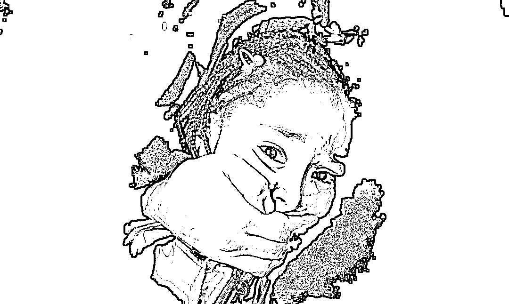
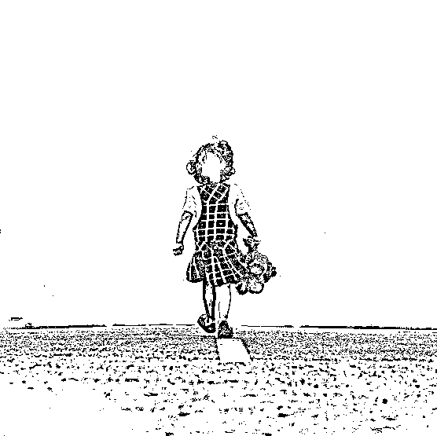

# 不是性侵变多了，而是女性变勇敢了

class="_135editor" data-id="4010" data-tools="135 编辑器" style="border-width: 0px;border-style: none;border-color: initial;">

编辑：小飞

我们的孩子经历过的「恶魔之选」还未尘埃落定，女孩子们对抗「咸猪手」的新闻又占据了新闻版面。

性侵事件

**章文事件**

昨天，一篇《章文，请停止你的伤害》匿名举报文章在网上热传。文章中描述的是受害人在今年 5 月被知名媒体人章文强奸，事后还遭到威胁的事情。

拉动图片可看全文

随后，作家蒋方舟转发此文章，并称「我也被此人性骚扰过，坐牢吧，人渣。」

紧接着，媒体人易小荷也站出来表示「和章文在中国新闻周刊做同事的时候，他也借机摸过我大腿。」

由于知名作家和媒体人的加入，此事件引发了更多人的关注。

至此，章文性侵事件开始发酵。

在接受媒体采访时，章文就已经开始反驳对他的举报，随后发表了长文否认强奸。

简单来说，他的意思是，

首先，事情是双方自愿的，女方还给自己发过尺度大的艺术写真。

其次，举报他的女性、蒋方舟和易小荷情感生活都很丰富，都不是传统意义上的好女孩。

最后，在男女混杂的饭局酒桌上，搂搂抱抱等亲密状是正常的。

我来翻译一下哈，

说女方先给他发艺术写真意思是对方勾引他在先，让他想入非非，他并没有强迫。

而这三名举报他的女生都不是什么好女孩，别人能碰得，我怎么就碰不得。

最后，酒后行为的不检点不能算是性骚扰，因为这是正常的酒桌文化。

这理由完全站不住脚，此处省略一万字粗话。

随后，一群姑娘都站出来了，纷纷指控章文，说他在女孩子面前，举止轻浮。

章文说，如果一群人在一个场合喝酒之后，搂一下腰或者是合个影，这也算是性骚扰的话，那我也搞不清楚了。

他还说，我能摸多少人大腿？很奇怪，为什么忽然这样说。

而后还发布了一则律师函，对强奸指控予以否认。

事情差不多是这样，指控究竟能否成立还在调查之中。

**雷闯事件**

跟章文事件几乎同时被曝光的，还有雷闯性侵事件。

这个事件相对来说比较清晰，受害者一开始也是发文举报。

文章描述了当时雷闯利用做公益的好感度骗取了自己的信任，从日常的言语到肢体接触，一步一步得寸进尺，最后实施了暴行的经过。

拉动图片可看全文

此信一出，舆论哗然，雷闯本人随机承认并道歉，表示愿意承担一切责任。 

为什么沉默

这两件事的共同点是，受害人并不是第一时间就站出来揭发，而是承受了长时间的煎熬之后才选择站出来。

章文事件中的受害者甚至只敢匿名发文，而雷闯事件中的受害者发文时距离受侵害之日已经过了三年之久。

她们为什么沉默了那么久？

当章文事件出现后，高级编辑鄢烈山发了条评论支持章文，称举报者有「阴谋」，称蒋方舟歪曲事实，称当时只要认真拒绝，人家怎么可能不断进行侵犯并纠缠？

瞬间引爆大家的质疑，目前该微博已删。

雷闯事件曝光后，甚至是在雷闯本人已经承认的情况下，还有不少人在痛骂着那个受伤害的女孩。

那是她自己下贱。

做了又怎样？当时爽了？现在又想敲诈？

都是凡人，都有犯错的时候。

既然是强奸，为啥几年后才提出来？

支持他（雷闯）去勇敢面对，重新开启

看到这些言论是不是感觉非常魔性？

明明是受害者反倒被质疑、被嘲讽，甚至被诅咒。明明是侵犯者却被拥护、被相信，认为这是一次再正常不过的冲动。

就像易小荷说的那样，这个社会有太多奇怪的论断。

中国的荡妇羞辱理论实在太普遍了，发生性骚扰以后，人们就会觉得，那个女生肯定是有不自重的地方。甚至会有人认为，摸一下又不会怎么样。

荡妇羞辱：指人们对某些女性的贬低和嘲笑现象。

只要该女性着装性感暴露、言行放浪，或者仅仅是谣传言行放浪，便认为她们遭受的侵犯都是活该，并且没有声张正义的权利。

哪怕她们不是故意的，也莫名其妙地就站在了道德的反面。

而被扣上了荡妇帽子的女性，在寻求公道的过程中，往往要先经过一番公众的羞辱。

对实施性侵犯的人来说，正是因为大众普遍抱有这种想法，才使得他们的犯罪成本降低，或许甚至都不觉得这是犯罪。

女孩子们受到侵犯后由于无处诉说，得不到同情，甚至会被冠上「不洁」的标签，所以她们一般都会选择隐忍，不敢发声。

也因此，这些禽兽才能一次又一次地得逞。

伤害有多大

如果不是亲身经历过，怕是无法切身体会那种心理创伤。

举报章文的受害人就因此患上了轻微的抑郁症。受侵犯后甚至不能一个人待着，连工作都做不了，整天只吃薯片和可乐，短时间内就胖了 10 斤。拼命地想自救，却仍活在无尽的痛苦中。

也想过要报警，结果仅仅是模拟了一次询问的过程，就撑不住崩溃了。

揭发雷闯的小姑娘情况也一样。

就在举报信发出的前一天，刚被诊断出患有重度抑郁。对她的伤害严重到连「性侵」、「非自愿性侵」这样的字都打不了，「受害者」三个字打出来尤其痛苦。

还记得前段时间跳楼的那位小姑娘么？就是因为两年前被自己尊敬的老师猥亵，心理创伤一直走不出来。

两年来一直尝试着讨回公道，却屡屡失败。最后选择了用生命来抗争罪恶，从八楼一跃而下。

这样的心理创伤，如果不是亲身经历，根本感受不到。伤害发生后，女孩子们会误入一种「是不是我错了」的死胡同里，不断地自我怀疑、自我否定。

再加上社会中存在的「奇怪论断」，更是会让受害的女孩们认定，是自己行为不检点招来的侵害，是自己「活该」，是自己「不洁」。

坚强一点的，勇敢站出来揭发，在面对警察的询问时再次回忆细节，这又是一次伤害，而且更深。

最后，若是得不到应有的公正，往往又会出现许多质疑「有阴谋」、「为了钱」等等，相当于在伤口上又撒了把盐，很多时候甚至毁了这个女孩的一生。

示范效应

好像近年来被曝光的性侵事件越来越多了。其实，不是性侵越来越多，而是女性变勇敢了。

因为，受到侵犯的女生勇于站出来发声了。

我们的社会越来越开放，对应的女性的自我保护意识也开始增强。以前整个社会氛围都是浓浓的荡妇羞辱，女性受到侵犯之后甚至都不敢承认。

**声音太弱、顾虑太多、心肠太软，所以基本上都忍下来了。**

但是现在，虽然某些「奇怪论断」依旧存在，但至少除此之外有了更多对女性的支援。

她们不再是孤军奋战了，也终于开始有人，鼓起勇气站出来指控了。

这是一种示范效应，只要有人愿意站出来，必将给千千万万仍在隐忍的女性以力量，也将会有越来越多的女性站出来。

而且，一个性侵惯犯，骚扰过的女性绝不可能只有一个。只要有一个站出来，就会有更多的被骚扰过的女性站出来作为旁证。

**而我们能做的，就是给真正受到侵害的女性以支持，消灭「荡妇理论」。**

**鼓励更多的受到侵害的女性勇敢站出来，让这些衣冠禽兽为自己的所作所为付出应有的代价。**

是时候让那些咸猪手明白，女生们已经不再会忍气吞声了，当下也已经不再是曾经无所顾忌的年代了。

此次的性侵事件舆论也在逐步发酵，大众对女性受到侵犯时的态度明显比之前正常了许多。

持有「荡妇」理论的人明显在减少，有越来越多的人开始站到她们那边、为她们支援。**她们已经不再像前几年一样只能孤军奋战了。**

长此以往，我们的社会无论是在制度上、法律上、以及行为和思想上，对女性的保护将会更加全面。

不仅女性的自我保护意识在逐步增强，我们的社会文明也在进步。

是时候了，是时候可以开始相信这个社会会变得越来越好了。

**只要有良知的人一直都在，我们的社会就有希望。**

我有信心。

相信你也有。

觉得此文的分析有道理，对你有所帮助，请随手转发。