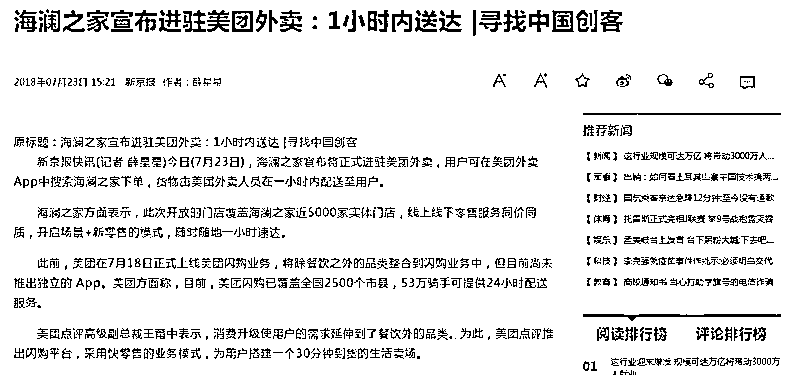
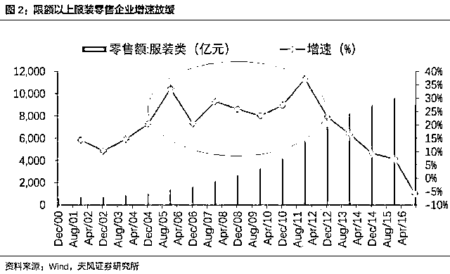

# 颠覆思维的新零售，我在美团外卖上居然看到了海澜之家

class="_135editor" data-id="4010" data-tools="135 编辑器" style="border-width: 0px;border-style: none;border-color: initial;">

新零售是马云提出的概念，被定为淘宝未来的发展方向，主要含义就是线上线下相结合，线上线下同款同价，用来弥补线上电商没有线下实体店购物体验的短板。电商本质上也是零售，而零售的精髓就是成本效率和购物体验，二者合一才是真正的零售，这就是新零售的发展方向。

新零售这个概念，说起来很简单，方向也很明确，但是做起来是很难的，线上线下结合是非常困难的事情，能做到的没有几家，而究竟怎样的新零售模式才是符合中国经济现状以及消费者需求的，包括马云自己也不是特别清楚，大家都在不断尝试。

而这几天我看到一个重磅新闻，亮瞎了眼睛。那就是海澜之家宣布登录美团外卖，线上线下零售服务同价同质，用外卖的方式送衣服，实现各地一小时速达，正式进军新零售领域。

看到这个新闻时我震惊的手中的瓜都掉了，海澜之家进军新零售打算杀出一片新天地可以理解，但是登录的居然是美团外卖，外卖小哥前来送衣服？这简直不可思议，超脱了普通人的思维理解范围，美团外卖不是送外卖的吗，怎么插足电商领域了。

为什么登录的是美团外卖，这是因为外卖小哥有着淘宝无法比拟的送货速度，那就是全国一小时送货，这几乎把网络购物的送货速度压缩到了现代人类科技的极致，不可能再低了，目前中国能提供这种送货速度的，只有外卖平台。我还特地搜到了他的宣传视频，利用各种场景模式强调自己送货速度快，快到极致。

单纯送货速度快，其实只是新零售的一个小角度而已，这方面做到极致了，并不代表你新零售成功了，尤其是服装这种时效性不是特别强的领域。实际上我之所以认为他这次是颠覆性的新零售，一方面是他居然登录美团外卖这种颠覆性的思维，一方面是因为其庞大的线下实力。

淘宝是线上去寻求和线下相结合，而海澜之家是线下寻求和线上相结合。海澜之家在线下接近 5000 家实体门店，覆盖全国 97%的县级以上行政单位，超高的覆盖率，是他敢用外卖送衣服的底气和基础，其他的服装商如果也想模仿跟随，必须也有这么大的城市覆盖率才可以。而 2016 年海澜之家年度收入 170 亿元，在整个 A 股的服装上市公司中以绝对优势排第一名，第二名仅仅 106 亿元收入。这就代表线下门店数量这个护城河是非常深厚的，是庞大的资金实力堆砌出来的，而不是一个创意就能被轻易模仿的。

铺天盖地的线下门店数量，让他拥有了新零售的必备要素，送货速度只是一个切入点而已，重要的是他利用外卖网络之后，真正的实现了线上线下相结合。

你在淘宝上看中一款衣服，商家可能是北京发货，也可能是深圳发货，你想去实地感受一下，是不太可能的事情，这种模式永远不可能玩新零售。而海澜之家登录美团外卖后，你点的衣服，一定是同城送过来的，这家店可能离你就非常近，如果你想去实体店体验，那是非常方便的。

而登录美团外卖的衣服价格，则执行线上线下同质同价，以线上网店的价格，获得线下品牌实体店的服务，这就完美符合了新零售的一切要求。

而我后来又仔细查了一下，美团外卖这一波登陆潮，包含多个线下零售巨头，如家乐福、百果园、全时便利、鼎卉鲜花和海澜之家，从日常生活息息相关的领域携手零售巨头全面进军新零售。这些零售巨头都有一个特性，就是线下实体店遍布全国各地。

对于能买六条一模一样的牛仔裤换着穿的男人而言，一年逛二次海澜之家都有点多了，最好一辈子只逛二次，然后在家里点外卖就可以了。海澜之家和美团外卖合作，让外卖小哥去送品牌服装，可以说是创了服装业的先河，绝对是前无古人，而且也绝对是脑洞大开。

网络新零售的跨界打击已经开始了，外卖平台不仅可以送烧烤，还可以送水果鲜花，如今居然开始可以送衣服了，无论从哪个角度去考虑，都不会想到淘宝的下一个电商竞争对手，居然是美团外卖。。。

新电商的乱战打出了新思维，也打出了新高度，脑洞之大让人目瞪口呆，但是战场越乱，战斗越激烈，对消费者来说就越好，零售的精髓在于“**多、快、好、省**”，不管是线上还是线下，都只是零售的形式而已，不会绕开这个本质，越是接近这个本质的厂商，其未来潜力就越大，而群众享受到的实惠也就越多。

实际上，中国的线下服装零售业下滑趋势非常明显。我们可以看到，年年增长的线下零售业，在 16 年开始变成了负值，而实际上 17 年和 18 年下滑的更加厉害，一系列知名零售品牌均遭遇业绩下滑困境。据有关报道，过去五年，美国的百货店客流减少了 57%，其主要原因，就是遭遇电商打击，电商利用成本优势完全压制了线下零售业的发展。

而在实体、电商竞争均十分激烈的服装零售领域，想要逆势突围，难度更大，必须完成转型，线上线下相结合实现新零售，让自己各方面没有丝毫短板，方有逆袭可能性。这次海澜之家登录美团外卖，创服装销售领域之先河。随着线上线下成本价格的逐渐接近甚至等同，线下实体店的购物体验优势越来越大，新零售必定是未来商家的发展方向。

这两年整个服装零售行业陷入下滑危机，海澜之家选择了美团外卖来实现逆势突围，说明他的确是一家创新精神非常强的企业，十几年来弯道超车成了中国男人的衣柜，并不是因为运气好。

如今，阿里要全面进军新零售，京东表示要开 100 万家线下便利店，亚马逊还要开无人店，而美团外卖，居然在送衣服。

颠覆思维的新零售，让我在美团外卖上居然看到了海澜之家，不知道我下一个能看到的新电商会是什么样子，电商社会的这种进化速度，你能想象吗？

觉得此文的分析有道理，对你有所帮助，请随手转发。

往期回顾（回复“目录”关键词可查看更多）

香港人说，香港房价必须这么贵！| 刚性兑付是一种骗局 |成本 200 的百姓救命药卖到 2 万一盒，难道没钱就得死？| 中国的房价什么时候会崩盘？| 你根本不知道烟草公司有多赚钱 | 中央这次打击三四线城市房价的决心为何如此坚定| 我是如何保证自己不近视的 | 魏忠贤其实是个贤臣 | 2 分钟了解中国 50 年的艰辛发展史 |历史数据表明：中国最赚钱的职业十年一个轮回 |房价大利空，货币化棚改权限被收回

