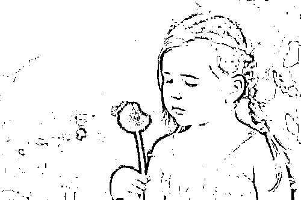
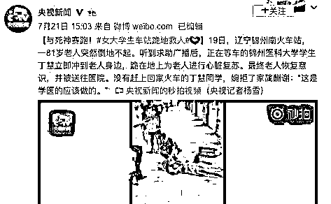
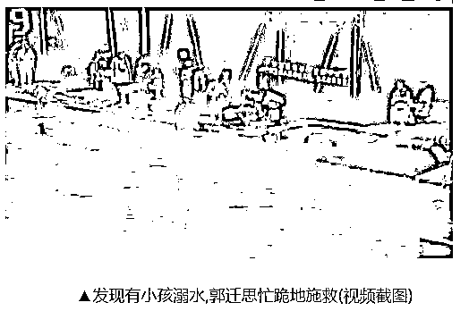
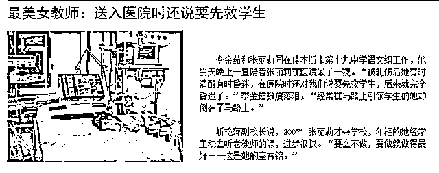
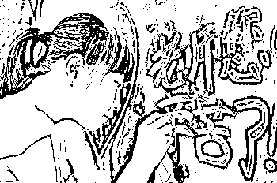
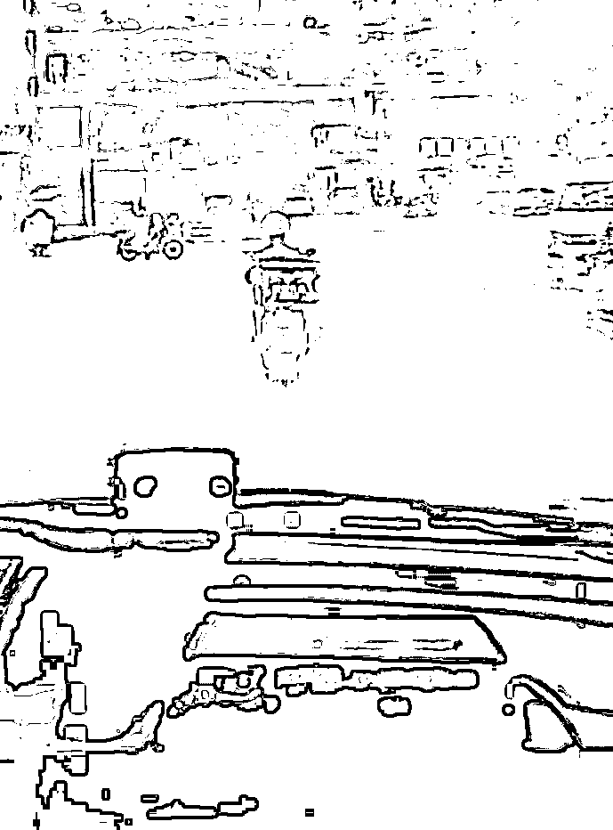

# 看，这里有天使出现

data-role="outer" label="Powered by 135editor.com" style="font-size: 16px;font-family: 微软雅黑;">

古人云：人之初，性本善。

古人还云：老吾老以及人之老，幼吾幼以及人之幼。

世间缺乏的不是善心和爱心，缺的是一个将其激发出来的机会。

与死神赛跑

前几日，在辽宁某火车站，一名老人突然倒地不起。听到求助广播后，正在等车的丁慧立即冲到老人身边，双膝跪地，为老人进行心脏复苏，并一声声地呼唤「爷爷，醒醒，坚持住。」。最终老人恢复意识，并被送往医院。

据媒体报道，救助了老人的丁慧是锦州医科大学的学生，目前正在念大二。为了救助老人，没有赶上回家的火车，还婉拒了家属的酬谢，并称「这是学医的应该做的。」

被救助的老人苏醒后的第一句话就是「找人……给钱……」。其家属也表示非常感谢，「如果不是丁慧，我父亲就没了……」

丁慧在火车站与死神赛跑救助老人的事迹，戳中了许多人的泪点，并在网上引发热议，大家都说她人美心善，堪称最美大学生。

而我想到的除此之外还有：真好，将来又多了一位好医生。

近年来，一提到火车站大家都会联想到黄牛、人贩子之类的，好一点也是「拦高铁的教师」这样的负面新闻。再加上一直以来时不时就出现的「救老人反被讹」的新闻，大家遇到倒地老人就会下意识地避开，哪曾想在火车站还会出现这样满是温暖的救人之举。

而丁慧根本没想那么多，几乎就是毫不犹豫地冲上前去救治。对她来说，虽然自己尚未成为医生，但已经将救人视为天职——「我就是学医的，救死扶伤是我的天职，我只是做了自己应该做的事而已。」

最美大学生丁慧不仅救了老人一命，更是给这个冷酷的社会带来了一缕温暖。

让大家知道，这世间**并不缺少美丽的心灵和人间的真情**。

与时间竞赛

上星期天，在广西某小区游泳池出现两名溺水儿童。被打捞上岸时，已经全身青紫，没有了呼吸。恰逢郭迁思路过泳池，见状二话不说，丢掉手里的东西之后双膝跪地，给溺水的小男孩实施人工呼吸和胸外心脏按压施救。

小男孩救活过来后，郭迁思刚想缓口气，却发现身后的地上还躺着同样溺水的一名小女孩。而此时小女孩的鼻子和嘴巴都在冒着水泡，牙关紧闭，没有任何反应。

溺水后最佳抢救时间为 5 分钟，但从抢救小男孩到发现小女孩，已不知过了多久。但她并没有放弃，脑海里只想着「一定要救活」「分秒必争」。于是，郭迁思再次跪在地上对小女孩进行抢救。终于，小女孩也救活了。

短短两分钟连救两个儿童，幸运的是都救活过来了。郭迁思也已经筋疲力尽，瘫坐在地。

据媒体报道，郭迁思今年已经 60 岁了，是一名退休护士。救人后也没有放在心上，继续过自己平淡的生活，仿佛这件事并没有发生过一样。只是，对她来说如同呼吸般正常的救人之举，挽救的却是两个幼小的生命。也因此，不少目击者通过朋友圈等途径转发了这一信息，「最美白衣天使」受到了大家的一致称赞与敬佩。

而这也并不是郭迁思退休后第一次救人了。今年 6 月，郭迁思乘坐火车时，便遇上一名男乘客突发疾病。当时，与郭迁思同行的三名退休医护人员听到广播后，毫不犹豫地立即赶过去施救……

郭迁思在接受采访时表示，「救死扶伤是医务工作者一辈子的事情。只要有需要的地方，我会责无旁贷。」「这是每一位医务工作者的职业本能，容不得半点迟疑。」

**好一个「责无旁贷」！**

**好一个「职业本能」！**

对郭迁思来说，自己虽然退休了，已经不在救死扶伤的岗位上了，但是她的本职还在。这已经成为了她的使命，成了刻在骨子里的本能。

仅仅一句「感动」根本无法表达出我的敬佩，只愿尽可能地将她的精神传递出去，让更多的人看到，并相信这世间真的有如此美好。

也希望能够影响更多的人，用自己的善意去拥抱这个社会。

舍己救人

更早时候的，2012 年的一天，张丽莉和往常一样站在车旁疏导学生。没想到原本停在路旁的客车突然猛地向学生们冲过来。

千钧一发之时，张丽莉想都不想，向前一扑，将车前一名吓傻的学生用力推到一边，而自己却被车轮碾到了下面，因身受重伤而导致双腿高位截肢，骨盆粉碎性骨折。

她昏迷多天后，醒来的第一句话是：那几个孩子没事吧？

原本处于安全区域的张丽莉，却因为救学生，将自己置于险境。最后，学生得救了，但是她却只能一辈子在轮椅上渡过了。

高位截肢后，她的亲人和医护人员都不敢想象她知道真相的后果会是怎样。结果出人意料的是，张丽莉不仅很快接受了事实，还反过来安慰父亲说，「当时车祸的场景我还记得，很幸运，如果车轮从我的头碾过去，你就看不到我了，我救了学生，也保住了命，今后一定会幸福的。」

还有有人问张丽莉，「你后悔吗?」

她回答：「不后悔。这样做是我的本能。我已经快 30 岁了，我已和父母度过了将近 30 年的快乐时光，那些孩子还小，他们快乐的人生才刚刚开始。」

28 岁的张丽莉的行为再次彰显了质朴大爱，作为一名人民教师，她真正做到了以学生为主，为了学生，可以付出一切，完美诠释了无私奉献的含义。

她用自己的一双腿，换来的是学生美好的生命。而在救人之前，她甚至不知道自己舍弃的是一双腿还是宝贵的生命。

事情虽然已经过去好几年了，但当年引起的轰动不少人还记忆犹新。这样舍身救人的行为，在我看来，已经远超一名教师的职业要求了。更像是一位母亲出于本能挺身而出，保护自己的孩子一样。

对张丽莉来说，她的学生就是她的孩子。不然，她怎么能做到奋不顾身地相救？

尽管之前被媒体曝光过一小部分有关教师行业的负面新闻，使得整个教师行业形象蒙羞。

但幸好，大众的误解、质疑并没有让真正优秀的教师退缩。他们仍坚持在这神圣的岗位上，用自己的一言一行努力维护着这个职业的「崇高」。

请不要对社会失望

在资本逐利的大环境中，总会有部分人枉顾他人的生命与安全，肆意掠夺财富，损害大家的利益。

就像最近曝光的很多负面消息，使得许多人表示对整个社会及其失望，寻求的已不再是改变，而是出去的路。

但其实，在许许多多我们看不见的地方，还有更多的人，在用自己的行为与努力在维护着社会的和谐与稳定，人性的光辉无时无刻不在闪闪发光，犹如天使降临。

所以，**请不要因为一小撮唯利是图的「老鼠屎」，就对这个社会失望****。**

6 月，一段外卖小哥给救护车带路的视频火了。视频中，一位外卖小哥卢湖成骑着电动车不是去送外卖，而是在给救护车引路。

一边是迟到便会有差评的外卖订单，一边是与死神赛跑的救护车，外卖小哥毫不犹豫地选择了后者。他的举手之劳有可能导致自己一整天的辛苦付出都化为乌有，但是却能拯救一名鲜活的生命。

有媒体评价：**这是先人后己、舍己为人的道德情操表现，更是人命关天、救人大于挣钱的人性良知的本能使然**。

深以为然。

8 月 12 日时，一名出租车司机雷月新在接送乘客的途中，无意中发现一处民房冒出火光。

千钧一发之际，雷月新没有丝毫犹豫，停车、报警、冲入火场、挨个敲门，一气呵成。由于提醒及时，民房内 15 人得以转危为安。雷月新被大量网友称为「最美的哥」。

这样的事情几乎每天都有发生，而几乎每一个伸出援手的人都会说，

**只是举手之劳。**

**换成谁都会这么做的。**

**这是应该的****。**

但越是这样看似不足挂齿的「举手之劳」，越能反应出根植于大家心中的善良与文明素养。

力量不大，却是营造和谐与温馨的社会氛围必不可缺的正能量。而我们每一个人，都能够成为贡献这种力量的「最美天使」。

看，这里有天使出现。

是你吗？

是你。

