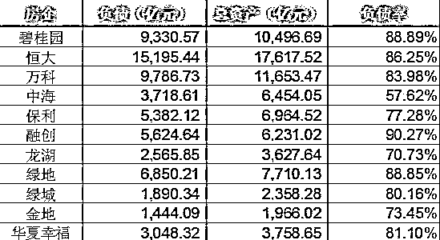
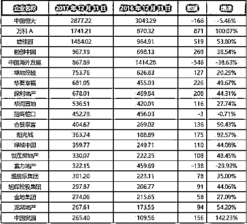
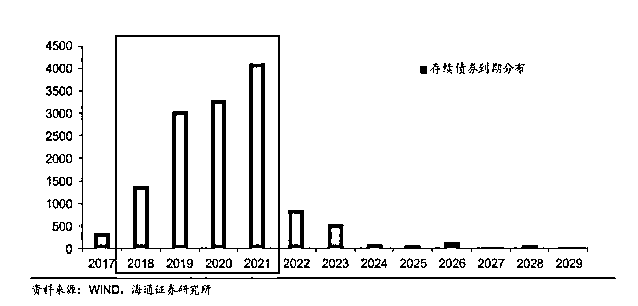

# 房价跌 20%就会全面崩盘，地产杠杆远比你想的要脆弱

class="_135editor" data-id="4010" data-tools="135 编辑器" style="border-width: 0px;border-style: none;border-color: initial;">

很多人都很好奇这么一个问题，中国的房价跌多少会导致全面崩盘？

不同的人回答都会不一样，有的人认为跌 30%应该就崩盘了吧，因为很多人的首付是 3 成，首付跌光的情况下，会引发一系列不可预知的连锁反应。有的人认为，跌 50%以上才会崩盘，因为 2017 年环京区域如通州等房价直接腰斩了，也没见崩盘啊。

但是实际上，如果中国所有城市的房价同一时间下跌 20%左右，就会引爆房产债务地雷，进而引发全面崩盘，环京区域房价腰斩没有引发崩盘是因为那只是一小片区域下跌，其他地方没有跌甚至个别还在涨，对于地产商来说损失不大而已。

根据上市公司公开数据显示，2017 年，136 家上市房企平均负债率达到 79.1%，最高的为融创 90%，其他绝大部分知名房企，都在 80%左右。

那么，80%的负债率是什么意思呢？我们以万科为例，万科在 2017 年的负债是 9786 亿元，负债率 84%。在 2018 年第一季度公告说负债达到了 10289 亿元，举债这么多，持有多少现金呢？大概 1700 亿。

为了简单计算我按照净负债一万亿，负债率 80%计算。这就是说，万科持有的所有土地和房产等资产，变卖之后可以获得 1.25 万亿元，但是他欠各种债务为一万亿，还清债务后，实际属于万科的现金，只有 2500 亿元，这是万科全部的净资产，多年积累的果实。

负债是永恒不变的，但是资产的价格是在不断波动的，如果一个月之内中国房价突然全面下跌 20%会产生什么效果呢，那么万科持有的所有土地和楼盘，价值会从 12500 亿元，变成一万亿元，这个时候他的负债正好也是一万亿，也就是说，万科负债率会超过 100%，通俗点说就是资不抵债了。

当一家企业资不抵债的时候会发生什么事情？可能有大部分银行关系好，不会逼债以及突然抽贷，但是绝对会有很多人心存警惕，从万科抽贷，贷款只进不出，拒不继续贷款是非常正常的现象。任何一家房企，如果遇到这样的事情，没有持续不断的新资金进来，轻则发展停滞规模萎缩，重则资金链断裂破产清算。

而最吓人的是，如果中国房价真的全面普跌 20%，那么很有可能会继续下跌，毕竟牛市一直涨，熊市一直跌，这是市场经济的普遍真理，如果在这个基础上再跌 20%，那么万科不仅多年积累的财富灰飞烟灭，还会倒欠 2000 亿元。

而在正常的市场环境下，当房价下跌的时候，万科会拼命的开发土地、建楼盘卖房子来减少自己的资产规模，增大自己的现金储备，确保当房价下跌的时候自己持有的资产越来越少，现金越来越多，这样可以减少自己的损失。而实际上，这种行为会加速房价下跌，导致地产行业总体资产价格账面损失越来越大，但是每一个房企都还必须这么做，因为如果你不这么做，别的房企这么做了，你的损失更大。这种情况，类似于 15 年股灾的时候杠杆断裂引发的多杀多行为。

这些巨头房企，其持有的土地楼盘等资产，分布在 1234 线所有城市，只是分布比例不同而已，绝对没有哪一家说自己只做大城市，不做小城市或者说只做小城市，不做大城市，毕竟大家都是为了赚钱。

所以个别城市的房价波动，这些房企是完全扛得住的，毕竟总盘子是赚钱的，中国整体的房价是在上涨或者横盘的，除了 08 年那一次，中国房价没有经历过任何其他的整体性的大幅下跌。而中国房企唯一的一次大规模的破产倒闭潮，就是出现在 08 年，这还是后面四万亿救市，如果再多持续个一二年，能活下来的房企那真的是寥寥无几。

大家都看到了，负债率如此之高是很危险的，除非房价永不下跌，不涨就横，否则极度危险，经不起一点波澜，那么有没有什么办法来降低这个负债率呢。有的。

第一个办法就是慢慢的把土地开发成楼盘，卖掉换成现金，还掉债务，自然就没事了，这一行为，叫缩表，缩小资产负债表，同时减少自己的资产以及负债，属于降杠杆。

还有一种办法就是维持原资产负债表，也就是无所作为，资产维持原规模，负债也维持原规模，但是房价突然上涨，比如房价上涨一倍，手中持有的土地和楼盘等资产就涨了一倍。以万科为例，负债还是一万亿，但是资产价值从 1.25 万亿突然变成 2.5 万亿了，那么负债率自然就下去了。

看到这里，很多人会很疑惑了，现在的房价相比 14 年，几乎全国都翻倍了啊，怎么这些房企的负债率还是那么高？不是应该下来了吗？

那是因为，随着房价的上涨，这些房企的确赚了大钱，原来持有的土地资产大幅升值，但是卖掉之后，这些房企又在不断的举债高价拿地。实际上，这一波房价上涨以来，各大房企的资产负债表大幅度的进行了扩表，资产大幅度增加，但是负债也大幅度增加，负债率不仅没有减少，反而有所增加，因为他们都在赌房价会继续上涨，自己不拿地，成长速度就会被其他房企所超越。

而在过去 20 年的历史里，肆无忌惮动用高杠杆的房企，都是飞速超车的代表，只有 08 年折戟沉沙过一次，死去了一批倒霉鬼。但是那个是意外，其余 19 年，畏畏缩缩不敢举债的房企，都被甩在后面了，冲到前面的，全是高负债高杠杆的领军代表。

除非房价真的一直涨，否则只要来一次回撤，这些领军房企就会来一次大洗牌，只有顺利逃顶的那几个能残存。

为什么在 2018 年很多房企突然开始加速开发周期，大举卖房呢，是不是他们察觉到房价要崩盘开始逃顶了呢，应该也不是。如果真的这么认为，他们不会去再度拿地，而应该只出不进。他们之所以这么做，可能是因为存量债务，在 19 年开始会大批量到期，他们现在是卖房还旧债务，然后拿地举新债务，这样可以让债务链变得更加顺滑健康。

从这个还债时间图我们可以看到，19 年开始还债量突然暴增，需还债数量远远比 18 年要多，所以很多房企在今年就开始提前进行准备，清理资产准备还钱。

但是，除非中国房价真的只涨不跌，否则的话，这么高杠杆的玩下去，早晚有一天会出事，因为没有一国的房价会永远不涨不跌，总有意外发生。政府控制房价的能力太过强大，没有任何人敢赌房价一定崩盘，大家都只能默认房价横盘震荡，继续这么玩下去，但是再强的政府，也有其能力极限所在，当某种意外突然出现击穿了苦苦维持的房价平衡的时候，灾难就会出现。

如果某一天，全国房价突然全面下跌 20%，中国地产就会出现全面崩盘，地产的杠杆远比你想的要脆弱，到了那一天，这些动辄万亿级的负债，又怎么去填这个坑呢。

觉得此文的分析有道理，对你有所帮助，请随手转发。

往期回顾（回复“目录”关键词可查看更多）

香港人说，香港房价必须这么贵！| 刚性兑付是一种骗局 |成本 200 的百姓救命药卖到 2 万一盒，难道没钱就得死？| 中国的房价什么时候会崩盘？| 你根本不知道烟草公司有多赚钱 | 中央这次打击三四线城市房价的决心为何如此坚定| 我是如何保证自己不近视的 | 魏忠贤其实是个贤臣 | 2 分钟了解中国 50 年的艰辛发展史 |历史数据表明：中国最赚钱的职业十年一个轮回 |房价大利空，货币化棚改权限被收回

