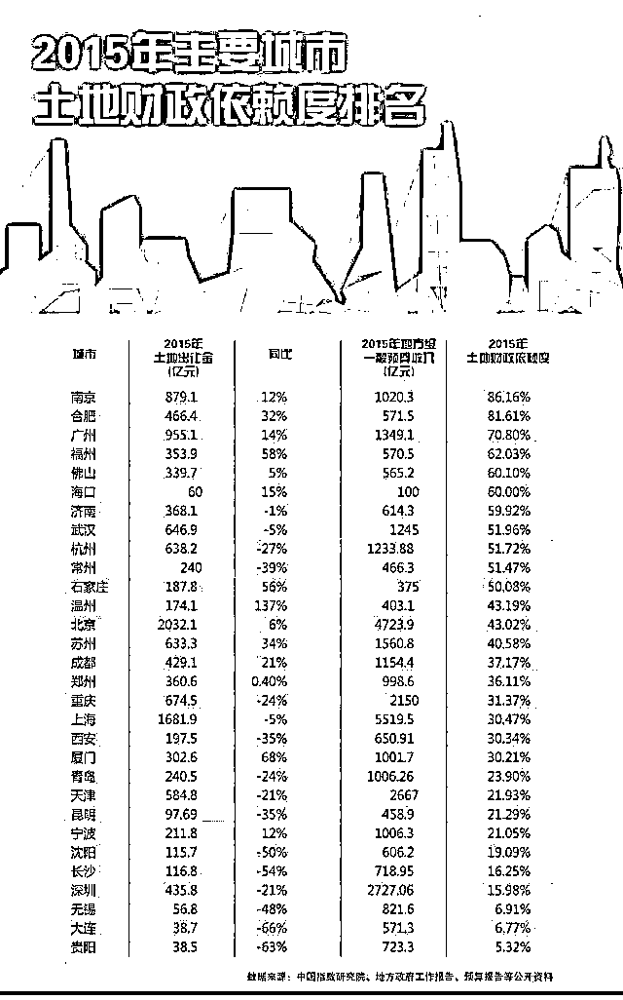

# 清醒点，放弃全面开征房产税的幻想

class="_135editor" data-id="4010" data-tools="135 编辑器" style="border-width: 0px;border-style: none;border-color: initial;">

近期，随着不动产登记平台实现全国联网，这几天一波接一波国家应加快推进房地产税的新闻报道，关于全面开征房地产税的呼声又高了起来。

首先，房产税肯定是社会进步的大方向，欧美发达国家均实行房产税制度，地方财政 60%依赖于房产税，所以中国未来也一定会全面推行房地产税制度。但是那是未来不是现在，而且也不是近期，因为推行房产税实在太困难了，每年都放风房产税就是在逐渐的试探民众，但是每年都离正式推行遥遥无期。

盼望房产税的人，很多都是买不起房指望房产税压崩房价的人，但是实际上，国家不会全面开征房产税，房价更不可能会因为房产税而崩溃，我给大家细细说一下其中的道理。

房产税全面开征的影响

房产税如果全面开征，对于中国的经济影响极大，绝对不是随便就盲目推进的。

首先是对房价泡沫程度的影响，我们都知道，北京等大城市的住房出租投资回报率大概是 1.5%左右，而贷款利率是 5%左右。也就是 1000 万买入的房子，每年要交 50 万的利息给银行，而租金收益只有 15 万，妥妥的亏本生意，为什么不能把租金涨到 50 万呢，因为租客工资有限，承担的最大值为 15 万，工资不涨的话，房东实在是加不动房租了，那为什么有人愿意买呢，因为都在赌房价会继续上涨来填平这个差距。

而 1.5%的收益率，代表的是 70 倍的市盈率，也就是 70 年可以回本，这已经是属于极大的泡沫了，15 年股灾的时候也就这个市盈率吧。如果这个时候征收 1%的房产税，也就是每年收 10 万元的税会发生什么事情？

能把房租提升到 25 万元把这 10 万元转嫁到租客头上吗？肯定不能，如果能转嫁的动，那么早就把租金提升到 50 万了，不用等房产税。那么如果是房东自己承担这 10 万的房产税，租金收益会锐减为 5 万元，也就是 200 年回本。

投机性最强的股市，历史最大的泡沫也就是 100 倍市盈率，现在北京的房子居然直接 200 倍的市盈率，这个投资肯定是完全不划算的，结果只有一个，那就是房东卖掉他持有的投资房，只保留一个自住的，免征房产税的房子。

即便把房产税的数值调为 0.5%，也是把出租收益率降低到了 1%，一百年回本也是极大的泡沫，随时可能爆炸，结局是一样的。

所以，房产税是真的有效果的，如果真的推行房产税，可以妥善解决我国投机房和空置房的问题，促使这些房源向市场抛售，很多富人都把存房当成了储蓄，这些房源的数量那是真的不少。但是对于现在脆弱的房地产市场来说，这些房源被瞬间挤压出来的后果只有一个，那就是房价崩盘。

政府不愿房价崩盘

而实际上，政府是不愿意房价崩盘的，中央政府不希望，地方政府也不希望，大家都知道，地方政府债务缠身，地方债黑洞到底有多大的谁都不好说。而地方政府的财政收入，只能勉强维持资金链。地方债务问题随时可能爆发，这是中国上下的一致共识。一旦爆发，那就是天塌地陷式的债务危机，极有可能引发中国金融危机，美国次贷危机在中国地方债危机面前，不值一提。

2011 年，上海和重庆就已经试点开征房产税，但是 2016 年，上海房产税收入为 171 亿元，土地出让金收入 1578 亿元。重庆房产税收入 57 亿元，土地出让金 705 亿元。一旦房价出现崩塌导致土地拍卖出让金收入锐减甚至流拍，那么房产税根本堵不上这个窟窿。

上海的土地财政依赖程度是全国最低的，仅为 30%左右，即便如此，如果少了这千亿收入，上海市财政也完全扛不住。而很多地方政府，土地财政依赖程度高达 50~80%

你比如图中南京和合肥这二个土地财政依赖度高达 80%的城市，一旦土地拍卖出了差池，收不上钱，地方债没钱还导致债务危机像多米诺骨牌一样连锁爆发，这个责任谁来负担？

而实际上，如果政府的目的是为了房价崩盘，那么手段多的是，我举个最简单的例子，把首付一律提升到 7 成，宣布央行加息，开始大规模卖地，任何一条都能直接刺破房价泡沫导致暴跌，政府没有这么做，而是小心翼翼的呵护着房价。推行的几个政策比如限购限贷根本不是为了压垮房价，而是怕涨的太快失控之后引发暴跌而已。

所以，房产税有可能推出，但是推出的目的一定不是为了让房价暴跌，实际上没有一个政策的目的是为了让房价暴跌的。那么反复吹风房产税的目的是什么呢？是给未来做准备，毕竟存量房是越卖越多，多到一定的份上，开征房产税的税收就可以覆盖掉土地出让金，这个时候才是开征的日子。

如果房产税引发房价崩盘

假设有人签署了行政令强行推出了房产税，引发了房价崩盘，那么我们可以想象一下会发生什么事。

首先，会有铺天盖地购房者到售楼处闹事，要求退房，当然这个是不可能退的，房价暴跌的时候很多地产商的资金链也会彻底断掉，自己都快死了怎么会同意退房。

但是这是一辈子的血汗钱，六个钱包都掏空了瞬间就被人间蒸发，他们会心甘情愿吗？肯定不会的，那必然会有更大规模的闹事，而那些已经买房多年的人，看到原本属于自己的财富瞬间腰斩也会不爽，他们同样会上街闹事，试图把自己的财富给恢复过来。

一旦爆发大规模的群体性事件，把责任推给了房产税，那么谁签发的谁负责，肯定是要当替罪羊平息民愤的，然后宣布撤销房产税，你说，谁愿意出这个头去当落实房产税？

中国的房民还没有养成风险自负的心态，赚钱归自己，亏钱找政府，这一点远不如股民。

什么时候会推行房产税

我们刚才也提了，房产税是大势所趋，是未来一定会实施的，那么什么时候会推行房产税呢？

首先，如果全面开征房产税，其税收要达到或者超过土地出让金收入，这个是必备的前提条件。如果达不到，地方政府不会愿意去配合这一措施的。

其次，出台房产税，一定不能是在房价高位，而应该是在房价低位。我们可以同样的看一下股市的注册制，同样是利国利民，同样是大势所趋，推进落实是多么的困难。为什么证监会不敢让股市涨，一有妖股就直接特停打死，就是怕疯涨之后没法推进注册制。

大盘越高，发 IPO 越容易引发暴跌，大盘越低，发 IPO 越不容易引起暴跌，因为都跌透了，等 IPO 都缓慢发完了，那么注册制就顺理成章了。

同样，你要在房价的高位推房产税，那是极其困难的，一旦引发暴跌没办法收场，所以最有可能推行房产税的时间点，就是房价控不住了意外暴跌之后。如果有一天，房价跌到了土地出让金大幅萎缩，地方政府缺钱缺到跳脚，而且对重新拉起房价不抱希望的时候，推行房产税反而会顺理成章。

是的，你没看错，从政府利益角度出发去考虑问题的话，绝对不会推行房产税去刺破房价泡沫，因为刺破泡沫的手段太多了，没必要用房产税，反而在苦苦护盘最终因为某种原因意外房价崩盘之后，推行房产税的概率会大增。

而现阶段更有可能推行的，是象征性房产税，也就是反复吹风，每年都提一下房产税，让民众慢慢接受，然后逐个城市的慢慢推开做试点，税率极低，免征条件极多，类似上海重庆这种，一年才征收一百多亿，基本没什么用，但是钱少不顶用没关系，群众慢慢接受熟悉了之后就好，等将来税源紧缺的时候，再拿出来用。

什么时候会税源紧缺的呢，一定是土地出让金断崖式下滑，而其他税收无法填平这个财政窟窿的时候。房价高涨需要刺破泡沫的时候，房产税不会出台，等房价跌到谷底，土地卖不掉的时候，反而有可能出台房产税，这是违反普通人逻辑认知的，但是这是符合国家经济治理原则的。

要记住，房产税的本质是税收，而不是为了抑制房价，银行抽贷足以消灭任何领域的泡沫，不需要任何税种来协助。

觉得此文的分析有道理，对你有所帮助，请随手转发。

往期回顾（回复“目录”关键词可查看更多）

香港人说，香港房价必须这么贵！| 刚性兑付是一种骗局 |成本 200 的百姓救命药卖到 2 万一盒，难道没钱就得死？| 中国的房价什么时候会崩盘？| 你根本不知道烟草公司有多赚钱 | 中央这次打击三四线城市房价的决心为何如此坚定| 我是如何保证自己不近视的 | 魏忠贤其实是个贤臣 | 2 分钟了解中国 50 年的艰辛发展史 |历史数据表明：中国最赚钱的职业十年一个轮回 |房价大利空，货币化棚改权限被收回

