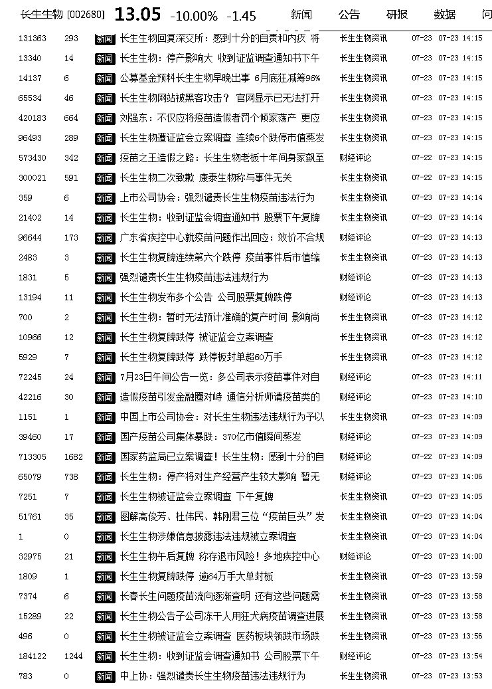
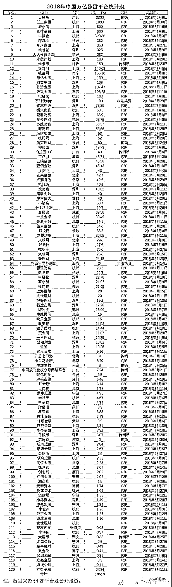
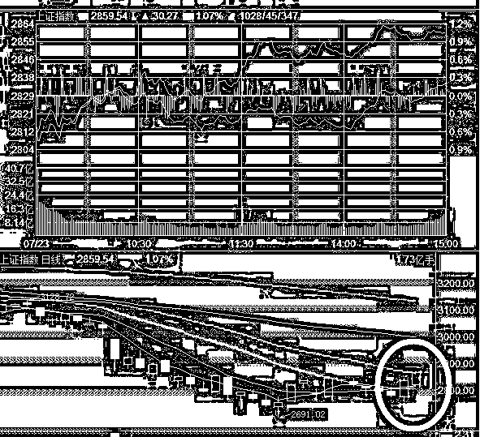

# 夜报|| 长生生物今天想停牌耍赖皮

lass="" data-copyright="0" data-ratio="0.0828125" data-s="300,640" src="http://mmbiz.qpic.cn/mmbiz_jpg/vVoVQ59VnF7pjKibM5nc3cXt2QIbjAjfRPFKsE447q0Gd6NhZ60rnLUGiayiblD7bJjicw3Px3Yfiadf5YcDrO9mabA/640?wx_fmt=jpeg" data-type="jpeg" data-w="1280" style=""/>

周末疫苗刷屏，主角长生生物今天开盘肯定是继续一字跌停，这个是毫无悬念的事情，但是今天长生生物居然唱了一出大戏，让股民们目瞪口呆。

首先，早上开盘的时候，长生生物发布公告，说拟披露重大事项，临时停牌，结果我们看到了一个奇观，A 股所有疫苗股都接近跌停，其他生物医药股也被拖累大跌，但是罪魁祸首长生生物，却停牌不跌，简直把 A 股随意停牌耍无赖的特点发挥到了极致。

于是证监会看不下去了，这是在啪啪的打监管脸啊，惹怒了证监会，于是到了中午的时候长生生物发布公告，收到证监会调查通知书，公司因涉嫌信息披露违法违规被立案调查。如果公司因前述立案调查事项被监管部门最终认定存在重大违法行为或移送公安机关，根据《深圳证券交易所股票上市规则》的有关规定，公司股票可能存在被实施退市风险警示、暂停上市或终止上市的风险。股票将于 2018 年 7 月 23 日下午开市起复牌。

这下傻眼了，本来想躺地上停牌耍无赖的，结果被强制复牌，还被证监会宣布存在退市风险，到了下午 2 点的时候，长生生物官方疯了一样连续发布新闻，瞬间发布了 58 个新闻，老实说，我也不知道他这么做是想干嘛，估计是失心疯了。

长生生物被退市的概率，很是有点大，这种被全民关注的焦点，被中央点名严查的企业，有重大违法过错的企业，被退市简直名正言顺，而证监会如今 IPO 这么多，退市的倒霉蛋严重不足，正愁抓不到人呢，这送上门的不可能不要，建议摁跌停，能跑则跑。

我昨天写疫苗的，20 个小时，不出意外的挂掉了，违规次数+1，这个是发帖前就预料的到的结果，之所以还坚持发出去，是为了心中的责任感。下面是复活号的二维码，紫色后花园，找不到我了，记得这里翻一下。

~~~~

然后，我今天找到一个资料图，是这二个月以来，中国暴雷的 P2P 累计损失资金，数额已经达到万亿，时间截止 7 月 11 日，在这份长长的列表里，只欠二三个亿的 P2P，都感觉是小案子了。。。

一万亿资金灰飞烟灭，这还只是 2 个月的不完全统计，这个大坑简直吓人哦，2017 年中国累计财政收入才 17 万亿，其中土地出让金 5 万亿，08 年震惊全球的刺激计划也就是四万亿，你可以从这些数字，看出这个一万亿的含金量，多少中国家庭的资金灰飞烟灭啊。

~~~

周末，美国特 XX 威胁以 5050 亿那个啥要挟中国，比之前的 2000 还狠，但是这种超大利空，完全没卵用，因为 A 股已经走出了筑底阶段，如今开始全面反弹。

我们可以看到，周五强行突破之后，周一受特 XX 大利空影响低开，但是丝毫不理会直接低开高走，收涨 2850 之上，终于回到一个正常的范围了。

我们可以看到，7 月以来，涨多的少，几个大利空都没有跌，可以认为，最黑暗的时候已经过去了，如今是在痛苦的煎熬后，享受果实的时候，很显然这个时候必须坚定持有。

大概什么时候可以卖，我觉得 2950-3000 点，就可以卖出 3 成先收一点回来了，然后越涨越卖，跌回来，我们继续买入，这种市场就慢慢熬，看谁能熬过谁就可以了，反正每一波都要赚一点。

