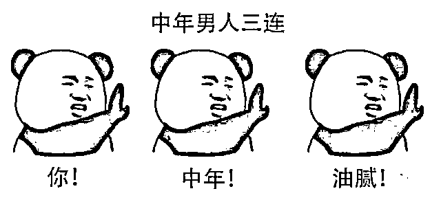
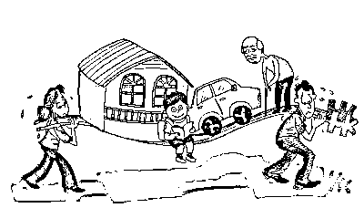
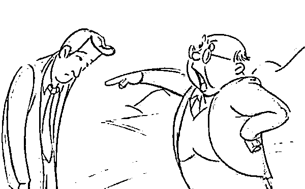
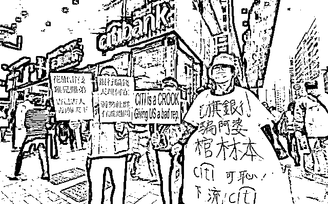
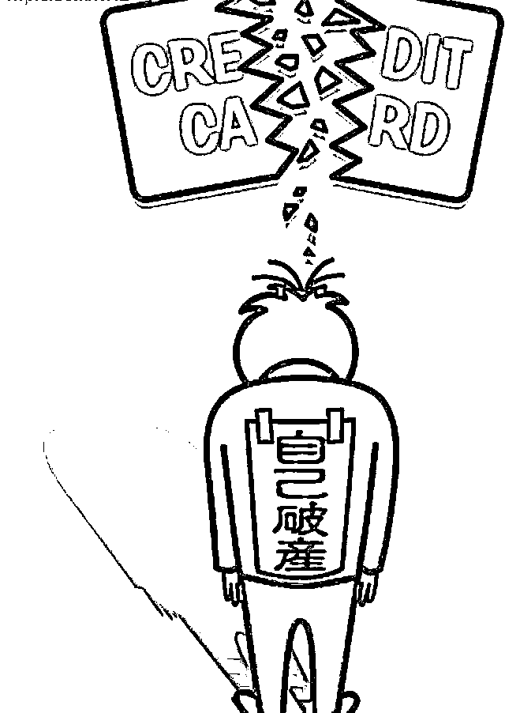
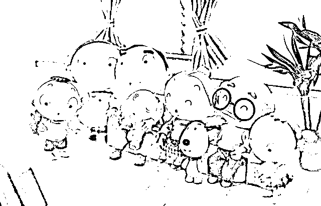
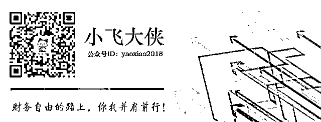

# 中年人永远是离破产最近的一群人

人到中年

你是什么时候意识到自己已经人到中年的？

我是因为世界杯。

早早地便去超市采购了一大箱啤酒和零食，兴致勃勃地定好手机闹钟。看起来就和别的球迷一样，蓄势待发、有备而来。

结果开幕式还没结束，眼皮已经开始打架了。回头看看老爸，鼾声四起。

天天高负荷的工作，白天应付领导和客户，晚上回到家已经累成狗。掐着点吃饭洗澡，身子一沾到床上就能直接睡着，和年轻时已经判若两人。

年轻时，可以为了修改出一个满意的方案整夜整夜不睡觉，第二天仍旧可以生龙活虎。当年还背地里鄙视过某领导，就因为晚睡三个小时，直接把第二天早上的时间用来补觉，连下午的工作会议期间都还是浑浑噩噩。

熟料现如今我，也成了曾经鄙视的「无法熬夜」的油腻中年了。

还有一个，是因为老爸的七十大寿。

年轻时看电视剧，总是对其中一个情节嗤之以鼻：一个中年人跪在地上哭求饶他一命，因为他上有老下有小。

嗤之以鼻的原因很简单，

一是因为男儿膝下有黄金，应该宁死不屈，怎可随意下跪？

二是因为怕死就说怕死，老拿「上有老下有小」出来当挡箭牌真的很丢脸。

如今再看到这样的情节，却已能真切地感受到剧中人的无助。

人到中年，最明显的标志便是「上有老下有小」这一份沉甸甸的责任。

老爸七十大寿时，拍了一张全家福。别人看到的是阖家幸福、其乐融融，但是我看到的是为了维系住这一切背后的艰难与心酸。这份责任已无法推卸。

关注焦点的变化

前两天刷微博，被一句话扎心了。

「不要大声责骂年轻人，他们会立马辞职的。但是你可以往死里骂那些中年人，尤其是有车有房有娃的那些。」

仔细回想近几年朋友间对于工作的讨论，确实暗合此理。

刚毕业时，遇到上级责骂、遇到客户刁难、遇到同事下绊子，朋友们支的招里面最多的就是：辞职！

三条腿的蛤蟆不好找，两条腿的老板遍地都是。

长这么大，爸妈都不舍得说一句重话，凭什么要忍受这样的委屈？

勾心斗角的环境，惹不起我还躲不起么？

而现在，朋友们大多成家。再遇到同样的问题，支的招虽然也很多，但是辞职已经不会再轻易说出口了。

虽然老板是傻逼，但是毕竟待遇不错，就忍忍吧。

不是每个客户都那么难搞定的，说不定下一个客户就轻松了，熬一熬吧。

别轻易站队就行啦，能力最重要，上级都看得见的，别放心上。

年轻时觉得，中年人活得窝囊是因为自己不努力；低声下气是因为懦弱；不成功是因为缺乏斗志。

我们甚至看不起自己的父母，只会守着那份死工资干一辈子，拿着那点退休金就心满意足，根本不知道世界发生的巨变。

但其实真等到自己步入中年这个槛，才恍然意识到，真不是因为自己缺乏斗志，而是真心输不起。年轻时可以大胆创业，输光了大不了重头再来。但一旦你的身后站着整个家庭，你输光了便会将整个家庭拖入万劫不复。

因为，你早已不属于自己。

因为，你的身后有妻儿，有父母，你必须珍惜每份工作，必须牢牢抓住手里的每一分钱。

随时处在破产边缘

一直以来听得最多的都是「XX 公司破产」，哪里曾想到，有朝一日「破产」这个词也会和个人沾边。

08 年金融海啸冲击之下的香港，就出现了大量中产失业跳楼的案例。因为失业了，债务还不上，家庭顾不了。每天一睁眼就是柴米油盐，上有老人需要赡养，下有小儿嗷嗷待哺，催债的步步紧逼，毫无出路，只能一死了之。

所以，个人破产不是没有听说过，而是没想过会真的发生在自己身上。

高房价、高债务、背负着整个家庭的生活，如今的我们，跟当年香港的中产是何其相似。

最近 P2P 的雷一个接一个，国资背书的不管用，上市公司背书的也不管用，圈走的资金一个比一个多。杭州市甚至开辟出了专门的场地用以安置维权者。整个黄龙体育管乌压压的一片，全是从全国各地赶过来报警维权的「P2P 投资者」。

一朋友投的平台有国企背景，在其他平台陆续跑路之后，他还追加了十几万投了进去。因为他确信有国企背书的平台绝对安全，而这十几万加上已经投的五十万，不仅是他近几年的全部积蓄，而且还有父母双亲的养老钱。

他并没有盲目地信任平台，投资之前也做了背景调查，确实有国企背景，年化收益也不算太高。没想到，还是雷了。

他去杭州报案的时候，看到体育馆的「盛况」腿都软了，脊背发凉，满是绝望。虽然心知，钱多半是回不来了，但是跟大多数人一样，还是抱有不切实际的希望。而这些，他甚至都不敢跟家里说。就连来杭州，跟家里说的也只是出差。

我们都知道，他已经破产了。

没有踩中 P2P 雷的中年人虽然幸运，但也不能掉以轻心。其他地方的雷也不少，说不定一不小心就会踩中一个。

或许不是雷，是重大变故，比如，疾病。随便来点什么，都会让整个家庭面临破产。

谁年轻的时候不是意气风发，心比天高，坚信只要努力，财富榜上终究会有自己的名字。

但是终究敌不过残酷的现实，你有了责任，你有了牵绊。

每天考虑的最多的就是准时打卡，不被罚款，迎合上级，保住工作。

最终还是成为了年轻时最看不上的「唯唯诺诺」的中年人。

对生活妥协

不知不觉间成了家里的精神支柱和经济支柱，父母妻儿都对你寄予厚望。

你步步惊心，生怕行差踏错，小心翼翼地维护着现有的生活。工作、房贷、生活、教育，每一个都让你累得喘不过气。

干脆不管不顾、一走了之。这样的念头不止一次出现在脑海中，但也就一闪而过。

最多就是在下班回家前，坐在车里抽根烟，好好享受难得清静的十分钟罢了。

其实严格说起来，谁的生活不是一地鸡毛呢。就像那个喜欢训话的秃头上司，他儿子不就叛逆得离家出走了么？

为了生活妥协吧。这不是耻辱，也不堕落。

而是人到中年，很多事情都想通了。既然没有能力改变世界，那就妥协吧。对家人好，对自己好，岁月安稳。

所以，请不要鄙视你身边的中年人。

他们的懦弱，其实是另一种坚强。

他们的低声下气，比起年轻人的愤而离职更需要勇气。

他们的哭泣，也并不是矫揉造作，而是积攒到极致的发泄。

人到中年，只有拼命奔跑，忍受所有不易，才能为家人挡住尽可能多的风雨，维护住一个温馨幸福的家。

请多理解你身边的中年人。

他们也曾经很有趣，也曾经毫无牵绊地说走就走。但是现在身上背负了太重的甜蜜负担，只能收起锋芒，踏踏实实缓步前进，不求大富大贵，只愿现世安稳。

如果你人到中年。

请好好照顾自己。父母以你为豪，伴侣需要依靠，儿女视你为榜样，你的身体已经不再属于自己。熬夜、酗酒、胡吃海塞已不再适合你。

你只有坚持锻炼，保持住健康的身体，才能支撑接下来的努力和拼搏。

同时，你还需要不断地进行充电，坚持学习。要知道时代抛弃你，连一句再见都不会说。

人到中年，你离破产就只有一步之遥。但好在，人生还有下半辈子，只要前进的脚步不停，再怎么样也不会过得太糟糕。

与君共勉。

