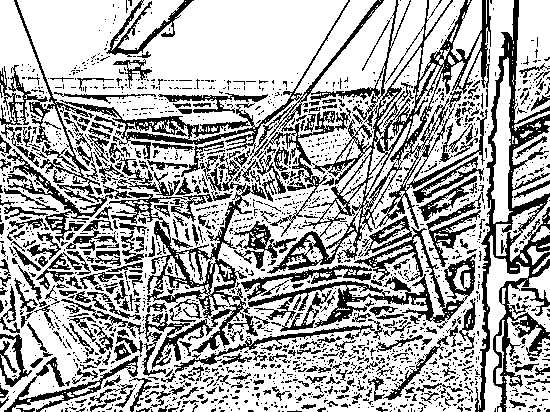
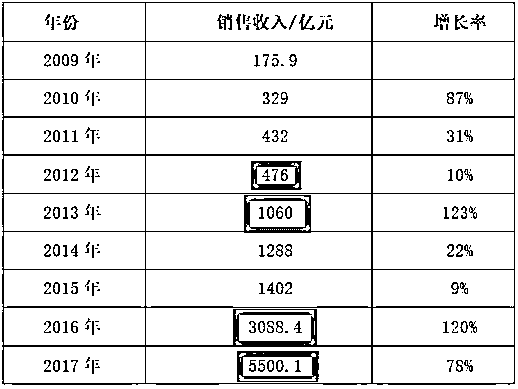
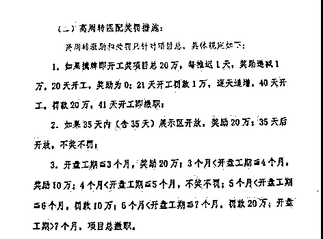

# 为什么碧桂园的质量那么差

最近一年来，碧桂园爆发全国多地的业主维权行动，堪称维权潮，上报纸的频率为全国第一。而工地倒塌事件几乎层出不穷，近来，碧桂园的工地又双叒叕塌了，为什么写这么多个又呢，因为真的很多啊。

> *2017 年 5 月份，河南驻马店碧桂园项目工地现场塔吊倒塌;*
> 
> *2017 年 8 月份，江西萍乡碧桂园项目在建工地坍塌;*
> 
> *2017 年 9 月份，江苏盐城碧桂园项目发生安全事故;*
> 
> *2017 年 11 月份，海南琼海博鳌碧桂园在建工地发生安全事故;*
> 
> *2017 年 12 月份，广东阳江江城区岗列街道碧桂园项目发生事故;*
> 
> *2018 年 4 月份，广西崇左碧桂园项目在建工地塌方;*

而把碧桂园推上风口浪尖的，是他近期在上海和杭州二个大城市连续的严重倒塌事故。

6 月 24 日，上海碧桂园红墅林售楼处 6 层屋面混凝土浇筑过程中出现模架坍塌，现场部分作业人员被模板及钢管掩埋，共造成 1 死 9 伤。售楼处都能塌，还有一位 51 岁的工人身亡，还是在大上海，你让别人怎么相信你的房子不会有事。。。

7 月 12 日，杭州萧山碧桂园前宸府基坑出现塌陷，事故殃及附近居民楼，基坑的裂缝蔓延至其地基让其成为了危楼，十几户居民被紧急疏散到宾馆。碧桂园没有成为一个五星级的邻居，反而成了一个五星级的大坑。

碧桂园，曾经也是一个上档次的品牌，为何成了现在这般模样，房屋质量如此之差，到底是什么原因呢，我认为这是碧桂园的体制问题导致的。

碧桂园的体制

碧桂园的体制精髓有二个，第一个是合伙人制度，第二个是高周转。

首先说说合伙人制度，简单的描述就是员工持股跟投以及超额利润分享，按照碧桂园的制度，公司的所有新项目，员工都可以跟投，最高股权比例上限为 15%，区域总和高管必须跟投。

碧桂园的杠杆率是 80%左右，所以跟投的资金也会享受这个杠杆率，项目做的好，年化收益简直是爆表，这是总部给员工让利的一种表现，也把所有的员工绑在了战船上，和总部一条心，荣辱与共。而超额利润则是说达到一定利润标准的时候，区域总可以分享到该项目利润的 20%。

风险共担、命运共享，如果赚钱，那么大家一起分钱，如果亏钱，那么要从区域总手中其他项目的已有盈利里扣除，如果填不平，还要按百分比从工资扣除。

这个制度，极大的激发了碧桂园的战斗力，也让碧桂园上下拧成了一股绳，碧桂园的销售额从 15 年开始出现了爆发式的攀升，一举实现了逆袭，成为地产界第一把手。

而相应的，碧桂园也非常舍得给员工发钱，据公开资料，2016 年 6 个区域总年薪上亿，还有几十个区域总年薪上千万。

所以，当碧桂园总部推行高周转的时候，没有遭到丝毫阻力就推进下去了，因为这不仅符合总部的利益，也符合上下员工的利益。

按照高周转的要求，碧桂园要实现当天连夜出图，光速建房，平均 5.2 个月开盘回款的速度被董事长杨国强批评为完全无法达到集团高周转的要求。在上一段，我们看到了区域总的高收入，但是区域总不仅要自己投入大笔本金，承担经营亏损的风险，而且一个不小心，还会被撤职。。。

如果拿地之后 41 天还没有开工，项目总撤职，拿地之后 7 个月项目还没有开盘回笼资金，项目总撤职，这个项目总，也不是那么好当的。

房子本质上是一种消费品

房子这个东西，从本质上说，他不是个投资品，而是个消费品，在成熟的发达国家，例如日本，一套房子默认购买之后直接跌价 20%，而木制的一户建默认 20 年价值直接归零。

日本人对待房子的态度，和我国对待汽车的态度差不多，在我国，一辆新汽车，买入当天价值也直接下跌 20%左右，10~15 年价值归零，当中国人摆脱这一代炒房的恶习之后，最终会把房子和汽车，看做是同等的消费品，毕竟他们都是拿来生活的，而不会创造什么价值。

除了那些买了房根本就不住而是想着卖给下家接盘的炒家之外，刚需们都是确实需要住房的，当你真正要使用这件消费品的时候，他的质量就非常重要了。

如果工期压缩到这么短是可以做到的事情，那么其他房地产商早就这么做了，谁不知道工期越短收益越高，他们不敢是因为他们怕出事，要控质量，碧桂园敢是因为不怕出事，要钱不要命。如果碧桂园这么无限压缩工期造出来的房子质量和正常施工进度一样的话，那么以后清华同济土木学院的课本，得碧桂园区域总来编制了。

混凝土硬化后再做上一层？

墙体鼓包出现空洞要拆除重建？

每个节点完成后要第三方仔细检查再继续推进？

碰到施工问题要请设计院专家论证后再继续施工？

连夜赶出的设计图和现场条件发现不一致的时候修改图纸再继续施工？

别逗了，你这么搞，是让项目总等着被撤职吗？一切以工期为主，质量靠边站，只要造出来的东西看起来还过得去，三五年不出事，就先对付着吧，在碧桂园的体制中，合伙人制和高周转，都把员工干活的激情发挥到了最大，唯独没有说十年之后这个楼盘出问题了怎么办，如果 10 年后出现质量问题，那个时候区域总会赔钱给购房者吗？到了区域总口袋里的收益，你还掏的出来吗？这种畸形的激励制度肯定是有问题的，只顾眼前不顾未来。

报告区域总，由于技术员的疏漏，有一处的钢筋用错了，小了一号，可能有质量隐患，请求拆除重建。

嗯，拆除重建需要多久？

我们加班加点，保证十天内搞定。

十天？这个问题 10 天，那个问题 10 天，你是要我被炒鱿鱼吗？算了吧，继续盖下一层，应该不会出事。

碧桂园的房屋质量大爆发

为什么最近一段时间，碧桂园维权事件突然铺天盖地的出现在了媒体上，那是因为碧桂园的快速发展是始于 2016 年，从上图中碧桂园的销售额我们也可以看出，16 年碧桂园销售额突然急剧增加。

那么，16 年开盘销售的房子，17~18 年就开始陆陆续续交付使用了，交付的时候引发了大量的维权事件，这些维权事件慢慢的磨损了碧桂园的声誉，加上 6 月底以来上海和杭州的连续二次严重事故，甚至连售楼处都塌了，这才引爆了整个事件。

楼板的混凝土还没干，一踩一个坑，上一层就开始搭架子支模板了，到处都是裂缝，拿东西一抹就算解决了。这样的施工进度，能造出什么样的房子？碧桂园的房子，漏水、鼓包、墙砖脱落简直太正常了，精装房收房后反复大修几个月还没办法入住的碧桂园维权帖，简直不要太多，网络一搜一大把，碧桂园的维权简直可以称之为维权潮，把中国预售制度业主看不到现房容易被坑的缺点发挥到了极致。

作为一个购房者，我根本不知道墙体里是什么样子，我也不知道钢筋水泥的质量是否符合规范，我也不知道现在看起来还行的房子，十年二十年之后会不会某一处就直接塌了。

我看不穿混凝土的内质，所以我只能选择相信地产商的良心，但是这样的地产商，能让我相信吗？

觉得此文的分析有道理，对你有所帮助，请随手转发。

往期回顾（回复“目录”关键词可查看更多）

香港人说，香港房价必须这么贵！| 刚性兑付是一种骗局 |成本 200 的百姓救命药卖到 2 万一盒，难道没钱就得死？| 中国的房价什么时候会崩盘？| 你根本不知道烟草公司有多赚钱 | 中央这次打击三四线城市房价的决心为何如此坚定| 我是如何保证自己不近视的 | 魏忠贤其实是个贤臣 | 2 分钟了解中国 50 年的艰辛发展史 |历史数据表明：中国最赚钱的职业十年一个轮回 |房价大利空，货币化棚改权限被收回

