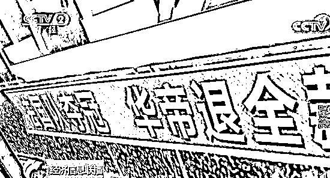
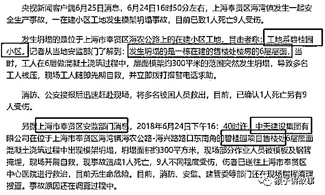
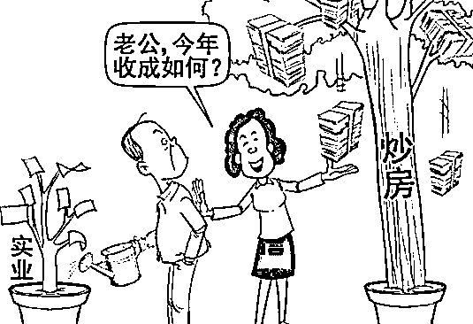
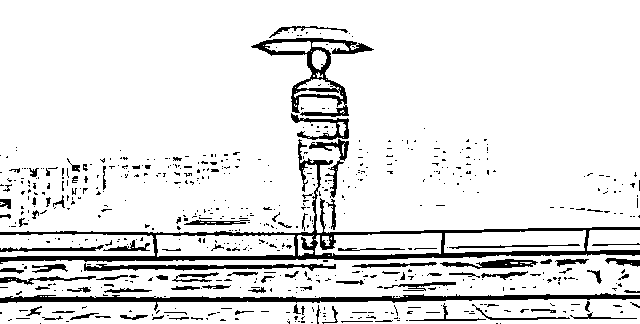
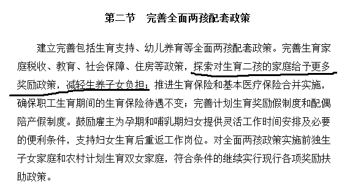
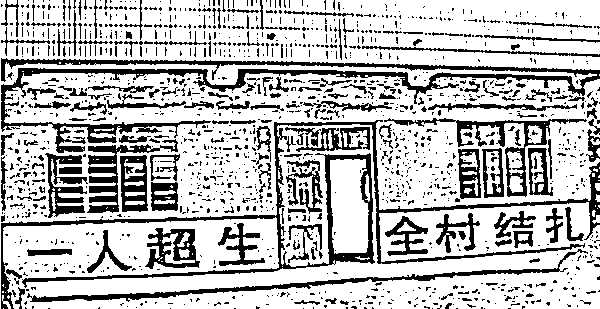
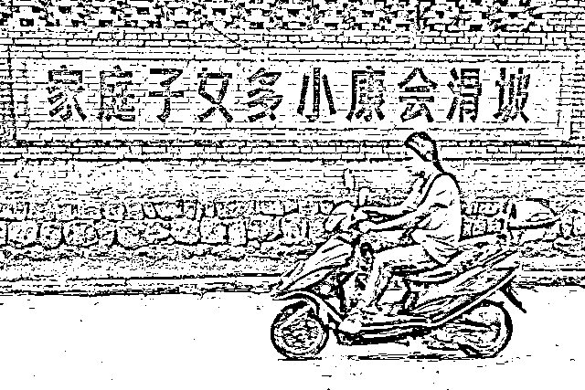
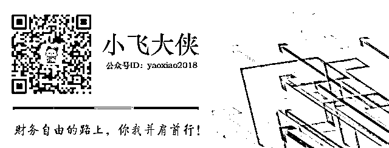

# 我们还能逃往何方

**华帝怕是要凉凉**

法国队夺冠了，华帝成功蹭了世界杯的热度，一连刷了三波频，可谓最大赢家。

营销费用尚且不到一个亿，而带来的效果却是立竿见影，不仅库存顺利出清，零售额更是刷上了 10 亿。

只是，一语成谶，华帝终究还是辜负了手中的一副好牌。

「退款」变「退卡」，套路早就铺好，退与不退全凭缘分。

连央视等主流媒体都发文批评，指责华帝的营销涉嫌霸王条款，引发全民吐槽。 

买了「夺冠套餐」的小伙伴还沉浸在退全款的喜悦当中，没想到传来的却是无法顺利退全款的消息。

你以为你占到了便宜，其实只不过是商家清库存的手段。商家的套路，怎么玩得过？

**房子是用来住的**

放眼世界，房子可不都是用来住的么？这还需要领导来提醒么？

可当今还真有这么一个神奇的国度，房子不住，先炒。

只是，本来大家以为这话是说给炒房者听的，没想到是说给开发商听的。 

可是，认真听进去的开发商又有多少呢？领导也就是喊喊，尽个提醒的义务，听与不听全在个人。而开发商呢，就当没听见，还沉浸在高周转的焦虑里。

最近被推上风口浪尖的碧桂园就焦虑得不行。

紧急叫停全覆盖的战略

撤出了周转周期长的合作项目

不惜一切代价贯彻实行高周转，加快推进「456」

然后，售楼处塌了，死了一个工人，伤了好几个工人。媒体报道了，工程质量暴露了。

有人问这样的房子还能买么？

买呀，你不买有的是人买，反正买来不是自己住，快去抢吧。

碧桂园慌么？怕是不慌的。

毕竟房住不炒只是个口号，买房子的人还是很多的。

7 月初，杭州萧山碧桂园开发的前宸府发生倾斜，水泥桩大幅歪倒，不仅造成了附近路面的坍塌，还让隔壁邻居的房子直接变成危房。

而这样工程质量的房子，却是开盘秒清。

售楼处小姐姐说，我们的房子盖得很快的。

买房的一脸懵逼：科技进步真快，盖个房比三岁小儿搭积木还快。

碧桂园高层说，要不惜一切代价实现高周转。

于是塌掉的售楼处成了代价，路面坍塌成了代价，隔壁邻居的危房也是代价，甚至包括死掉的那个工人也是代价。

只是不知道，下一个成为高周转代价的会是什么？细思极恐。

碧桂园捅出了整个行业不为人知的行业内幕，建筑乱象下开发出来的房子，能放心住么？

住进去的人根本不知道前一秒还能给自己遮风避雨的片瓦之地，下一秒会不会直接成为掩埋自己的坟墓。

也是很贴心了，让大家把买墓地的钱都给省了。

股市、债市都比不过 P2P

股市持续阴跌，底深不可测，上市公司造假横行，强制退市的一个接一个。

专家甩锅给毛衣战，称这是大环境的影响，经济平稳整体可控，股市天天下跌全是股民恐慌，自己吓自己引发踩踏导致的。

呵呵哒，怎么同为毛衣战对手国的股市却连创新高？一个频频新低，一个连刷新高，差距是越拉越大，怎么两国交战，受影响的只有 A 股？

看来我大 A 股可能是存在异次元空间，才会这样无欲无求，犹如一潭死水了。

同「房住不炒」口号一并传出来的，还有「借钱是要还的」。

吃瓜群众此时一脸懵逼，原来以前借钱是不需要还的？

哦，错了。

不只是以前，现在可能也不用还。

债市违约一个接一个，不停地借钱，利息比利润都高。这下兜不住了，怎么办？能怎么办？还钱是不可能还钱的，爆了就爆了吧。反正已经那么多爆的了，多我一个不多。

就像熊孩子跑到村口小卖部赊账，越赊越多，自己兜不住了哭着回家找妈妈。妈妈能怎么办？总归是自己的孩子，一顿打骂后还是会把钱还上。

熊孩子尝到甜头了，故技重施，但是这次妈妈发怒了「借钱是要还的！」。

只是这时候熊孩子已经熊惯了，又怎么拉的回来？

只是苦了辛苦攒钱的中产。躲过了股市的阴跌，避开了债市的违约，却还是没逃过 P2P 的收割。

P2P 的雷一个接一个，一群接一群，炸起来犹如烟花般绚烂。只是局外人看得热闹，局内人却看得凄凉。

股市再阴跌，腰斩再腰斩，好歹还残留些肉沫。债市违约跟个人投资者关系不大，最后可能还有央妈兜底。可是 P2P 炸雷，那是尸骨无存、血本无归。

股市割韭菜只割半截，剩下的养肥了再割，而 P2P 直接把根也割走，将所有投资者的财富洗劫一空。

明明是炎热的盛夏，这周身的寒意却始终下不去。站在天台俯瞰城市时，面对这世界遍布的镰刀，欲语还休。最后只叹息一声「天凉好个秋啊」。

接盘侠在哪里？

15 年的牛市行情中，连市场上卖菜的大妈都在讨论 K 线，赚钱看起来是那么的容易，新鲜韭菜前仆后继地入场。只是，有人赚就必定有人亏。

新鲜韭菜一没技术二没资金，终逃不过在山顶站岗的命运。本想套利走人，没想到把自己套成了上市公司的股东。

躺着装死吧，等下一轮牛市开启。总会有新鲜韭菜过来拯救我们的，就如同我们拯救了上一批站岗的老韭菜一样。

指望从股市里发财是无望了，还是回归家庭，结婚生子吧。

什么，丈母娘要求婚前买房？

凑不出首付怎么办？

没关系，专家给你支招了，有六个钱包呀。 

那就买吧，还能如何。房价一直在涨，现在不买以后更买不起。早早就买了房的哪里用得到六个钱包，可能两个钱包就搞定了。而后面想买房的怕是再往上加六个钱包都再难负担的起了。

房价不能崩，崩了国家就完了。没有国哪来家？唯有自己安慰自己，六个钱包就六个钱包吧，也算是为国接盘了。

内忧还没解决，外患又起。帝国主义亡我之心不死啊！

这回专家又说了，加税没关系，只要我们扩大内需，再多的商品都能内销。

只是这内需要怎么拉？

买了房的战战兢兢，每月工资还了房贷所剩无几，顺利加入「隐性贫困」人口之列。

没买房的畏畏缩缩，领了工资也不敢乱花，时刻惦记着买套房。存款倒是越来越多了，但是跟房价的差距也越来越大了，更是不敢乱花钱。

眼看「拉动内需」沦为一句口号，「消费升级」变成「消费降级」，破局之路在哪里？

这时候又有专家说了，建议对生育二孩的家庭给予更多的奖励政策。

恍然大悟。

不得不赞叹一声，高！实在是高！

第一步，取消计划生育，全面放开二胎政策。

第二步，鼓励生育二胎，并给予物质奖励。

第三步，将生育二胎上升为国家战略，全面洗脑，生二胎就是爱国的表现。

第一步已经实行，第二步已经有探路的，第三步怕是不远了。

别笑，这不是在哄你。

犹记得二十年前，计划生育基本国策的实行也是为了爱国。

当初实行的越彻底的地区，二十年后就越凄凉。

没想到风水轮流转，二十年前避之不及的人口，成了如今各地大抢特抢的人才。  

曾经，韭菜是不缺的，随便忽悠一下就全都出来了。如今，韭菜被收割了好几波，长不动了，不肥美了，是时候呼唤新韭菜出来了。

二胎啊，快快长大吧，国家需要你。

你们是祖国的花朵，你们是祖国的希望，内忧外患全靠你们来解决了，担子很重啊！

早上去找华帝退钱，中午到跑路的 P2P 公司催债，下午去碧桂园维权，晚上还要响应国家号召努力「爱国」。

一天看尽一生，苦逼的中产擦干一把辛酸泪，举目四望，还能逃往何方？ 

