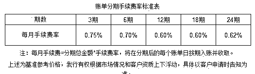
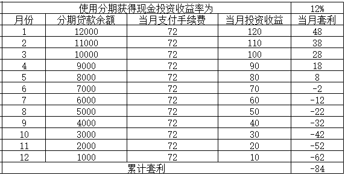
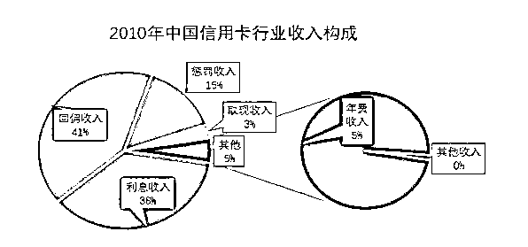

# 信用卡时代如何最大化自己的权益

 

我们都知道，现代金融是基于信用建立的，现代社会也是基于信用建立的，美国人对自己的信用记录非常的在意，强大的信用制度是建立美国和谐社会的基石。

对于中国而言，信用制度的建立要落后美国太多，而整个信用制度的推广，其实是从信用卡开始的。中国的首张信用卡，是 1978 年刚改革开放的时候，中国银行代理某外资行发放的，那个时候中国自己的银行还没有开设信用卡的能力，只能代理国外的。到了 2003 年，中国银联成立，清算和支付网络开始形成，各大银行才开始加大对信用卡的投入力度，建立自己的信用卡中心和营销队伍，自那以后，我国自己的信用卡市场开始爆发式增长。你去银行办任何业务，结束的时候柜员都会挤出一抹微笑问：“请问您要不要办一张我行的信用卡。”

到了今天，信用卡几乎已经覆盖了全中国，很多人手里捏着远不止一张卡，而淘宝的蚂蚁花呗和京东的白条，他其实也是信用卡，只不过没有实体卡而已。换句话说，中国人已经进入了信用卡时代，那么，在这个新的信用时代里，我们应该怎么样最大化自己的权益呢？

1**信用卡的本质**

首先，我们需要熟悉信用卡时代的规则，然后去适应这个规则。信用卡的本质是授权，而授权的额度则基于信用。

换句话说，信用卡本身不重要，它只是一个媒介或者载体而已，本质上，是银行对你的个人资质进行了审核，给予你一定的贷款额度，在这个额度之内，任意时间你提出申请，银行无需再度审查，直接无条件放款，而这个额度的大小，则是基于你的信用等级。

无论信用卡使用有多少种使用技巧，它都不会改变你和银行之间的借贷关系，所以 P2P 和信用卡是一脉同源，当信用额度足够的时候，任何人都会优先选择信用卡，因为利率低，当信用额度不足的时候，这些借款人才会去考虑 P2P，唯一的区别就是银行对风控的要求很严格，授信额度低，安全保障高，所以贷款利率也低。而 P2P 降低了资质审查的要求，提高了授信额度，对应的平台风险也会增大，所以要求的贷款利率就高。

这也就是为什么大型规范的 P2P 平台，甚至能接入央行的征信系统的原因，欠他们钱和欠银行钱后果没有区别，因为理论上他们做的就是银行的信用卡小额放贷工作。

2**信用卡分期的奥秘**

银行如此热衷于发信用卡，那自然是因为信用卡能给银行带来收入，而信用卡的使用也为一些急用钱的人提供了便利的贷款通道，可谓是互惠互利的行为。不过信用卡使用中的一些小秘密还是要掌握的，尤其是信用卡分期的利率计算。

上图，是一家银行的信用卡分期手续费计算表，我们可以看到，如果选择 12 期还款的话，每期的手续费仅为 0.6%，按这个方法计算，年利率应该是 12*0.6%=7.2%，好像很便宜的样子，如果使用信用卡分期，把节约的资金以 12%的年化利率投资，好像可以轻易挣一笔利差。

实际上我们可以看到，每个月固定支付的手续费为 72 元，但是由于你占用银行本金的逐渐减少，你的投资收益从 120 每月飞速下滑到 10 元每个月，一年下来，累计套利损失是 84 元，也就是说，你以每个月 0.6%手续费的代价分期模式套取资金，以 12%的收益率贷出去，你是稳亏不赚的，这还没有计算投资风险溢价，如果计算，你亏的更严重。实际上，投资收益率大概要翻一倍，到 14%左右，才算双方是平衡的。房贷利率 5%，那是真的年利率 5%，因为他是按照剩余贷款余额来计算的，而分期模式不是，因为他是按照初始贷款总额来计算的。

但是之所以有这么高的利率，和小额贷款风险高是密不可分的，所以银行必须给出这么高的贷款利率，只不过用分期费的概念掩藏的看起来很低而已。对于大多数中国人来说，信用卡分期付款的功能是没什么用的，他们最常用的，是信用卡最高可达 50 天的免息期的利用。

3**信用的重要性**

信用卡可能是中国建立信用社会的第一块土壤了，凡是使用过信用卡的人，都知道维持自己信用的重要性，因为自己信用卡的授信额度和信用直接成正比，而信用额度越高，显然自己的权益就越大。

除了可以救急之外，信用卡额度高最大的作用，就是利用免息期套利，让货币获得时间价值，能用信用卡的地方，绝不用现金。

我们都知道，刷信用卡节约资金之后，哪怕你只是把这笔钱放在余额宝上，你都可以妥妥的吃到利差，如果你有其他靠谱的借款项目，那么你的收益会更大。

但是不管收益率是多少，其根基还是在信用卡授信总额度上，如果你长期使用信用卡按期还款信用良好，你的额度就会增加，如果你有哪一天忘记了还款，那问题就大了，不仅原本拥有的 50 天免息期的利息要重新按照年化 18%左右进行计算缴纳，还要因为逾期上一次征信系统，一旦有了逾期记录，不仅会影响你日后的购房贷款审核，还会影响你的信用卡额度提升，严重的甚至会降级。

所以，按期还款，维持信用，是使用信用卡的前提，如果你不能持之以恒的按期还款，你还不如不用信用卡，代价会非常惨重。

这里有个很重要的问题就是，按期还款很麻烦，有时候不是没钱，是真的忘了。所以中国出现了一个新的市场，很多帮助提醒用户按期还款的软件 APP，如 51 信用卡管家就是其中的代表产品，51 信用卡管家能够在用户授权后检索信用卡账单，节省用户以手工方式查询账单的时间，并逐步将管理的账单从信用卡扩大至生活账单如房屋按揭、汽车贷款，让用户全面管理其负债，设定还款提醒或打开自动还款功能，避免逾期。

51 信用卡是国内最大的信用卡管理平台，他有多少注册用户呢，注册的用户超过了 8100 万，注意是 8100 万人而不是 8100 万张信用卡，这些人都是要输入身份信息进行核实的，而全国所有银行的信用卡注册用户合计不超过 2.78 亿人。它通过帮用户管理信用卡账单，最后成功在香港上市，估值超过百亿港币。

图片来源：搜狐网

在公开招股期间，51 信用卡得到机构资本的认可，中信银行旗下子公司信银（香港）投资有限公司作为基石投资者，以总金额 3000 万美元的港元等值认购相关数目的发售股份。从这款软件的市场估值，你可以想象一下，中国使用信用卡的人群有多庞大，对辅助还款的软件需求有多高，这个市场含金量有多高。

4**银行靠什么赚钱**

很多人疑惑了，我是在薅银行羊毛啊，免费占用银行资金，银行怎么可能赚钱，亏本赚吆喝吧，既然银行都赚不到钱，51 信用卡又怎么可能赚钱。

你这么想，那你就小看银行了，从南京到北京，买的没有卖的精，银行是绝对不会做亏钱买卖的，想薅银行羊毛那是不存在的事情。

银行信用卡的收入主要包括利息收入、回佣收入、取现收入、惩罚收入和其他收入（年费和附加服务等）

这些名词直截了当的说明了收入来源，我就不赘述了，大家应该看得懂，我主要解释利息和回佣。所谓利息收入，就是你不再利用免息期，而是直接使用信用卡分期付款支付利息，不是所有的人都有兴趣养一堆卡反复刷卡赚免费的利息钱的，还是有人直接利用信用卡贷款的，这部分收入不可小觑，因为信用卡的实际利率是很高的，我上面说过，绝对不是 7.2%一年，实际高达 14%以上。

至于回佣收入，则是所有刷信用卡的人都要支付的。很多人可能认为，我刷信用卡有最高 50 天免息期，银行亏大了，实际上，你刷卡的那一瞬间是付费的，有一个刷卡费，一开始是 2%，后来降价到 0.6%，只不过不是你支付，是商家支付而已，这部分叫回佣收入。

这个回佣收入，足以保证在全部人都只使用信用卡免费期功能的时候，银行也至少能保本，至于更多的那就是利润了。但是不可能所有人都年复一年的薅羊毛，也不可能所有人都能用足 50 天免息期，所以银行信用卡的利润还是很可观的。

但是这和消费者无关，你不刷卡，商家也不会让利给你，所以消费者依然开开心心的使用信用卡。而银行因为赚钱，也大力推广，我们都有被银行信用卡推销员闯入办公室推销的经历，银行花这么大资源去推销，自然不是去做亏本生意的。

而对于 51 信用卡这种信用卡管理平台而言，因为有太多用户使用它，所以它就可以和银行谈判，帮银行发卡来赚取一定好处费。

2017 年的数据来看，仅仅 51 信用卡一家，就替银行发出新卡 210 万张，撮合的信用卡还款交易额达 1085 亿元，并以和城商行合作的形式提供联名信用卡，分享联名信用卡带来的收入。

这还只是其中一家的数据，整个信用卡市场的份额有多大？合计利润有多少？简直不可估量。

5**我们应该怎么使用信用卡**

使用信用卡，对于我们而言，主要有三个要点需要注意：

1、使用分期付款功能，要仔细计算自己要支付的实际利率，并衡量自己的还款能力，不要因为分期还款轻松的还款压力就非理性大量消费，以致于最后超出自己的还款能力导致信用污点的产生。

2、绝对不要借债去还信用卡，如果有一天你的信用卡账单超出了你的还款能力，那么你需要好好反思自己的财务规划能力，千万不要轻易借款去还信用卡，否则很容易不把信用卡透支当一回事，认为自己可以不断的拆东墙补西墙玩转信用卡。实际上随着利息的不断上升，一开始还不起，后来注定还不起。所以一开始还款困难的时候，最好求助于家人，并反思自己。

3、切记按时还款，只要你能在免息期内按时还款，那么信用卡的存在就是送钱的，这一点要利用好，但是一定要记得按时还款，保持自己良好的信用记录非常的重要。

信用卡的普及，信用系统的建立，对于建造我国未来的诚信体系，也有基石和领路人的作用。我国目前已经进入了信用卡时代，每一个中国人都处于信用社会之中，随着时间的积累，信用好的人收获的权益肯定是越来越大。

而在这个新的社会规则里，最核心的一点，就是保持自己的信用记录，这一点非常重要。

觉得此文的分析有道理，对你有所帮助，请随手转发。

往期回顾（回复“目录”关键词可查看更多）

香港人说，香港房价必须这么贵！| 刚性兑付是一种骗局 |成本 200 的百姓救命药卖到 2 万一盒，难道没钱就得死？| 中国的房价什么时候会崩盘？| 你根本不知道烟草公司有多赚钱 | 中央这次打击三四线城市房价的决心为何如此坚定| 我是如何保证自己不近视的 | 魏忠贤其实是个贤臣 | 2 分钟了解中国 50 年的艰辛发展史 |历史数据表明：中国最赚钱的职业十年一个轮回 |房价大利空，货币化棚改权限被收回

