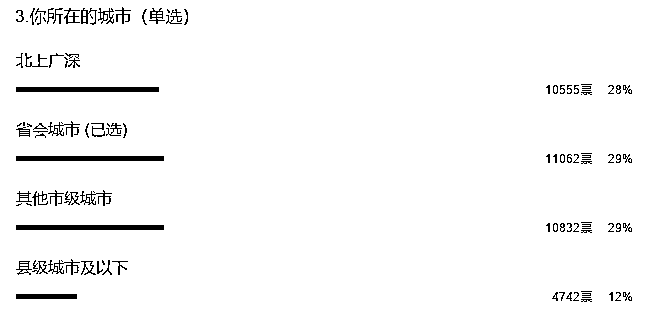
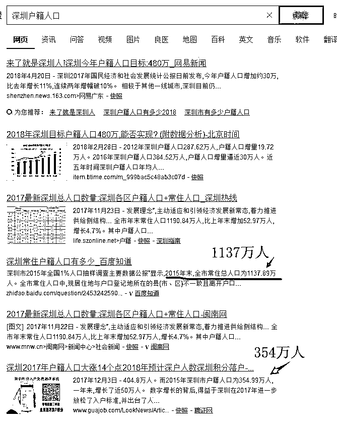
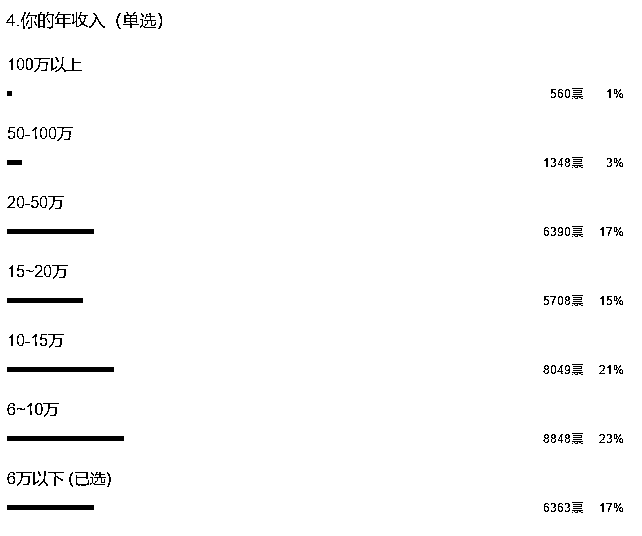
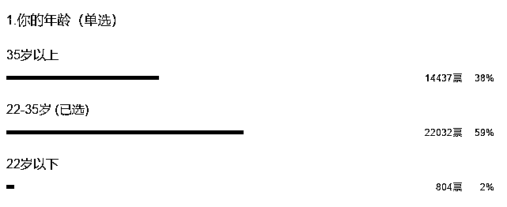

# 今天给大家组织一次高质量相亲大会

上次我科普全国人均收入数据的时候，遭到了很大的难度，相当多的粉丝不理解，中国人收入居然那么低。当时我就怀疑我的粉丝平均收入可能远超全国平均数据，毕竟是有一定积蓄的人才会关心财经，于是昨晚顺手做了一个调查，结果数据吓死人，比我想象的还要高。样本量达到万以上，足够体现平均值，调查表主要体现出我的粉丝里，学历高、大城市多，收入高、适婚人数多。

1、学历高

首先是学历数据，我们可以看到，大学以上学历占 90%的比例，大学以下占 10%

而上次我和大家展示过教育部的公开数据，从恢复高考到现在 40 年的时候，累计大学招生数量是 9577 万人，占据 13 亿总人口的 7%，也就是大学以下学历全国平均值应该是 93%，结果到了我这里，直接颠倒了一下，1 比 9 变成 9 比 1。

然后再细分一下学历，我们知道，历年大学招生基本都是三本以上一半，专科一半，然后到了我这里，本科占 52%，专科占 18%，不是 1 比 1，是 1 比 3，此外还硕士以上还占了 18%，换句话说本科以上占 70%，这个学历绝对完爆任何婚姻市场的平均学历啊，更完爆全国平均值。

2、大城市多

然后是所属城市的数据，我们可以看到，北上广深这四个一线城市，居然占了 28%的比例。二线省会城市又占了 29%

那么实际上一线城市的人口有多少人呢，根据 2015 年常住人口公开数据，北京 2170 万人，上海 2420 万人，广州 1300 万人，深圳 1137 万人，合计 7200 万，占总人口的比例为 5.5%。

有人说一线城市就这么点人啊，你这是户籍人口的数据吧，实际人口不止吧。但是我上面列的，就是实际常住人口。户籍人口其实很少的，以最容易落户深圳举例子，虽然它号称来了就是深圳人，但是实际户籍人口才 354 万人，只占 30%。

中国的主要人口，都集中在县城，虽然一个县少则三五十万人，多了也很难超过百万，但是架不住数量多啊，2861 个县，平均一个县 30 万人，直接 8.5 亿出来了。

但是我们可以看到，这个调查表里，县级只占 12%，明显和平均数据对不上去，呈完全反比，这就说明，关心财经和金融的人的比例是和经济发展水平呈正比的。

3、收入高

关于个人年入，我很贴心的让全职妈妈和在校学生，都直接填最低档 6 万以下，结果这个最低档的，依然没多少人。

我们可以看到，年入 6 万以下的人，只占 17%，而年入 20 万以上的人都有 21%，但是实际上，年入超过 6 万，已经碾压了 95%的中国人了，符合月入超过 5000 纳税标准的，全国只有 3000 万人，国开行副行长昨天刚说的。

所以，这个收入是真的高，很多鸡汤文说年薪 10 万只够温饱，那是针对大城市，在实际生活中超过 10 万的中国人真的是凤毛麟角，不信问问郊区工厂的打工妹和你农村的亲戚。

不过在我这就不一样了，年入 10 万以上的居然有 60%。。。

4、适婚人数多

然后，我调查了年龄分布，这个本来是随手填的，以 22 和 25 为分界线，22 以下基本还在大学无收入，35 以上已经步入中年，工作和收入都基本稳定，要供房子养小孩所以收入波动不会很大。22~35 岁的人是爱折腾的年龄，进步速度快，负担压力小，敢辞职也敢挑战，收入变化速度快，而且通常是向上变化。我的本意是通过这个，修正一下收入数据。

调查之后发现，居然 59%的人都是 22~35 岁，这说明上图的收入，是年轻人的收入，后续他还会增加。

看到这个图之后，我突发奇想，22~35 正是婚配高峰期，学历和收入都这么高，这是一大波需要婚配的人群啊，而且质量非常高。

做月下老人是积善行德的好事，所以我今天决定直接用头条做一个活动，来一次大型相亲大会，本来想放在次条夜报的，后来想一下，还是放头条吧，惠及人群更大一点。

活动规则：直接留言，我随机翻上墙。格式举例为：坐标北京，男，年龄，职业，收入，自我介绍，对另一半的要求，联络微信号 XXX。

被翻上墙的人，是有关注度溢价的，我们都知道，如果你结识了 10 个异性，只能其中选对象的话，和你结识了 100 个异性效果那是完全不一样的，很明显后者你选中满意对象的概率要更大一点。在婚姻市场上有一个明显的关注度溢价效应，受关注最高的人，找到的对象条件越好。

而在这里，连读者带他们的适婚亲戚好友资源库，每一个上墙的人都等于被几十万人关注，把你选为满意对象加你聊天的人会非常多，然后你再从中选择，牵手成功概率会非常大。

翻的时候我会尽量按照城市分布和男女分布平均翻，资料详细的、有个人生活照做头像的、留言早的，上墙概率大。

不过上墙最多 50 人，这是系统限制，只能解决一部分问题，其他的你们可以先在上墙的人中进行选择，还不够的以后再说啦。

友情提醒：我是随机翻留言上墙，无法对留言中的身份职业等信息进行核实，望读者们在现实交往中，自行核实。

不过，爱读书的男孩和女孩，应该都不会太差的，因为他们自带仙气，比如下面这个这个做复习题的妹子：

觉得此文的分析有道理，对你有所帮助，请随手转发。

往期回顾（回复“目录”关键词可查看更多）

香港人说，香港房价必须这么贵！| 刚性兑付是一种骗局 |成本 200 的百姓救命药卖到 2 万一盒，难道没钱就得死？| 中国的房价什么时候会崩盘？| 你根本不知道烟草公司有多赚钱 | 中央这次打击三四线城市房价的决心为何如此坚定| 我是如何保证自己不近视的 | 魏忠贤其实是个贤臣 | 2 分钟了解中国 50 年的艰辛发展史 |历史数据表明：中国最赚钱的职业十年一个轮回 |房价大利空，货币化棚改权限被收回

