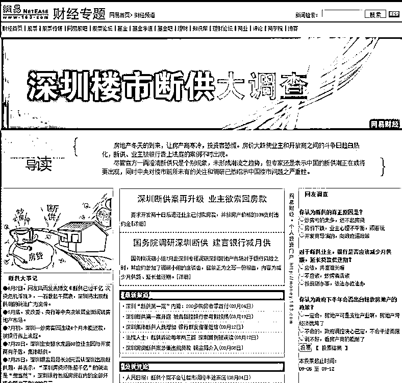

# 如果房价暴跌，银行会没收你的房子吗？

随着越来越多的人认可贷款买房的概念，贷款买房已经成为了大众价值观，绝大部分人身上都背有房贷。如果你购买了一套 1000 万的房子，首付 300 万，贷款 700 万，那么当房价腰斩只价值 500 万的时候，银行会没收强制拍卖你的房子吗？

我们的房贷合同上清楚的注明，如果抵押物价格下降的时候，银行会要求你补充抵押物，这是银行的权利。那么当抵押物价格下跌多少的时候银行才会通知你补充抵押呢，这个合同上没有注明，很多人认为，只要我能按期还月供，银行就不可能没收房子，事实真的是这样吗？

首先，我们要清晰一个概念，银行要的不是房子，是你的资产，在你的眼里，你借款 700 万是买了房子，自己一分钱没捞到，全在房子里，所以最坏情况也不过就是把房子给没收了。

但是实际上，银行给你的是真金白银的 700 万巨款，和你形成的是债权结构非常明晰的借贷关系，银行对那个房子一点兴趣都没有，他给你的是现金，要你还的，也是现金。

所以，在大多数情况下，只要你按期还月供，银行是不会找你麻烦的，没收房子拍卖也是需要走法院起诉流程的，有执法成本，很麻烦，银行更希望贷款人按合同约定还完剩余的房贷。

但是这一切，都是在房价下跌不多的基础上，也就是没有跌穿安全垫，你的首付款还在，如果跌穿了安全垫，那你的房子就有危险了。

还是上面那个案例，如果房价下跌 30%，这套房屋只值 700 万了，你的首付款已经跌没有了，再跌下去，就伤及银行的本金了。而且如果拉过去拍卖，说不定只能卖 600 万，这个时候，银行就要考虑自保了，再跌下去就麻烦了。

在这个时候，银行会催你补充质押，什么叫补充抵押，假设房价腰斩，房屋只价值 500 万，而你贷款 700 万，你补充 200 万现金给银行，那么银行就认可你是安全的，如果继续下跌，那么你要继续补钱。

没钱怎么办呢，你可以抵押其他资产，例如其他的房产、土地、汽车、名贵古董等一切银行认可的资产都可以，反正你要补齐这 200 万的差额，让银行的资金回到安全线以上。

如果你没有其他资产可以做补充质押，也拿不出 200 万现金，那么银行是肯定要没收你的房子的去拍卖的，如果拍卖得到了 400 万，那么你除了一无所有之外，还倒欠银行 300 万，上老赖黑名单，名下有任何资产都可能被银行查封，直到你还清欠款为止。

补充抵押贷款的意义，在于保护银行资金的安全，很多人认为，我会老老实实还月供的啊，我也还的起，银行你不要没收我的房子啊。但是实际上，如果你贷款 700 万，房屋价值下跌到 700 万附近的时候，绝大部分人都不会选择放弃的，但是如果价格下跌过度，跌到 500 万甚至只有 300 万，除了个别道德品德非常高的人之外，其他的人一般就不还贷款了，大不了房子你拿走。

贷款 700 万，房子只能卖 300 万，这可是多付 400 万欠款啊，这套房子市值才 300 万，他要是有这 400 万，直接转移走，以子女的名义按照 30%首付的话，可以直接买 4 套房子了，可以多赚多少钱？他为什么还要老老实实还给银行。

千万不要高估人性，银行也绝对不会把自己的生死寄托在贷款人守信之上，那叫江湖义气，而不叫市场经济，在中产完蛋和银行完蛋里面二选一的话，银行绝对是选择中产完蛋。至于说没收房产拍卖会导致房价继续暴跌，假设中国只有一家银行，一个声音的话，他可能会这么想，但是如果有几十家银行，互相进行资产考核来进行奖惩升迁的话，没有人会关心大市如何，只会考虑把自家银行先脱离苦海。

因为只要房价一跌，那是真的会出现大面积断供，想让银行背锅的坏业主是大有人在，中国房价只有在 2008 年出现过一次暴跌，巧了，刚暴跌就出现了大面积断供潮，我们看一看 2008 年媒体做的一篇专题报道，说的就是深圳楼市大面积断供，贷款的业主被银行告上法庭的事情。

深圳房价就跌过那么一次，就立刻出现了大面积断供潮，你说怎么这么巧？很多人心里和明镜似的，要是房屋价值真的跌到不如贷款余额了，指望他们守约难如登天。

所以，当房价刚刚跌破贷款余额的时候，银行就会立刻让你补充抵押贷款，绝对不会等太久，而且一般情况下，还会让你再多缴一点钱做安全垫，这样才能最大限度的保护自己的本金安全。

还有一个因素就是，当房价下跌的时候，一定是在经济下行期，房价下跌通常都是和失业潮所互相捆绑的，尤其是中国这种国情，但凡经济扛得住，政府一定不会让房价跌，要是跌了，那经济真的就扛不住了。

例如 2008 年，以正常的手段，是绝对无法挽救经济的，也拉不回房价，后来还是执行了大面积的放水，制造通货膨胀来饮鸩止渴，才把经济给拉上去的，如果当年不放水，后面肯定是经济危机。你原本以为自己是可以付得起月供的，但是等失业潮发生的时候，你又拿什么去还月供呢。

以香港和日本为例，当年在房灾中，被银行没收房产跳楼自杀的人，绝大多数都是因为经济不景气被迫失业，被银行没收房产又背了几百万巨债的人。他们有很多人，按照原本的工资，是能够勉强还得起房贷的，可惜经不起任何风吹雨打，一旦失业，立刻断供。现在那些北上深的房奴们你们自己给自己做一个压力测试，假设明天你失业了，你还能还多久的月供？哪怕只有 10%的人无法通过这个压力测试，带来的都是多杀多，第一批断供人带来的强制拍卖，会把房价打的更低，带来更多的人违约断供，然后是雪崩一样的连绵抛压，2015 年股灾，就是因为杠杆断裂引起的。

银行的确不会轻易没收拍卖你的房产，尤其是对于自住刚需，但是也不要认为你可以把风险无脑转嫁给银行，在银行面前单个贷款人是绝对弱势，和银行比聪明是不存在的，不要低估银行的智商。银行会拼命催缴补充质押的现金，在房价下跌达到一定程度之后，也会果断没收房产，绝对不会有什么客气好讲的，至于拍卖了还没还清的贷款差额，那也是要追债一辈子的。

现在你知道为什么政府不敢让房价暴跌了嘛，当杠杆断裂的时候，山崩海啸是谁也挡不住的。当然，我之前也发布多篇文章，不认为房价会涨，不让房价继续疯涨的原因还是怕第一波下跌带来杠杆崩溃，所以就这么横着吧，政府也难呐，横盘时间，预计是 3~5 年，只有达到这么长的时间，才能勉强消化第一波泡沫。

觉得此文的分析有道理，对你有所帮助，请随手转发。

往期回顾（回复“目录”关键词可查看更多）

香港人说，香港房价必须这么贵！| 刚性兑付是一种骗局 |成本 200 的百姓救命药卖到 2 万一盒，难道没钱就得死？| 中国的房价什么时候会崩盘？| 你根本不知道烟草公司有多赚钱 | 中央这次打击三四线城市房价的决心为何如此坚定| 我是如何保证自己不近视的 | 魏忠贤其实是个贤臣 | 2 分钟了解中国 50 年的艰辛发展史 |历史数据表明：中国最赚钱的职业十年一个轮回 |房价大利空，货币化棚改权限被收回

