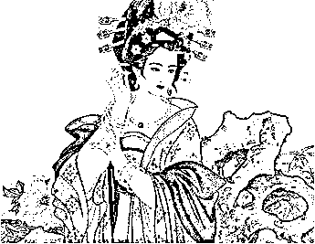
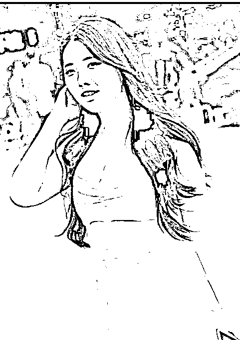
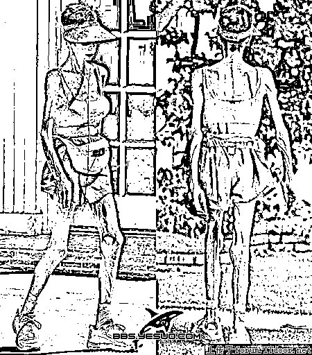
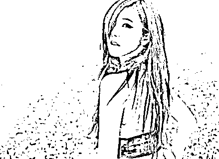
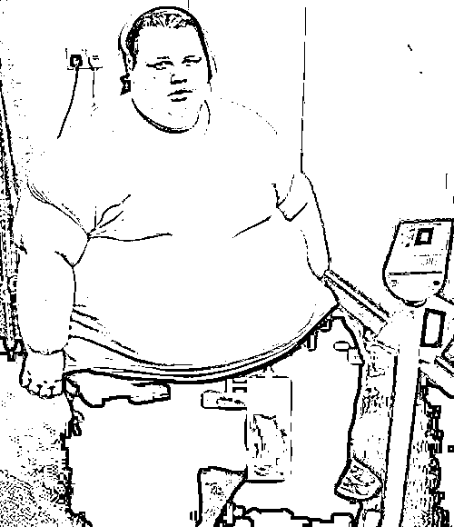
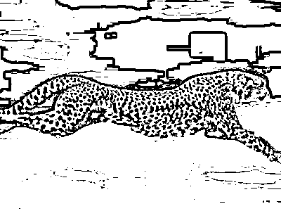

# 回到唐朝，胖子也翻不了身

肥胖，是一个很讨人嫌的问题，人到中年以后，感觉喝凉水都长肉，油腻的中年男人这个称谓会让你明媚的心情瞬间灰暗下来。很多人在午夜都偷偷幻想，要是回到唐朝就好了，听说唐朝以肥为美，像我这种胖砸，到了唐朝就是大美人，现在只是生不逢时而已。

但是实际上，在人类漫长的进化史里，绝大部分时候都是以肥为美的，实际上以瘦为美的时间是极其短暂的，那为什么人类的审美观突然改变了，这是和工业革命以来人类的生活水平突然爆发式增长有关系的，我们今天就来捋一捋历史，让你理解为何今天的人类会以瘦为美。

人类是以健康为美

首先，要修正一下定义，其实认为人类是以瘦为美这个词语是不精确的，认为古人以肥为美他也是不精确的，之所以这么说，是因为比较直观、便于理解而已。

人类的审美观从古至今都没有变，那就是以健康为美，人类至今所有的审美观，其实都体现出这一点，不管是白嫩的皮肤、乌黑的秀发、明亮的眼神，其实都是健康的标志。任何在不健康状态下的表象，例如暗淡的皮肤斑点、枯黄的头发、无神的双眼，都是现代化妆技术里极力遮掩的瑕疵。

以肥为美还是以瘦为美，其实一直都体现在人类对于健康的追求上面，只不过因为时代不同，人类追求的目标改变了而已。

以肥为美的时代

任何一国的古代，都是以肥为美的，甚至在刚改革开放的时候，中国的农村也依然是以肥为美，挑媳妇的时候就是要选膀大腰圆的，因为易生养，还能干活。

至于那些瘦弱的女子，在婚恋市场上是要贬值的，肩不能扛手不能提的瘦美人，在农村市场里有一个词汇来形容，那就是中看不中用。

而至于农村婚恋市场对男性的要求，那就更不用说了，地里的重活都是男人干的，当然要求越壮硕越好，又高又壮是最符合女性对男性的审美观的，在这里，胖人未必会壮，但是瘦子一定壮不起来，所以瘦弱的男性始终遭人白眼。

之所以会出现这种审美观，是因为人类历史上是常年吃不饱饭的，甚至改革开放以前，中国农村依然吃不饱饭，能吃饱饭的历史，估计也就这短短几十年吧。

在常年忍饥挨饿，平均寿命 30 岁的年代里，什么代表健康，能活下去就代表健康。壮硕的女性能帮家里干活，生下来的孩子有能力提供充沛的乳汁，在生存难以保障的年代，这就是健康。

大家一提到以肥为美，通常就自行脑补那种体重几百斤的相扑手，但是实际上，即便是古代胖美人的典型杨玉环，其真实的样子也应该是这样的。

如果换算到现代人当模型，差不多应该是这样的。

用通俗的话说，叫微胖界的女神，他们胖的一看就很健康，在吃不上饭，婴儿夭折率 50%的年代，这样体型的女子，最符合大众的审美观。

以瘦为美的时代

现在，人类踏入了以瘦为美的时代，这个所谓的瘦，肯定不是越瘦越好，例如下图这种瘦人，肯定没有人会认为这代表美。

那么为何人类开始变得以瘦为美呢，随着人们物质生活的丰富，吃饱饭不再成为一个奢侈品，而是一件稀松平常的事情之后，人们就开始追求更高级的健康。

什么是更高级的健康呢，我们以帝王家为例，他们是古代第一批能吃饱饭的，那么他们最希望的东西是什么呢？是返老还童药。换句话说，当人类达到温饱水平之后，其最喜欢的东西，就是永葆青春，这个时候，青春就代表着健康。所以，在古代农村普遍喜欢胖女人的时候，皇宫里的妃子，普遍都很瘦，因为皇帝喜欢瘦的。

对于成年人来说，最青春的时候是什么时候，就是人类的青春期，大概 12~17 岁左右，豆蔻年华，这个阶段人类的一大重要特点，就是普遍比较瘦，因为身体发育的太快。

所以，在温饱无法解决的年代，能够更好的生存下去就是最大的美。而在温饱得以解决的年代，人类的一切美学活动都在向青春靠拢，青春就代表最大的美，青春期也是人类最健康的年龄段。

女孩子减肥的目的，就是把自己的身材恢复到类似于青春期女孩的样子，女孩子化妆，也是让自己的肌肤恢复到类似于青春期女孩子的样子。只要身材够苗条，脸蛋够青春，那么你就能变成不老的仙女。下面这个女孩的妆容和身材完美的解释了现代美学复制青春的目的。

而在人类步入温饱时代之后，人类居然很快进入了超重时代，肥胖病迅速的蔓延到各大国家。等人类胖到一定程度的时候，就会对身体健康产生严重的损害，当现代医学证实这一点之后，对肥胖的恐惧形成了人们潜意识的厌恶，进一步强化了人类对纤瘦体型的喜爱。

人类的美学，从来都没有发生改变，都是建立在对健康美好生活的追求上面，而人类最健康的生活方式，就是每天在野外狩猎的生活方式，运动量大极大，吃的也不多。而人类最健康最有活力的年龄段，就是青春期时代。

例如这只猎豹，浑身每一寸肌肉都洋溢着美，这种美是跨物种的，因为这只猎豹一看就充满了健康和活力，所以人类就会觉得他美，这丝毫不受任何艺术作品的宣传影响，对这种美的欣赏，是源自于基因。

所以，肥胖的人不要每天幻想着回到唐朝我就是杨大美人，唐朝的人没我们想象的那么胖，在那个每天需要干大量农活还经常闹饥荒的年代，没有几个人胖的起来，他们认可的胖，估计和现代人对壮硕的男人和微胖的女人定义是差不多的，绝对不是那种臃肿的胖。

所以，人类目前以瘦为美的审美观并不是病态的，而是非常正常的，永远也不会改变，放弃回到唐朝的梦想吧，回到唐朝，胖子也翻不了身。少吃点零食，多增加点运动，让自己看起来青春洋溢活力四射，才是正道。

谨以此文，送给我那个热衷于美食还每天赖家里不动的老婆。虽然你美丽温柔可爱又漂亮，但是防患于未然嘛。

觉得此文的分析有道理，对你有所帮助，请随手转发。

往期回顾（回复“目录”关键词可查看更多）

为什么中国必须购买美国国债？| 租房贷款会将房子拆分成房骨和房皮 | 香港人说，香港房价必须这么贵！| 中国的房价什么时候会崩盘？| 你根本不知道烟草公司有多赚钱 | 中央这次打击三四线城市房价的决心为何如此坚定| 我是如何保证自己不近视的 | 魏忠贤其实是个贤臣 | 2 分钟了解中国 50 年的艰辛发展史 |历史数据表明：中国最赚钱的职业十年一个轮回 |房价大利空，货币化棚改权限被收回

