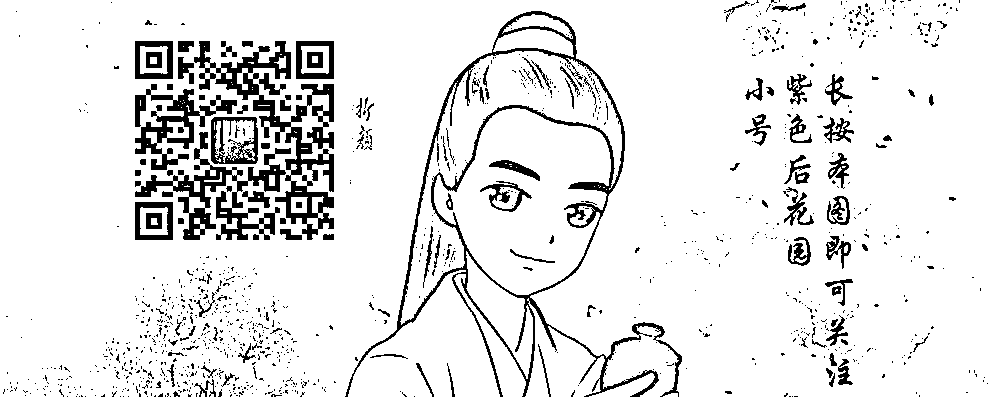

# 你想用进口药还是国产药？进口药效果好一点

 

中国的制药行业是非常弱小的，至今中国唯一拿得出手的，恐怕就是屠呦呦的青蒿素了，除此之外简直是一片荒芜，换个包装就号称新药然后涨价，是中国医药公司最喜欢做的事。在中国，原研药这个词汇等于进口药，而且是天价进口药，因为中国本土药企和原研药这个词汇不沾边，二万多元一盒的白血病神药格列卫只是其中之一，而不是全部。

原研药=进口药，但是进口药却不一定等于原研药，有很多国外的原研药，其专利保护早就到期了，按理说中国可以大胆合法的仿制了，但是中国居然没有仿制能力，仿制的国产药疗效明显不如进口药。

前几天去医院看病，开药的时候医生问我，你想用进口药还是国产药，我疑惑的问有区别吗？医生很笃定的告诉我，进口药贵一点，但是效果好一点，如果经济能力允许，建议使用进口药。

批评我中国填鸭式教学导致缺乏创新精神也就算了，但是中国仿制能力还是第一流的，山寨能力冠绝全球，为何区区一个药物仿制都搞不定，原创药你不会，山寨药你还不会吗？

中国仿制药能力有多弱

中国的仿制药能力弱到让人发指的地步，很多人认为，既然专利到期了允许你仿制，而你仿制的效果不好，那肯定是原药厂保密工作做的好，里面有些许的分子式你没研究透，导致效果出现了偏差，降低了疗效。

但是实际上不是这样的，法律给予原研药 20 年的专利保护期，在专利期内允许原研药卖个天价，对等的交换条件就是原药厂必须把配方贡献给全人类。所以在专利到期后，有效成分的分子结构、剂量和理化特性都会公开，所有人都可以查阅到。

如伟哥（万艾可），他的有效成分细节甚至在百度百科都能查到，但是他专利到期之后，十几家中国药企自己的仿制药全部质量不过关，属于典型的低价低效药，甚至可以说是无毒无效药，迫使中国消费者不得不继续购买美国辉瑞公司的原研药，以致出现了专利到期后，伟哥在中国的销量反而大幅上升 47%这种怪现象。

在中国有一种特别奇怪的现象，那就是原研药的价格并不会因为专利过期而下降，也不会被廉价的仿制药迅速抢占市场，这是其他国家都没有的怪现象。为什么会这样，主要原因就是国产的仿制药药效和质量都不过关，无法获得百姓的信任。

为什么会出现这种现象，因为现代医药学其实是一种高精尖的科学，所谓差之毫厘谬以千里，国外原研药和国内仿制药的工艺误差，有时候只有 1%甚至 0.1%的差别，但是有时候就会产生疗效的巨大异常，有效成分含量基本都差不多，问题主要集中在含量均匀度，溶出度这些项目上，别小看这些细节，等你吃下去之后，就会发现效果差异很大。

例如青霉素这种专利都过期半个世纪的老掉牙药物，居然还有国产青霉素和进口青霉素的区别，在国外青霉素是一律不用做皮试的，但是国内的青霉素医生都建议你做一下皮试，因为国内青霉素的杂质很高，过敏率始终居高不下，医生不放心，让你做个皮试也是为你好。

一位医生曾经对媒体说：“病人刚来的时候，先用‘小阿奇’(阿奇霉素)，如果控制不住病情就用‘大阿奇’。”其实‘小阿奇’就是国产的仿制药，‘大阿奇’是辉瑞的原研药。平时为了便宜，让患者先用国产仿制的阿奇霉素，真到了救命的时候，医生依然会选择进口的阿奇霉素，山寨都不合格，真是悲剧。

还有一些剂量控制非常严格，中毒剂量和有效剂量差距很小的药物，医生根本就不敢用中国药，如一种强心药叫地高辛，某个国产的地高辛性能就特别奇特，在病人遵医嘱按时服药的基础上，时而因为剂量不足出现心衰发作，时而因为剂量过大出现中毒症状，最后医生都怕了，怕出人命，于是只敢让病人吃进口药。

中国仿制药为什么这么弱

中国可以仿造出以假乱真的运动鞋、手机、甚至跑车，为什么连一粒药都搞不定？这一切，都是因为中国药企的生产工艺不过关，生产现代药物的难度可能比芯片简单，但是至少也是有生产特种钢这种技术难度的。而中国药企目前的生产工艺，还达不到这个水平。

为什么达不到这个水平，一个重要的原因就是药企的研发投入过弱，弱到别说自行研发新药了，连研发仿制药工艺的投入都严重不足。

研发投入弱的重要原因，就是因为中国的医药市场，并不是一个自由竞争的市场经济，并不是说你疗效好、价格低，你就一定会赚大钱，你的药卖的好不好，企业能不能赚钱，很大的因素，取决于你的销售渠道是否通畅。

根据 A 股公开上市的药企财报我们可以发现，多家知名药企的销售费用都占到了营收比例的 60%以上，也就是说卖出去一个亿的药，公司要支出 6000 万以上的销售费用，这还是上市的知名药企，那些小药企为了能卖掉自己的药，还不得 80%甚至 90%的钱拿出来做销售（回扣）费？

在如此之高的销售费用下，再扣除药物本身的成本、人员开支、税费以及合理的利润，你觉得药企还能剩多少钱拿来做研发？有专家说，中国药企的平均研发费占比为 1%，绝大多数都是 0%，他见过最高的一家药企，也就是 10%的比例，远远低于国际医药巨头。

这么低的研发费用，就算是应付日益更新换代的生产技术，那也是不够用啊，莆田鞋厂还五年换一次生产线呢。

除此之外，中国药企本身具有的道德原罪也是压制他们研发热情的主要因素，我们都知道，白血病神药格列卫卖到 2 万多一盒，让很多白血病人吃药吃到倾家荡产。但是如果没有格列卫，这些病人也许早就死了，或者使用其他疗效更差耗费更大的疗法比如干细胞移植等。不过这些病人可不会这么认为，他们只会认为诺华公司靠格列卫谋取了暴利，这家黑心公司是瑞士的，西方贪婪的资本主义巨头黑心肠理所当然的，但是如果是中国的一家医药公司发明的格列卫，卖这么贵，这些倾家荡产的白血病人一定会去公司门口闹事，这是中国特色。

而实际上在中国目前的医疗体系中，靠药赚钱，也被认为是非常不道德的，医院以药养医被行政严厉打击，药品卖高价的企业，也被媒体批判为黑心企业。

于是，中国药企形成了恶性死循环，越是靠回扣打通销售渠道来卖药，药物卖高价就越被民众痛恨，但是行政和媒体越是打压高价药，药企就越倾向于制造质次价低的药然后靠回扣打通销售渠道赚钱。

这种恶性循环到最后，是一种劣币驱除良币的现象，老老实实做好药的企业都活不下去了，那些质次价低，拿点产品出来凑合过关的药企，反而靠着大量的销售费用和回购过的很滋润，毕竟药好不好，用多少，不是消费者说了算，是销售渠道说了算。

尤其是当国外的医药巨头入乡随俗学会这一招，也开始大肆给回扣之后，国内的药企生存就更艰难了，要活命只能给更高的回扣，实在没有力量去搞研发了。

国际医药巨头有多强

看到国内药企平均水平有多弱之后，我们就要看看国际医药巨头有多强了，判断什么样的企业属于医药巨头很简单，他有没有一款自己的原研药，只要他有一款自己的原研药，直接就判定为医药巨头。

就发明一款药就判定为医药巨头了？巨头这么不值钱吗？会这么问的人，那是因为你不知道研发一款新药有多难，实际上，只有巨头才有资格去研发新药，而研发出的新药，基本都归属于巨头，属于强者恒强的局面，而只要你研发了一款新药，就代表你也有资格踏入这个医药权贵圈了。。

2015 年欧美制药巨头财报显示研发投入总计 1098 亿美金，总共获得了 45 个新药专利权，平均算下来，24.4 亿美金一个，换成人民币，140 亿人民币。。。

研发一款新药成本需要 140 亿人民币，贵吗？当然贵，中国很多药企全副身家卖掉也没那么多钱，要是都拿出来发明新药，那是不可能的，敢掏出 140 亿人民币做研发的企业，至少身家上千亿了。

这还不是最关键的，关键的是，其实每一款药的研发耗资是 1~2 亿美金，并没有 20 亿那么夸张，大部分中国药企还是承受的了的，但是药物研发失败率是 90%以上，耗时通常是 10~20 年，一旦失败，这些研发费用全部打水漂，连个响都听不到。

辉瑞公司曾经和 MDVN 公司联手研发一款可以治疗阿尔茨海默症（老年痴呆症）的药物，在实验室和一期二期临床试验中，此药物都证有效，被寄希望为解决这一不治之症的突破性创新药物，但是在三期临床试验中，被证实未能达到期望的疗效，被募集来做三期临床的阿尔茨海默症患者总计 598 名，这个样本量足够证明试验数据的有效性。

于是，消息发布当天，MDVN 的股价直线暴跌 2/3，也就是腰斩再腰斩，只剩个零头了，对于这样的小医药公司来说，即便有辉瑞这样的大公司分担了一大部分损失，也是难以承受的重击，一般的小公司如果敢独自研发，失败一次，就直接濒临破产，即便还能活着，也不会再有研发第二款药物的资金力量了。

而实际上，为了解决阿尔茨海默症，让患者不再无药可治，全球医药巨头每年投入这个项目的资金都高达数十亿美金，十五年来从不间断，但是很可惜的是，截止 2018 年制药巨头礼来公司再次折戟临床三期试验，国际医药巨头全军覆没，无一成功，所有投入全部打了水漂，仅仅礼来公司，就已经研发 2 款针对阿尔茨海默症的新药，全部倒在三期临床试验上面。礼来公司表示，公司目前投入在这个病上面的资金已经达到 40 亿美金，估计离最终成功，还要花 10~20 亿美金。

至于他是在安慰自己的投资人，还是真的有信心，谁知道呢，期望他再花个 20 亿美金真的能把这个病能解决吧，毕竟这个是惠及全球人类的大好事。

新药研发利国利民

这里要说一下，新药研发是利国利民的，有人说这些新药效果是好，让以前很多的绝症不再无药可医，但是价格太贵了，我也吃不起，和我有什么关系。

这个视野就狭隘了，这些新药研发，企业投入了巨资，承担了巨大的风险，理应获得丰厚的回报，否则谁还有兴趣去解决下一个绝症。至于新药上市，在专利保护期内卖天价，实际上是向富人征税来补贴穷人，因为买得起这些天价药的，全是富人。

等会，向富人征税我可以理解，和补贴穷人有啥关系，这些钱全给药企回笼研发费了，又没给我钱啊。

实际上是这样的，我们来捋一捋顺序，专利保护期 20 年，实际上扣除临床试验和一系列上市审批时间，实际能卖药的也就 10 年，在这 10 年里，假设无人研发出这款新药，你还是绝症对不对，依然在使用老的疗法，新药出来了，你买不起，你依然还是在使用老的疗法，对穷人的权益并无实质性的影响，该怎样还怎样，只是有点眼红可以拿钱买命的富人。

用新药的，全是拿钱买命的富人，但是他们贡献了自己的财富，这些财富刺激药企不断的研发下一个新药。而当专利保护到期之后，仿制药蜂拥而至，研发费用被归零，药价立马就下去了，几万一盒？开玩笑，几百一盒就不错了，这个时候穷人也吃得起了，穷人的生存质量得到了根本性的改善。

那么你说，新药研发对穷人有没有好处？假设无人研发新药，穷人会过的更好还是更坏？

对中国医药界的期望

看完了上面这一段，其实理性的人都已经对中国自己的原研药不抱期望了，至少短期之内是不抱期望了，这些药企能严格规范自己的生产工艺，把精力集中在做好仿制药，能把专利已经到期的欧美原研药给做到 99%的还原度，让进口药和国产药没有疗效上的差别，降低中国穷人的医疗负担，我就心满意足了。

中国的药品市场，必须推进优胜劣汰的竞争模式，质量决定一切，而不是回扣决定一切，我认为这是中国监管部门的主要职责所在，否则的话，中国药企永远长不大。

也不知道中国哪一天，能实现原研药从 0 到 1 的突破，也许将来某一天，中国的医院里会发生这样类似于在美国医院才能听到的对话。

你想用进口药还是国产药？进口药价格便宜点。

觉得此文的分析有道理，对你有所帮助，请随手转发。

往期回顾（回复“目录”关键词可查看更多）

为什么中国必须购买美国国债？| 租房贷款会将房子拆分成房骨和房皮 | 香港人说，香港房价必须这么贵！| 中国的房价什么时候会崩盘？| 你根本不知道烟草公司有多赚钱 | 中央这次打击三四线城市房价的决心为何如此坚定| 我是如何保证自己不近视的 | 魏忠贤其实是个贤臣 | 2 分钟了解中国 50 年的艰辛发展史 |历史数据表明：中国最赚钱的职业十年一个轮回 |房价大利空，货币化棚改权限被收回

