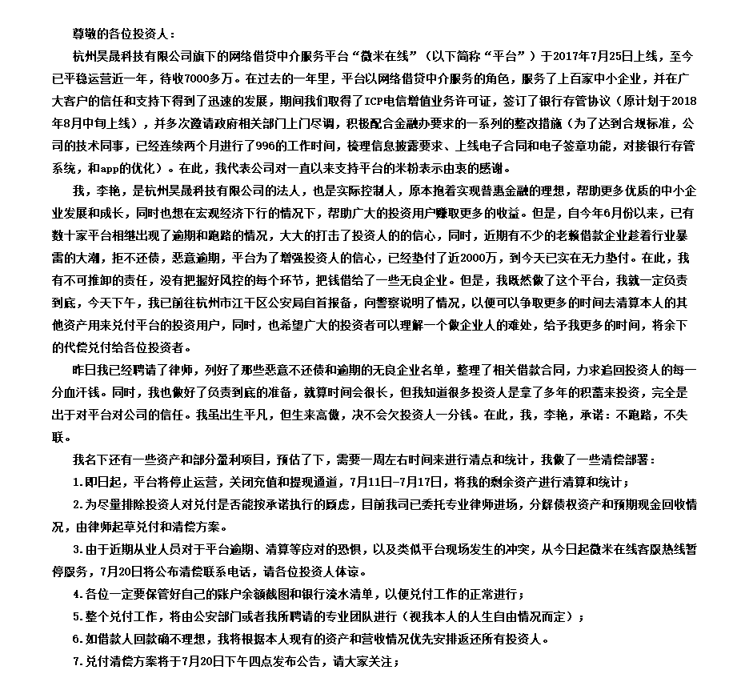
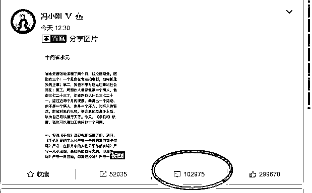
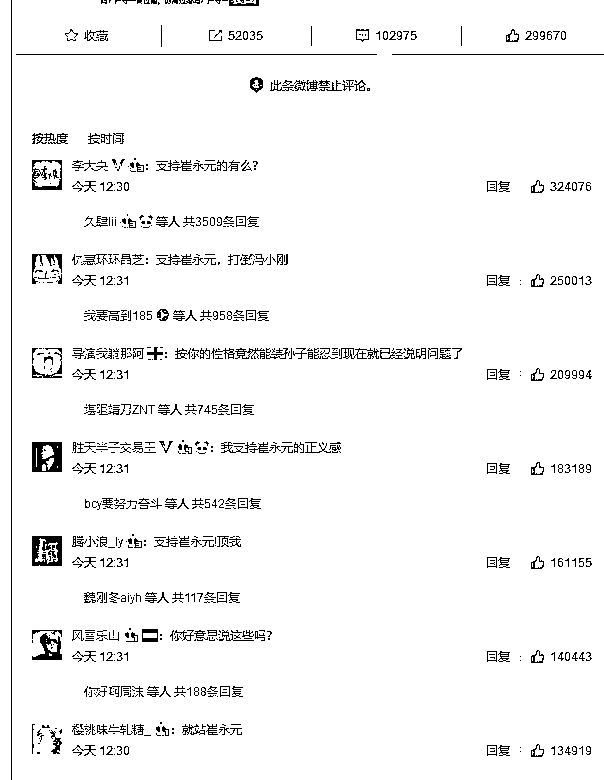

# 夜报 || 史上最有诚意的 P2P 倒闭公告

今天，又一家 P2P 平台炸雷了，是杭州的微米在线，按理说炸一家 P2P 平台简直太正常了，最近一个月，哪天不炸个二三家，但是这个平台不一样，他的倒闭公告是我见过最有诚意的 P2P 声明，发出来给大家分享一下。

从这份停运倒闭声明里，我们可以发现这几个事实，首先，这个公司的法人李艳是一个真正想做企业的人，字里行间都可以看出，他对于破产是极不甘心的，而且并没有挪用客户资金玩庞氏骗局，是真正的放贷出去了给一些借款企业，是一个真正的 P2P 公司。

从声明里我们也可以看出，这家公司的资金运转非常良好，但是对风险预估不足，大部分资金拿出去放贷了，当这波挤兑潮到来的时候，没扛得住挤兑，资金彻底枯竭了，被迫终止提现宣布倒闭。

而从这个字里行间我们可以看出，如果收回全部贷款，这家 P2P 应该还是正资产的，之所以破产还有一个很重要的原因，是一些借款企业，乘着 P2P 暴雷潮，拒不还款，想看看能否把这个平台拖破产然后就赖掉这笔钱。

于是，两面夹击下，这个平台直接挂掉了。这个案例告诉我们，满身窟窿的庞氏骗局 P2P，在这波雷潮里会破产，但是那些正经做 P2P 的，没有挪用客户资金玩庞氏骗局的，也有可能破产，挤兑潮之下，任何 P2P 都很危险，没人敢说哪个企业一定没事，即便这个企业是正经做事的，人也很正直，做事也很规范，也一样可能出事，这事情真不好说。

所以我还是那句老话，先避避风头吧，这么好的企业都死了，虽然我不希望这样负责任、有诚意的企业死，但是如果我的钱搁在了里面生死未卜，我也会很难受的。

~~~~~

今天凌晨，美股都收盘了，突然遭遇大型黑天鹅，川普宣布对中国 2000 亿美金商品征收关税，税率 10%，听证会将在 2 个月后举行。

于是，今天整个亚太股市，开盘就跪了，全部大幅度低开，折腾了一天，上上下下，最后收回到开盘价，收盘价是 2777.77，是不是很好玩的数字。。。

讲真的，我真的怀疑特朗普就是一炒股的，尤其是专业针对中国股市，昨天晚上，各项 A 股指标刚刚空转多，真的是刚刚空转多，创业板收 20 日均线之上，上证和深成指刚刚金叉，整个趋势正在从空头向多头转变，只需要几天之后，就能彻底逆转趋势。

然后，今天特朗普咣的一下，来了一击突发重锤，超大只黑天鹅，正好打在脆弱的节点上，于是又给打下来了，这感觉就是空军操盘手一样。

难不成，川大爷是看着 A 股和港股的 K 线来制定毛衣战策略的？

但是其实大家有没有发现，今天的走势是下跌的，但是其实非常坚挺，盘中一度大暴跌，然后都拉回了，死死的抗住。

换句话说，如果没有今天的大只黑天鹅，走势应该是挺好的。

2000 亿黑天鹅，税率 10%，还是突发事件，威力是超过当初宣布 500 亿，税率 25%的时刻的，但是今天的跌幅其实对不起这么大的利空，因为跌的很少。

具体的，我们还要再观察几天，如果几天之内价格依然维持原位没有下跌，那含义就很明确了，吃大利空而不怎么跌，是底部的标志，吃大利好而不怎么涨，是顶部的标志。

所以，再观望几天，毕竟从今天的跌幅来判断，未来几天企稳的概率非常大，毕竟今天这个的确他只是个意外。

~~~~

今天冯小刚沉寂了 2 个月之后发言了，发文《十问崔永元》，猛烈的炮轰，图太长我就不贴了，你们有兴趣的可以自己网上搜一搜。

我只告诉你们一个结论，这个下面十万评论，绝大部分都是骂冯小刚的，比例非常惊人，买水军都买不出这效果出来，说明群众的眼睛是雪亮的。

还有一点个人观后感就是，冯裤子撕人的逻辑和理论，真的让人感到很恶心，一股浓浓的地痞流氓的感觉，很有那种网络流氓的滚刀肉喷人既视感，这次必须支持崔永元。