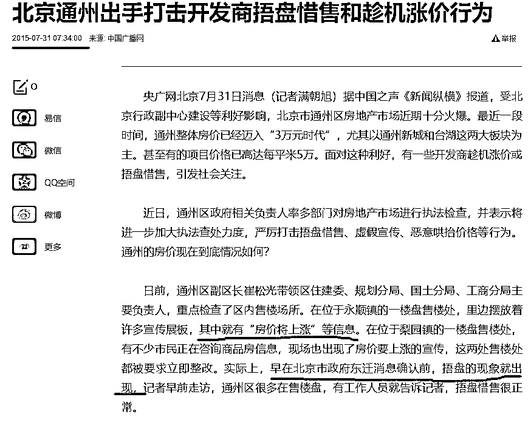
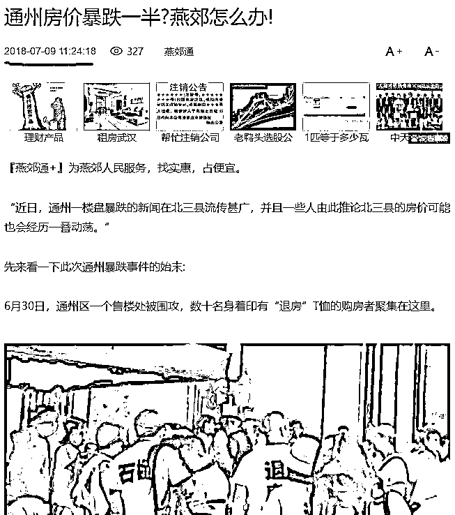
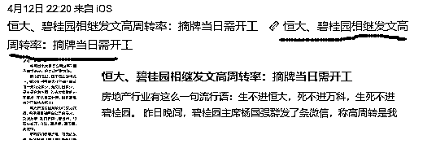
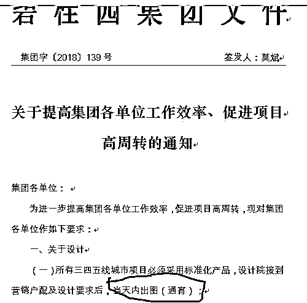
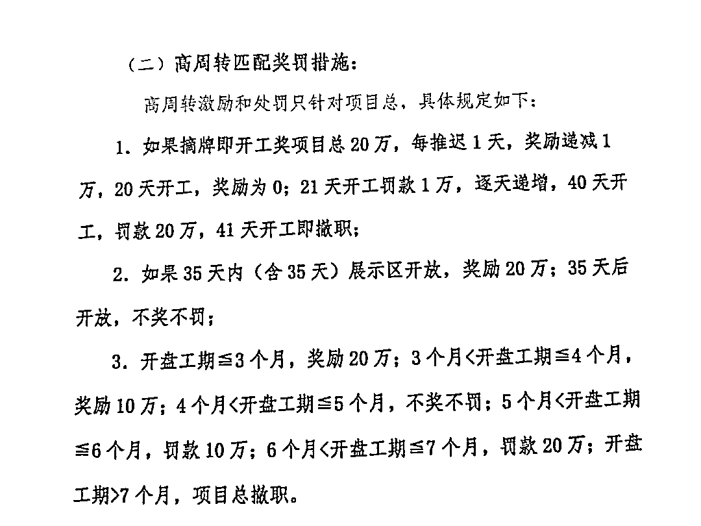

# 深度揭秘：地产高层对未来走势的真正看法

很多人都想知道房价的未来走势，网上的各路专家众说纷纭，究竟谁说的话靠谱，太难分辨了。但是有一种人的看法是非常有参考价值的，那就是房地产的高层领导，春江水暖鸭先知，作为一家大型房地产企业的掌控者，这些人对房价的看法一定是敏锐且正确的，至少判断成功率会比普通专家强上很多，否则他们的企业早就倒闭了。

那么你们想不想知道，各大房地产企业高层对于中国房价未来走势的真正看法呢，今天我来给大家深度揭秘。

看到深度揭秘，很多人会认为，是不是要放独家爆料了，有重磅小道消息？其实不是的，这些房地产高层的嘴巴都是很严的，他们就是靠这些机密信息来吃饭，怎么会到处对外说，即便他说了，你也很难判断他说的是真话还是迷雾弹。

那么我们怎么得知他们的真正想法呢？其实也不难，我们不需要关心他说了什么，我们只关心他做了什么就可以了，行动说明一切。鉴于地产企业过于庞大，调头困难，他的判断成型到行动完成的时间差会长达半年到一年，而且他的行动是无法保密的，这个时候，我们就可以随着他的行动，来获知他对未来的房价判断。

房价上涨的时候

我们做个假设，假设你是地产商，这个时候你判断未来房价会暴涨，那么你会怎么做？你会不会赶紧把自己手头的地块开发成房子，趁着房价还没涨之前赶紧卖给购房者，然后把现金全部回笼到自己手中放银行存理财？

肯定不会啊，正确的做法是马上借钱去买地，能借多少借多少，囤积的地越多越好，手头的地也要减缓开发，拖延上市速度，已经建成的楼盘，能不卖就不卖，毕竟能多拖一个月出手，说不定就能多卖个 10%，这种行为，叫捂盘惜售。

在任意时刻，只要开发商认为他手中的房源卖便宜了，未来会上涨，他都不会痛快的卖房，辛苦开发土地不就是为了赚钱嘛，房价疯涨躺着赚钱多好。

另外还要告诉大家的是，要区分真捂盘和假捂盘，有的时候开发商会虚假捂盘来烘托气氛好卖房子。怎么区分呢，也很简单，当开发商真捂盘的时候，什么都不会说，就是告诉你房源已售罄，建议你去别家看看。而假捂盘的时候，销售经理会告诉你，房价还要涨，好多人来买，所以房子马上就卖没了，赶紧买吧。

上图中，北京市政府东迁消息确认前的捂盘是真捂盘，而 15 年峰顶的时候，开发商告诉你会涨价，还告诉你他要捂盘，让你赶紧买，这叫假捂盘，是生怕你不买。

实际上，如果要涨，他干嘛还要告知你，不收你茶水费就不错了，塞红包才会卖给你，不然就二个字，没房。

当开发商出现加速拿地、减慢售房等捂盘行为的时候，就代表他们判断房价会涨，当房价涨完之后，售楼部的小姐才会告诉你，房价还会涨让你赶紧买。。。

房价下跌的时候

如果你预测到房价会下跌，作为一个开发商，你的第一反应就是少拿地多卖房，加快卖房速度，回笼现金到手中，捂盘是绝对不可能捂盘的，多拿一个月就可能跌 10%，亏死了，早点卖掉才是正道。

此外，当房价已经暴跌的时候，开发商还会做的一件事就是保护售楼处，拒绝退房。

所以，当地产商出现加速售房、减少拿地等行为的时候，就代表他们预判房价会跌，而已经暴跌之后，地产商会保卫售楼处，拒绝退房。。。

高周转是什么鬼

上面二条，是过去二十年地产界的铁律，一般都是这么玩的，但是到了 18 年，冒出了一个新词汇，叫高周转，这是个什么鬼，代表什么含义呢。

所谓高周转，就是企业疯狂拿地，疯狂开发，资金周转速度特别快，快到什么程度呢，要求土地拍卖成功当日就要开工，要求设计院连夜出图，这种周转速度已经达到了人类想象极限了，我无法想象出更快的周转速率了。

碧桂园的高层说，项目平均摘牌到动工 1.65 个月，摘牌到开盘 5.2 个月，完全无法达到集团高周转的要求。换句话说，从土地拍卖到手当天开始计算，5.2 个月就可以开盘回笼资金，这种速度居然完全无法达到高周转的要求。。。

那么碧桂园的高层希望开盘速度快到什么程度呢，希望 3 个月以内开盘，4 个月及格，5 个月罚款。。。

据媒体报道，碧桂园热衷的“456”模式是指，新项目需 4 个月开盘、5.5 个月资金回正、6 个月资金再周转。原碧桂园首席财务官吴建斌也曾透露，如果控制得好，从买地到资金回正，碧桂园只需半年就可周转一次。

恒大、碧桂园突然提出高周转，这代表了什么，如果他们看空房价，直接加速出清资产不就行了，等暴跌完之后，手持大量现金的自己就是爷，想吞并谁就吞并谁，为什么要提出高周转，疯狂卖房的同时疯狂拿地。

这里面有二种可能性，第一种，是这些房企高管认为房价会横盘，指望捂地等涨的套路是发不了财了，卖掉所有项目等房价暴跌吞并别人，好像也等不了，万一半年还不暴跌，自己手底下的团队吃什么，不能都闲着吧。于是在这种预期下，还能保证企业赚钱的唯一办法就是高周转，每一个项目赚一点小钱，多周转几次就能汇成大钱。

当然，还有一种可能性，就是这些人认为房价会跌，而自己在去年因为形势判断失误拿了太多的土地，不好意思说自己看跌房价，于是借着高周转的虚假借口，加速开发土地，然后赶紧甩卖出去回笼现金，并减缓拿地，实际上不是高周转，而是高速卖出，低速拿地，边打边撤。

但是无论哪一种可能性，都预示着这些房地产高层认为未来一段时间，房价不会涨了，否则的话他们的行动应该是低周转，捂盘惜售才是赚钱的最快办法。

行动才能体现一个人真正想法，这些地产高层对未来房价的预判，你看清楚了吗？

觉得此文的分析有道理，对你有所帮助，请随手转发。

往期回顾（回复“目录”关键词可查看更多）

为什么中国必须购买美国国债？| 租房贷款会将房子拆分成房骨和房皮 | 香港人说，香港房价必须这么贵！| 中国的房价什么时候会崩盘？| 你根本不知道烟草公司有多赚钱 | 中央这次打击三四线城市房价的决心为何如此坚定| 我是如何保证自己不近视的 | 魏忠贤其实是个贤臣 | 2 分钟了解中国 50 年的艰辛发展史 |历史数据表明：中国最赚钱的职业十年一个轮回 |房价大利空，货币化棚改权限被收回

