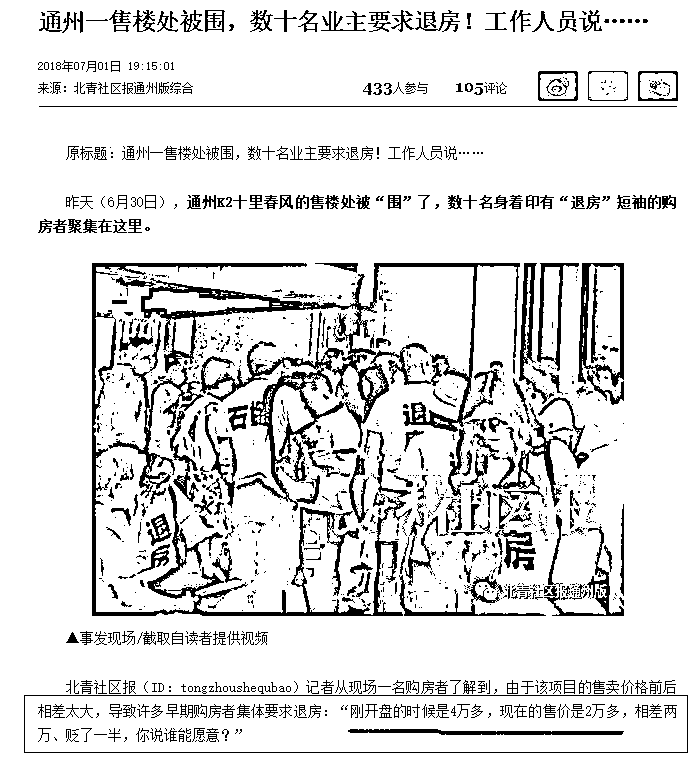
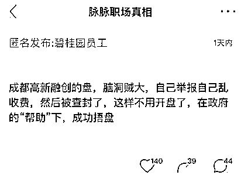

# 中央这次打击三四线城市房价的决心为何如此坚定

前一段时间爆出消息，棚改暂停，审批权限收归国开行总行，我特地写了文章《房价大利空，货币化棚改权限被收回》进行分析，我的观点很明确，三四线城市的房价非常危险，会承受非常大的压力，建议回避一年再做决定。

但是随后，有媒体报道说，今年国开行在棚改上的投放任务是 8000 亿元，截至 5 月底已经达到 4300 亿元，下半年还会有将近 4000 亿元按计划投放，市场不需要对投放额度过度紧张。很多人据此评论棚改暂停是假消息，三四线城市依然会继续上涨不受影响。

没几天，重拳调控消息一个接一个，密集推出各项政策。如 7 部委联手严查 30 城地产乱象，控制房地产市场债券规模收缩银根，限制企业购房等一系列政策。各大官媒也轮流发声攻击房价，人民日报旗下自媒体侠客岛称“**去库存目标已实现，棚改货币化安置的手段自然没有保留的必要**”。湖南日报甚至用连发四头条的形式炮轰长沙房价，甚至把长沙房价炒作问题比作**新中国成立之初，不法资本家囤积居奇，挑战人民政府的反革命事件**。这个措辞是破天荒的严厉，尤其是在周围的省会城市，其实房价都比长沙高的情况下。

可以认为，棚改货币化权限收回总行是肯定的，后续的货币更有可能定向投放给这几年暴跌的城市作为平衡，暴涨的三四线房价也一定要熄火，官方的态度已经很明确了，为什么中央这次打击三四线城市房价的决心如此坚定，因为在货币化棚改的推动下，他们玩的太过分了。

**疯狂的三四线城市**

2015 年，全国商品房去库存运动开启，一二线城市采用制造地王，涨价去库存的方法就可以解决。但是三四线城市这一套玩不动，货币太少，盘子太大，刚需收入太低，拉升起来特别费劲。

于是，发明了货币化棚改，这是个专门为了去库存而设计的制度，对所有城市都有效，但是对三四线城市，效果特别显著。

以上一段炮轰长沙房价的湖南省为例，衡阳城区的住宅去化周期只有 5.5 个月，株洲茶陵县仅 1.4 个月，也就是说茶陵县再过 1.4 个月就没房子卖了，届时供需会彻底失衡，从供需决定价格的市场经济里来说，这个小县城的房子比长沙还要走俏，房价一飞冲天是市场的必然现象。

在 2015 年初，去库存压力最大的区域，就是三四线城市，很多城市的房子库存数量已经达到了让人绝望的地步，去库存给经济减负是一个艰巨到几乎不可能完成的任务，为什么 3 年之后，三四线城市的房子库存居然已经开始告急？这其中，货币化棚改居功至伟，人为创造了一个经济奇迹。

这个奇迹是如何制造的呢，湖南某三线城市数据，2017 年准备拆迁 3.04 万户，累计动迁 15 万人，货币化棚改让这些人离开了自己的老房子，开始冲进市场买新房子用来安身。

对于一个三线城市，15 万人意味着一个天文数字，直接把 15 万人的房子给拆掉了，利用货币化棚改从国开行拿钱，发给这些拆迁户让他们去买房，人为制造出了海量的需求，把这个小城市的房价从三四千元，一路给推升到了超万元，整个城市的房子被一扫而空。

就算是不懂经济学的人，也知道把 15 万人给货币化棚改拆迁了会对房价产生什么样的刺激作用，15 万人口的巨大需求，就是一线城市的房价，也都能推上一个新台阶。同时也应该知道，这种寅吃卯粮的行为解决了当下的问题，但是会给未来制造出一个更大的问题，这 15 万人原本的土地，卖出后经地产商开发出的新楼盘，绝对不止住 15 万人，可能 60 万人都不止，否则开发商是赔钱的，到时候这些房子又卖给谁呢。

这仅仅是湖南的数据，湖南的棚改已经玩到了这个份上，长沙的房价依然远低于周边的武汉、合肥等经济差不多的省会城市，你可以想象湖北和安徽，他们的棚改会玩的多 6，货币决定房价，房价说明一切（公众号紫竹张先生）。

国家推动货币化棚改的目的是为了给三四线城市去库存，如今这些三四线城市的库存已经降低到只剩几个月的严重不足警戒区域，直接断粮来降低需求，冷却房价，让库存回到健康区域是再正常不过的事情。

**冰火二重天的中国楼市**

在很多三四线城市利用货币化棚改政策房价翻三倍的同时，环京区域数个城市，房价出现了腰斩现象。

自调控以来，通州房价一路暴跌直接腰斩，直接把北京房价都给拖下水了，市场可谓冷到了极致，而与此同时，还有城市房价可谓热到了极致，甚至出现了开发商为了能捂盘惜售，自己举报自己的奇葩乱象。

所以，中国房地产市场，出现严重的冷热不均现象，在全国一盘棋调控房价的时候，有的城市乖乖听话直接腰斩，有的城市逆势而行继续猛涨，那么当全国一盘棋卡死货币化棚改的时候，当然也要区别对待。

所以，这才是国开行说审批权限收回总行，但是会继续放款的原因所在。一方面是为了防止抛售恐慌狂潮，一方面是真的可能有此需求。资金权限收回总行之后，就不会由着地方乱搞了，肯定是定向放钱，放给谁，什么时候放，以什么形式放，那都是有讲究的，但是肯定是放给中央觉得需要稳定一下房价不发生系统性风险的城市，那些一涨再涨的城市，想都不用想，一毛钱都不会有。

但是不管怎么说，这一波三四线城市上涨的重要燃料就是货币化棚改，这一点是公认的，而这几年持续上涨的城市，毫无疑问会被直接断粮，国开行总行不可能还允许把货币投放到这种城市，这一次的调控，不仅严格程度远超以往，而且直接对三四线釜底抽薪，疯狂的楼市肯定会迅速冷却，而过度冰冷的城市，可能会添点燃料。

打压沸腾的三四线城市房价，符合中央总体横盘拖时间的大方向和大利益，他绝对不会允许地方无穷无尽的乱涨最后引发一地鸡毛这种事情的。所以中央这次打击三四线城市的决心，一定是坚定的。整个中央的方针大计，就是总体横盘，涨多了他就砸，砸多了他就护，但是三五年过去，你会发现可能还在原点没动，这是我的一贯看法。

觉得此文的分析有道理，对你有所帮助，请随手转发。

往期回顾（回复“目录”关键词可查看更多）

为什么中国必须购买美国国债？| 租房贷款会将房子拆分成房骨和房皮 | 宁波老虎事件遇难者不应该得到赔偿 | 中国的房价什么时候会崩盘？| 你根本不知道烟草公司有多赚钱 | 如何把自家孩子培养成一个顶尖人才 | 我是如何保证自己不近视的 | 魏忠贤其实是个贤臣 | 2 分钟了解中国 50 年的艰辛发展史 |历史数据表明：中国最赚钱的职业十年一个轮回 |房价大利空，货币化棚改权限被收回

