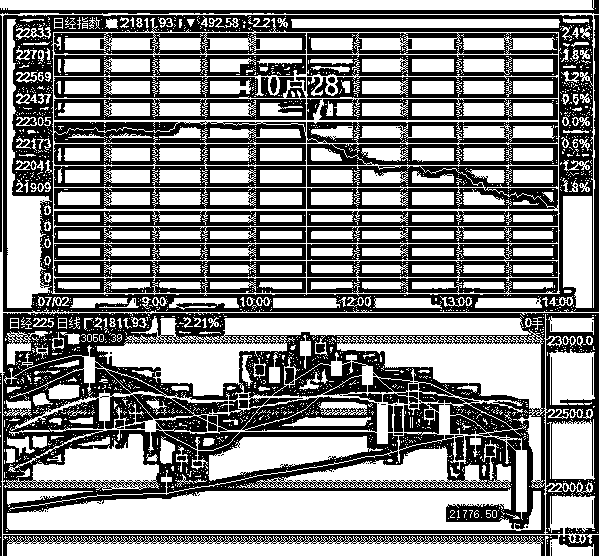
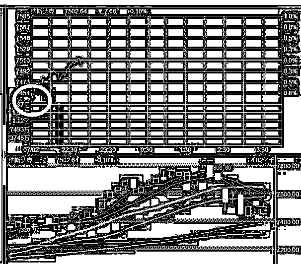

# 夜报 || 资本市场今天又大幅震荡

今天算是开眼界了，本来说今天到了 7 月 6 号之间的 5 天里，随时可能有黑天鹅，虽然不影响最终筑底，但是拉起来就跑一点，估计可以做个 T，没想到第一天就碰上了黑天鹅。

今天上午 10 点 28，不知道出了什么消息，整个亚太市场突然开始单边下跌，本来走的好好的正常震荡消化整固上周五战果的 A 股也直接被拖下水了，我们看看日本股市的走势，就知道今天上午发生什么事了。

A 股当然也不能免俗了，蓝筹带头砸，护盘的反而是创业板，创业板周五涨的最多，周一跌的最少，基本可以确认为反弹的龙头了，另外，他如此强硬也是反弹的迹象之一。

今天上午到底发生了什么事，到现在都不清楚，媒体也没有任何报道，估计是在白宫里面谈判团又吵架了吧，消息被个别大财团拿到了然后直接砸盘，不过从目前美国股市的走势来看，应该已经消化掉了，因为美股今晚大幅低开，然后现在是高走。

我今天没什么操作，就底部慢慢震荡吧。监管呵护市场的暖意新闻也很多，上周小米推迟 CDR 之后，今天阿里巴巴也宣布，原本在本月申请 CDR 发行，但由于种种原因，该进程需要推后。

今天才 7 月 2 号，你要是实在有事，可以等到最后几天再说推后嘛，今天就急匆匆的宣布，很明显是监管层授意他说的，要呵护市场，让市场提前知道，阿里巴巴本月是不会来抽血了。这种推迟的话一定要企业说而不是监管说，因为他们实质上暂停了 CDR 的发行，但是绝对不能公开承认，因为一旦承认，首先是丢面子，其次是承认自己被市场走势给胁迫了，最后是下次想恢复 CDR 的时候，又会引发市场暴动，再丢一次面子。

所以就出现了现在这种情况，不过不管怎么说，口头不暂停实质暂停，也是好事，今天上交所开会还对全体员工说牢牢守住不发生系统性风险的底线。这句话我认为是真的，因为没毛病，就是他的反应速度不知道快不快，能不能控制得住市场了，监管总是慢半拍，哎。

~~~

今天领跌的，就是房产股，把水泥、基建等全部拖下水了，市场资金总是最敏感的，所以我今天头条上说中国的三四线房价要出问题了，这个的概率真的是非常非常高，我在夜报次条里，再度强调一遍，股市总是领先于实体经济的，这一轮房地产跌幅远远大于平均值，足够说明一切。

杭州昨天再爆二个雷，还是国资背景做靠山的平台，云端金融和湖商贷，无数投资人的血汗钱血本无归。

所以最近几个月，风声鹤唳，真的建议大家避开风险类投资，房地产和 P2P 都少碰，等一等再说。

~~

今天给大家推荐二个我认为比较好的公众号给大家参考，都是很有实力和特色的，一个擅长做短线，一个擅长做中线。

喜欢做短线打板的朋友可以关注只会炒股

喜欢做中线的朋友可以关注小费财经

