# 中国只有 3%的人具有本科学历，还有 3000 万人穷的超乎想象

今天我来说一说中国教育情况和贫富分化情况，他们的实际数据或将刷新你的三观。

前天我写中国人均收入的文章时，曾提到中国只有 5%的人口每月到手的工资收入高于 5000 元，很多人说我本科同学最低都是 5K 的工资，中国怎么可能只有 5%的人口工资高于 5000，而实际上，中国具备本科以上学历的人，只占总人口的 3%，所以本科学历工资高于 5000 当然是很常见的，尤其是你离开老家，选择大城市作为工作地点的情况下。

之所以会产生这种认知差异，主要是中国的贫富差距已经远超一般人的想象，很多人认为，中国最穷的人，应该就是城市里扫大街和捡破烂的人了。而实际上，他们还真不是最穷的，同样的捡破烂，在北京捡破烂的收入十倍于乡镇捡破烂的都不止，有很多人，穷困程度是大城市之人无法想象的。

中国到底有多少本科生

先说说本科生的数据吧，中国有多少本科生呢，在很多人的眼里，应该是多如狗吧，中国的本科生和农民工已经没区别了，数量极多。从高中那里得到的反馈是，现在高三学生考个本科和喝水一样简单，从人才市场得到的反馈来看，普通三本生的平均起薪，也就比农民工稍微高一点，大学生的数量，有这么多吗？

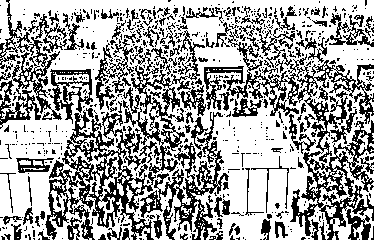

他们看到的全都是事实，高三学生考上本科的确非常简单，大学经过扩招，每年的毕业生数量也超过了市场能够负荷的最大值，所以起薪和农民工的起薪比也差距不大，毕竟大城市的生活成本摆在那里，普通大学生也做不了什么事。但是与此同时，本科生的数量依然是绝对稀少的，我们看一看教育部公布的数据。

中国恢复高考是 1977 年，之前大学也在运转，但是招收人数是非常稀少的，大概一年就几万人，而且很多都是高考白卷英雄上的大学，所以基本可以忽略不计，实际我们可以从 82 年开始计算，但是这里还是把 78 年的数据也列入，因为中国大学教育的二大转折点，分别是 77 年恢复高考和 99 年大学扩招。

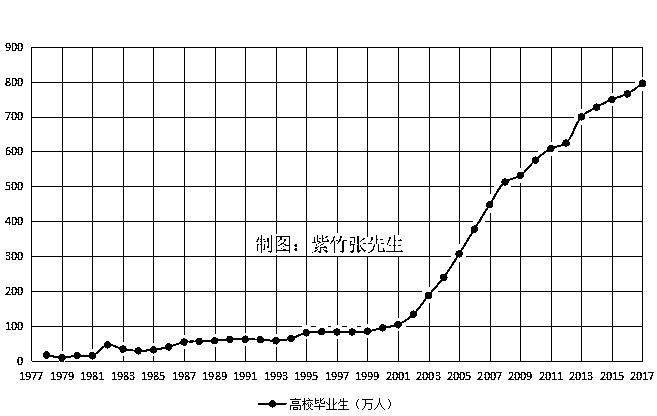

可以看到，中国的高校毕业生数量一路飙升，17 年高校毕业生（本专科合计）已经达到了接近 800 万的数量，这是个什么概念呢，17 年全国出生人口是 1700 万人，也就是说，连偏远农村人口和发达大城市人口绑在一起，都有一半的人能上大学，如果把农村贫困人口都撇开，可以说，大城市的孩子绝大部分，都能上大学，这已经不能称之为考大学了，只能称之为高等继续教育，只有考上重点一本，才能称之为考大学。我们看一看历年高考，每年的报考人数和录取人数。

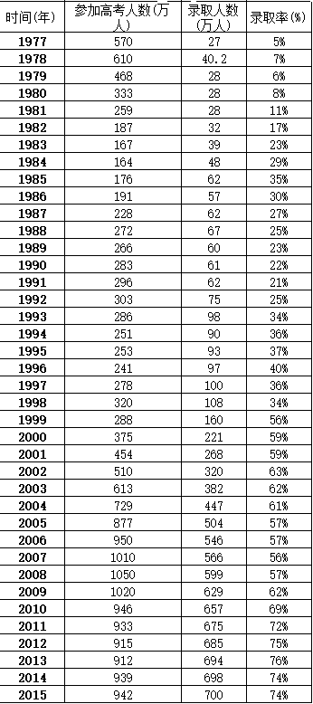

我们可以看到，高考录取率从 5%，一路飙升到 74%，到了 17 年数据更加夸张，不过 16 和 17 的全国报考人数汇总数据我没搜到，就不列入了，估计也是 900 多万人。我们也可以看到，最近几年的高三应届考生每年都是 900 多万人，大概相当于每年出生人口的一半多一点，也就是说，有一半的孩子参加了高考，其余的都弃学了，但是参加高考的这批人，考上大学的概率是 74%以上，这是面向全国的数据，如果是大城市的中学，考上大学（本专科）的概率就是 99%，有些重点中学都敢说二本率 99%，一本率 90%了，可以说，是个人就能考上大学。而 17 年毕业接近 800 万大学生，也超过了劳动市场新增就业岗位的需求，所以大家形成了印象，大学生变得不值钱，到处都是。

但是实际上，从恢复高考以来，40 年累计毕业的大学生，总共是 9577 万人，其中三本以上占一半，专科生占一半，也就是说，本科生有 4800 万人左右。

看起来的确是很多，但是中国的人口总共是 13 亿人，本科生占据总人口的比例是 3.69%，换句话说，只要你是本科生，你就碾压了 97%的中国人。

从 3%的人口占比来看，本科生很金贵，从这几年每年毕业接近 800 万人，人才市场不堪重负来看，本科生很廉价，这里面体现的，是中国巨大的贫富差距，和中国太穷的历史欠账。

穷人到底有多穷

中国的贫困地区到底有多穷，中国的贫困人口到底有多穷，很多人没有什么印象，他们看到的新闻是北京一个乞丐都能月入几万，这世界上还能有什么穷人，再穷能穷哪去。

所以，我前几天贴的这个图，没有引起太多的共鸣，中国年收入低于 2300 元的贫困人口，前几年有上亿人，这几年扶贫缩减了很多很多，但是还有 3000 万人。

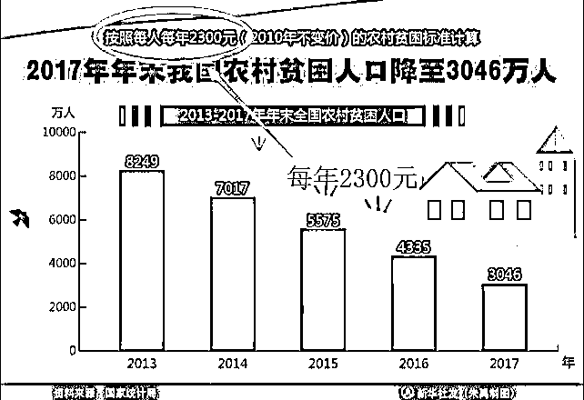

很多人无法理解年收入低于 2300 是个什么概念，认为这就是个玩笑，我今天给大家看一看，在北京房价破十万，富人一片欢腾的时候，中国真正的穷人，到底有多穷。

下面是一个穷孩子，为了能上学，每天去给一家窑厂背砖坯，每次背 16 块，重 40 公斤，走 140 米，工钱三分三厘，也就是说，背 30 回，得 1 块钱工钱，为什么在北京乞讨能月入几万，而他如此辛苦，一天也就十几块钱收入，因为那是北京，这里是大山沟。

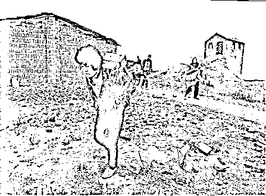

这个捡垃圾的可怜小孩，据媒体报道，一天能赚 30 元，相比前一个小孩就幸福了很多，因为她是在县城边缘拾荒，所以轻松了很多而且也赚的多，但是相比大城市的人而言，这肯定称不上是幸福生活，依然是属于绝对贫困人群。

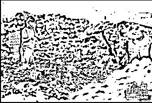

而贫困地区的学生，他们的学校环境，是这个样子的

看完上面三个图，你就知道，为什么能熬到高三的应届考生，只占出生人口的一半了，还有 50%的孩子为什么不参加高考，因为他们的家庭经济不允许他们参加高考。

国家把年收入低于 2300 定为穷人，而不是月收入 2300，这是有道理的，因为好多人，他们穷成了下面这个样子：

这是一位孤寡老人，家里所有值钱的东西凑一起也卖不了几百块钱，一年赚 2300 是她都不敢想象的天文数字，她的要求很简单，每年能有几袋米，让她吃饱就可以了。

然后，这是一个山区母亲的采访图，她面对记者说的第一句话就是“孩子们饿得都快不行了，可是您看看我还有米吗？”，这位重病的母亲已经基本丧失劳动能力，她唯一的祈求就是有足够的大米让自己的孩子吃上饭就可以了，至于什么上学，什么肯德基游乐场，连想象一下都觉得是奢望。

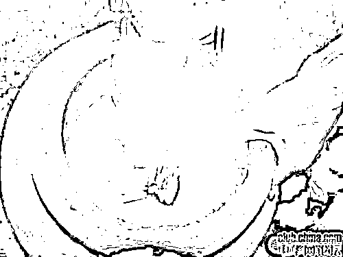

记者在中国一贫困山区采访时拍摄的一张照片----记者对孩子的母亲说：尽量让孩子少吃这些油炸的速食垃圾食品。孩子的母亲说“没关系，不经常吃。但是每年都会给孩子煮一次，因为今天是孩子的生日，其实我们根本舍不得吃”。

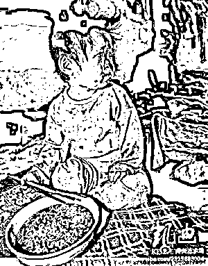

叔叔，就在俺家吃饭吧，俺杀鸡，你是第一个来俺家的老板．．．！

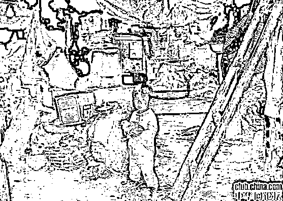

这才是中国的穷人现状，在前几年有接近一亿人口处于这样的生活状态，只要年收入突破 2300 就可以脱离这个阶层，但是这几年通过扶贫的努力，依然有接近 3000 万的人口处于这样的状态。

这就是中国，看到这样的穷困人口基数之庞大，你才会知道，为什么北上深和纽约一样繁华，人均 GDP 不亚于欧洲列强，但是整个中国的人均 GDP 依然上不去，直接被甩到全球一百多名，正是因为这样的贫困人口太多了。

而很多人，被大城市的繁华迷惑了双眼，认为整个中国所有地区都像大城市一样富裕，认为月薪 5000 怎么可能就超越了 95%的中国人，随便干点什么活都能月入 5000 啊。之所以会产生这样的疑问，那是因为他们不知道，其他的中国人目前是怎么生活的，中国的现代化建设任重而道远，我们依然是发展中国家，而不是发达国家。

至于其他人津津乐道的农民工月薪上万，本科生起薪 5000，我可以给大家展示一下农民工的生活状态，他们揽活是这样的。

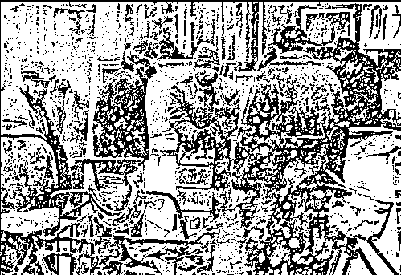

这样的小工，日薪通常是 200~300 元，很多人折算一下，月薪真的上万啊，但是实际上，这些人是接到活才有活干，接不到活就没活干，月收入完全没有保障，也没有五险一金，建筑工地也是类似，基本都是按天算钱，没有给你包月算钱的，出一天工给你算一天钱，干完这个工地就要找另外的工地接活，在工地上干，单日价明显就比街头自己揽活的人要低，因为工地给的出勤天数要多，要稳定，不需要你自己出去揽活，但是也不是你天天能干活的，要是下雨或者你生病，你就没有出勤的机会了。

你在建筑工地干满一个月苦力，拿 6000 不成问题，但是这不代表你一年就能拿到 7.2 万，这完全两码事，你不可能有月月有活干且满勤的好运气，在工地上卖一年苦力，你能拿到五六万块钱就算你今年运气爆棚了。

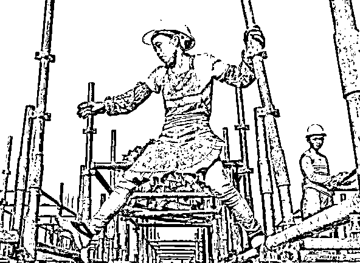

要想多赚，只能脱离小工，不做苦力，拿高级技工证，做点技术活，才能提升收入，但是那又不是谈起薪的事情了，那属于建筑领域的中级技术人员了。不过对于普通建筑工来说，还有个问题就是建筑行业结算特别慢，基本没有月结的，都是拖很久，要是碰到黑心包工头，一年可能白干。

而很多专科生和三本生，如果扣掉五险一金还能到手 3000，他们宁愿在下图这样的格子间工作，也不愿意去没有五险一金到手 6000 的建筑工地工作。因为其工作环境的舒适程度、劳工权益保证、未来发展前途都是远胜于建筑工地小工的，很多人甚至愿意去富士康拿 3000 工资，都不愿意去工地。

当然，去这样的公司，哪怕是底层员工，也至少是专科毕业，如果是大城市，应该是要至少三本毕业，你有本科毕业证，你可以选择去办公室或者选择去工地，但是如果你只有初中学历，你只能选择去工地，去富士康估计都要托关系。。。

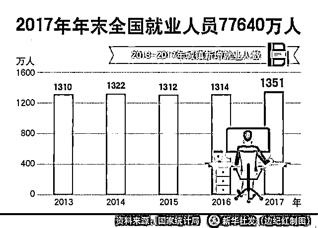

毕竟，当建筑工地的工头招人的时候，如果不限学历，他有 7.76 亿就业人口可以招收，如果选择专科以上，他只有 9577 万人可以选择了，如果选择三本以上，那么可选择的余地只有 4800 万人不到了。

所以，本科生的确不值钱，但是没有你想象的那么不值钱，中国的确富裕了，但是也没有你想象的那么富裕，这一切都是因为我们仅仅改革开放了 40 年，还有很多的历史包袱没有甩掉，贫富差距极大，时间可以改变一切，但是在没有改变之前，我们不能盲目自大，要尊重现实。

<link rel="stylesheet" href="view/css/APlayer.min.css">

觉得此文的分析有道理，对你有所帮助，请随手转发。

往期回顾（回复“目录”关键词可查看更多）

为什么中国必须购买美国国债？| 租房贷款会将房子拆分成房骨和房皮 | 宁波老虎事件遇难者不应该得到赔偿 | 中国的房价什么时候会崩盘？| 你根本不知道烟草公司有多赚钱 | 如何把自家孩子培养成一个顶尖人才 | 我是如何保证自己不近视的 | 魏忠贤其实是个贤臣 | 2 分钟了解中国 50 年的艰辛发展史 |历史数据表明：中国最赚钱的职业十年一个轮回 |房价大利空，货币化棚改权限被收回

