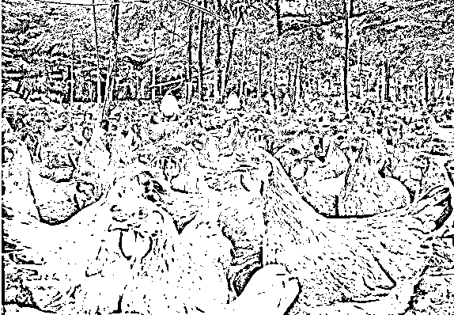

# 基因的力量有多么可怕-紫竹张先生

喜欢我的都关注我了~

有这么一句话，叫人人生而平等，这句话用于人权方面是正确的，但是很多人把这句话错误的应用到了基因和天赋身上，认为大家真的是完全平等的。

但是实际上，基因的力量是非常可怕的，可怕到你目瞪口呆，虽然大家都是人类，基因几乎是完全一样的，但是有时候亿分之一的区别，就会导致能力的巨大差异。

小时候，老师教育我们说笨鸟先飞，大器晚成，告诉大家天赋不重要，努力很重要，但是实际结果告诉我们，天赋很重要，1%的天赋有时候重要性不亚于 99%的汗水。

怎么证明呢，其实很难证明，不然这个话题也不会争吵数十年。因为智力和天赋这东西是看不见摸不着的，爱因斯坦做出了很大成就，但是那未必一定是大脑聪明啊，也许就是特别努力并且特别幸运呢。

最关键的是，你说我笨？我还说你笨呢。你拿得出你聪明的证据吗？智力测验得高分就一定代表你聪明了？未必吧。智力高的人成绩就一定好了，也未必把。成绩好的人工作成就就一定高了，也未必吧。

那么，怎么证明你所谓的“天赋”，大家都是人，差不多的。对于别人的成功，很多人连他们的努力都不愿意承认，直接归结为运气好。。。

但是实际上，人和人的基因导致的天赋差距之大，难以形容，但是智力是看不见摸不着的，姚明刘翔这样的体能差距也并不能说明什么问题，我今天采用另外一种办法，来说明基因的力量。

我们都知道，现在中国人吃的猪肉和鸡肉，都是千挑万选的良种，被国人形象的称之为肉猪和肉鸡，他们其实和中国本土的原种有着极其巨大的差异，这个差异主要体现在料肉比上。

料肉比是什么意思呢，就是说，猪每长一斤肉，需要吃掉多少斤饲料，这个比值，就叫料肉比。

很多人幻想未来世界里，人类发明的高科技，能够以能量直接人工合成肉类，不经过牲畜再转化一次造成能量损失，增大人类的能量利用率。这个想法很好，但是你觉得这个能量转化率应该达到多少呢?

首先，一斤肉比一斤猪饲料富含的能量肯定是要多的，而且是要多很多，猪饲料的能量密度连大米都比不上，里面都是一些人类不愿意吃的农副边角料，所以一斤猪饲料用再神奇的机器，它也不可能转化成一斤猪肉，这个能量转化率突破 100%的科学极限了。

所以，一斤猪肉，哪怕用未来的实验室直接能量转化，怎么地也得 1.5 斤猪饲料吧，这估计是未来人类可以做到的科技极限了。

但是现代科技选育出的良种猪，你们知道料肉比是多少嘛？3 比 1，根据《中国生猪养殖成本与收益分析报告(2004-2008)》，中国生猪养殖平均长一公斤肉，大概需要 3~3.2 公斤的猪饲料，从仔猪到肥猪出栏，只需要 4~5 个月。

而现阶段，有些特别优异的良种，和生产控制能力特别强的大型养殖场，其料肉比已经达到可怕的 2.4 到 2.8 之间。

换句话说，2.8 斤猪饲料进去，1 斤猪肉出来，这活脱脱的就是一个产肉机器。自从中国引入猪肉良种后，猪肉的生产成本一路下跌，现在大家都吃得起肉，不仅仅有改革后生活富裕的原因，也有肉猪良种技术大突破的因素在里面。

那还有没有更高的料肉比呢，还真有，那就是肉鸡和肉鸭，他们的料肉比可以低到 1.8~2 之间。一般来说，肉猪出栏需要 150 天，出栏体重大概 100 公斤左右，料肉比能控制在 3 以内。而肉鸡只需要 45 天就可以出栏，长到 2.5 公斤左右，料肉比在 1.8~2 之间。

肉牛的料肉比就恐怖了，美国大概是 6 比 1，中国则是 8.5 比 1。同样的饲料成本能换来 2 斤多猪肉，但是只能换来一斤牛肉。那还有没有更高的料肉比呢，有，那就是羊，羊的料肉比大概是 10 比 1，如果不吃饲料改吃草，那料肉比会高达 30 比 1。

所以，鸡肉比猪肉便宜，猪肉比牛肉便宜，牛肉比羊肉便宜，这根本就不是口感和味道决定的，完全是因为料肉比决定的。所以 2018 年，大家可以考虑多吃点鸡肉，它的料肉比只有鱼能比得上。

所以，猪和猪是不同的，不同的猪，在同样的生存条件下，所能生产出来的肉的数量差异是非常巨大的，那是一倍甚至几倍的差距，经过人类一代代的选育，野猪已经被人类改造成了产肉机器，产肉效率夸张到了极致。

在这样的条件和背景下，基因的重要性和引发的结果差异被完整的呈现在了桌面上，现代人类的数量已经高达 60 亿，其中必然有某些人类，产肉效率数倍于常人，也必然有某些人类，智商成就数倍于常人。只不过是因为人类没有刻意选育，导致这些异常的基因很快被人类基因库给同化掉而已。

今天我写这么多字，是为了论证为什么有人特别聪明，成就特别大么？并不是，我今天写这么多只是为了告诉你，真的有人喝凉水都长肉，同样的食物吃进肚子里，别人只长半斤肉，你能长一斤甚至二斤出来。。。

别沮丧，你的存在，为人类基因库的多样性，做出了重大的贡献！

觉得此文的分析有道理，对你有所帮助，请随手转发。

长按下方图片，识别二维码，即可关注我

近期精彩文章回顾（回复“目录”关键词可查看更多）

华为员工都这么穷，怪不得拼多多能火 | 房价跌 20%就会全面崩盘，地产杠杆远比你想的要脆弱 |  为什么碧桂园的质量那么差 | 清醒点，放弃全面开征房产税的幻想 | 央行和财政部隔空掐架，我支持央妈 |中国土地制度源自香港，但是香港却是劏房密布 | 为什么中介哄抢租赁房源，因为贩毒都没它来钱快 

复活号+紫竹林功能的公众号

**长按扫描下方二维码即可关注**

