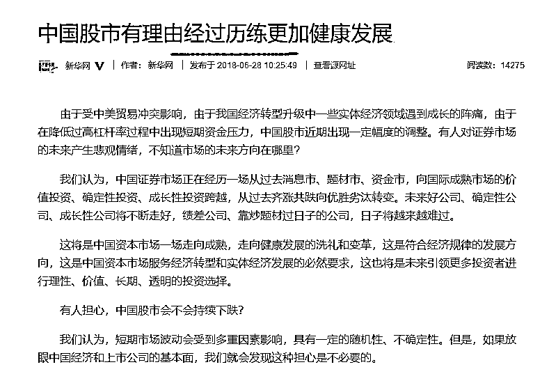
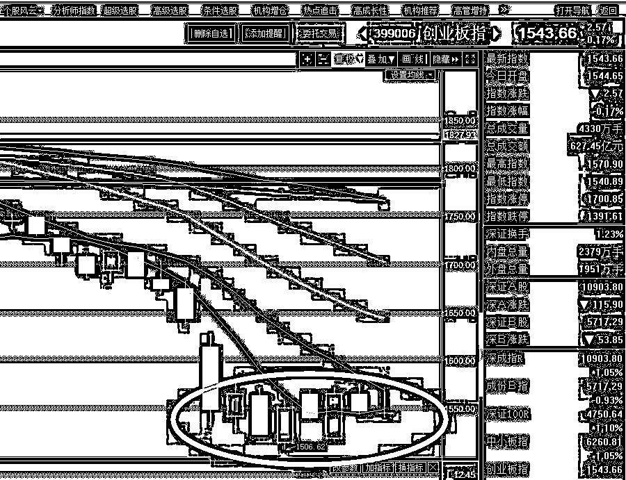

# 夜报 || 官媒说，A 股经过下跌会更加健康

今天上午，新华网发布了一则新闻来呵护市场，内容还算暖，但是标题有点不舒服，叫《中国股市有理由经过历练更加健康发展》。

前几段的大意就是，经过持续的“历练”，A 股变的更加健康，从过去消息市、题材市、资金市，向国际成熟市场的价值投资、确定性投资、成长性投资跨越。

这个道理我知道，跌到这个份上，A 股哪里还有什么投机炒作，市场已经是死水一潭了，挤泡沫已经挤到大股东爆仓这个份上了，堪称史上最严，官媒这个时候应该说一说，历练啥时候能结束啊，可以停了吧。

不过，新华社也承认了 A 股目前估值很低，他的原文如下：

统计表明，当前上证综指、沪深 300 指数市盈率约 13 倍，与英国富时 100 指数和德国 DAX 指数的水平相当。而美国道琼斯指数、标准 500 指数的市盈率都是 25 倍。无论是自身比较，还是横向比较，我们都可以看到中国证券市场的巨大潜力，沪深股市放在全球市场中比较，也是具有投资价值的。

从市盈率上，A 股目前的真的具备很强的吸引力，可惜资金就是不愿意进来，所以 A 股经历了下跌的确会变得更加健康，但是这并没有什么用，有赚钱效应了，才是真的健康。

七部委联手打击房地产，强监管终于不只是股市专利了，楼市也摊上了，强烈建议证监会也加入，八部委联手打击房地产。

> *【住建部等七部委联合开展治理房地产市场乱象专项行动重点打击投机炒房和“黑中介”等】住建部会同中宣部、公安部、银保监会等部委，近日联合印发《关于在部分城市先行开展打击侵害群众利益违法违规行为 治理房地产市场乱象专项行动的通知》，决定于今年 7 月初至 12 月底，在北京、上海等 30 个城市先行开展治理房地产市场乱象专项行动。本次专项行动的打击重点包括投机炒房、房地产“黑中介”、违法违规房地产开发企业和虚假房地产广告等四个方面。*

对了，这 30 个城市的名单我也列一下：北京、上海、广州、深圳、天津、南京、苏州、无锡、杭州、合肥、福州、厦门、济南、郑州、武汉、成都、长沙、重庆、西安、昆明、佛山、徐州、太原、海口、宁波、宜昌、哈尔滨、长春、兰州、贵阳。

没什么好说的，短期一定承压，长期的话，就是点名了下一波楼市应该炒谁，官方金榜，名单都给列好了。

~~~~

昨天晚上，在特朗普发表软化言论之后，欧美市场先冲高，然后迅速走低，纳达克斯是这么走的。

想都不用想，肯定又是半夜的时候美国那边的贸易战谈判出什么幺蛾子了，而且是那种媒体尚未公布的冲突，具体是啥也不知道，但是市场走势说明一切，这就带来了 A 股的低开，不过随后在市场自身强劲拉升下高走，然后再度回落，

不过从目前的图形来看，上证指数节节下跌的同时，创业板反而不跌了，这几天看起来跌的很惨，但是回过头一看，创业板居然已经好几天都维持一个底部横盘的姿态了。

作为一个先行指标，他前一波的跌幅比上证大，如今率先止跌，而不是持续领头下跌，我个人可以看做，这一波下跌已经差不多了，2800 今天收盘击破，但是应该不会持续太久就能收回，向下击穿 2800 超过了我容忍的底线，但是我的对策不是直接割肉，因为这个位置摆明了是超跌和随时反弹，我的对策是降低反弹高度预期，向上的时候持续卖出。

6 月还有最后一个交易日，那就是明天，再熬一天就过去了，7 月回点血，减点仓心里会平衡很多。