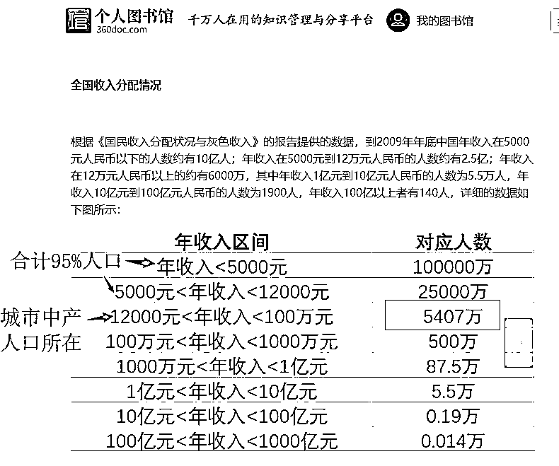
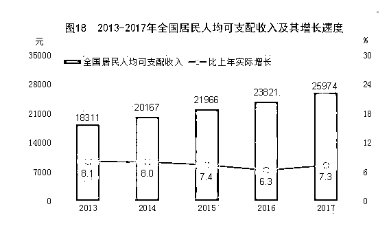
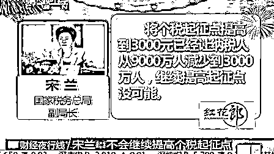
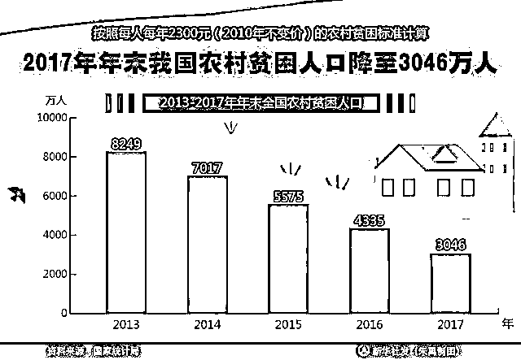
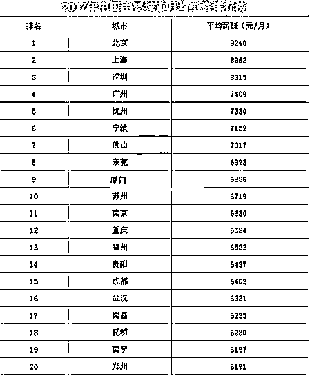
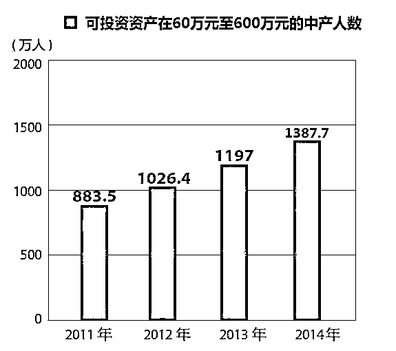
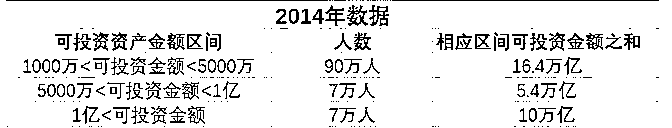

# 月薪 5000，你将碾压 95%的中国人

前一段时间我写深圳富士康工人收入的时候，曾经提到深圳至少有一半人月入不足 5000 元，当时很多粉丝表示特别不理解，有多人留言说自己就在深圳工作，身边的人没有一个月入低于一万的，也有很多人表示，连月薪过万都达不到的人是怎么在深圳生存下去的。

而知乎上的各种答主动辄告诉大家他年薪百万是一种什么样的体验，他们拿出来分享的这种新编的故事，让很多人误解为，年薪百万才能勉强算脱离中产，年薪十万的话恐怕和乞丐无异，今天我让大家了解一下残酷的中国现实，用事实说话，告诉你月薪 5 千足以碾压 95%的中国人，属于绝对精英的收入。

2017 年中国人一年能赚多少钱

首先，我们拿出 17 年国家统计局的数据，为什么要拿统计局的数据呢，首先因为他是官方的，而且按照中国惯例，统计局的数据一定是在允许的范围内尽可能的往高了报，因为数据实在太低，所以就按高的数据我们看一看吧。

> *根据国家统计局在 2018 年 2 月 28 日发布的《中华人民共和国 2017 年国民经济和社会发展统计公报》（以下简称《公报》）统计数据显示，2017 年全年全国居民人均可支配收入为 25974 元，月均 2164 元。*

你以为是农村人拖后腿了？还真不是，17 年的全国城镇居民人均可支配收入是 36396 元，月均 3033 元。

这里要科普下**人均可支配收入，他和人均工资是有区别的**。人均工资指的是单位为你付出的成本，扣掉社保才是你到手的工资性收入。而人均可支配收入，包含工资性收入、经营性净收入、财产性净收入和转移性净收入，简单的说，就是就是你实际到手的可以拿出来消费的钱。

也就是说，全国城镇居民，可以拿出来还房贷、付房租，带女朋友看电影的可支配收入，平均一个月才 3033 元，这里面还包含了很多超高收入的富豪拉高了这个人均，**如果排除富豪，那么这个数据更低**。

扣除富豪后的人均收入有多惨

在《公报》的数据里，我们还发现，他们把全国的收入细分为五等分，这为我们排除顶尖富豪的收入提供了便利。根据统计局数据，全国居民收入分五组： 

> *第一组是“****高收入组****”，占人口 20%，人均可支配收入 64934 元，月均 5412 元。*
> 
> *第二组是“****中等偏上收入组****”，占人口 20%，人均可支配收入 34547 元，月均 2879 元。*
> 
> *第三组是“****中等收入****组”，占人口 20%，人均可支配收入 22495 元，月均 1875 元。*
> 
> *第四组是“****中等偏下收入组****”，占人口 20%，人均可支配收入 13843 元，月均 1153 元。*
> 
> *第五组是“****低收入组****”，占人口 20%，人均可支配收入 5958 元，月均 500 元。*

《公报》基本涵盖了全中国绝大部分居民，样本量足够的大，换句话说，只要你的月收入达到 5412 元，你就碾压了 80%的中国人，达到了中国前 20%人群，政府给你划分的类别为“高收入组”，**如果你的月收入能达到 2879 元以上，你也干掉了 60%的中国人，****属于中等偏上收入，也算是体面人了****。。。**

但是前 20%里，依然包含有巨富阶层，严重拉高人均收入，能否再细分排除掉这些人呢，我在《国民收入分配状况与灰色收入》一文里找到了 2009 年的全国收入细分数据。

这个数据是 2009 年的，全国有 12.5 亿人年收入低于 1.2 万元，高于 1.2 万元的仅有 6000 万人，也就是说，月入超过 1000 元，你就碾压了中国 95%的人口。绝大部分大城市高收入人群，其年收入区间都在 1.2~100 万之内，总人数是 5407 万人，另外中国有 140 人年入超过了 100 亿元，一个人顶 100 万人，140 人顶 1.4 亿人的收入，另外还有大概 600 万人的富豪人口，年入均在 100 万之上。

这是 09 年的数据，到 17 年大概 8 年过去了，人均收入大概每年 8%的增速吧，大概增长 85%左右，我们姑且算他增长一倍。

按照翻倍的数字进行计算，全国有 12.5 亿人的年收入在 2.4 万之下，也就是月入 2000 之内，数额占比为 95%，年入超过 2.4 万的，全国有大概 6000 万人，占总人口比为 5%，按照《公报》的数据，17 年全国人均可支配收入月均是 2164 元，和这个数据差不多，但是这个是全国人均，按照我们的数据，刨除掉 600 万富豪人群收入后，有大概 95%的人口，收入在月均 2000 元之下。

根据这些数据，可以得出我的结论，也就是说，如果你月入超过 5000 元，按统计局《公报》计算你也排在全国前 20%之内，如果刨除掉富豪人口，你可能是全国前 5%的精英人群了，自豪不自豪。

这个数据是真的吗？

打住，月入超过 2000 元的全国只有 6000 万人，大部分人都在这个水平线之下，月入 5000 妥妥的能进前 5%，你在逗我把，这个数据绝对是假的，和我的日常认知有极大的差异，明显和现实对不上号。这里来给大家扒几个事实，帮大家重新树立正确的人生观和财富观。

**1、从个税起征点进行推算**

首先，2011 年 9 月进行个税起征点改革的时候，最终个税免征额从 2000 元提升到 3500 元。当初协商数额的时候，政协委员呼吁继续提高个税起征点，认为太低了，国家税务总局副局长宋兰现场称个税起征点提高到 3000 元已让纳税人从 9000 万人减少到 3000 万人，继续提高起征点没可能。宋兰称“不能简单的说税减了老百姓就富了，而是应该看总体”，后来税务局退了一步，才定为 3500 元的。

换句话说，2011 年的时候，如果按照 2000 元起征个税，全国有 9000 万人符合纳税标准，如果按照 3000 元起征，那么符合条件的中国人只有 3000 万人，从 11 年到 17 年大概 6 年，按照年增长 8%计算，复合增长为 58%，11 年的 3000 元等于 17 年的 4740 元。也就是说，2017 年，月收入超过 4740 元的人数，应该只有 3000 万人左右，按照 13 亿的人口基数进行计算，占总人口比例为 2.3%

只有富豪阶层才有所谓的灰色收入，对于年入低于 10 万的人来说，没资格谈灰色收入，就是拿一份死工资，而税务局是绝对不会放过一分钱税收的，故这个数据真实可信。所以，从个税起征点来推算，月入超过 4740 元的人，为 3000 万人左右，占总人口比例是 2.3%，我上文的观点，全国月入超过 5000 元的将碾压全国 95%的人口，是符合事实的，而这次个税起征点定为 5000 元，估计也有这方面的考量。

**2、最穷的人有多穷**

很多人根本无法接受月入 5000 就算全国前 5%的精英人士这一结论，根本原因在于他们不知道最穷的人到底有多穷，一辈子待在大城市，根本没有去农村基层看过，我们看看这组数据。

我国把年均收入 2300 元以下的人，定义为贫困人口，注意是年收入，不是月收入，他们的月入在 200 元左右，这种贫困人口，在 2013 年，有 8249 万人，在 2017 年是 3046 万人，看了这个数据，你就知道上文中说 09 年的时候年收入低于 5000 元在中国有 10 亿人，不是在和你开玩笑。

到了 13 年，中国还有 8000 万人，月收入低于 200 元，17 年居然还有 3000 万人，这个数据你知道吗？身在大城市的你，不可想象月入 200 元怎么生活对吗？但是这就是现实，一个活生生且冷冰冰的数据，所以你无法想象，中国月入超过 5000 元的人，全国可能只有 5%的人口符合。

巨大的贫富差距

之所以在网络上谈论中国经济和收入的人，绝大部分都不认为中国有那么多穷人，这是因为这些人其实都算精英人士，至少是中国前 5%的精英人士。你很难想象一个老农民在下田插完秧之后，会带着满身的泥巴打开电脑去知乎上浏览回复《年薪百万是一种什么样的体验》这种帖子。你也很难想象一个城市里的农民工，会在忙完一天的苦活之后，拖着疲惫酸软的身体还有精力打开手机，到我这样的经济学帖子下面来和我留言讨论中国的人均收入问题。

对经济感兴趣的，月入基本都在 5000 以上，而且至少都是坐办公室的，收入稳定，下了班还有时间精力刷手机关心下国家大事的。带来这一切的，是巨大的贫富差距，这些差距不仅仅体现在个人身上，也体现在城市身上。

还记得上面的《公报》数据嘛，2017 年全国居民月均 2164 元，城镇居民月均 3033 元，城市比全国平均大概高了 50%，如果再细分到大城市，那高的更多，看看 17 年的细分数据。

这里面统计的是人均工资，而不是人均可支配收入，计算人均可支配收入的时候，要扣除你自己缴纳的五险一金，但是即便如此，这些一线城市和二线省会城市，其月均收入都是远远超过全国城镇居民收入平均值的。在这些大城市里生活的人，其收入普遍高于普通中国人，月薪 5000 非常常见，然后，在这些大城市里，还有更厉害的贫富分化。

可投资资产为 60-600 万元的中产人数，14 年就达到了 1387 万人。

而可投资金额在 1000 万元以上的大富豪，有超过 100 万人

这种人，合起来一二千万，基本都分布在大城市，其中不少人，都是大城市的原住民，靠着手头有 2 套以上的房子，才混入这个阶层的。北京上海有很多手握七八套房的拆迁户，自己小学文化，打工月入二三千，纯靠房租活着，但是给自己女儿招亲的时候，对月入过万的无房外地小伙，不屑一顾，他们有资格这么说话，因为他们靠租金一个月都能赚二三万，根本不用打工赚钱。

这种人的身家，拉高了大城市内的人对财富的期望值，所以才导致他们对大城市之外的人均收入情况，并不清楚，很多大城市的白领，真的认为月薪破万不值一提，因为他们在大城市的土著面前是受人鄙视的对象。

而实际上，这些大城市土著的财富是来源于房子，是来源于时代的恩赐，而不是来源于他们的工资，而中国的网络，尤其是经济类的帖子，又被中高收入的人群给占领，因为只有这些人才有钱有闲的去讨论这个话题，这些人对自身收入的描述，以及填写的调查表，严重拉高了所有人的预期值。

在我以上所展现的数据中，高收入人群的收入，可能是低估的，因为他们有很多隐形收入是无法纳入计算的，没有任何人知道这些收入。但是对于工薪阶层来说，其收入是完全可以确定的，因为拿死工资交社保的人，所有的收入都纤毫毕现的展现在税务局的眼中，一分钱都别想跑。

根据目前的工薪族数据，有 95%的人，月入在 5000 以下，所以大家不要轻信那些鸡汤导师的话，也不要轻信那些动辄告诉你人生就应该年薪百万的知乎答主，没事回一趟老家，和自己在老家工作的亲戚聊聊天，问问工资，你的幸福感会大幅度提升。

<link rel="stylesheet" href="view/css/APlayer.min.css">

**觉得此文的分析有道理，****对你有所帮助的，****请随手转发。**

往期回顾（回复“目录”关键词可查看更多）

为什么中国必须购买美国国债？| 租房贷款会将房子拆分成房骨和房皮 | 宁波老虎事件遇难者不应该得到赔偿 | 中国的房价什么时候会崩盘？| 你根本不知道烟草公司有多赚钱 | 如何把自家孩子培养成一个顶尖人才 | 我是如何保证自己不近视的 | 魏忠贤其实是个贤臣 | 2 分钟了解中国 50 年的艰辛发展史 |历史数据表明：中国最赚钱的职业十年一个轮回 |房价大利空，货币化棚改权限被收回

