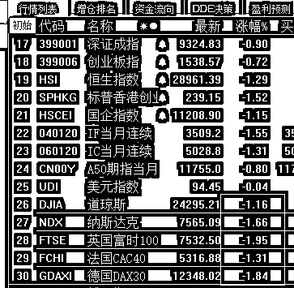

# 上市公司的股权质押风险有多严重 | 夜报

大家都知道，现在有很多上市公司的高额股权质押濒临平仓线，问题很严重，但是很多人可能不知道到底有多严重，我这里给大家列几个数据。

目前，有 97 家公司的大股东，其所持有股份的质押比例是 100%，已经属于无钱可补，无股可补的状态。跌破平仓线以及靠近预警线的股权质押金额，总市值接近万亿人民币。

这其中，类似于乐视网贾跃亭这种恶意全部股权质押的只是少数，绝大部分都是被动质押的，什么意思呢，就是最开始的时候，这些大股东可能只质押个 50%或者 70%所持有股份，但是等股价一路下跌的时候，银行券商督促补仓，就拿自己持有的其他股份进行补充质押，一路补充到 100%质押率的时候，彻底失去补仓能力，这个时候股价再向下跌，就会引起强平。

一旦触发强平，那就是彻底割肉，自己砸自己的股，彻底失去流动性，连续跌停后以超低的价格把股份卖给别人，为了防止这一点，现在有很多已经跌破平仓线的股票，券商并未执行强平，因为质押数量太大，平也平不掉，只是在不停的督促大股东补钱试图和平解决此事。

但是现在很多大股东也没钱了，只能爱咋咋地，券商也不敢强平，双方就僵持在那里，但是中小股东特别害怕，强平的阴影一天不解除，这个股就一天止不住跌势，不断下跌的股价，会反过来让这个股被强平的概率越来越大。。。

换成简单的话解释就是，很多大股东其实已经爆仓了，现在拖着不给强平而已，股价要是再上不去，这颗核弹也拖不了太久了，到时候就不是慢牛了，是快熊，所以我相信独角兽短期是不敢再上了。

~~~~

今天还有一个重磅新闻，许家印买下 FF，花费 67 亿港元入股 45%，很多人可能不知道 FF 是啥，我给大家科普一下，乐视网董事长贾跃亭抛弃了国内的所有资产和负债，直接跑到美国去了，目前唯一在弄的就是这个 FF 电动汽车。

说实话，贾跃亭刚把孙宏斌拖进乐视的浑水里，让孙宏斌亏了一百多亿，按理说名声和信誉都已经烂大街了，理应一分钱融不到直接破产才对。这种时刻，他那个啥 FF 电动汽车公司，居然还能拉来许家印的 67 亿港元。

别的不说，这个融资能力和忽悠的功力，我是真的服，贾跃亭他还真是个人才，一般人还真的做不到这种成果。

首先，我对贾跃亭说一声佩服，真的是厉害，然后，我祝许家印好运，就算钱都是许家印的，也经不住这么浪费啊，你有这个钱，为啥不买特斯拉。

~~~

今天 A 股，属于高开低走，高开的原因就是周末的定向降准，因为股市分析的文章我周六就说了，所以关于降准我昨天晚上没有特地加一篇分析，因为降准这个事情，从来都只是小利好，没有一次是因为降准而逆转的股市趋势，没有什么好特别分析的。

而今天高开之后的下跌，是因为美国那边又出幺蛾子了，贸易战再度激烈打了起来，具体因为啥还不知道，但是应该不仅仅是和中国有关的，有可能是美国和全球主要国家的贸易都打起来了，因为今天晚上一开盘，欧美股市直接低开低走，这会他们是这么跌的。 

这肯定不是因为今天中国 A 股高开低走给拖下来的，因为 A 股熊了那么多年，也没看到欧美受到中国什么影响。而他们的下跌，倒是会给 A 股带来影响，不过只限于半天时间，现在唯一不能确定的是，这一轮美国和全球开打的贸易战部分，牵涉到中国多少筹码，这才是影响 A 股涨跌的主要因素。

鉴于外围跌这么惨，明天上午又是一个低开，等总队来护盘吧，但是对 A 股来说，降准和欧美下跌，都属于小的外力，并不是核心原因，我个人在这个位置，是不会看空了，整个上半年我的仓位都很轻，因为价格很高，但是随着目前的大盘跌到了整个上半年的最低点，我的仓位也逐步慢慢加到了满仓，目前形态是很差，但是这个位置真的不宜盲目看空，熬过 6 月的最后一个月，我觉得好日子就快来了。