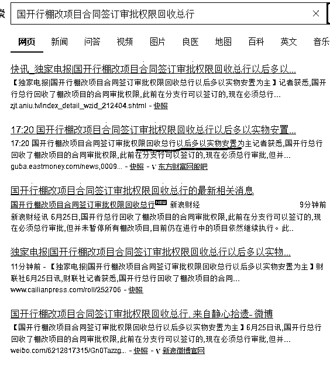
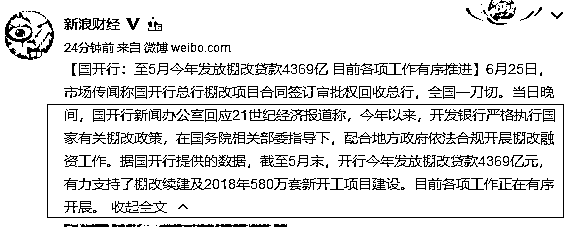

# 房价大利空，货币化棚改权限被收回

↑ 点击上方“蓝字”关注我

今天下午，房价迎来一个核弹级利空消息，那就是国开行总行收回了棚改项目的合同审批权限，之前签订的合同依旧有效，总行继续拨款，但是从今天开始，所有的合同都要拿到总行去审批，过去执行的货币化拆迁安置方式，将改为实物安置为主。简单的说，政策会大幅度收紧，只有总行有权利批钱，流入房地产的国开行资金会大幅减少。

而国内各大媒体迅速跟进，连各种细节都挖出来全面曝光之后，国开行进行了如下回复： 

你没看错，就说这么多，没有进行任何声明和辟谣，只是陈述一下历史，典型的答非所问。按中国传统，这就等于是默认了，依惯例，此事大概会在一个月之内宣布，因为如果更远时间的话，官方的说法应该是“此事不完全属实”，因为官方还没完全确定好细则。如果压根没这事的话，官方的说法会是“此事属于谣言”。而默不作声，那就代表政策出台已经近在咫尺了。

看到这个消息的第一眼，我的反应就是三四线城市的房价会被一大桶冰水浇的透心凉，这些因货币化棚改爆热的城市，其房价会迎来彻底降温。

自 2016 年 10 月全国房价大调控以来，中央频频约谈各大城市，严控房价，但是很多地方出现控不住的局面，我们深扒这些房价上涨的城市，发现他们都具有一个共同点，出现了大量的货币化棚改拆迁户。

货币化棚改大幅推升房价

什么叫货币化棚改，以前大家可能很陌生，但是这一波房价暴涨后，大家肯定记忆犹新。所谓货币化棚改就是区别实物化棚改，以前对城中村进行改造，都是拆迁之后，以房换房，补偿少量货币。而货币化棚改，则是一口气补偿你一个天量的货币，然后你自己去市场上去买房。平心而论，货币化棚改是个好政策，他遵循市场经济的原理，能减少很多社会矛盾，更有利于城市化建设，但是在中国复杂的现状下，这个好政策执行起来完全变形了。对于地方官而言，货币化拆迁，意味着中央贷款支援他搞大拆大建，原本艰难无比的城中村改造，在大笔的现金之下马上就顺利成交了，地方官有强烈的冲动迅速推进棚改。道理很简单，疯狂的拆迁城中村，能从国开行拿到大量的现金，这些现金给予了棚改户之后，他们只有一个选择，就是拿这些现金去买房。这样的话，现有的商品房就会被一扫而空，房价沸腾，而房企则会积极的拿地，棚改户拆迁之后空出来的地，是归地方政府自由支配的，都不需要向中央申请用地指标，直接就卖给地产商了，卖掉之后，还清国开行下拨的资金不成问题。国开行的资金这么走一圈之后，地方上的 GDP 就会爆棚，政绩突出，唯一的后果就是当前阶段大量的货币随着棚改户冲击了现有房地产市场，造成房价飞涨，而这种透支的货币行为，在未来二三年之后，当这批棚改户的土地开发出来投向市场的时候，会等量返还苦果。但是，今朝有酒今朝醉，能支撑一二年的 GDP 增长就已经很满意了，这块肥肉不抢下来，被其他地方的官员抢了，自己的政绩就落后了，至于以后的事情，以后再说呗，说不定那个时候我就已经升职走人了，后来的官员操心去吧。所以，各地争先恐后的申请货币化棚改，大量的资金被被国开行投向了房地产领域，于是我们最近看到了诸多地产奇观，一方面是中央严控房价，一方面是市民连夜排队全款抢房。

暂停货币化棚改会引来什么后果

城中村棚户拆迁，以前一直是实物置换为主，更改为货币化拆迁之后，引来了诸多地产乱象，如今上头看不下去，又改回来了，那么暂停货币化棚改，使用实物安置，会引起什么后果呢。

首先我们要分析一下，货币化棚改之所以具备直接推升房价的魔力，并不是因为他能凭空变钱出来，而是寅吃卯粮。

以杭州为例，17 年杭州共进行货币化棚户拆迁六万多户，几乎都是千万级货币起步，这直接就制造了至少数千亿货币涌入了杭州楼市，直接把杭州的房价和房租炒上了天。国开行直接给予了杭州数千亿现金，但是这并不是白送的，这是要还的。市政府利用这笔钱把棚户给拆迁之后，卖地的收入是要拿来偿还这笔开发贷款的。

如果仅仅只有这一波拆迁，那么很明显，这数千亿的资金涌入，会对今天的房价带来强烈的刺激，但是等这批棚户的土地卖给开发商拿到预售证入市之后，会带来一个极大的空窗期，卖盘增加的时候，买盘基本已经消化完毕，会给未来的房价带来很大的压力，这就属于寅吃卯粮。

为了对冲这一问题，全城的棚户拆迁，会分三步走，每一批拆二三年，等第一批的土地二三年之后入市之前，就启动第二批拆迁，用第二批拆迁户的资金，对冲掉这个空窗期，至于三批之后怎么办，三批之后都快十年了，哪个政府还去管十年之后的事情，那铁定是下一届了，留给下一届去操心吧。

那么如今突然把这个资金收紧会带来什么后果呢，会让寅吃卯粮的事情进行提前还账，这个空窗期会提前到来，按照目前的政策，原先签署的合同，资金会正常发放，但是后面的新合同，一律拿到总行去审批，没有一刀切的收回贷款不会带来雪崩式的房价下跌，但是按这种程度的资金紧缩进行预计，目前因为货币化棚改上涨的房价会立刻停止，因为新增资金突然减少了，国开行贷款收紧了。

这些城市的房价不会立刻下跌，因为原来的买盘还在，慢慢消化需要时间，新的卖盘制造出来也需要时间，上一批棚改户的土地变成新房子，大概还需要 1~1.5 年左右的时间吧。

综上分析，二三四线的城市，由于失去了新增的资金，会失去上涨的动力，变的和一线城市一样，但是不会立刻自由落体，为去年的异常繁荣偿债的时刻，是这批拆迁户的土地变成新房子的时候，预估一下，大概一年半左右，这些城市的房价会迎来巨大的压力。

近来中央频频出手调控房价

近期，中央频频出手调控房价，前一段时间刚刚推出了不动产全国联网登记打击炒房客，24 日西安宣布禁止企业在限购区域内购买商品住房，25 日长沙也宣布该政策，预计后续会有更多城市跟进。

而今天，又冒出了国开行打算收紧货币化拆迁，可以明确认为，对于各地的房产过热，全款摇号买房屡上新闻已经到了中央无法忍受的地步了，频频约谈还无法压制房价之后，终于开始出重招了。

而不动产联网登记，和禁止企业买房，在我看来，都没啥用，只是敲敲边鼓而已，说扬汤止沸都算抬举他了，而货币化棚户改造全面收紧，才是真正的釜底抽薪。

而从目前各大媒体的爆料，以及反向声明极弱的力度来推测，真正的政策落地，应该会很快，而对棚改货币化应该不是一刀切的收回，而是把审批权拿回总行，根据中央的意志而不是地方政府的意志进行拨款，毫无疑问，在前期会卡的非常严，一直到各地房价热度平息为止。货币化棚改这个怪兽放出来造成了这么大的经济扰乱，下一次要放出来恐怕很难了，我估计和限购限贷一样，等崩盘的时候才会打开来救市，楼市资金面越来越紧是大趋势。

大家都知道，我算是一个中国房价的准多头，我向来都认为，中国的房价要么横盘，要么涨，而如今处于横盘期。但是今天这个新闻，让我需要向大家紧急示警，二三四线的房子，紧急停止购买，他们过热的温度会迅速的冷却，而在去年的棚改户拆出来的土地开发完毕开始预售的时候，甚至会引来一波下跌，在贷款利率如此高昂的档口，我强烈不建议大家购买，建议等这个利空飞过去再说，按照我上面的分析判断，这批土地上市的日子，最多只有一年到一年半时间了，不妨等上一等。

中国房价不是永远只涨不跌的，所谓横盘，也不是一点回调都不允许，燕郊、固安等环京区域，17 年房价直接腰斩就是一个例子。在货币化拆迁全线收紧的档口，其余二三四线城市，未来一年之内，房价会承受非常巨大的压力，回调是肯定的，根据爆炒的状态回调的幅度不同而已，我认为我的这个示警，会对很多家庭的财产进行保护，紫竹在这里建议大家：如果要买房的，建议等上一年多，明年底再买。

<link rel="stylesheet" href="view/css/APlayer.min.css">

觉得此文的分析有道理，对你有所帮助的，请随手转发。

往期回顾（回复“目录”关键词可查看更多）

为什么中国必须购买美国国债？| 租房贷款会将房子拆分成房骨和房皮 | 宁波老虎事件遇难者不应该得到赔偿 | 中国的房价什么时候会崩盘？| 你根本不知道烟草公司有多赚钱 | 如何把自家孩子培养成一个顶尖人才 | 我是如何保证自己不近视的 |魏忠贤其实是个贤臣 | 2 分钟了解中国 50 年的艰辛发展史 |历史数据表明：中国最赚钱的职业十年一个轮回

