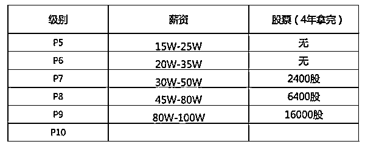
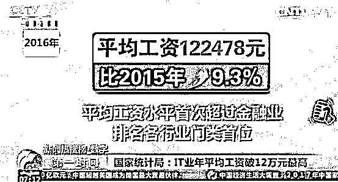
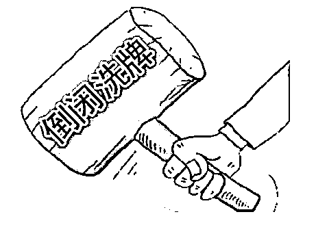

# 历史数据表明：中国最赚钱的职业十年一个轮回

紫竹张先生

每篇都有干货的财经公众号

高考的成绩已经公布，又到了选专业的时候了，这个时刻很多人都很想知道一个问题的答案，那就是未来从事什么职业最赚钱，隐含的意思就是想自己提前潜伏，好轻松赚大钱，关于这个问题的回答，我们可以从历史数据里获得我们想要的答案。

因为中国在改革开放前和改革开放后是完全不同的二种模式和玩法，所以 1978 年以后的经济发展史才有参考价值，我们把时间轴拉回到刚改革开放的时候。

80 年代最赚钱的职业

在 80 年代，最赚钱的职业是什么？上了年纪的人可能都知道，但是年轻一代应该都不清楚这段历史了，那段时间，最赚钱的职业，是出租车司机！

当时的出租车司机赚钱赚到了什么份上呢，八十年代这十年里，全国人均月收入在 60~100 元之内逐步增长，但是出租车司机的月入，在 2000~3000 元左右，折合到 2018 年的人均，大概就是月入 10~15 万这个样子吧，而且不是说你必须做到顶尖水平才有这个收入，你只要参与这个行业，就有那么高的收入，水平高的出租车司机和水平差的，收入不会太过明显的悬殊，毕竟都是体力劳动者。

当时的出租车司机，严格意义上来说，属于个体户或者说承包者，出租车牌照和承包费后来被推上了天价，最后导致各大城市打车难，其根源就在于 80 年代的暴利，这一现状直到网络打车平台出现之后才慢慢缓解。

整个 80 年代，个体能从事的最赚钱的职业，全部集中在个体户、私营承包者，小作坊等行业，当时对于财富的最高定义的万元户，几乎全部集中在这个领域。

《中国青年报》当年的一项调查显示，80 年代最受人们欢迎的职业前三名分别是出租车司机、个体户和厨师，而最后三名则分别是科学家、医生和教师。

当年还有一句很出名的话，哪怕年轻人也应该有所耳闻“搞原子弹的，不如卖茶叶蛋的”

90 年代最赚钱的职业

因为个体户实在太赚钱，所以一时间全民下海成为风潮，甚至有县长、市长都辞职下海的。一批批涌现的老板阶层，大部分都是低学历低知识的，因为他们是第一批吃螃蟹的且参与人数最多，所以知识无用论一时间尘嚣至上，美国人从来不信知识无用论，就是因为他们没有中国 80 年代的那批小学文化发家的老板阶层。

而在 80 年代混的最惨的知识分子，成为下海的主力军，读到博士去做原子弹还不如小学毕业去卖茶叶蛋，这种明显不公平的待遇让科技领域的从业人员大幅度流失，只要辞职下海，做什么都比做技术强。

为了扭转这一点，90 年代开始，国家有意识的全面提升知识分子的待遇。而经过 80 年代十年间的疯狂下海，个体户的数量也已经严重饱和，高速发展的中国经济最急需的不再是低端的体力劳动者，而是技术人员。

对技术人才的需求，一方面因为前十年的大幅流失，一方面因为中国高等教育薄弱而供给不足，还因为经济高速发展，雨后春笋冒出的大量公司而产生了大量的需求，所以导致了巨大的供不应求现象，助推了技术人员工资的飞速提升，考上大学，成为白领，就是光宗耀祖的代名词。知识分子不再受人鄙视，高考成为鲤鱼跃龙门的代名词。

90 年代，是知识分子大翻身的年代，巨大的供不应求现象一方面让技术人员的工资飞速提升，一方面促使国家进行了教育改革，大学开始大幅度扩招，试图缓解大学生供不应求的现象。

除此之外，90 年代外资大规模进入中国，但是符合外企条件的人才太少，刚开始很多人去外企上班也心存顾忌，所以外企的收入，明显高于其他工作，在外企上班，就是有钱的代名词。

从 80 年代和 90 年代的经历我们可以推出这么一个道理，市场经济环境下，供求关系，是决定工资的最主要因素。

2000 年代最赚钱的职业

中国教育改革之后，大学扩招，铺天盖地的大学生很快塞满了各种招聘会，大学生不值钱了，从包分配的天命之子，变成了到处求职的普通人，别说铁饭碗，连泥饭碗都要自己去找。技术员不仅不缺了，还立刻饱和了。

到了这个阶段，体力劳动者不缺了，技术人员也不缺了，甚至外企的工资都没什么优势了，毕业的大量大学生从事什么职业最好呢，公务员。考上公务员就意味着拿到了铁饭碗，要么单位，要么国企，都可以接受，只要进去，最差也能拿到一份不赖的工资和福利，要是运气好一点能拿个一官半职，那生活的就更滋润了。

00 年代开始兴起的公务员热，一直到现在还有余波，由于公务员和国企实行高门槛准入制，不像市场经济那样迅速的达到饱和状态，所以至今还有不错的吸引力，一些公务员名额放出来，报考人数甚至达到了百倍甚至千倍。

如果放开门槛，公务员的工资会瞬间被打成和民工差不多的状态，不过就算是目前存在门槛的状态，基层公务员的工资也在逐年的丧失吸引力，因为报考人数太多啊，高层没有涨工资的动力，你嫌工资低你别考就是了，高层也是懂市场经济学的，既然还有那么多人报考，那一定有吸引他们的地方，比如，过高的各种隐性福利等。

门槛只能减慢这个领域饱和的速度，但是不会改变结果，这个市场从供不应求到供大于求的速度慢了很多，但是从目前的趋势看，依然在坚定不移的向这个目标推进。

2010 年代最赚钱的职业

转眼又过了十年，来到了 10 年代，这个时候的数据和文献就精确了很多，大家也都是亲身经历者，最新的一个十年轮回，最赚钱的职业当之无愧的是金融和 IT 从业者。根据 2013 年招聘网站数据，毕业生最期望进入的行业，分别是金融、IT、政府。

金融行业的高薪水来源于国家的四万亿，以及这十年来的不断放水和通货膨胀，具体的高薪起爆点也可以直接精确到 2008 年底和 09 年初这个阶段，天量的货币从央行发出流向各行各业，经过的第一道手，就是金融行业，那么理所当然的，金融行业获得的收入是最高的。

其次就是 IT 从业者，在 2010 年这一年，天才乔布斯推出了苹果 4 手机，果 4 手机不是第一部智能机，但是他是第一部划时代的智能机，他的性能征服了全球的用户，开启了智能机时代，到了 2012 年，全球所有的手机厂商都推出了自己的智能手机，不愿意改变的诺基亚唯一的下场就是破产。

从 2010-2012 年开始，各种制作 APP 和手机软件的公司如雨后春笋般的冒出来，巨大的市场需求给他们带来的巨大的盈利，也催生了对 IT 人才的巨大需求，一时间 IT 人才严重供不应求，那些有四五年从业经验的人，更是被当成宝贝一样直接开出了 50 万以上的年薪，有天赋的人，甚至可以拿到百万年薪。

IT 的从业人员，什么都没做，因为风口来了，瞬间从供大于求，变成了供不应求，一年跳二次槽，跳一次槽工资翻一倍的神话，也就只有最近几年的 IT 人敢说了，其他行业的人哪敢说这种话。

这个十年周期，其实就是人才培养的周期，体现的是供需平衡的基本原理。

未来最惨的行业

在供不应求的十年黄金期之后，会进入供需平衡的十年白银期，然后是十年供大于求的青铜期，最后会进入一地鸡毛的黑暗期。

首先，我们看看 80 年代叱咤风云的出租车司机，以及卖茶叶蛋的个体户，过高的收入引起过量的从业者涌入，出租车牌照在 90 年代被炒成了天价，甚至可以说是成为城市行政垄断行业，但是这也没有影响这个行业的从业人员收入的迅速下滑，在 90 年代，出租车从业者可以说还凑合，其收入并不亚于大学生，我称之为白银期。在 2000 年之后，出租车司机的收入水平就开始慢慢下降，我称之为下滑的青铜期。到了 2010 年之后，出租车司机完全就是一个纯体力劳动者的代名词，辛苦的长时间工作，一个月就挣几千块，我称之为痛不欲生的黑暗期。

出租车司机这个行业，完美体现了十年黄金期、十年白银期、十年青铜期的轮回，如今陷入黑暗期，因为出租车司机本质上是没有太大技术门槛的，尤其是在驾照和车辆都泛滥的新时代，所以可以大胆预计，出租车行业会持续陷入黑暗期很久，甚至整体被网络出行平台给淘汰合并掉也是非常有可能的。

这里我们还可以大胆预测一下如今依然处于黄金期的 IT 行业，因为这个行业是没有任何行政门槛的，所以完全符合市场经济，人才会持续涌入。人才周期限制了当他处于高薪的前十年，国家不能很快的培养出对应的人才数量填补缺口，但是同样，当他的薪水没有吸引力的时候，人才周期也不能很快流出这个行业。

所以，2020 年左右，IT 行业会脱离黄金期，其薪水增速会从远超社会平均值变成等于社会平均值，这个职业就应该开始从供大于求慢慢变为供需平衡的状态，开始进入白银期，这个时候 IT 依然是高薪，只不过增速没有了，其他行业开始慢慢追上 IT 行业的报酬。

大概 2030 年开始，IT 行业会进入青铜期，溢价彻底消失，工资和同等学历其他行业拉平，都是清华毕业的，没道理从事核工业的就比从事 IT 的工资低那么多，如果是的话，那么报考 IT 的人数一定会远多于报考核工业的，从事 IT 的人转行人数也会远低于其他行业，多年累积下来之后，供大于求，这个行业的工资吸引力就会慢慢降低，一直到和其他行业拉平，彻底丧失吸引力为止。

大概 2040 年开始，会进入彻底的黑暗期，从事 IT 行业就是苦逼和穷逼的代名词，类似于今天的制造业从业者，现在的 IT 人不要称自己是程序猿，2040 年之后你们才是真正的程序猿。不过 IT 从业者也不用如此害怕，还有 20 年呢，甚至在未来十年的白银期，你们也是高于社会平均报酬的存在，我觉得这么长时间足够你们提前做好职业规划和资本储存了。

这里有一个假定前提，那就是这个行业也属于一个正常的市场经济行业，不能被行政门槛所干涉。

行业的十年周期

其实，除了职业之外，行业也是有十年周期的，例如 80 年代，最赚钱的行业，就是低端制造业，你只要开工厂，甭管你生产啥，傻子都赚钱。90 年代，最赚钱的是商业，只要你开商场，从事流通领域，经商就是躺赚钱的代名词。00 年代，最赚钱的是地产，大家都懂，如今中国的富豪，都是靠 01 年之后的那一波地产狂潮发财的。10 年代，最赚钱的是移动互联网行业，马化腾用 10 年时间打造了 QQ 帝国，张小龙用 2010 年上线的微信，三年时间再造了一个 QQ。

这里我们可以发现，80 年代最赚钱的职业和最赚钱的行业，90 年代进入了白银期，00 年代进入了青铜期，如今都处于黑暗期，无一例外。以行业为例，从 2000 年附近开始，制造业就不再是一个暴利行业，典型青铜期，盈利能力和其他行业的差距在飞速的减少，不过还能赚一点，属于食之无味弃之可惜。但是从 2010 年开始，制造业赔钱就是一个常见状态，挣的钱全部还银行利息了，甚至连还利息都不够成为常态，有很多干了二三十年制造业的人，都撑不下去了。

这是一个典型的黑暗时期，整个行业的报酬被打到社会平均回报之下，就是因为当年太赚钱，从业人员过多，都不肯退出从而酿出的苦果，最后用行业亏钱，职工不赚钱的黑暗时期，来倒逼这个行业回复正常状态。

而商业，慢了制造业十年，大概从 2010 年开始，就进入了青铜期，被电商给折磨的死去活来，如今已经陷入了赔钱的边缘，我认为从 2020 年开始，就开始进入整个行业的大面积赔钱或者不赚钱状态，类似于今天的低端制造业。这个锅不能甩给电商，就算没有电商，整个商业依然会不赚钱，从业人员越来越多，投入的资本也越来越多，回报率越来越低当然是常态，电商出现还是不出现，都不会影响这个最终结果，制造业就是一个活生生的例子，电商的出现是利好制造业的，但是也不耽误制造业继续赔钱。

这里唯一有点例外的，就是地产业了，00 年开始了黄金十年，按理说 2010 年就结束了，开始进入白银周期，结果 2010-2015 年冻市 5 年之久的地产业，2016 年又迎来一波爆发大赚钱的时期，可以认为是黄金期的延续，之所以会出现这种延续的结果，是因为地产有明显的行政干涉行为出现，所以能够短暂摆脱经济规律周期的影响，就好像公务员热一样，延续时间明显比其他职业要久。但是这种行政干涉，只能影响时间，不能影响结果。

未来最赚钱的职业和行业是什么

看完了历史，我们看看未来，大家最想知道的肯定是未来最赚的的职业和行业是什么，我们统计历史数据发现，是否赚钱和供需关系完全呈正比，也就是说，最赚钱的职业一定是供不应求的行业。

那么什么样的行业会是供不应求的行业的，但是我们可以通过历史发现，这样的行业一定是新兴行业，同时一定不会是老旧行业。

你可以这么认为，改革开放以来 40 年里，曾经有人在里面赚过大钱，成为社会一致眼热的职业和行业，你统统可以回避掉了，这些领域未来成为好行业的概率，微乎其微。假设你在 2010 年创业，你杀进一个谁也不知道啥玩意的移动手机互联网端软件设计领域，成功的概率大概百倍于你那个杀进电脑网页端软件设计领域的同学，同时万倍于你那个杀进传统制造业的校友。你那个杀进传统制造业的校友，现在估计坟头草都已经三米高了，不管他是北大毕业的还是北大青鸟毕业的，结局都不会差太多。

哪个领域是未来的引爆点，总统和首富也都不知道，但是我们可以首先排除掉以前的老旧行业和曾经热门的职业，这些全是坑，要避开。其余的到底谁是真命天子，那就要靠赌了，就好像今天的风投一样，四处尝试。

如果你不愿意冒着赌博的风险，你吃到黄金期新兴行业的概率是微乎其微的，但是我这里有一个替代方案给你，那就是吃白银期。刚刚兴起的行业，你都是可以去试一试的，比如 IT 还有十年白银好过，比如物联网，比如新能源电池等等，这些都是可以吃到白银期的，相比陷入黑暗期不知道什么时候才能摆脱的制造业是要好很多的。

另外，还有一个更重要的建议，任何行业选择，任何职业选择，都只是辅助，从事好行业不一定能带来好收入，只能说成功概率高而已，我举个例子：

人们羡慕演员的收入嘛？不羡慕，人们羡慕的是演艺圈做的最好的明星的收入，而不是那些普通演员，他们的收入可能还不如民工。

人们羡慕主播的收入嘛？不羡慕，月入二三千甚至零收入的主播简直如过江之鲫，人们羡慕的是那些网红主播的收入。

人们羡慕金融/IT 从业人员的收入嘛？不羡慕，年入 12 万以下的金融民工和程序猿一样大有人在，人们羡慕的是那些年薪百万的高端金融/IT 人才。

所以说，找对风口很重要，风口上猪都能飞起来，但是那些飞的最高的，永远是那些轻灵的鸟儿，但是给自己打造一对翅膀，让自己成为鸟儿才是最重要的。

自留地好文推荐 : 贸易战要谨防特朗普的低关税陷阱

往期回顾（回复“目录”关键词可查看更多）

为什么中国必须购买美国国债？| 租房贷款会将房子拆分成房骨和房皮 | 宁波老虎事件遇难者不应该得到赔偿 | 中国的房价什么时候会崩盘？| 你根本不知道烟草公司有多赚钱 | 如何把自家孩子培养成一个顶尖人才 | 我是如何保证自己不近视的 |魏忠贤其实是个贤臣 | 2 分钟了解中国 50 年的艰辛发展史

