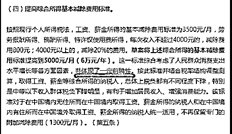
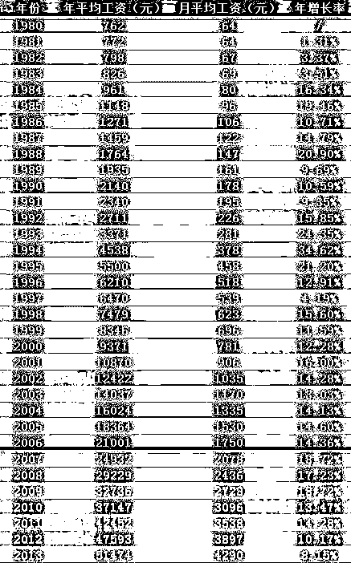
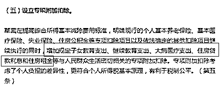

# 税起征点提升到 5000，但是你少交的税远不止于此

紫竹张先生

每篇都有干货的财经公众号

我们都知道，前几天，中国宣布了最新的个税改革，大家津津乐道的就是个税起征点，从 3500 提升到 5000。

讲真，从 3500 元只提升到 5000 元，这个幅度简直太少了，至少我是很不满意的，对于巨大的通货膨胀和物价涨幅来说，这等于没减，尤其是文件里的那句“体现了一定的前瞻性”更让我无语，5000 元哪里体现的出前瞻性了，除非他前瞻的是未来会通货紧缩，那怎么可能嘛，少印钞票我们就很满意了，回收钞票那是不可能的。

什么才叫前瞻性的个税起征点，个人所得税是 1980 年立法进行征收的，当时的起征点，是月薪 800 元，这才叫前瞻性的个税起征点。在 1980 年，月收入超过 800 元的个人，不能说没有，那绝对是凤毛麟角，是标准的超级富人。

我们可以看到，在 1980 年，平均月薪是 64 元，个税起征点高达 800 元，12 倍的差距，这是妥妥的前瞻性，把未来 N 年的空间都预留好了，实际上，10 年之后，1990 年，平均月薪也才 178 元，差距也是还有 4 倍多，能达到 800 月薪的依然寥寥无几。

如果按照 1980 年的倍数，今天平均月入大概 5000 吧，个税起征点，应该是 6 万，无论从哪个角度来说，在中国能获得 6 万月薪的，都是绝对的超级精英，凤毛麟角，这才叫前瞻性。

而把起征点定为 5000，我认为是体现不出任何前瞻性的，从事低端劳动的人是可以免征了，大城市里绝大部分白领工薪，都是在纳税范围之内的，按照 5000 进行征收，个人所得税他依然是工薪税。

但是，个税新法开了另外一个口子，他让我们的税负减免，可以得到大幅度的减免，其重要性远远超过起征点提升到 5000 元，如果你不妥善利用这一点，那你真的是亏大了。

我们都知道，个人所得税是有专项扣除的，假设你月入是 8000，那么实际上并不会按照 8000 进行纳税，而是要先扣除五险一金，假设需要扣除 2000 元，那么是按照 6000 为基数进行纳税的。

而这次改革，在专项扣除里，加入了重磅新增项，那就是子女教育支出、继续教育支出、大病医疗支出、住房贷款利息和住房租金等专项进行扣除。

这个改变是非常人性化并且非常必要的，其实工薪族并不介意纳税，而是每个月的收入刚到手，就瞬间月光了，有很多还是固定支出，这种情况下还要纳税，是让人非常不爽的。

这里面，最大头，就是住房贷款利息和住房租金。这个贷款利息，并不是你的月供，而是你的利息，你偿还本金的部分是不能进行抵扣的，但是这个数值也是非常吓人的。

对于买得起房的人来说，假设贷款是 100 万，那么每年需要偿还多少利息呢，按 5%的利率算，每年需要偿还的利息都是 5 万元整。不管你是 30 年还是 10 年期，不管你是等额本息还是等额本金，不同的还款方案都只影响你每年偿还的本金数量，你支付的利息是一个固定值，这个 5 万，是可以进行抵扣的。

我知道，有很多金融小白这里已经迷惑不解了，有的甚至开始打算掏出计算器把自己的月供拆开来算，然后把自己算晕了，这里大家可以好好仔细盘算下，我这里就不赘述了，直接列出结果，今年 100 万贷款余额，约定利率 5%，那么今年需要支付的利息就是 5 万，不管你使用任何还款方案，都只影响本金偿还而不影响利息偿还。

房贷 100 万，在如今的一线城市里，只能买个小房子，所以这个数据还是具有一定的代表性的，每年有 5 万的利息可以进行专项抵扣折减，每个月大概是 4000 元，也就是说，假设你扣除五险一金后实际到手是 9000 元，你从银行拿个证明交给你们单位，可以再抵扣 4000 元，低于 5000 的起征点之后，你就可以不用纳税了。

对于买不起房的苦孩子而言，也没事，你可以拿租金去抵扣，买不起房子你总得住吧，让你的房东，给你开租房发票，现在的租金也是死贵死贵的，单间的话二三千很正常，这样的话你就有了二三千的抵扣额，如果你租的是更大的房子，那么四五千，七八千，甚至上万的月租都很正常，这些全部是可以抵扣的。

除此之外，对于已经结婚的人来说，子女教育支出，继续教育支出，都是一个重要的抵扣部分，首先学校的学费是肯定可以抵扣的，拿着发票就能去抵扣，但是学费并不多，平摊到每个月几乎可以忽略不计，重点就在于继续教育支出上面。

现在很多家庭的教育支出是很重的，但是并不是重在学费上，而是各种课外辅导班上，什么特长班啊，兴趣班啊，早教班啊，费用都死贵死贵的，这些费用，以后统统可以持票去抵扣。

但是国家并不吃亏，为什么呢，因为这些课外教育机构，以前都是现金交易，要求开票的家长很少，因为发票拿回去也没什么用啊，现在家长肯定是要求开票的因为可以回去抵扣，只要这些教育机构开了票，他们就要纳税，这个税负，不过是从工薪族头上转移到教育机构头上缴纳了而已。

当然，教育机构会转过身来给家长加价，再转移回家长头上，这个就是后话了，是市场经济的必然行为，我这里要告诉大家的是，千万别忘了向教育机构索要发票，否则你就吃亏了，因为别人都在要，教育机构也已经把发票的税收已经添加进收费里面了。

另外还有一个大病医疗支出，如果你得了大病，就是需要动用医保进行报销的那种级别的病，记得保留一份收据和发票，你的个人缴纳部分，这也是可以抵扣的，当然，我希望大家永不生病，最好别用到这项政策，不过相应的知识储备还是有的，要知道这个东西是可以抵扣的。

这次是改革，是把个税起征点从 3500 提升到了 5000，但是加入了几个重磅级的专项抵扣政策，我估算了一下，这些专项抵扣，平均应该可以再减免 5000~6000，也就是说月入万元以下的，经过一系列操作，是可以直接免税的，当然前提是你要知晓这些免税政策，申报工作单位的会计应该可以帮你处理，但是日常发票的保留工作，是需要你自己来做的。

今天这篇文章，看了的人，我估计可以省不少个税，国家给予的免税政策，既然你符合，就必须要用，如果是因为不知道怎么用而错失了，那就太可惜了，新政策基本上能让大部分人都直接免征不再缴纳个人所得税。

当然，我还是希望大家的收入都远超月入万元的门槛，这里祝福大家都月入 6 万，达到 1980 年的月薪 800 水平，哪怕交一堆税，我觉得都是幸福的。

自留地好文推荐 : 贸易战要谨防特朗普的低关税陷阱

<link rel="stylesheet" href="view/css/APlayer.min.css">

往期回顾（回复“目录”关键词可查看更多）

一个 800 亿的地雷爆炸了，网贷平台后面可能会连环炸雷 | 租房贷款会将房子拆分成房骨和房皮 | 宁波老虎事件遇难者不应该得到赔偿 | 中国的房价什么时候会崩盘？| 你根本不知道烟草公司有多赚钱 | 如何把自家孩子培养成一个顶尖人才 | 我是如何保证自己不近视的 |魏忠贤其实是个贤臣 | 2 分钟了解中国 50 年的艰辛发展史

